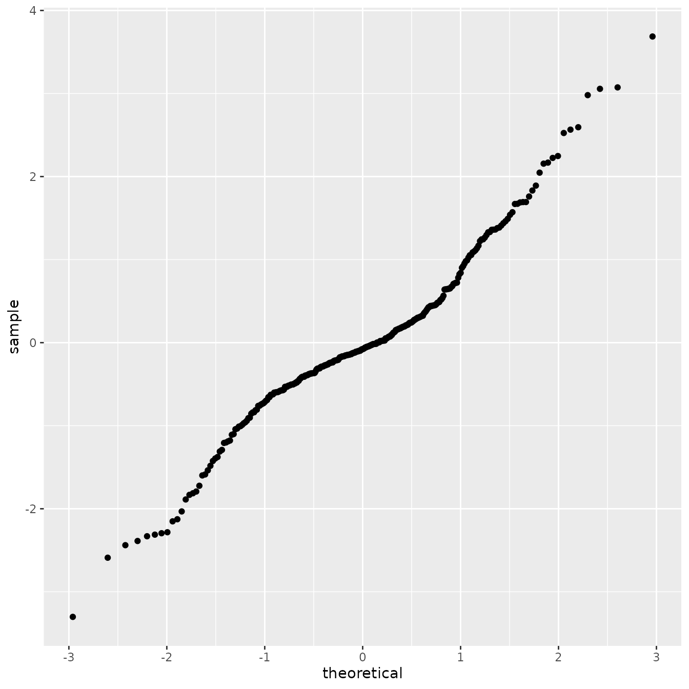
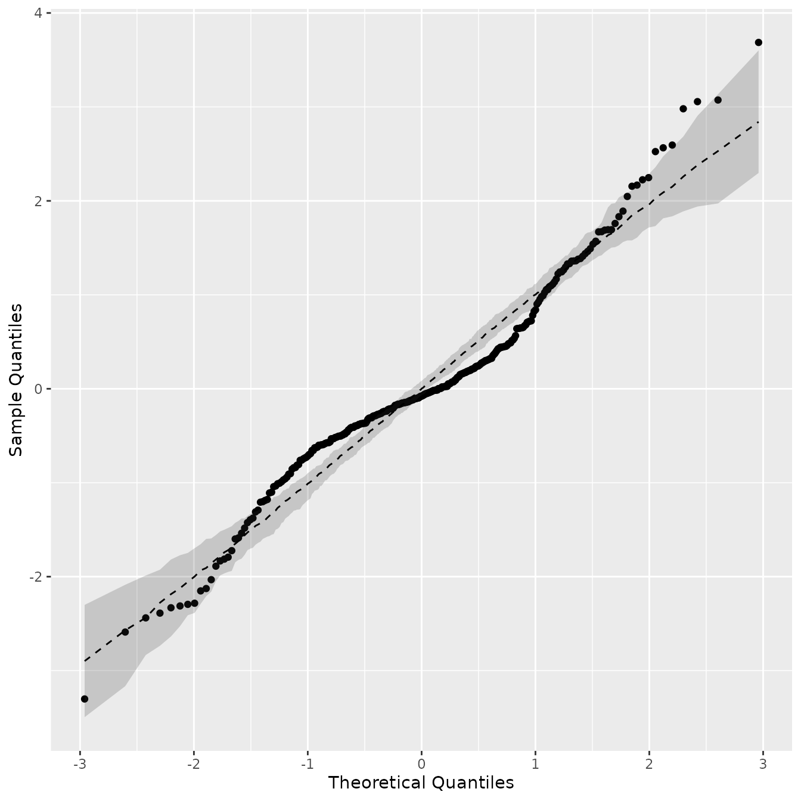

# Comparison of different models using real data

## Introduction

This vignette contains the details of the Application section of [Bolin
et al. (2023)](https://arxiv.org/abs/2304.10372). Our goal is to compare
the predictive power of different models on metric graphs by
cross-validation. More precisely, we consider the Whittle–Matérn fields
introduced by [Bolin et al. (2024)](https://arxiv.org/abs/2205.06163)
and [Bolin et al. (2023)](https://arxiv.org/abs/2304.10372), a Gaussian
random field with an isotropic exponential covariance function [Anderes
et al.
(2020)](https://projecteuclid.org/journals/annals-of-statistics/volume-48/issue-4/Isotropic-covariance-functions-on-graphs-and-their-edges/10.1214/19-AOS1896.full),
and Matérn Gaussian processes based on the graph Laplacian [Borovitskiy
et al.
(2021)](http://proceedings.mlr.press/v130/borovitskiy21a/borovitskiy21a.pdf).

## The dataset

For this example we will consider the `pems` data contained in the
`MetricGraph` package. The data consists of traffic speed observations
on highways in the city of San Jose, California. The variable `y`
contains the traffic speeds.

``` r

 pems_graph <- metric_graph$new(edges = pems$edges)
 pems_graph$add_observations(data = pems$data, normalized=TRUE)
```

Let us take a look at the observations:

``` r

pems_graph$plot(data = "y", vertex_size = 0, type = "mapview")
```

## The models

We will assume that the data has the following structure:

``` math
y_i = \mu + u(s_i) + \varepsilon_i, \quad i=1,\ldots,n,
```
where $`\mu`$ is a constant that represents the mean of the field,
$`u(\cdot)`$ is a Gaussian random field, $`s_i\in \Gamma`$ are
observation locations and $`\varepsilon_i`$ are independent centered
Gaussian variables $`N(0,\sigma_e^2)`$ representing measurement noise.

Let us fit the different models, that is, we will assume several
different possible latent fields $`u(\cdot)`$. We start by fitting a
Whittle-Matérn field with `alpha = 1` (with `BC=0`, which means we are
not perform boundary corrections):

``` r

fit_alpha1 <- graph_lme(y ~ 1, graph=pems_graph, BC = 0,
            model = list(type = "WhittleMatern", alpha = 1), optim_method = "Nelder-Mead")
```

and look at its summary:

``` r

summary(fit_alpha1)
#> 
#> Latent model - Whittle-Matern with alpha = 1
#> 
#> Call:
#> graph_lme(formula = y ~ 1, graph = pems_graph, model = list(type = "WhittleMatern", 
#>     alpha = 1), optim_method = "Nelder-Mead", BC = 0)
#> 
#> Fixed effects:
#>             Estimate Std.error z-value Pr(>|z|)    
#> (Intercept)   51.187     4.132   12.39   <2e-16 ***
#> 
#> Random effects:
#>       Estimate Std.error z-value
#> tau   0.104435  0.007827  13.343
#> kappa 0.108220  0.050045   2.162
#> 
#> Random effects (Matern parameterization):
#>       Estimate Std.error z-value
#> sigma   20.582     4.398   4.679
#> range   18.481     8.530   2.167
#> 
#> Measurement error:
#>          Estimate Std.error z-value
#> std. dev   6.8654    0.4086    16.8
#> ---
#> Signif. codes:  0 '***' 0.001 '**' 0.01 '*' 0.05 '.' 0.1 ' ' 1 
#> 
#> Log-Likelihood:  -1221.225 
#> Number of function calls by 'optim' = 245
#> Optimization method used in 'optim' = Nelder-Mead
#> 
#> Time used to:     fit the model =  13.28662 secs
```

Now, we will fit a Whittle-Matérn field with `alpha = 2`:

``` r

fit_alpha2 <- graph_lme(y ~ 1, graph=pems_graph, BC = 0,
            model = list(type = "WhittleMatern", alpha = 2), optim_method = "Nelder-Mead")
```

and its summary:

``` r

summary(fit_alpha2)
#> 
#> Latent model - Whittle-Matern with alpha = 2
#> 
#> Call:
#> graph_lme(formula = y ~ 1, graph = pems_graph, model = list(type = "WhittleMatern", 
#>     alpha = 2), optim_method = "Nelder-Mead", BC = 0)
#> 
#> Fixed effects:
#>             Estimate Std.error z-value Pr(>|z|)    
#> (Intercept)   51.219     2.813   18.21   <2e-16 ***
#> 
#> Random effects:
#>       Estimate Std.error z-value
#> tau    0.09205   0.01596   5.767
#> kappa  0.43173   0.07254   5.952
#> 
#> Random effects (Matern parameterization):
#>       Estimate Std.error z-value
#> sigma   19.147     2.572   7.446
#> range    8.024     1.314   6.105
#> 
#> Measurement error:
#>          Estimate Std.error z-value
#> std. dev   7.1763    0.3764   19.07
#> ---
#> Signif. codes:  0 '***' 0.001 '**' 0.01 '*' 0.05 '.' 0.1 ' ' 1 
#> 
#> Log-Likelihood:  -1208.087 
#> Number of function calls by 'optim' = 227
#> Optimization method used in 'optim' = Nelder-Mead
#> 
#> Time used to:     fit the model =  14.02765 secs
```

We will now fit Whittle-Matérn fields with `alpha = 1` and `alpha=2`,
and by performing a boundary correction on vertices of degree 1. To such
an end, we set `BC=1`:

``` r

fit_alpha1_bc <- graph_lme(y ~ 1, graph=pems_graph, BC = 1,
        model = list(type = "WhittleMatern", alpha = 1), optim_method = "Nelder-Mead")

fit_alpha2_bc <- graph_lme(y ~ 1, graph=pems_graph, BC = 1,
        model = list(type = "WhittleMatern", alpha = 2), optim_method = "Nelder-Mead")
```

Now, let us look at the summaries:

``` r

summary(fit_alpha1_bc)
#> 
#> Latent model - Whittle-Matern with alpha = 1
#> 
#> Call:
#> graph_lme(formula = y ~ 1, graph = pems_graph, model = list(type = "WhittleMatern", 
#>     alpha = 1), optim_method = "Nelder-Mead", BC = 1)
#> 
#> Fixed effects:
#>             Estimate Std.error z-value Pr(>|z|)    
#> (Intercept)   51.111     4.294    11.9   <2e-16 ***
#> 
#> Random effects:
#>       Estimate Std.error z-value
#> tau   0.104592  0.007829  13.359
#> kappa 0.095113  0.051225   1.857
#> 
#> Random effects (Matern parameterization):
#>       Estimate Std.error z-value
#> sigma   21.921     5.489   3.994
#> range   21.028    11.304   1.860
#> 
#> Measurement error:
#>          Estimate Std.error z-value
#> std. dev   6.8634    0.4083   16.81
#> ---
#> Signif. codes:  0 '***' 0.001 '**' 0.01 '*' 0.05 '.' 0.1 ' ' 1 
#> 
#> Log-Likelihood:  -1221.377 
#> Number of function calls by 'optim' = 193
#> Optimization method used in 'optim' = Nelder-Mead
#> 
#> Time used to:     fit the model =  11.0432 secs
```

and

``` r

summary(fit_alpha2_bc)
#> 
#> Latent model - Whittle-Matern with alpha = 2
#> 
#> Call:
#> graph_lme(formula = y ~ 1, graph = pems_graph, model = list(type = "WhittleMatern", 
#>     alpha = 2), optim_method = "Nelder-Mead", BC = 1)
#> 
#> Fixed effects:
#>             Estimate Std.error z-value Pr(>|z|)    
#> (Intercept)   51.149     2.828   18.09   <2e-16 ***
#> 
#> Random effects:
#>       Estimate Std.error z-value
#> tau    0.09286   0.01610   5.768
#> kappa  0.42028   0.07258   5.791
#> 
#> Random effects (Matern parameterization):
#>       Estimate Std.error z-value
#> sigma   19.762     2.764   7.150
#> range    8.242     1.388   5.937
#> 
#> Measurement error:
#>          Estimate Std.error z-value
#> std. dev   7.1759    0.3759   19.09
#> ---
#> Signif. codes:  0 '***' 0.001 '**' 0.01 '*' 0.05 '.' 0.1 ' ' 1 
#> 
#> Log-Likelihood:  -1208.28 
#> Number of function calls by 'optim' = 257
#> Optimization method used in 'optim' = Nelder-Mead
#> 
#> Time used to:     fit the model =  16.93911 secs
```

Similarly, let us now fit a Matérn Gaussian model based on the graph
Laplacian for `alpha=1` and `alpha=2`. For these, we first fit the
models without fixed effects, and then use those results as starting
values for the complete optimization. The reason for this is that the
estimation otherwise is slightly unstable for these models.

``` r

fit_GL1 <- graph_lme(y ~ -1, graph=pems_graph, 
            model = list(type = "graphLaplacian", alpha = 1), optim_method = "Nelder-Mead")
fit_GL1 <- graph_lme(y ~ 1, graph=pems_graph, 
            model = list(type = "graphLaplacian", alpha = 1), previous_fit = fit_GL1, optim_method = "Nelder-Mead")
fit_GL2 <- graph_lme(y ~ 1, graph=pems_graph,
            model = list(type = "graphLaplacian", alpha = 2), previous_fit = fit_GL1, optim_method = "Nelder-Mead")
```

and look at their summaries:

``` r

summary(fit_GL1)
#> 
#> Latent model - graph Laplacian SPDE with alpha = 1
#> 
#> Call:
#> graph_lme(formula = y ~ 1, graph = pems_graph, model = list(type = "graphLaplacian", 
#>     alpha = 1), optim_method = "Nelder-Mead", previous_fit = fit_GL1)
#> 
#> Fixed effects:
#>             Estimate Std.error z-value Pr(>|z|)    
#> (Intercept)   50.896     4.304   11.82   <2e-16 ***
#> 
#> Random effects:
#>       Estimate Std.error z-value
#> tau   0.104506  0.007847  13.317
#> kappa 0.070314  0.033202   2.118
#> 
#> Random effects (Matern parameterization):
#>       Estimate Std.error z-value
#> sigma   25.517     5.565   4.585
#> range   28.444    13.406   2.122
#> 
#> Measurement error:
#>          Estimate Std.error z-value
#> std. dev   6.8644    0.4085    16.8
#> ---
#> Signif. codes:  0 '***' 0.001 '**' 0.01 '*' 0.05 '.' 0.1 ' ' 1 
#> 
#> Log-Likelihood:  -1221.384 
#> Number of function calls by 'optim' = 143
#> Optimization method used in 'optim' = Nelder-Mead
#> 
#> Time used to:     fit the model =  1.18594 secs
```

and

``` r

summary(fit_GL2)
#> 
#> Latent model - graph Laplacian SPDE with alpha = 2
#> 
#> Call:
#> graph_lme(formula = y ~ 1, graph = pems_graph, model = list(type = "graphLaplacian", 
#>     alpha = 2), optim_method = "Nelder-Mead", previous_fit = fit_GL1)
#> 
#> Fixed effects:
#>             Estimate Std.error z-value Pr(>|z|)    
#> (Intercept)   50.903     2.867   17.75   <2e-16 ***
#> 
#> Random effects:
#>       Estimate Std.error z-value
#> tau    0.14855   0.02539   5.851
#> kappa  0.27405   0.04623   5.928
#> 
#> Random effects (Matern parameterization):
#>       Estimate Std.error z-value
#> sigma   23.462     3.219   7.289
#> range   12.641     2.061   6.133
#> 
#> Measurement error:
#>          Estimate Std.error z-value
#> std. dev   7.1251    0.3852    18.5
#> ---
#> Signif. codes:  0 '***' 0.001 '**' 0.01 '*' 0.05 '.' 0.1 ' ' 1 
#> 
#> Log-Likelihood:  -1208.703 
#> Number of function calls by 'optim' = 181
#> Optimization method used in 'optim' = Nelder-Mead
#> 
#> Time used to:     fit the model =  1.66471 secs
```

Observe that the default optimizer (L-BFGS-B) failed to converge, thus
an alternative optimizer was used, when fitting the graph Laplacian
model with `alpha=2`.

Let us now fit a Gaussian field with isotropic exponential covariance
function:

``` r

fit_isoexp <- graph_lme(y ~ 1, graph=pems_graph, 
                model = list(type = "isoCov"), optim_method = "Nelder-Mead")
#> Warning in graph_lme(y ~ 1, graph = pems_graph, model = list(type = "isoCov"),
#> : No check for Euclidean edges have been perfomed on this graph. The isotropic
#> covariance models are only known to work for graphs with Euclidean edges. You
#> can check if the graph has Euclidean edges by running the `check_euclidean()`
#> method. See the vignette
#> https://davidbolin.github.io/MetricGraph/articles/isotropic_noneuclidean.html
#> for further details.
```

and look at the summary:

``` r

summary(fit_isoexp)
#> 
#> Latent model - Covariance-based model
#> 
#> Call:
#> graph_lme(formula = y ~ 1, graph = pems_graph, model = list(type = "isoCov"), 
#>     optim_method = "Nelder-Mead")
#> 
#> Fixed effects:
#>             Estimate Std.error z-value Pr(>|z|)  
#> (Intercept)    45.57     26.78   1.702   0.0888 .
#> 
#> Random effects:
#>       Estimate Std.error z-value
#> tau   31.53081  20.79698   1.516
#> kappa  0.04528   0.06234   0.726
#> 
#> Measurement error:
#>          Estimate Std.error z-value
#> std. dev   6.8692    0.4087   16.81
#> ---
#> Signif. codes:  0 '***' 0.001 '**' 0.01 '*' 0.05 '.' 0.1 ' ' 1 
#> 
#> Log-Likelihood:  -1223.838 
#> Number of function calls by 'optim' = 299
#> Optimization method used in 'optim' = Nelder-Mead
#> 
#> Time used to:     fit the model =  4.57258 secs
```

Observe the warning, message. This message tells us that we did not
check if the metric graph has Euclidean edges. Let us check now:

``` r

pems_graph$check_euclidean()
```

Now, we can look at the graph’s characteristics contained in this
summary:

``` r

summary(pems_graph)
#> A metric graph object with:
#> 
#> Vertices:
#>   Total: 691 
#>   Degree 1: 11;  Degree 2: 360;  Degree 3: 315;  Degree 4: 5; 
#>   With incompatible directions:  17 
#> 
#> Edges: 
#>   Total: 848 
#>   Lengths: 
#>       Min: 0.005079864  ; Max: 3.277304  ; Total: 470.6126 
#>   Weights: 
#>       Columns: .weights 
#>   That are circles:  0 
#> 
#> Graph units: 
#>   Vertices unit:  degree  ; Lengths unit:  km 
#> 
#> Longitude and Latitude coordinates:  TRUE
#>   Which spatial package:  sp 
#>   CRS:  +proj=longlat +datum=WGS84 +no_defs
#> 
#> Some characteristics of the graph:
#>   Connected: TRUE
#>   Has loops: FALSE
#>   Has multiple edges: TRUE
#>   Is a tree: FALSE
#>   Distance consistent: FALSE
#>   Has Euclidean edges: FALSE
#> 
#> Computed quantities inside the graph: 
#>   Laplacian:  FALSE  ; Geodesic distances:  TRUE 
#>   Resistance distances:  FALSE  ; Finite element matrices:  FALSE 
#> 
#> Mesh: The graph has no mesh! 
#> 
#> Data: 
#>   Columns:  y 
#>   Groups:  .group 
#> 
#> Tolerances: 
#>   vertex-vertex:  0.001 
#>   vertex-edge:  0.001 
#>   edge-edge:  0
```

Thus, this graph does not have Euclidean edges. This means, when we fit
the model, we actually modify the graph, when we add the obvservations
as vertices. By default, when fitting isotropic models, the
[`graph_lme()`](https://davidbolin.github.io/MetricGraph/reference/graph_lme.md)
function checks it the metric graph after adding the observations as
vertices has Euclidean edges. We can check by looking at the `euclidean`
element of the fitted model:

``` r

fit_isoexp$euclidean
#> [1] FALSE
```

Therefore, even after adding the observations as vertices, the metric
graph is still not Euclidean.

Let us check if we can fit an isotropic model with isotropic Matérn
covariance function with smoothness parameter `nu=1.5` (which
corresponds to `alpha=2` for Whittle-Matérn fields and Matérn Gaussian
models based on the graph Laplacian). Recall that by the results in
[Anderes et al.
(2020)](https://projecteuclid.org/journals/annals-of-statistics/volume-48/issue-4/Isotropic-covariance-functions-on-graphs-and-their-edges/10.1214/19-AOS1896.full),
it is not guaranteed that such a function will be a valid covariance
function even on an metric graph with Euclidean edges.

We start by defining the Matérn covariance corresponding to `alpha=2`:

``` r

cov_mat <- function(h,theta){
  tau <- theta[1]
  kappa <- theta[2]
  1/tau * (1 + kappa * abs(h)) * exp(- kappa * abs(h))
}
```

Let us now fit the model:

``` r

fit_isomat <- graph_lme(y ~ 1, graph = pems_graph, 
                model = list(type = "isoCov", cov_function = cov_mat), 
                model_options = list(start_par_vec = fit_alpha2$coeff$random_effects))
#> Warning in graph_lme(y ~ 1, graph = pems_graph, model = list(type = "isoCov", :
#> This graph DOES NOT have Euclidean edges. The isotropic covariance models are
#> NOT guaranteed to work for this graph! See the vignette
#> https://davidbolin.github.io/MetricGraph/articles/isotropic_noneuclidean.html
#> for further details.
#> Warning in graph_lme(y ~ 1, graph = pems_graph, model = list(type = "isoCov", :
#> All optimization methods failed to provide a positive-definite Hessian. The
#> optimization method with largest likelihood was chosen. You can try to obtain a
#> positive-definite Hessian by setting 'improve_hessian' to TRUE.
#> Error in `chol.default()`:
#> ! the leading minor of order 260 is not positive
```

Indeed, the model could not be fitted.

Let us now quickly look at the likelihoods of the fitted models. We
begin by creating a list with the fitted models:

``` r

fitted_models_list <- list("isoExp" = fit_isoexp, 
                            "GL1" = fit_GL1,
                            "alpha=1" = fit_alpha1, 
                            "alpha=1 bc" = fit_alpha1_bc,
                            "GL2" = fit_GL2,
                            "alpha=2" = fit_alpha2, 
                            "alpha=2 bc" = fit_alpha2_bc)
```

Now, the likelihoods:

``` r

table_lik <- sapply(fitted_models_list, logLik)

# Printing the negative likelihoods:
-table_lik
#>     isoExp        GL1    alpha=1 alpha=1 bc        GL2    alpha=2 alpha=2 bc 
#>   1223.838   1221.384   1221.225   1221.377   1208.703   1208.087   1208.280
```

## Comparison by cross-validation

We will now use the function
[`posterior_crossvalidation()`](https://davidbolin.github.io/MetricGraph/reference/posterior_crossvalidation.graph_lme.md)
to perform leave-one-out cross validation based on the estimated
parameters and compare the results:

``` r

res <- posterior_crossvalidation_loo(fitted_models_list, tibble=FALSE)
knitr::kable(res$scores, digits = 3)
```

|            | logscore |  crps | scrps |   mae |  rmse |
|:-----------|---------:|------:|------:|------:|------:|
| isoExp     |    3.604 | 4.735 | 2.133 | 6.175 | 8.610 |
| GL1        |    3.605 | 4.737 | 2.133 | 6.175 | 8.611 |
| alpha=1    |    3.605 | 4.738 | 2.133 | 6.178 | 8.614 |
| alpha=1 bc |    3.604 | 4.736 | 2.133 | 6.168 | 8.612 |
| GL2        |    3.551 | 4.531 | 2.107 | 5.853 | 8.304 |
| alpha=2    |    3.548 | 4.519 | 2.106 | 5.851 | 8.255 |
| alpha=2 bc |    3.548 | 4.518 | 2.106 | 5.853 | 8.255 |

## Kriging

We will now perform kriging with the best models according to the
cross-validation results, which are `fit_alpha2` and `fit_alpha2_bc`.

It is important to observe that for the Matérn Gaussian model based on
the graph Laplacian and the Gaussian model with isotropic exponential
covariance function, one would actually need to modify the model when
doing predictions. See the [On isotropic covariances on metric graphs
with non-Euclidean
edges](https://davidbolin.github.io/MetricGraph/articles/isotropic_noneuclidean.md)
vignette for further details. Therefore, even though we might be able to
obtain \`\`predictions’’ using the Matérn Gaussian models based on graph
Laplacian and the Gaussian models with istropic exponential covariance
function, there are some inconsistencies between the model used to fit
the data, and the model used to obtain predictions. Such inconsistency
is not present in the Whittle-Matérn models on metric graphs.

Let us begin by building a mesh on the metric graph and create a
[`data.frame()`](https://rdrr.io/r/base/data.frame.html) with such mesh
locations:

``` r

pems_graph$build_mesh(h = 0.1)

df_pred <- data.frame(edge_number = pems_graph$mesh$PtE[,1],
                        distance_on_edge = pems_graph$mesh$PtE[,2])
```

As the region is very large, we will select two smaller subregions to
\`\`zoom in’’, so we can see the predictions with more details. Let us
create variables containing the coordinates of such regions:

``` r

coordx_lwr1 <- -121.905
coordx_upr1 <- -121.875
coordy_lwr1 <- 37.316
coordy_upr1 <- 37.328
```

Now, for the second region:

``` r

coordx_lwr2<- -121.94
coordx_upr2 <- -121.88
coordy_lwr2 <- 37.35
coordy_upr2 <- 37.38
```

We can now obtain the predictions. We will use the
[`augment()`](https://davidbolin.github.io/MetricGraph/reference/augment.graph_lme.md)
method to obtain such predictions. We start by obtaining predictions for
the Whittle-Matérn models with `alpha=2`:

``` r

pred_alpha2 <- augment(fit_alpha2, newdata = df_pred,
                        normalized = TRUE)
```

Let us now build the plot for region 1:

``` r

p <- pems_graph$plot_function(
  newdata = pred_alpha2, 
  data = ".fitted",
  vertex_size = 0,
  edge_width = 0.5, 
  type = "mapview", 
  mapview_caption = "Pred alpha2"
)

plot <- pems_graph$plot(data = "y", vertex_size = 0, data_size = 2, 
                    edge_width = 0, p = p, type = "mapview")

pred_plot <- plot@map

pred_plot %>% leaflet::fitBounds(
  lng1 = coordx_lwr1, lat1 = coordy_lwr1,  
  lng2 = coordx_upr1, lat2 = coordy_upr1   
)              
```

and region 2:

``` r

p <- pems_graph$plot_function(
  newdata = pred_alpha2, 
  data = ".fitted",
  vertex_size = 0,
  edge_width = 0.5, 
  type = "mapview", 
  mapview_caption = "Pred alpha2"
)

plot <- pems_graph$plot(data = "y", vertex_size = 0, data_size = 2, 
            edge_width = 0, p = p, type = "mapview")

pred_plot <- plot@map

pred_plot %>% leaflet::fitBounds(
  lng1 = coordx_lwr2, lat1 = coordy_lwr2,  
  lng2 = coordx_upr2, lat2 = coordy_upr2
)
```

Now with boundary correction:

``` r

pred_alpha2_bc <- augment(fit_alpha2_bc, newdata = df_pred,
                        normalized = TRUE)
```

the plot in region 1:

``` r

p <- pems_graph$plot_function(
  newdata = pred_alpha2_bc, 
  data = ".fitted",
  vertex_size = 0,
  edge_width = 0.5, 
  type = "mapview", 
  mapview_caption = "Pred alpha2 bc"
)

plot <- pems_graph$plot(data = "y", vertex_size = 0, data_size = 2, 
  edge_width = 0, p = p, type = "mapview")
pred_plot <- plot@map

pred_plot %>% leaflet::fitBounds(
  lng1 = coordx_lwr1, lat1 = coordy_lwr1,  
  lng2 = coordx_upr1, lat2 = coordy_upr1
)
```

and in region 2:

``` r

p <- pems_graph$plot_function(
  newdata = pred_alpha2_bc, 
  data = ".fitted",
  vertex_size = 0,
  edge_width = 0.5, 
  type = "mapview", 
  mapview_caption = "Pred alpha2 bc"
)

plot <- pems_graph$plot(data = "y", vertex_size = 0, data_size = 2, 
  edge_width = 0, p = p, type = "mapview")
pred_plot <- plot@map

pred_plot %>% leaflet::fitBounds(
  lng1 = coordx_lwr2, lat1 = coordy_lwr2,  
  lng2 = coordx_upr2, lat2 = coordy_upr2
)
```

## A quick diagnostic analysis

The cross-validation suggests that the best model with respect to RMSE,
MAE, CRPS and log-score is the Whittle-Matérn field with `alpha=2` and
boundary corrections. Let the residual be given by
``` math
e_i = y_i - \mu - E(u(s_i)|y_1,\ldots,y_n), \quad i=1,\ldots, n.
```
We will consider a standardized version of the above residual where we
normalize it by divinding by its standard deviation. Such standardized
residuals are given when using the `augment` function when the argument
`se_fit` is set to `TRUE`. Let us now compute such residuals, then do a
simple QQ plot of them.

``` r

fitted_aug <- augment(fit_alpha2_bc, se_fit = TRUE)
```

Now let us build the QQ-plot against the theoretical quantiles a
standard Gaussian distribution:

``` r

library(ggplot2)
p <- fitted_aug %>% ggplot(aes(sample = .std_resid)) +
          stat_qq()
p          
```



We will now do a parametric bootstrap procedure to obtain confidence
bands (simulated envelopes) for the above QQ plot. We will consider
$`B=100`$ bootstrap samples. We start by generating $`B`$ samples. This
can be done by using the
[`simulate()`](https://rdrr.io/r/stats/simulate.html) method:

``` r

B <- 100
samples_alpha2_bc <- simulate(fit_alpha2_bc, nsim = B)
```

To reduce computational cost, we will fix the latent parameters at the
original fitted values, this can be done by passing the fitted model as
the `previous_fit` argument, and setting `fix_coeff` to `TRUE`. We will
compute the new standardized residuals based on these new samples:

``` r

simul_std_resid <- matrix(nrow = nrow(fitted_aug), ncol = B)
# We clone the graph to add new data
pems_graph_new <- pems_graph$clone()
for(i in 1:B){
  # We get the simulated response. Since we do not have replicates, 
  # all of them are in the first element of the list.
  y_tmp <- samples_alpha2_bc$samples[[1]][,i]
  # Add new observations
  pems_graph_new$add_observations(data = pems_graph$mutate(y = y_tmp), 
                                  clear_obs = TRUE, verbose = 0)
  new_fit <- graph_lme(y ~ 1, graph=pems_graph_new, BC = 1, 
                                previous_fit = fit_alpha2_bc,
                                model = list(type = "WhittleMatern", alpha = 2),
                                fix_coeff = TRUE)
  new_fitted_aug <-  augment(new_fit, se_fit = TRUE)        
  simul_std_resid[,i] <- new_fitted_aug[[".std_resid"]]            
}
```

We will now create the lower and upper bands with 95% confidence, as
well as plot a median line. We being by extracting the lower, upper and
median values.

``` r

  prob <- 0.95
  simul_std_resid <- t(simul_std_resid)
  simul_std_resid <- t(apply(simul_std_resid, 1, sort))
  simul_std_resid <- apply(simul_std_resid, 2, sort)
  id1 <- max(1, round(B * (1 - prob) / 2))
  id2 <- round(B * (1 + prob) / 2)
  bands <- rbind(simul_std_resid[id2, ], apply(simul_std_resid, 2, stats::median), simul_std_resid[id1, ])
  bands <- as.data.frame(t(bands))
  colnames(bands) <- c("upper", "median", "lower")  
```

Let us now produce the QQ plot with the confidence bands and median
line. We start by obtaining the quantile values, and add them to the
bands `data.frame`:

``` r

tmp_quantiles <- qqnorm(fitted_aug[[".std_resid"]])
bands[["x"]] <- sort(tmp_quantiles$x)
bands[["y"]] <- sort(tmp_quantiles$y)
```

``` r

p <- bands %>% ggplot(aes(x = x, y = y)) + geom_point() +
        geom_ribbon(aes(x = x, ymin = lower, ymax = upper), alpha = 0.2) +
        geom_path(aes(x=x, y = median), linetype = 2) + 
        labs(x = "Theoretical Quantiles", y = "Sample Quantiles")
p
```



By observing the QQ plot with confidence bands, we can see that the
Gaussianity assumption is reasonable; however, the fit can likely be
improved by considering non-stationary Gaussian models as latent fields.
However, it is not the goal of this vignette, as we are only comparing
exact models. Our package has an implementation for nonstationary
Gaussian models using finite element approximations.

## References

Anderes, Ethan, Jesper Møller, and Jakob G. Rasmussen. 2020. “Isotropic
Covariance Functions on Graphs and Their Edges.” *Annals of Statistics*
48: 2478–503.

Bolin, David, Alexandre B. Simas, and Jonas Wallin. 2023. “Statistical
Properties of Gaussian Whittle–Matérn Fields on Metric Graphs.”
*arXiv:2304.10372*.

Bolin, David, Alexandre B. Simas, and Jonas Wallin. 2024. “Gaussian
Whittle–Matérn Fields on Metric Graphs.” *Bernoulli* 30: 1611–39.

Borovitskiy, Viacheslav, Iskander Azangulov, Alexander Terenin, Peter
Mostowsky, Marc Deisenroth, and Nicolas Durrande. 2021. “Matérn Gaussian
Processes on Graphs.” *International Conference on Artificial
Intelligence and Statistics*, 2593–601.
