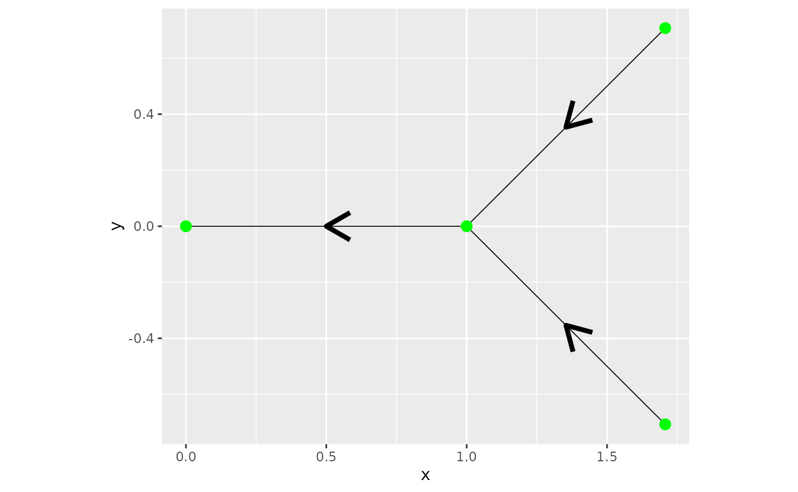
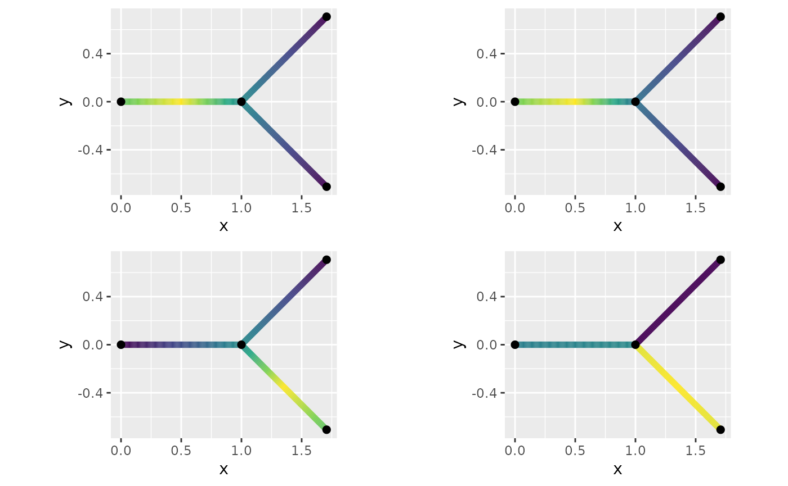
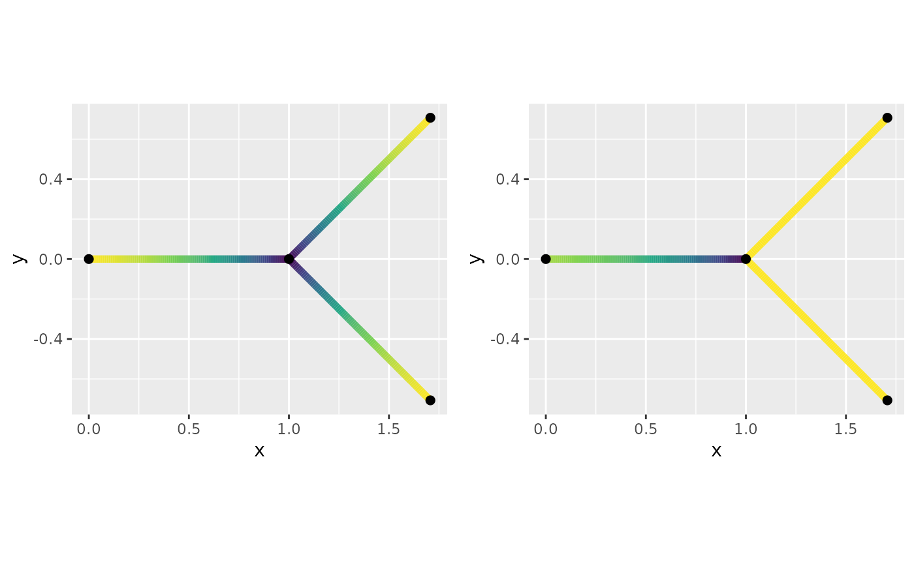
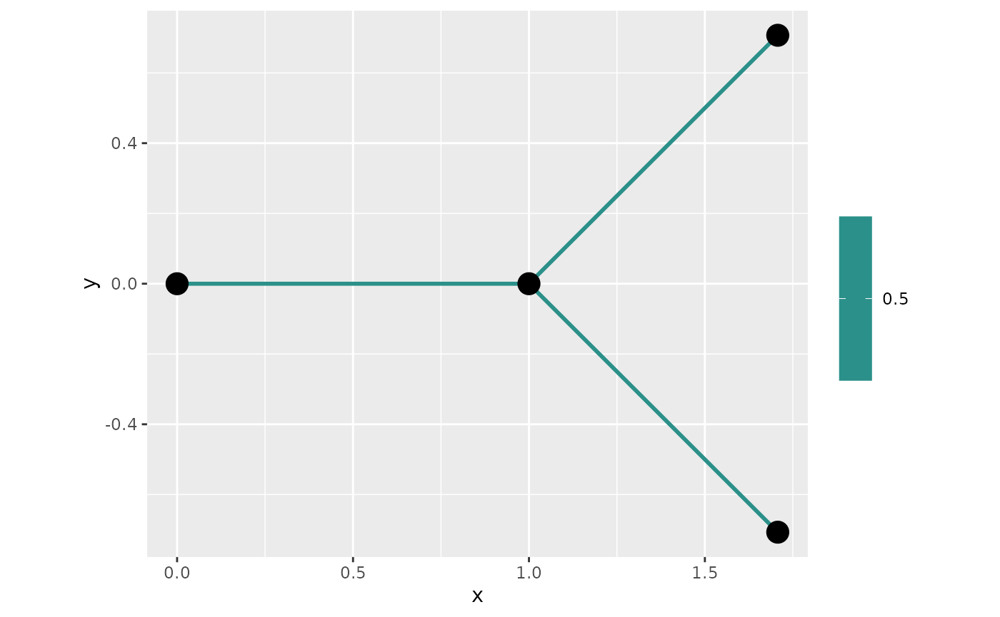

# An example with directional models

## Introduction

This is a tutorial for working with Gaussian processes on directional
tree graphs. We introduce how the directional models differ from the
non-directional. We also show how a few different boundary conidtions
gives different behavior, with boundary conditions we mean how edges are
connected. As the basic graph we create a very simple directional graph
$`\Gamma`$.

``` r

  edge1 <- rbind(c(1,0),c(0,0))
  edge2 <- rbind(c(1+sqrt(0.5),sqrt(0.5)),c(1,0))
  edge3 <- rbind(c(1+sqrt(0.5),-sqrt(0.5)),c(1,0))
  edges = list(edge1,edge2,edge3)
  graph <- metric_graph$new(edges = edges)
  graph$plot(direction = T)
```



## Symmetric vs directional

In [Gaussian random fields on metric
graphs](https://davidbolin.github.io/MetricGraph/articles/random_fields.md)
we have studied the symmetric Whittle–Matérn field which is the solution
to
``` math
  (\kappa^2 - \Delta)^{\alpha/2} \tau u = \mathcal{W}.
```
Here we instead we instead looking for solution on the form
``` math
  (\kappa - d_s)^{\alpha} \tau u = \mathcal{W}.
```
We only consider the case $`\alpha=1`$. The only difference between the
process is how the boundary conditions are constructed. For the
symmetric field we impose the boundary condition for a vertex $`v`$
``` math
\mathcal{K} = \left\{ \forall e,\tilde{e} \in \mathcal{E}_v : 
        u_e(v) =  u_{\tilde{e}}
        \right\}.
```
While the default boundary condition for the directional graph for
vertex $`v`$ is to let the outgoing edges, \$ ^s_v\$, equal the average
of the in-going edges, \$ ^s_v\$ i.e. 
``` math
\mathcal{K}_1 = \left\{ \forall e \in \mathcal{E}_v^s : 
        u_e(v) =  \frac{1}{|\mathcal{E}_v^e|}\sum_{\hat{e} \in \mathcal{E}_v^e} u_{\hat{e}}.
        \right\}.
```
We explore the covariance of both upstream dependence (against the
direction) by examining node located at the middle of the first edge,
$`e_1(0.5)`$, and the downstream behaviour through the node
$`e_3(0.5)`$.

``` r

graph$build_mesh(h=0.01)
kappa <- 0.1
tau   <- 1
P1 <- c(1, 0.5)
P2 <- c(3, 0.5)
C.dir <-spde_covariance(P1,kappa=kappa,tau=tau,
                            alpha=1,
                            graph=graph,
                            directional = T)
C.sym <-spde_covariance(P1,kappa=kappa,tau=tau,
                            alpha=1,
                            graph=graph,
                            directional = F)
df_C_sym <- data.frame(C = C.sym, edge_number = graph$mesh$VtE[,1],
                       distance_on_edge = graph$mesh$VtE[,2])
df_C_sym <- graph$process_data(data = df_C_sym, normalized = TRUE)
fig.sym <- graph$plot_function(data = "C", newdata = df_C_sym, line_width=2, vertex_size=2)

df_C_dir <- data.frame(C = C.dir, edge_number = graph$mesh$VtE[,1],
                       distance_on_edge = graph$mesh$VtE[,2])
df_C_dir <- graph$process_data(data = df_C_dir, normalized = TRUE)
fig.dir <- graph$plot_function(data = "C", newdata = df_C_dir, line_width=2, vertex_size=2)
C.dir2 <-spde_covariance(P2,kappa=kappa,tau=tau,
                            alpha=1,
                            graph=graph,
                            directional = T)
C.sym2 <-spde_covariance(P2,kappa=kappa,tau=tau,
                            alpha=1,
                            graph=graph,
                            directional = F)
df_C_sym2 <- data.frame(C = C.sym2, edge_number = graph$mesh$VtE[,1],
                        distance_on_edge = graph$mesh$VtE[,2])
df_C_sym2 <- graph$process_data(data = df_C_sym2, normalized = TRUE)
fig.sym2 <- graph$plot_function(data = "C", newdata = df_C_sym2, line_width=2, vertex_size=2)

df_C_dir2 <- data.frame(C = C.dir2, edge_number = graph$mesh$VtE[,1],
                        distance_on_edge = graph$mesh$VtE[,2])
df_C_dir2 <- graph$process_data(data = df_C_dir2, normalized = TRUE)
fig.dir2 <- graph$plot_function(data = "C", newdata = df_C_dir2, line_width=2, vertex_size=2)
plot_grid(fig.sym + theme(legend.position="none"),
          fig.dir + theme(legend.position="none"), 
          fig.sym2 + theme(legend.position="none"),
          fig.dir2 + theme(legend.position="none"))
```



Here one can see that the with directional model creates independence
between edges that are meeting by inwards direction.

## Special boundary condition

When imposing the boundary condition $`\mathcal{K}`$ or
$`\mathcal{K}_1`$ the variance of the field is non-istorpic. Where the
symmetric boundary conditions the variance around vertex of degree three
has a smaller variability, while for the directional only the outward
direction creates a smaller variability.

``` r

kappa = 1 #change to larger value for better figures
var.dir <-spde_variance(P2,kappa=kappa,tau=tau,
                            alpha=1,
                            graph=graph,
                            directional = T)
var.sym <-spde_variance(P2,kappa=kappa,tau=tau,
                            alpha=1,
                            graph=graph,
                            directional = F)
df_var_sym <- data.frame(var = var.sym, edge_number = graph$mesh$PtE[,1],
                         distance_on_edge = graph$mesh$PtE[,2])
df_var_sym <- graph$process_data(data = df_var_sym, normalized = TRUE)
fig.sym <- graph$plot_function(data = "var", newdata = df_var_sym, line_width=2, vertex_size=2)

df_var_dir <- data.frame(var = var.dir, edge_number = graph$mesh$PtE[,1],
                         distance_on_edge = graph$mesh$PtE[,2])
df_var_dir <- graph$process_data(data = df_var_dir, normalized = TRUE)
fig.dir <- graph$plot_function(data = "var", newdata = df_var_dir, line_width=2, vertex_size=2)
plot_grid(fig.sym + theme(legend.position="none"),
          fig.dir + theme(legend.position="none"))
```



In [Ver Hoef et al.
(2006)](https://link.springer.com/article/10.1007/s10651-006-0022-8)
they introduced a different type of boundary condition namely
``` math
\mathcal{K}_2 = \left\{ \forall e \in \mathcal{E}_v^s : 
        u_e(v) =  \sum_{\hat{e} \in \mathcal{E}_v^e}\sqrt{\frac{1}{|\mathcal{E}_v^e|}} u_{\hat{e}}.
        \right\}.
```
If one imposes this boundary condition one gets that variance of the
Gaussian processes on the graph is isotropic. In one line we can change
the boundary conditions so they follow these boundary conditions:

``` r

graph2 <- graph$clone()
graph2$setDirectionalWeightFunction(f_in = function(x){sqrt(x/sum(x))})
```

    ## Warning in graph2$setDirectionalWeightFunction(f_in = function(x) {: The
    ## constraint matrix has been deleted

And we can see that the variance now isotropic:

``` r

C<-spde_variance(kappa=kappa,tau=tau,
                            alpha=1,
                            graph=graph2,
                            directional = T)
df_C <- data.frame(C = C, edge_number = graph2$mesh$PtE[,1],
                   distance_on_edge = graph2$mesh$PtE[,2])
df_C <- graph2$process_data(data = df_C, normalized = TRUE)
graph2$plot_function(data = "C", newdata = df_C, plotly = FALSE)
```

    ## Warning: The `plotly` argument of `plot()` is deprecated as of MetricGraph 1.3.0.9000.
    ## ℹ Please use the `type` argument instead.
    ## ℹ The argument `plotly` was deprecated in favor of the argument `type`.
    ## This warning is displayed once per session.
    ## Call `lifecycle::last_lifecycle_warnings()` to see where this warning was
    ## generated.



However, the isotropic processes it creates non energy conserving
conditional expectations, in that the posterior expectation of the
outward direction is greater then the average of the inwards direction
on a vertex of degree greater than two. This can be seen by adding two
observations on the edge and plot the posterior mean of the field

``` r

PtE_resp <- rbind(c(2,0.5),
               c(3,0.5))
resp <- c(1,1)
Eu <- MetricGraph:::posterior_mean_obs_alpha1(c(0,tau, kappa),
                            graph2,
                            resp, 
                            PtE_resp,
                            graph2$mesh$PtE,
                            type = "PtE",
                            directional = T)
df_Eu <- data.frame(Eu = Eu, edge_number = graph2$mesh$PtE[,1],
                    distance_on_edge = graph2$mesh$PtE[,2])
df_Eu <- graph2$process_data(data = df_Eu, normalized = TRUE)
fig<- graph2$plot_function(data = "Eu", newdata = df_Eu, type = "plotly")
fig <- fig %>% layout(scene = list( camera=list( eye =  list(x=-2., y=-0.8, z=.5))))
fig
```

While for $`\mathcal{K}_1`$ there is no increase in energy.

``` r

Eu <- MetricGraph:::posterior_mean_obs_alpha1(c(0,tau, kappa),
                            graph,
                            resp, #resp must be in the graph's internal order
                            PtE_resp,
                            graph$mesh$PtE,
                            type = "PtE",
                            directional = T)
df_Eu <- data.frame(Eu = Eu, edge_number = graph$mesh$PtE[,1],
                    distance_on_edge = graph$mesh$PtE[,2])
df_Eu <- graph$process_data(data = df_Eu, normalized = TRUE)
fig <- graph$plot_function(data = "Eu", newdata = df_Eu, type = "plotly")
fig <- fig %>% layout(scene = list( camera=list( eye =  list(x=-2., y=-0.8, z=.5))))
fig
```

Ver Hoef, Jay M., Erin Peterson, and David Theobald. 2006. “Spatial
Statistical Models That Use Flow and Stream Distance.” *Environmental
and Ecological Statistics* 13: 449–64.
