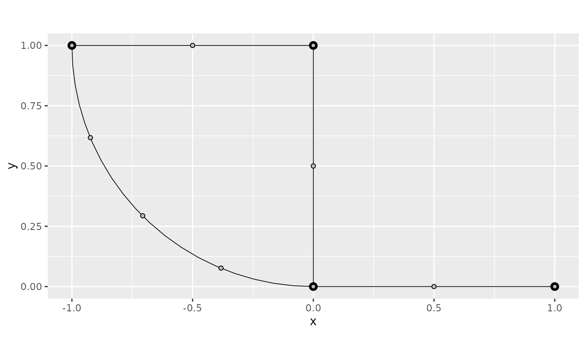
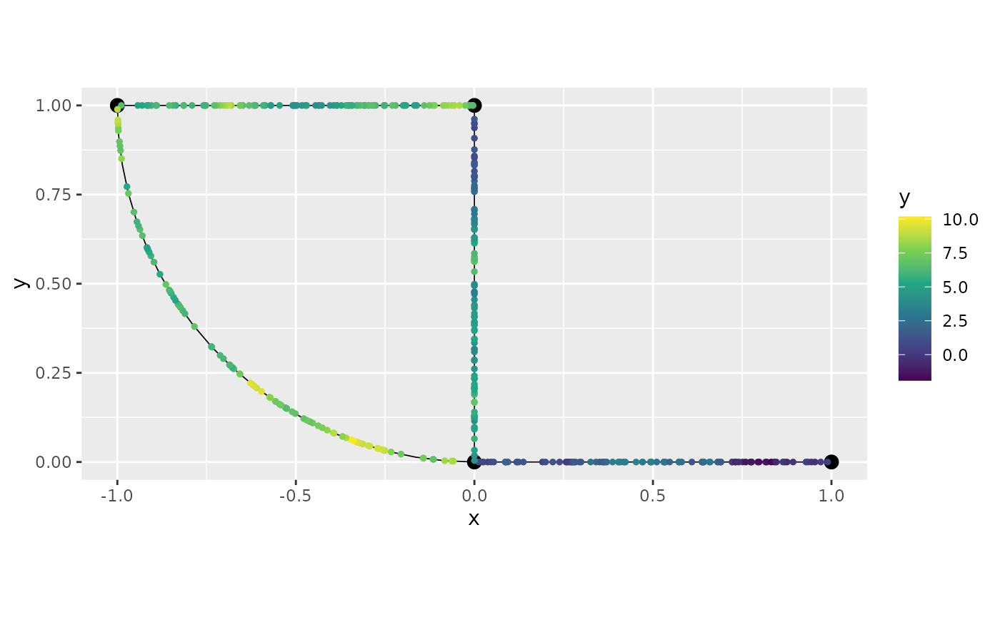
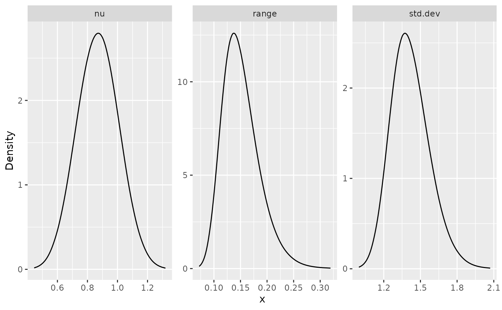
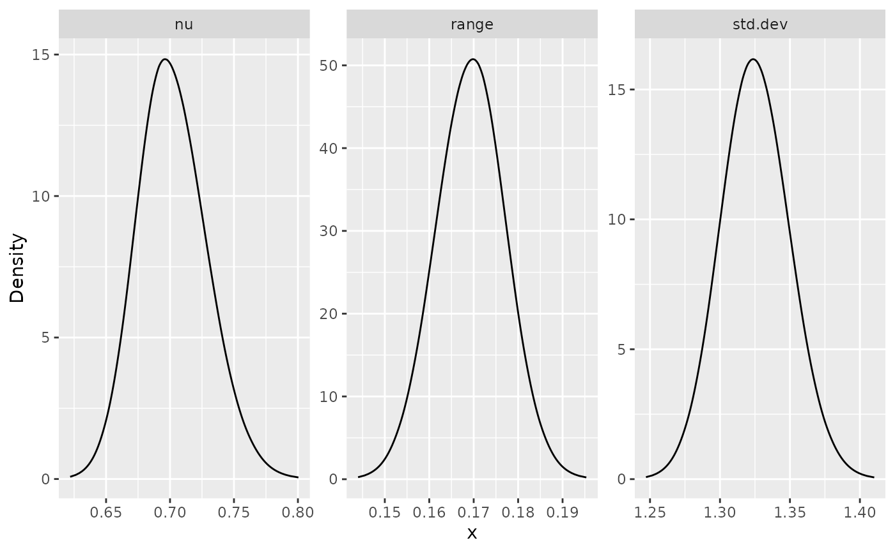
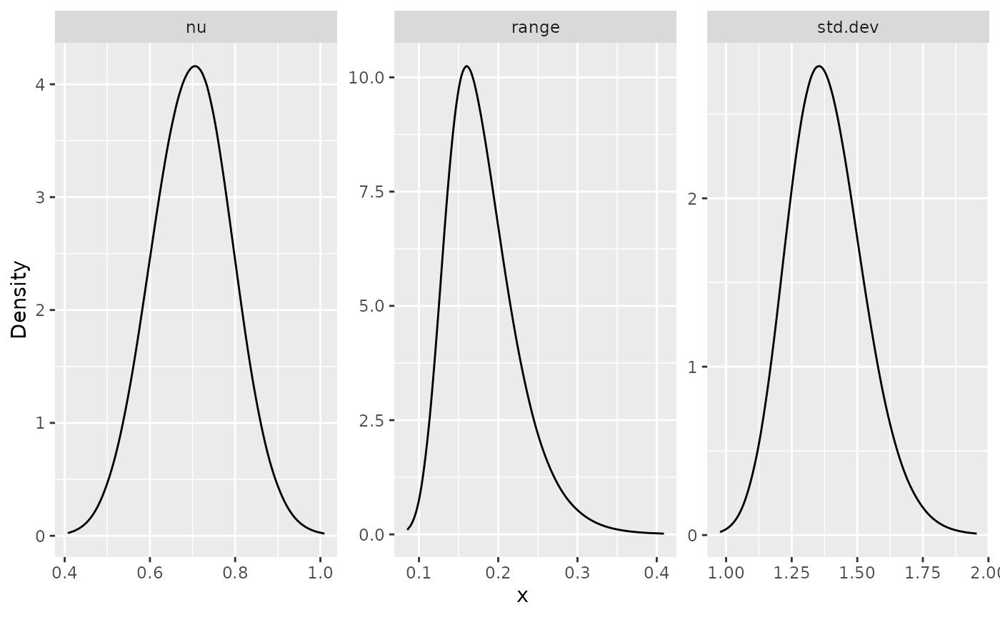
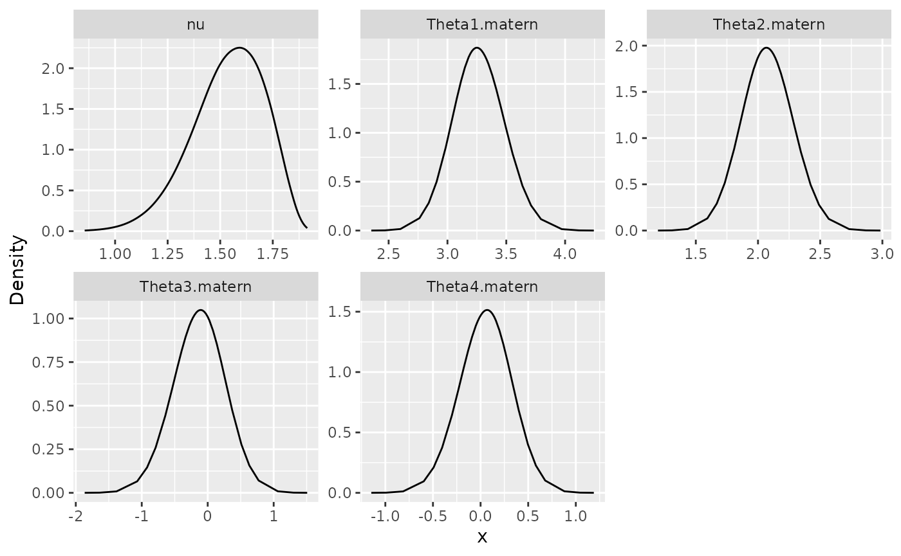

# Whittle--Matérn fields with general smoothness

## Introduction

In this vignette we will introduce how to fit Whittle–Matérn fields with
general smoothness based on finite element and rational approximations.
The theory for this approach is provided in [Bolin, Kovács, et al.
(2023)](https://doi.org/10.1090/mcom/3929) and [Bolin, Simas, et al.
(2023)](https://doi.org/10.1080/10618600.2023.2231051). For the
implementation, we make use of the [`rSPDE`
package](https://davidbolin.github.io/rSPDE/) for the rational
approximations.

These models are thus implemented using finite element approximations.
Such approximations are not needed for integer smoothness parameters,
and for the details about the exact models we refer to the vignettes

- [Whittle–Matérn fields on metric
  graphs](https://davidbolin.github.io/MetricGraph/articles/random_fields.md)
- [INLA and inlabru
  interfaces](https://davidbolin.github.io/MetricGraph/articles/inla_interface.md)

For details on the construction of metric graphs, see [Working with
metric
graphs](https://davidbolin.github.io/MetricGraph/articles/metric_graphs.md)

For further details on data manipulation on metric graphs, see [Data
manipulation on metric
graphs](https://davidbolin.github.io/MetricGraph/articles/metric_graph_data.md)

## Constructing the graph and the mesh

We begin by loading the `rSPDE` and `MetricGraph` packages:

``` r

  library(rSPDE)
  library(MetricGraph)
```

As an example, we consider the following metric graph

``` r

  edge1 <- rbind(c(0,0),c(1,0))
  edge2 <- rbind(c(0,0),c(0,1))
  edge3 <- rbind(c(0,1),c(-1,1))
  theta <- seq(from=pi,to=3*pi/2,length.out = 20)
  edge4 <- cbind(sin(theta),1+ cos(theta))
  edges = list(edge1, edge2, edge3, edge4)
  graph <- metric_graph$new(edges = edges)
  graph$plot()
```


To construct a FEM approximation of a Whittle–Matérn field with general
smoothness, we must first construct a mesh on the graph.

``` r

  graph$build_mesh(h = 0.1)
  graph$plot(mesh=TRUE)
```



In the command `build_mesh`, the argument `h` decides the largest
spacing between nodes in the mesh. As can be seen in the plot, the mesh
is very coarse, so let’s reduce the value of `h` and rebuild the mesh:

``` r

graph$build_mesh(h = 0.01)
```

We are now ready to specify the model
``` math
(\kappa^2 - \Delta)^{\alpha/2} \tau u = \mathcal{W}
```
for the Whittle–Matérn field $`u`$. For this, we use the
`matern.operators` function from the `rSPDE` package:

``` r

  sigma <- 1.3
  range <- 0.15
  nu <- 0.8 

  rspde.order <- 2
  op <- matern.operators(nu = nu, range = range, sigma = sigma, 
                         parameterization = "matern",
                         m = rspde.order, graph = graph)                     
```

As can be seen in the code, we specify $`\kappa`$ via the practical
correlation range $`\sqrt{8\nu}/\kappa`$. Also, the model is not
parametrized by $`\tau, \alpha`$ but instead by $`\sigma, \nu`$. Here,
`sigma` denotes the standard deviation of the field and `nu` is the
smoothness parameter, which is related to $`\alpha`$ via the relation
$`\alpha = \nu + 1/2`$. The object `op` contains the matrices needed for
evaluating the distribution of the stochastic weights in the FEM
approximation.

Let us simulate the field $`u`$ at the mesh locations and plot the
result:

``` r

u <- simulate(op)
df_u <- data.frame(u = as.vector(u), edge_number = graph$mesh$VtE[,1],
                   distance_on_edge = graph$mesh$VtE[,2])
df_u <- graph$process_data(data = df_u, normalized = TRUE)
graph$plot_function(data = "u", newdata = df_u, type = "plotly")
```

If we want to evaluate $`u(s)`$ at some locations $`s_1,\ldots, s_n`$,
we need to multiply the weights with the FEM basis functions
$`\varphi_i(s)`$ evaluated at the locations. For this, we can construct
the observation matrix $`\boldsymbol{\mathrm{A}}`$, with elements
$`A_{ij} = \varphi_j(s_i)`$, which links the FEM basis functions to the
locations. This can be done by the function `fem_basis` in the metric
graph object. To illustrate this, let us simulate some observation
locations on the graph and construct the matrix:

``` r

obs.per.edge <- 100
obs.loc <- NULL
for(i in 1:graph$nE) {
  obs.loc <- rbind(obs.loc,
                   cbind(rep(i,obs.per.edge), runif(obs.per.edge)))
}
n.obs <- obs.per.edge*graph$nE
A <- graph$fem_basis(obs.loc)
```

In the code, we generate $`100`$ observation locations per edge in the
graph, drawn at random. It can be noted that we assume that the
observation locations are given in the format $`(e, d)`$ where $`e`$
denotes the edge of the observation and $`d`$ is the position on the
edge, i.e., the relative distance from the first vertex of the edge.

To compute the precision matrix from the covariance-based rational
approximation one can use the
[`precision()`](https://davidbolin.github.io/rSPDE/reference/precision.CBrSPDEobj.html)
method on object returned by the
[`matern.operators()`](https://davidbolin.github.io/rSPDE/reference/matern.operators.html)
function:

``` r

  Q <- precision(op)
```

As an illustration of the model, let us compute the covariance function
between the process at $`s=(2,0.1)`$, that is, the point at edge 2 and
distance on edge 0.1, and all the other mesh points. To this end, we can
use the helper function `cov_function_mesh` that is contained in the
`op` object:

``` r

  c_cov <- cov_function_mesh(op, matrix(c(2,0.1),1,2))
  df_c_cov <- data.frame(cov = as.vector(c_cov), edge_number = graph$mesh$VtE[,1],
                         distance_on_edge = graph$mesh$VtE[,2])
  df_c_cov <- graph$process_data(data = df_c_cov, normalized = TRUE)
  graph$plot_function(data = "cov", newdata = df_c_cov, type = "plotly")
```

## Using the model for inference

There is built-in support for computing log-likelihood functions and
performing kriging prediction in the `rSPDE` package which we can use
for the graph model. To illustrate this, we use the simulation to create
some noisy observations of the process. We generate the observations as
$`Y_i = 1 + 2x_{i1} - 3 x_{i2} + u(s_i) + \varepsilon_i`$, where
$`\varepsilon_i \sim N(0,\sigma_e^2)`$ is Gaussian measurement noise,
$`x_1`$ and $`x_2`$ are covariates generated from the relative positions
of the observations on the graph.

``` r

    sigma.e <- 0.1

    x1 <- obs.loc[,1]
    x2 <- obs.loc[,2]

    Y <- 1 + 2*x1 - 3*x2 + as.vector(A %*% u + sigma.e * rnorm(n.obs))
```

Let us now fit the model. To this end we will use the
[`graph_lme()`](https://davidbolin.github.io/MetricGraph/reference/graph_lme.md)
function (that, for the finite element models, acts as a wrapper for the
[`rspde_lme()`](https://davidbolin.github.io/rSPDE/reference/rspde_lme.html)
function from the `rSPDE` package). To this end, let us now assemble the
[`data.frame()`](https://rdrr.io/r/base/data.frame.html) with the
observations, the observation locations and the covariates:

``` r

df_data <- data.frame(y = Y, edge_number = obs.loc[,1],
                        distance_on_edge = obs.loc[,2],
                        x1 = x1, x2 = x2)
```

Let us now add the data to the graph object and plot it:

``` r

graph$add_observations(data = df_data, normalized = TRUE)
```

    ## Adding observations...

    ## Assuming the observations are normalized by the length of the edge.

``` r

graph$plot(data = "y")
```



We can now fit the model. To this end, we use the
[`graph_lme()`](https://davidbolin.github.io/MetricGraph/reference/graph_lme.md)
function and set the model to `'WM`’.

``` r

fit <- graph_lme(y ~ x1 + x2, graph = graph, model = "WM")
```

Let us obtain a summary of the model:

``` r

summary(fit)
```

    ## 
    ## Latent model - Whittle-Matern
    ## 
    ## Call:
    ## graph_lme(formula = y ~ x1 + x2, graph = graph, model = "WM")
    ## 
    ## Fixed effects:
    ##             Estimate Std.error z-value Pr(>|z|)    
    ## (Intercept)  0.01389   0.78764   0.018  0.98593    
    ## x1           2.24707   0.22309  10.073  < 2e-16 ***
    ## x2          -2.21628   0.74255  -2.985  0.00284 ** 
    ## 
    ## Random effects:
    ##        Estimate Std.error z-value
    ## alpha  1.212430  0.014797  81.939
    ## tau    0.073186  0.005842  12.528
    ## kappa 13.106013  2.515219   5.211
    ## 
    ## Random effects (Matern parameterization):
    ##       Estimate Std.error z-value
    ## nu     0.71243   0.01480  48.148
    ## sigma  1.37199   0.15321   8.955
    ## range  0.18216   0.03207   5.680
    ## 
    ## Measurement error:
    ##          Estimate Std.error z-value
    ## std. dev 0.096920  0.006273   15.45
    ## ---
    ## Signif. codes:  0 '***' 0.001 '**' 0.01 '*' 0.05 '.' 0.1 ' ' 1 
    ## 
    ## Log-Likelihood:  -126.7326 
    ## Number of function calls by 'optim' = 502
    ## Optimization method used in 'optim' = Nelder-Mead
    ## 
    ## Time used to:     fit the model =  8.75329 secs

An improved estimate of the Hessian can be obtained by setting
`improve_hessian` to `TRUE`, which improves the precision of the
standard errors.

``` r

fit <- graph_lme(y ~ x1 + x2, graph = graph, model = "WM", improve_hessian = TRUE)
```

Let us obtain a summary of the model fitted with the improved Hessian:

``` r

summary(fit)
```

    ## 
    ## Latent model - Whittle-Matern
    ## 
    ## Call:
    ## graph_lme(formula = y ~ x1 + x2, graph = graph, model = "WM", 
    ##     improve_hessian = TRUE)
    ## 
    ## Fixed effects:
    ##             Estimate Std.error z-value Pr(>|z|)    
    ## (Intercept)   0.3135    0.7190   0.436  0.66284    
    ## x1            2.1435    0.2061  10.402  < 2e-16 ***
    ## x2           -2.2434    0.7058  -3.178  0.00148 ** 
    ## 
    ## Random effects:
    ##       Estimate Std.error z-value
    ## alpha  1.25996   0.13295   9.477
    ## tau    0.05782   0.03959   1.461
    ## kappa 15.56839   6.07844   2.561
    ## 
    ## Random effects (Matern parameterization):
    ##       Estimate Std.error z-value
    ## nu     0.75996   0.13295   5.716
    ## sigma  1.32027   0.13496   9.783
    ## range  0.15838   0.02465   6.425
    ## 
    ## Measurement error:
    ##          Estimate Std.error z-value
    ## std. dev 0.097162  0.006363   15.27
    ## ---
    ## Signif. codes:  0 '***' 0.001 '**' 0.01 '*' 0.05 '.' 0.1 ' ' 1 
    ## 
    ## Log-Likelihood:  -126.5465 
    ## Number of function calls by 'optim' = 125
    ## Optimization method used in 'optim' = L-BFGS-B
    ## 
    ## Time used to:     fit the model =  23.18599 secs 
    ##   compute the Hessian = 2.7467 secs

We can also obtain additional information by using the function
[`glance()`](https://davidbolin.github.io/MetricGraph/reference/glance.graph_lme.md):

``` r

glance(fit)
```

    ## # A tibble: 1 × 9
    ##    nobs  sigma logLik   AIC   BIC deviance df.residual model         alpha
    ##   <int>  <dbl>  <dbl> <dbl> <dbl>    <dbl>       <dbl> <chr>         <dbl>
    ## 1   400 0.0972  -127.  267.  295.     253.         393 WhittleMatern  1.26

Let us compare the values of the parameters of the latent model with the
true ones:

``` r

print(data.frame(sigma = c(sigma, fit$alt_par_coeff$coeff["sigma"]), 
                   range = c(range, fit$alt_par_coeff$coeff["range"]),
                   nu = c(nu, fit$alt_par_coeff$coeff["nu"]),
                   row.names = c("Truth", "Estimates")))
```

    ##             sigma     range        nu
    ## Truth     1.30000 0.1500000 0.8000000
    ## Estimates 1.32027 0.1583788 0.7599609

### Kriging

Given that we have estimated the parameters, let us compute the kriging
predictor of the field given the observations at the mesh nodes.

We will perform kriging with the
[`predict()`](https://rdrr.io/r/stats/predict.html) method. To this end,
we need to provide a `data.frame` containing the prediction locations,
as well as the values of the covariates at the prediction locations.

``` r

  df_pred <- data.frame(edge_number = graph$mesh$VtE[,1],
                        distance_on_edge = graph$mesh$VtE[,2],
                        x1 = graph$mesh$VtE[,1],
                        x2 = graph$mesh$VtE[,2])

  u.krig <- predict(fit, newdata = df_pred, normalized = TRUE)
```

The estimate is shown in the following figure

``` r

  df_krig <- data.frame(mean = as.vector(u.krig$mean), edge_number = graph$mesh$VtE[,1],
                        distance_on_edge = graph$mesh$VtE[,2])
  df_krig <- graph$process_data(data = df_krig, normalized = TRUE)
  graph$plot_function(data = "mean", newdata = df_krig, type = "plotly")
```

We can also use the
[`augment()`](https://davidbolin.github.io/MetricGraph/reference/augment.graph_lme.md)
function to easily plot the predictions. Let us a build a 3d plot now
and add the observed values on top of the predictions:

``` r

df_pred <- graph$process_data(data = df_pred, normalized = TRUE)
p <- augment(fit, newdata = df_pred, normalized = TRUE) %>%
          graph$plot_function(data = ".fitted", type = "plotly")

graph$plot(data = "y", p = p, type = "plotly")
```

## Further details on `graph_lme`

The `graph_lme` function provides flexibility in model fitting by
allowing users to fix certain parameters at specific values or set
custom starting values for the optimization process. This can be useful
when you have prior knowledge about some parameters or when you want to
improve convergence by providing better starting points.

### Fixing parameters

Parameters can be fixed by using the `model_options` argument with
elements of the form `fix_parname = value`, where `parname` is the name
of the parameter you want to fix. The parameters that can be fixed in
the `model_options` list are:

- `fix_sigma_e`: Fix the standard deviation of the noise parameter
  $`\sigma_\varepsilon`$
- `fix_sigma`: Fix the standard deviation parameter $`\sigma`$
- `fix_range`: Fix the range parameter
- `fix_alpha`: Fix the fractional power $`\alpha`$

### Setting starting values

Similarly, you can set starting values for parameters using elements of
the form `start_parname = value` in the `model_options` list. This is
particularly useful when the default starting values might be far from
the optimal values, which could lead to slow convergence or convergence
to a local minimum.

- `start_sigma_e`: Starting value for the standard deviation of the
  noise parameter $`\sigma_\varepsilon`$
- `start_sigma`: Starting value for the standard deviation parameter
  $`\sigma`$
- `start_range`: Starting value for the range parameter
- `start_alpha`: Starting value for the fractional power $`\alpha`$

### Example: Fixing and setting starting values

Let us demonstrate how to use these parameters with a graph model
example. We will fix the standard deviation $`\sigma`$ to 1 and set the
starting value for the range parameter to 0.5, on the previous example.

``` r

# Fit model with fixed sigma and start_range
fit_fixed <- graph_lme(y ~ x1 + x2, graph = graph, model = "WM",
                      model_options = list(
                        fix_sigma = 1,      # Fix sigma to 1
                        start_range = 0.5   # Set starting value for range
                      ))

# Print summary of the model
summary(fit_fixed)
```

    ## 
    ## Latent model - Whittle-Matern
    ## 
    ## Call:
    ## graph_lme(formula = y ~ x1 + x2, graph = graph, model = "WM", 
    ##     model_options = list(fix_sigma = 1, start_range = 0.5))
    ## 
    ## Fixed effects:
    ##             Estimate Std.error z-value Pr(>|z|)    
    ## (Intercept)   0.5825    0.4770   1.221    0.222    
    ## x1            2.0676    0.1348  15.340  < 2e-16 ***
    ## x2           -2.4141    0.5096  -4.737 2.17e-06 ***
    ## 
    ## Random effects:
    ##               Estimate Std.error z-value
    ## nu            0.692490  0.010335   67.00
    ## sigma (fixed) 1.000000        NA      NA
    ## range         0.117990  0.008995   13.12
    ## 
    ## Random effects (SPDE parameterization):
    ##       Estimate Std.error z-value
    ## alpha  1.19249   0.01034   115.4
    ## tau    0.07975        NA      NA
    ## kappa 19.94834        NA      NA
    ## 
    ## Measurement error:
    ##          Estimate Std.error z-value
    ## std. dev  0.09719   0.00630   15.43
    ## ---
    ## Signif. codes:  0 '***' 0.001 '**' 0.01 '*' 0.05 '.' 0.1 ' ' 1 
    ## 
    ## Log-Likelihood:  -132.3038 
    ## Number of function calls by 'optim' = 77
    ## Optimization method used in 'optim' = L-BFGS-B
    ## 
    ## Time used to:     fit the model =  14.34051 secs

``` r

# Compare log-likelihoods
cat("Log-likelihood with fixed sigma:", logLik(fit_fixed), "\n")
```

    ## Log-likelihood with fixed sigma: -132.3038

``` r

cat("Log-likelihood with all parameters estimated:", logLik(fit), "\n")
```

    ## Log-likelihood with all parameters estimated: -126.5465

## Fitting a model with replicates

Let us now illustrate how to simulate a data set with replicates and
then fit a model to such data. To simulate a latent model with
replicates, all we do is set the `nsim` argument to the number of
replicates.

``` r

  n.rep <- 30
  u.rep <- simulate(op, nsim = n.rep)
```

Now, let us generate the observed values $`Y`$:

``` r

  sigma.e <- 0.3
  Y.rep <- A %*% u.rep + sigma.e * matrix(rnorm(n.obs * n.rep), ncol = n.rep)
```

Note that $`Y`$ is a matrix with 20 columns, each column containing one
replicate. We need to turn `y` into a vector and create an auxiliary
vector `repl` indexing the replicates of `y`:

``` r

y_vec <- as.vector(Y.rep)
repl <- rep(1:n.rep, each = n.obs)                       

df_data_repl <- data.frame(y = y_vec,
                              edge_number = rep(obs.loc[,1], n.rep),
                              distance_on_edge = rep(obs.loc[,2], n.rep), 
                              repl = repl)
```

Let us clear the previous observations and add the new data to the
graph:

``` r

graph$add_observations(data = df_data_repl, normalized = TRUE, 
                            group = "repl", clear_obs = TRUE)
```

    ## Adding observations...

    ## Assuming the observations are normalized by the length of the edge.

We can now fit the model in the same way as before by using the
[`rspde_lme()`](https://davidbolin.github.io/rSPDE/reference/rspde_lme.html)
function. Note that we can optimize in parallel by setting `parallel` to
`TRUE`. If we do not specify which replicate to consider, in the
`which_repl` argument, all replicates will be considered.

``` r

fit_repl <- graph_lme(y ~ -1, graph = graph, model = "WM", parallel = TRUE)
```

Now, let us see a summary of the fit:

``` r

summary(fit_repl)
```

    ## 
    ## Latent model - Whittle-Matern
    ## 
    ## Call:
    ## graph_lme(formula = y ~ -1, graph = graph, model = "WM", parallel = TRUE)

    ## 
    ## No fixed effects.

    ## 
    ## Random effects:
    ##        Estimate Std.error z-value
    ## alpha  1.289682  0.006362  202.72
    ## tau    0.052035  0.001474   35.30
    ## kappa 15.901647  0.507588   31.33
    ## 
    ## Random effects (Matern parameterization):
    ##       Estimate Std.error z-value
    ## nu    0.789682  0.006362  124.13
    ## sigma 1.313555  0.024716   53.15
    ## range 0.158063  0.004862   32.51
    ## 
    ## Measurement error:
    ##          Estimate Std.error z-value
    ## std. dev   0.3014    0.0030   100.5
    ## ---
    ## Signif. codes:  0 '***' 0.001 '**' 0.01 '*' 0.05 '.' 0.1 ' ' 1 
    ## 
    ## Log-Likelihood:  -9837.691 
    ## Number of function calls by 'optim' = 117
    ## Optimization method used in 'optim' = L-BFGS-B
    ## 
    ## Time used to:     fit the model =  1.07147 mins 
    ##   set up the parallelization = 2.59769 secs

Let us also take a glance of the fit:

``` r

glance(fit_repl)
```

    ## # A tibble: 1 × 9
    ##    nobs sigma logLik    AIC    BIC deviance df.residual model         alpha
    ##   <int> <dbl>  <dbl>  <dbl>  <dbl>    <dbl>       <dbl> <chr>         <dbl>
    ## 1 12000 0.301 -9838. 19683. 19713.   19675.       11996 WhittleMatern  1.29

Let us compare the values of the parameters of the latent model with the
true ones:

``` r

print(data.frame(sigma = c(sigma, fit_repl$alt_par_coeff$coeff["sigma"]), 
                   range = c(range, fit_repl$alt_par_coeff$coeff["range"]),
                   nu = c(nu, fit_repl$alt_par_coeff$coeff["nu"]),
                   row.names = c("Truth", "Estimates")))
```

    ##              sigma     range        nu
    ## Truth     1.300000 0.1500000 0.8000000
    ## Estimates 1.313555 0.1580625 0.7896819

Let us do kriging. We will use the same prediction locations as in the
previous example. Let us get prediction for replicate 10, then add the
original observations on top of them. Observe that even though the
group/replicate might be a number, it is stored as character in the data
frame, so we need to pass it as a character in the `which_repl`
argument.

``` r

p <- augment(fit_repl, which_repl = 10, newdata = df_pred, normalized = TRUE) %>% 
          graph$plot_function(data = ".fitted", type = "plotly")

graph$plot(data = "y", group = 10, type = "plotly", p = p)
```

## Using the R-INLA implementation

We also have an `R-INLA` implementation of the rational SPDE approach
for metric graphs.

We begin by defining the model by using the
[`rspde.metric_graph()`](https://davidbolin.github.io/rSPDE/reference/rspde.metric_graph.html)
function. This function contains the same arguments as the function
[`rspde.matern()`](https://davidbolin.github.io/rSPDE/reference/rspde.matern.html).
We refer the reader to the [R-INLA implementation of the rational SPDE
approach](https://davidbolin.github.io/rSPDE/articles/rspde_inla.html)
vignette for further details.

We begin by clearing the previous observations and adding the
observations (for the case without replicates) to the graph:

``` r

graph$clear_observations()
graph$add_observations(data = df_data, normalized = TRUE)
```

    ## Adding observations...

    ## Assuming the observations are normalized by the length of the edge.

Let us create the model object:

``` r

  library(INLA)
  rspde_model <- rspde.metric_graph(graph, shared_lib = "rSPDE")
```

By default, the order of the rational approximation is 2.

We can now create the auxiliary quantities that will be needed with the
[`graph_data_rspde()`](https://davidbolin.github.io/rSPDE/reference/graph_data_rspde.html)
function:

``` r

  data_rspde <- graph_data_rspde(rspde_model, name = "field")
```

The remaining is standard: we create the formula object, the stack
object, and then fit the model by using the
[`inla()`](https://rdrr.io/pkg/INLA/man/inla.html) function. So, first
we create the formula object:

``` r

  f.s <- y ~ -1 + Intercept + x1 + x2 + f(field, model = rspde_model)
```

Now we create the `inla.stack` object. To such an end, observe that
`data_rspde` contains the dataset as the `data` component, the index as
the `index` component and the so-called `A` matrix as the `basis`
component. We will now create the stack using these components:

``` r

  stk.dat <- inla.stack(
    data = data_rspde[["data"]]["y"], A = list(data_rspde[["basis"]],1), tag = "est",
    effects =
      list(c(
        data_rspde[["index"]],
        list(Intercept = 1)), list(x1 = data_rspde[["data"]]["x1"] ,
                                      x2 = data_rspde[["data"]]["x2"])
      )
    )
```

Finally, we can fit the model:

``` r

  rspde_fit <- inla(f.s, data = inla.stack.data(stk.dat),
    control.inla = list(int.strategy = "eb"),
    control.predictor = list(A = inla.stack.A(stk.dat), compute = TRUE),
    num.threads = "1:1"
  )
```

We can use the same functions as the `rspde` fitted models in `inla`.
For instance, we can see the results in the original scale by creating
the `result` object:

``` r

  result_fit <- rspde.result(rspde_fit, "field", rspde_model)
  summary(result_fit)
```

    ##             mean        sd 0.025quant 0.5quant 0.975quant     mode
    ## std.dev 1.395080 0.1645560   1.110110 1.381210   1.755100 1.348800
    ## range   0.190003 0.0605587   0.103065 0.179025   0.338402 0.159372
    ## nu      0.687484 0.1061780   0.484085 0.686715   0.898670 0.689083

Let us compare with the true values:

``` r

  result_df <- data.frame(
    parameter = c("std.dev", "range", "nu"),
    true = c(sigma, range, nu),
    mean = c(
      result_fit$summary.std.dev$mean,
      result_fit$summary.range$mean,
      result_fit$summary.nu$mean
    ),
    mode = c(
      result_fit$summary.std.dev$mode,
      result_fit$summary.range$mode,
      result_fit$summary.nu$mode
    )
  )
  print(result_df)
```

    ##   parameter true      mean      mode
    ## 1   std.dev 1.30 1.3950841 1.3488036
    ## 2     range 0.15 0.1900028 0.1593721
    ## 3        nu 0.80 0.6874843 0.6890833

We can also plot the posterior marginal densities with the help of the
[`gg_df()`](https://davidbolin.github.io/MetricGraph/reference/gg_df.metric_graph_spde_result.md)
function:

``` r

  posterior_df_fit <- gg_df(result_fit)

  library(ggplot2)

  ggplot(posterior_df_fit) + geom_line(aes(x = x, y = y)) + 
  facet_wrap(~parameter, scales = "free") + labs(y = "Density")
```



### Kriging with the `R-INLA` implementation

We will do kriging on the mesh locations:

``` r

  pred_loc <- graph$mesh$VtE
```

Let us now add the observations for prediction:

``` r

graph$add_observations(data = data.frame(y=rep(NA,nrow(pred_loc)), 
                                x1 = graph$mesh$VtE[,1],
                                x2 = graph$mesh$VtE[,2],
                                edge_number = pred_loc[,1], 
                                distance_on_edge = pred_loc[,2]), 
                                normalized = TRUE)
```

    ## Adding observations...

    ## Assuming the observations are normalized by the length of the edge.

Let us now create a new model and, then, compute the auxiliary
components at the prediction locations. To this end, we set the argument
`only_pred` to `TRUE`, in which it will return the `data.frame`
containing the `NA` data.

``` r

  rspde_model_prd <- rspde.metric_graph(graph) 
  data_rspde_prd <- graph_data_rspde(rspde_model_prd, only_pred = TRUE)
```

Let us build the prediction stack using the components of
`data_rspde_prd` and gather it with the estimation stack.

``` r

  ef.prd <- 
    list(c(data_rspde_prd[["index"]], list(Intercept = 1)), 
          list(x1 = data_rspde_prd[["data"]][["x1"]],
                x2 = data_rspde_prd[["data"]][["x2"]]))
  stk.prd <- inla.stack(
    data = data.frame(y = data_rspde_prd[["data"]][["y"]]),
    A = list(data_rspde_prd[["basis"]],1), tag = "prd",
    effects = ef.prd
  )
  stk.all <- inla.stack(stk.dat, stk.prd)
```

Let us obtain the predictions:

``` r

rspde_fitprd <- inla(f.s,
  data = inla.stack.data(stk.all),
  control.predictor = list(
    A = inla.stack.A(stk.all),
    compute = TRUE, link = 1
  ),
  control.compute = list(
    return.marginals = FALSE,
    return.marginals.predictor = FALSE
  ),
  control.inla = list(int.strategy = "eb"),
  num.threads = "1:1"
)
```

Let us now extract the indices of the predicted nodes and store the
means:

``` r

id.prd <- inla.stack.index(stk.all, "prd")$data
m.prd <- rspde_fitprd$summary.fitted.values$mean[id.prd]
```

Finally, let us plot the predicted values. To this end we will use the
`plot_function()` graph method.

``` r

  df_prd <- data.frame(mean = m.prd, edge_number = pred_loc[,1],
                       distance_on_edge = pred_loc[,2])
  df_prd <- graph$process_data(data = df_prd, normalized = TRUE)
  graph$plot_function(data = "mean", newdata = df_prd, type = "plotly")
```

## Using `R-INLA` implementation to fit models with replicates

Let us begin by cloning the graph and clearing the observations on the
cloned graph:

``` r

graph_rep <- graph$clone()
graph_rep$clear_observations()
```

We will now add the data with replicates to the graph:

``` r

graph_rep$add_observations(data = data.frame(y=as.vector(Y.rep), 
                          edge_number = rep(obs.loc[,1], n.rep), 
                          distance_on_edge = rep(obs.loc[,2], n.rep),
                          repl = rep(1:n.rep, each = n.obs)), 
                          group = "repl",
                          normalized = TRUE)
```

    ## Adding observations...

    ## Assuming the observations are normalized by the length of the edge.

Let us create a new `rspde` model object:

``` r

rspde_model_rep <- rspde.metric_graph(graph_rep)
```

To fit the model with replicates we need to create the auxiliary
quantities with the
[`graph_data_rspde()`](https://davidbolin.github.io/rSPDE/reference/graph_data_rspde.html)
function, where we set the `repl` argument in the function
`graph_data_spde` to `.all` since we want to use all replicates:

``` r

data_rspde_rep <- graph_data_rspde(rspde_model_rep, 
                      name = "field", repl = ".all",
                      repl_col = "repl")
```

Let us now create the corresponding `inla.stack` object:

``` r

st.dat.rep <- inla.stack(
  data = data_rspde_rep[["data"]],
  A = data_rspde_rep[["basis"]],
  effects = data_rspde_rep[["index"]]
)
```

Observe that we need the response variable `y` to be a vector. We can
now create the `formula` object, remembering that since we gave the name
argument `field`, when creating the index, we need to pass `field.repl`
to the `formula`:

``` r

f.rep <-
  y ~ -1 + f(field,
    model = rspde_model_rep,
    replicate = field.repl
  )
```

We can, finally, fit the model:

``` r

rspde_fit_rep <-
  inla(f.rep,
    data = inla.stack.data(st.dat.rep),
    family = "gaussian",
    control.predictor =
      list(A = inla.stack.A(st.dat.rep)),
    num.threads = "1:1"
  )
```

We can obtain the estimates in the original scale with the
[`rspde.result()`](https://davidbolin.github.io/rSPDE/reference/rspde.result.html)
function:

``` r

  result_fit_rep <- rspde.result(rspde_fit_rep, "field", rspde_model_rep)
  summary(result_fit_rep)
```

    ##             mean         sd 0.025quant 0.5quant 0.975quant     mode
    ## std.dev 1.324080 0.02431520   1.277480 1.323640   1.372960 1.322470
    ## range   0.169447 0.00724966   0.155353 0.169421   0.183811 0.169536
    ## nu      0.701425 0.02465520   0.655215 0.700550   0.751921 0.697911

Let us compare with the true values of the parameters:

``` r

  result_rep_df <- data.frame(
    parameter = c("std.dev", "range", "nu"),
    true = c(sigma, range, nu),
    mean = c(
      result_fit_rep$summary.std.dev$mean,
      result_fit_rep$summary.range$mean,
      result_fit_rep$summary.nu$mean
    ),
    mode = c(
      result_fit_rep$summary.std.dev$mode,
      result_fit_rep$summary.range$mode,
      result_fit_rep$summary.nu$mode
    )
  )
  print(result_rep_df)
```

    ##   parameter true      mean      mode
    ## 1   std.dev 1.30 1.3240800 1.3224701
    ## 2     range 0.15 0.1694467 0.1695359
    ## 3        nu 0.80 0.7014245 0.6979107

We can also plot the posterior marginal densities with the help of the
[`gg_df()`](https://davidbolin.github.io/MetricGraph/reference/gg_df.metric_graph_spde_result.md)
function:

``` r

  posterior_df_fit_rep <- gg_df(result_fit_rep)

  ggplot(posterior_df_fit_rep) + geom_line(aes(x = x, y = y)) + 
  facet_wrap(~parameter, scales = "free") + labs(y = "Density")
```



## Using `inlabru` implementation

The `inlabru` package allows us to fit models and do kriging in a
straighforward manner, without having to handle `A` matrices, indices
nor `inla.stack` objects. Therefore, we suggest the reader to use this
implementation when using our implementation to fit real data.

Let us clear the graph, since it contains `NA` observations we used for
prediction, add the observations again, and create a new `rSPDE` model
object:

``` r

graph$clear_observations()
graph$add_observations(data = df_data, 
                          normalized = TRUE)
```

    ## Adding observations...

    ## Assuming the observations are normalized by the length of the edge.

``` r

rspde_model <- rspde.metric_graph(graph)
```

Let us now load the `inlabru` package and create the component (which is
`inlabru`’s formula-like object). Let us begin by building the auxiliary
data to be used with the
[`graph_data_rspde()`](https://davidbolin.github.io/rSPDE/reference/graph_data_rspde.html)
function, where we pass the name of the location variable in the above
formula as the `loc_name` argument, which in this case is `"loc"`:

``` r

data_rspde_bru <- graph_data_rspde(rspde_model, bru = TRUE)
```

Now, we create the component to be used in `inlabru`, in which we pass
the `index` element from the `data_rspde_bru` object as index locations:

``` r

    library(inlabru)
    cmp <-
    y ~ -1 + Intercept(1) + x1 + x2 + field(
                          cbind(.edge_number, .distance_on_edge), 
                          model = rspde_model
                          )                   
```

Now, we can directly fit the model, by using the `data` element of
`data_rspde_bru`:

``` r

  rspde_bru_fit <-
    bru(cmp,
        data=data_rspde_bru[["data"]],
        options = list(num.threads = "1:1")
    )
```

Let us now obtain the estimates of the parameters in the original scale
by using the
[`rspde.result()`](https://davidbolin.github.io/rSPDE/reference/rspde.result.html)
function:

``` r

  result_bru_fit <- rspde.result(rspde_bru_fit, "field", rspde_model)
  summary(result_bru_fit)
```

    ##             mean        sd 0.025quant 0.5quant 0.975quant     mode
    ## std.dev 1.382220 0.1454220   1.121700 1.373320   1.692280 1.354980
    ## range   0.180874 0.0445319   0.113075 0.173946   0.286739 0.160251
    ## nu      0.699724 0.0938212   0.516823 0.700243   0.883349 0.705974

Let us compare with the true values of the parameters:

``` r

  result_bru_df <- data.frame(
    parameter = c("std.dev", "range", "nu"),
    true = c(sigma, range, nu),
    mean = c(
      result_bru_fit$summary.std.dev$mean,
      result_bru_fit$summary.range$mean,
      result_bru_fit$summary.nu$mean
    ),
    mode = c(
      result_bru_fit$summary.std.dev$mode,
      result_bru_fit$summary.range$mode,
      result_bru_fit$summary.nu$mode
    )
  )
  print(result_bru_df)
```

    ##   parameter true      mean      mode
    ## 1   std.dev 1.30 1.3822240 1.3549823
    ## 2     range 0.15 0.1808738 0.1602507
    ## 3        nu 0.80 0.6997244 0.7059738

We can also plot the posterior marginal densities with the help of the
[`gg_df()`](https://davidbolin.github.io/MetricGraph/reference/gg_df.metric_graph_spde_result.md)
function:

``` r

  posterior_df_bru_fit <- gg_df(result_bru_fit)

  ggplot(posterior_df_bru_fit) + geom_line(aes(x = x, y = y)) + 
  facet_wrap(~parameter, scales = "free") + labs(y = "Density")
```



### Kriging with the `inlabru` implementation

It is very easy to do kriging with the `inlabru` implementation. We
simply need to provide the prediction locations to the
[`predict()`](https://rdrr.io/r/stats/predict.html) method.

In this example we will use the mesh locations. To this end we will use
the `get_mesh_locations()` method. We also set `bru=TRUE` to obtain a
data frame suitable to be used with `inlabru`. In this case, the mesh
locations will be returned as a `data.frame` with the location columns
`.edge_number` and `.distance_on_edge`. We will, then, add the
covariates `x1` and `x2` to the data frame:

``` r

  prd_loc <- graph$get_mesh_locations(bru = TRUE)
  prd_loc[["x1"]] <- prd_loc[,1]
  prd_loc[["x2"]] <- prd_loc[,2]  
```

Now, we can simply provide these locations to the `predict` method along
with the fitted object `rspde_bru_fit`:

``` r

  y_pred <- predict(rspde_bru_fit, newdata=prd_loc, 
                        ~Intercept + x1 + x2 + field)
```

Let us now prepare the predictions so we can plot them easily by using
the
[`process_rspde_predictions()`](https://davidbolin.github.io/MetricGraph/reference/process_rspde_predictions.md)
function:

``` r

y_pred <- process_rspde_predictions(y_pred, graph = graph, PtE = prd_loc)
```

Finally, let us plot the predicted values. To this end we will use the
[`plot()`](https://rdrr.io/r/graphics/plot.default.html) method on
`y_pred`:

``` r

  plot(y_pred) 
```


We can also create the 3d plot, together with the true data:

``` r

p <- graph$plot(data = "y", type = "plotly")
plot(y_pred, type = "plotly", p = p)
```

## Using inlabru to fit models with replicates

We can also use our `inlabru` implementation to fit models with
replicates. We will consider the same data that was generated above,
where the number of replicates is 30.

For this implementation we will use the `rspde_model_rep` object.

We can now create the component, passing the vector with the indices of
the replicates as the `replicate` argument. To obtain the auxiliary
data, we will pass `repl` argument we use the function
[`graph_data_rspde()`](https://davidbolin.github.io/rSPDE/reference/graph_data_rspde.html),
where we set it to `.all`, since we want all replicates. Further, we
also set the argument `bru` to `TRUE`.

``` r

data_rspde_rep <- graph_data_rspde(rspde_model_rep, repl = ".all", 
                                    bru = TRUE, repl_col = "repl")
```

We can now define the `bru` component formula, passing the `repl` as the
`replicate` argument:

``` r

  cmp_rep <-
    y ~ -1 + field(cbind(.edge_number, .distance_on_edge), 
                              model = rspde_model_rep,
                              replicate = repl)
```

Now, we are ready to fit the model:

``` r

  rspde_bru_fit_rep <-
    bru(cmp_rep,
        data=data_rspde_rep[["data"]],
        options=list(
        family = "gaussian",
        num.threads = "1:1")
    )
```

We can obtain the estimates in the original scale with the
[`rspde.result()`](https://davidbolin.github.io/rSPDE/reference/rspde.result.html)
function:

``` r

  result_bru_fit_rep <- rspde.result(rspde_bru_fit_rep, "field", rspde_model_rep)
  summary(result_bru_fit_rep)
```

    ##             mean         sd 0.025quant 0.5quant 0.975quant     mode
    ## std.dev 1.324080 0.02431520   1.277480 1.323640   1.372960 1.322470
    ## range   0.169447 0.00724966   0.155353 0.169421   0.183811 0.169536
    ## nu      0.701425 0.02465520   0.655215 0.700550   0.751921 0.697911

Let us compare with the true values of the parameters:

``` r

  result_bru_rep_df <- data.frame(
    parameter = c("std.dev", "range", "nu"),
    true = c(sigma, range, nu),
    mean = c(
      result_bru_fit_rep$summary.std.dev$mean,
      result_bru_fit_rep$summary.range$mean,
      result_bru_fit_rep$summary.nu$mean
    ),
    mode = c(
      result_bru_fit_rep$summary.std.dev$mode,
      result_bru_fit_rep$summary.range$mode,
      result_bru_fit_rep$summary.nu$mode
    )
  )
  print(result_bru_rep_df)
```

    ##   parameter true      mean      mode
    ## 1   std.dev 1.30 1.3240800 1.3224701
    ## 2     range 0.15 0.1694467 0.1695359
    ## 3        nu 0.80 0.7014245 0.6979107

We can also plot the posterior marginal densities with the help of the
[`gg_df()`](https://davidbolin.github.io/MetricGraph/reference/gg_df.metric_graph_spde_result.md)
function:

``` r

  posterior_df_bru_fit_rep <- gg_df(result_bru_fit_rep)

  ggplot(posterior_df_bru_fit_rep) + geom_line(aes(x = x, y = y)) + 
  facet_wrap(~parameter, scales = "free") + labs(y = "Density")
```


Let us now do prediction for observations of replicate `10`. We start by
building the data list with the prediction locations:

``` r

  data_prd_repl <- graph$get_mesh_locations(bru = TRUE)
  data_prd_repl[["repl"]] <- rep(10, nrow(data_prd_repl))
```

Let us now obtain predictions for this replicate:

``` r

  y_pred <- predict(rspde_bru_fit_rep, 
                      newdata=data_prd_repl, 
                      ~field_eval(cbind(.edge_number, .distance_on_edge), 
                                    replicate = repl))
```

Let us now process the predictions:

``` r

  y_pred <- process_rspde_predictions(y_pred, graph = graph, PtE = data_prd_repl)
```

We can now plot the predictions along with the observed values for
replicate `10`:

``` r

p <- plot(y_pred, type = "plotly")
graph_rep$plot(data = "y", group = 10, type = "plotly", p = p)
```

## An example with a non-stationary model

Our goal now is to show how one can fit model with non-stationary
$`\sigma`$ (std. deviation) and non-stationary $`\rho`$ (a range
parameter). One can also use the parameterization in terms of
non-stationary SPDE parameters $`\kappa`$ and $`\tau`$.

We follow the same structure as `INLA`. However, `INLA` only allows one
to specify `B.tau` and `B.kappa` matrices, and, in `INLA`, if one wants
to parameterize in terms of range and standard deviation one needs to do
it manually. Here we provide the option to directly provide the matrices
`B.sigma` and `B.range`.

The usage of the matrices `B.tau` and `B.kappa` are identical to the
corresponding ones in
[`inla.spde2.matern()`](https://rdrr.io/pkg/INLA/man/inla.spde2.matern.html)
function. The matrices `B.sigma` and `B.range` work in the same way, but
they parameterize the stardard deviation and range, respectively.

The columns of the `B` matrices correspond to the same parameter. The
first column does not have any parameter to be estimated, it is a
constant column.

So, for instance, if one wants to share a parameter with both `sigma`
and `range` (or with both `tau` and `kappa`), one simply let the
corresponding column to be nonzero on both `B.sigma` and `B.range` (or
on `B.tau` and `B.kappa`).

### Creating the graph and adding data

For this example we will consider the `pems` data contained in the
`MetricGraph` package. The data consists of traffic speed observations
on highways in the city of San Jose, California. The variable `y`
contains the traffic speeds.

``` r

 pems_graph <- metric_graph$new(edges = pems$edges)
 pems_graph$add_observations(data = pems$data)
 pems_graph$prune_vertices( )
 pems_graph$build_mesh(h=0.1)
```

The summary of this graph:

``` r

summary(pems_graph)
```

    ## A metric graph object with:
    ## 
    ## Vertices:
    ##   Total: 347 
    ##   Degree 1: 11;  Degree 2: 16;  Degree 3: 315;  Degree 4: 5; 
    ##   With incompatible directions:  67 
    ## 
    ## Edges: 
    ##   Total: 504 
    ##   Lengths: 
    ##       Min: 0.01040037  ; Max: 7.663457  ; Total: 470.6126 
    ##   Weights: 
    ##       Columns: .weights 
    ##   That are circles:  0 
    ## 
    ## Graph units: 
    ##   Vertices unit:  degree  ; Lengths unit:  km 
    ## 
    ## Longitude and Latitude coordinates:  TRUE
    ##   Which spatial package:  sp 
    ##   CRS:  +proj=longlat +datum=WGS84 +no_defs
    ## 
    ## Some characteristics of the graph:
    ##   Connected: TRUE
    ##   Has loops: FALSE
    ##   Has multiple edges: TRUE
    ##   Is a tree: FALSE
    ##   Distance consistent: FALSE
    ##   Has Euclidean edges: FALSE
    ## 
    ## Computed quantities inside the graph: 
    ##   Laplacian:  FALSE  ; Geodesic distances:  TRUE 
    ##   Resistance distances:  FALSE  ; Finite element matrices:  FALSE 
    ## 
    ## Mesh: 
    ##   Max h_e:  0.0999534  ; Min n_e:  0 
    ## 
    ## Data: 
    ##   Columns:  y 
    ##   Groups:  .group 
    ## 
    ## Tolerances: 
    ##   vertex-vertex:  0.001 
    ##   vertex-edge:  0.001 
    ##   edge-edge:  0

Observe that it is a non-Euclidean graph.

We now define a non-stationary covariate based on the position along
each edge. This covariate is designed to indicate whether the traffic
speed observation was taken close to an intersection. More precisely, we
identify points whose relative position on the edge is either below 0.1
or above 0.9, corresponding to locations near the endpoints of the edge.
Thus, the covariate is equal to TRUE for points close to intersections
and FALSE otherwise.

``` r

cov_pos <- (pems_graph$mesh$VtE[,2] > 0.9) | (pems_graph$mesh$VtE[,2] < 0.1)
```

We will now build the non-stationary matrices to be used:

``` r

 B.sigma = cbind(0, 1, 0, cov_pos, 0)
 B.range = cbind(0, 0, 1,  0, cov_pos)
```

Let us also obtain the same covariate for the observations:

``` r

cov_obs <- pems$data[[".distance_on_edge"]]
cov_obs <- (cov_obs > 0.9) | (cov_obs < 0.1)
```

Let add this covariate to the data:

``` r

pems_graph$add_observations(data = pems_graph$mutate(cov_obs = cov_obs),
                            clear_obs = TRUE)
```

    ## Adding observations...

    ## Assuming the observations are NOT normalized by the length of the edge.

    ## The unit for edge lengths is km

    ## The current tolerance for removing distant observations is (in km): 3.83172861400444

### Fitting the model with `graph_lme`

We are now in position to fit this model using the
[`graph_lme()`](https://davidbolin.github.io/MetricGraph/reference/graph_lme.md)
function. We will also add `cov_obs` as a covariate for the model.

``` r

fit <- graph_lme(y ~ 1, graph = pems_graph, model = list(type = "WhittleMatern", 
                    B.sigma = B.sigma, B.range = B.range, fem = TRUE))
```

Let us now obtain a summary of the fitted model:

``` r

summary(fit)
```

    ## 
    ## Latent model - Generalized Whittle-Matern
    ## 
    ## Call:
    ## graph_lme(formula = y ~ 1, graph = pems_graph, model = list(type = "WhittleMatern", 
    ##     B.sigma = B.sigma, B.range = B.range, fem = TRUE))
    ## 
    ## Fixed effects:
    ##             Estimate Std.error z-value Pr(>|z|)
    ## (Intercept)    50.85        NA      NA       NA
    ## 
    ## Random effects:
    ##        Estimate Std.error z-value
    ## nu     0.003384        NA      NA
    ## theta1 1.535088        NA      NA
    ## theta2 3.679246        NA      NA
    ## theta3 2.482607        NA      NA
    ## theta4 1.977267        NA      NA
    ## 
    ## Measurement error:
    ##          Estimate Std.error z-value
    ## std. dev    14.76        NA      NA
    ## ---
    ## Signif. codes:  0 '***' 0.001 '**' 0.01 '*' 0.05 '.' 0.1 ' ' 1 
    ## 
    ## Log-Likelihood:  -1336.878 
    ## Number of function calls by 'optim' = 158
    ## Optimization method used in 'optim' = L-BFGS-B
    ## 
    ## Time used to:     fit the model =  11.95768 secs

Let us plot the range parameter along the mesh, so we can see how it is
varying:

``` r

est_range <- exp(B.range[,-1]%*%fit$coeff$random_effects[2:5])
df_range <- data.frame(range = est_range, edge_number = pems_graph$mesh$VtE[,1],
                       distance_on_edge = pems_graph$mesh$VtE[,2])
df_range <- pems_graph$process_data(data = df_range, normalized = TRUE)
pems_graph$plot_function(data = "range", newdata = df_range, vertex_size = 0,
                    type = "mapview", mapview_caption = "Range")
```

Similarly, we have for sigma:

``` r

est_sigma <- exp(B.sigma[,-1]%*%fit$coeff$random_effects[2:5])
df_sigma <- data.frame(sigma = est_sigma, edge_number = pems_graph$mesh$VtE[,1],
                       distance_on_edge = pems_graph$mesh$VtE[,2])
df_sigma <- pems_graph$process_data(data = df_sigma, normalized = TRUE)
pems_graph$plot_function(data = "sigma", newdata = df_sigma, vertex_size = 0,
                    type = "mapview", mapview_caption = "Sigma")
```

Our goal now is to plot the estimated marginal standard deviation of
this model. To this end, we start by creating the non-stationary Matérn
operator using the `rSPDE` package:

``` r

rspde_object_ns <- rSPDE::spde.matern.operators(graph = pems_graph,
                                                parameterization = "matern",
                                                B.sigma = B.sigma,
                                                B.range = B.range,
                                                theta = fit$coeff$random_effects[2:5],
                                                nu = fit$coeff$random_effects[1])
```

Now, we compute the estimated marginal standard deviation:

``` r

est_cov_matrix <- covariance_mesh(rspde_object_ns)
est_std_dev <- sqrt(Matrix::diag(est_cov_matrix))
```

We can now plot:

``` r

df_std <- data.frame(std = est_std_dev, edge_number = pems_graph$mesh$VtE[,1],
                     distance_on_edge = pems_graph$mesh$VtE[,2])
df_std <- pems_graph$process_data(data = df_std, normalized = TRUE)
pems_graph$plot_function(data = "std", newdata = df_std, vertex_size = 0,
          type = "mapview", mapview_caption = "Std. dev")
```

### Fixing parameters in non-stationary models

In non-stationary models, the parameters are labeled as theta1, theta2,
etc., corresponding to the coefficients in the B matrices. Similar to
the stationary case, we can fix individual parameters or set starting
values, but these options must be set in the `model_options` list
argument using `fix_theta1`, `fix_theta2`, etc., or `start_theta1`,
`start_theta2`, etc.

For example, if we want to fix the first coefficient theta1 to 0 in the
previous example:

``` r

# Fit model with fixed theta1 parameter
fit_ns_fixed_theta1 <- graph_lme(y ~ 1, 
                               graph = pems_graph, 
                               model = list(type = "WhittleMatern", 
                                          B.sigma = B.sigma, 
                                          B.range = B.range, 
                                          fem = TRUE),
                               model_options = list(fix_theta1 = 0.5))  # Fix theta1 to 0.5
```

    ## Warning in rSPDE::rspde_lme(formula = formula, loc =
    ## cbind(df_data[[".edge_number"]], : All optimization methods failed to provide a
    ## numerically positive-definite Hessian. The optimization method with largest
    ## likelihood was chosen. You can try to obtain a positive-definite Hessian by
    ## setting 'improve_hessian' to TRUE.

``` r

summary(fit_ns_fixed_theta1)
```

    ## 
    ## Latent model - Generalized Whittle-Matern
    ## 
    ## Call:
    ## graph_lme(formula = y ~ 1, graph = pems_graph, model = list(type = "WhittleMatern", 
    ##     B.sigma = B.sigma, B.range = B.range, fem = TRUE), model_options = list(fix_theta1 = 0.5))
    ## 
    ## Fixed effects:
    ##             Estimate Std.error z-value Pr(>|z|)
    ## (Intercept)    50.85        NA      NA       NA
    ## 
    ## Random effects:
    ##                 Estimate Std.error z-value
    ## nu             0.0009486        NA      NA
    ## theta1 (fixed) 0.5000000        NA      NA
    ## theta2         4.4319589        NA      NA
    ## theta3         3.2768968        NA      NA
    ## theta4         2.7141178        NA      NA
    ## 
    ## Measurement error:
    ##          Estimate Std.error z-value
    ## std. dev    14.77        NA      NA
    ## ---
    ## Signif. codes:  0 '***' 0.001 '**' 0.01 '*' 0.05 '.' 0.1 ' ' 1 
    ## 
    ## Log-Likelihood:  -1336.88 
    ## Number of function calls by 'optim' = 123
    ## Optimization method used in 'optim' = L-BFGS-B
    ## 
    ## Time used to:     fit the model =  9.22111 secs

Similarly, we can provide starting values for the entire theta vector
with `start_theta`:

``` r

# Fit model with starting values for theta parameters
fit_ns_start <- graph_lme(y ~ 1, 
                        graph = pems_graph, 
                        model = list(type = "WhittleMatern", 
                                   B.sigma = B.sigma, 
                                   B.range = B.range, 
                                   fem = TRUE),
                        model_options = list(start_theta = c(0.4, 0.7, 1.0, 0.2)))  # Starting values for theta vector
```

    ## Warning in rSPDE::rspde_lme(formula = formula, loc =
    ## cbind(df_data[[".edge_number"]], : All optimization methods failed to provide a
    ## numerically positive-definite Hessian. The optimization method with largest
    ## likelihood was chosen. You can try to obtain a positive-definite Hessian by
    ## setting 'improve_hessian' to TRUE.

``` r

summary(fit_ns_start)
```

    ## 
    ## Latent model - Generalized Whittle-Matern
    ## 
    ## Call:
    ## graph_lme(formula = y ~ 1, graph = pems_graph, model = list(type = "WhittleMatern", 
    ##     B.sigma = B.sigma, B.range = B.range, fem = TRUE), model_options = list(start_theta = c(0.4, 
    ##     0.7, 1, 0.2)))
    ## 
    ## Fixed effects:
    ##             Estimate Std.error z-value Pr(>|z|)
    ## (Intercept)    50.85        NA      NA       NA
    ## 
    ## Random effects:
    ##        Estimate Std.error z-value
    ## nu     0.003384        NA      NA
    ## theta1 1.935088        NA      NA
    ## theta2 2.343821        NA      NA
    ## theta3 3.482607        NA      NA
    ## theta4 2.177267        NA      NA
    ## 
    ## Measurement error:
    ##          Estimate Std.error z-value
    ## std. dev    14.76        NA      NA
    ## ---
    ## Signif. codes:  0 '***' 0.001 '**' 0.01 '*' 0.05 '.' 0.1 ' ' 1 
    ## 
    ## Log-Likelihood:  -1336.878 
    ## Number of function calls by 'optim' = 158
    ## Optimization method used in 'optim' = L-BFGS-B
    ## 
    ## Time used to:     fit the model =  12.19664 secs

### Fitting the inlabru rSPDE model

Let us then fit the same model using `inlabru` now. We start by defing
the `rSPDE` model with the
[`rspde.metric_graph()`](https://davidbolin.github.io/rSPDE/reference/rspde.metric_graph.html)
function:

``` r

rspde_model_nonstat <- rspde.metric_graph(pems_graph,
  B.sigma = B.sigma,
  B.range = B.range,
  parameterization = "matern") 
```

Let us now create the
[`data.frame()`](https://rdrr.io/r/base/data.frame.html) and the vector
with the replicates indexes:

``` r

 data_rspde_bru_ns <- graph_data_rspde(rspde_model_nonstat, bru = TRUE)
```

Let us create the component and fit.

``` r

cmp_nonstat <-
  y ~ -1 + Intercept(1) + field(
    cbind(.edge_number, .distance_on_edge),
    model = rspde_model_nonstat
  )


rspde_fit_nonstat <-
  bru(cmp_nonstat,
    data = data_rspde_bru_ns[["data"]],
    family = "gaussian",
    options = list(num.threads = "1:1")
  )
```

We can get the summary:

``` r

summary(rspde_fit_nonstat)
```

    ## inlabru version: 2.14.1 
    ## INLA version: 26.05.10 
    ## Latent components:
    ## Intercept: main = linear(1)
    ## field: main = cgeneric(cbind(.edge_number, .distance_on_edge))
    ## Observation models:
    ##   Model tag: <No tag>
    ##     Family: 'gaussian'
    ##     Data class: 'metric_graph_data', 'data.frame'
    ##     Response class: 'numeric'
    ##     Predictor: y ~ Intercept + field
    ##     Additive/Linear/Rowwise: TRUE/TRUE/TRUE
    ##     Used components: effect[Intercept, field], latent[] 
    ## Time used:
    ##     Pre = 0.15, Running = 77.4, Post = 0.318, Total = 77.9 
    ## Fixed effects:
    ##             mean   sd 0.025quant 0.5quant 0.975quant   mode kld
    ## Intercept 50.448 2.92     44.533   50.485     56.151 50.481   0
    ## 
    ## Random effects:
    ##   Name     Model
    ##     field CGeneric
    ## 
    ## Model hyperparameters:
    ##                                          mean    sd 0.025quant 0.5quant
    ## Precision for the Gaussian observations 0.020 0.002      0.016    0.020
    ## Theta1 for field                        3.145 0.197      2.751    3.147
    ## Theta2 for field                        2.089 0.202      1.676    2.094
    ## Theta3 for field                        0.499 0.755     -0.795    0.445
    ## Theta4 for field                        0.255 0.520     -0.637    0.218
    ## Theta5 for field                        1.162 0.647     -0.038    1.139
    ##                                         0.975quant  mode
    ## Precision for the Gaussian observations      0.024 0.019
    ## Theta1 for field                             3.528 3.155
    ## Theta2 for field                             2.472 2.116
    ## Theta3 for field                             2.146 0.176
    ## Theta4 for field                             1.389 0.033
    ## Theta5 for field                             2.506 1.032
    ## 
    ## Marginal log-Likelihood:  -1239.34 
    ##  is computed 
    ## Posterior summaries for the linear predictor and the fitted values are computed
    ## (Posterior marginals needs also 'control.compute=list(return.marginals.predictor=TRUE)')

We can obtain outputs with respect to parameters in the original scale
by using the function
[`rspde.result()`](https://davidbolin.github.io/rSPDE/reference/rspde.result.html):

``` r

result_fit_nonstat <- rspde.result(rspde_fit_nonstat, "field", rspde_model_nonstat)
summary(result_fit_nonstat)
```

    ##                   mean       sd 0.025quant 0.5quant 0.975quant      mode
    ## Theta1.matern 3.144810 0.197334   2.750760 3.146670    3.52783 3.1546700
    ## Theta2.matern 2.088890 0.202324   1.675760 2.093770    2.47227 2.1158000
    ## Theta3.matern 0.499221 0.755342  -0.794787 0.445163    2.14643 0.1759160
    ## Theta4.matern 0.255051 0.520221  -0.636521 0.217909    1.38929 0.0329149
    ## nu            1.487690 0.226438   0.985866 1.512350    1.84712 1.5829400

We can also plot the posterior densities. To this end we will use the
[`gg_df()`](https://davidbolin.github.io/MetricGraph/reference/gg_df.metric_graph_spde_result.md)
function, which creates `ggplot2` user-friendly data frames:

``` r

posterior_df_fit <- gg_df(result_fit_nonstat)

ggplot(posterior_df_fit) + geom_line(aes(x = x, y = y)) + 
facet_wrap(~parameter, scales = "free") + labs(y = "Density")
```



## References

Bolin, David, Mihály Kovács, Vivek Kumar, and Alexandre B. Simas. 2023.
“Regularity and Numerical Approximation of Fractional Elliptic
Differential Equations on Compact Metric Graphs.” *Mathematics of
Computation*.

Bolin, David, Alexandre B. Simas, and Zhen Xiong. 2023.
“Covariance-Based Rational Approximations of Fractional SPDEs for
Computationally Efficient Bayesian Inference.” *Journal of Computational
and Graphical Statistics*.
