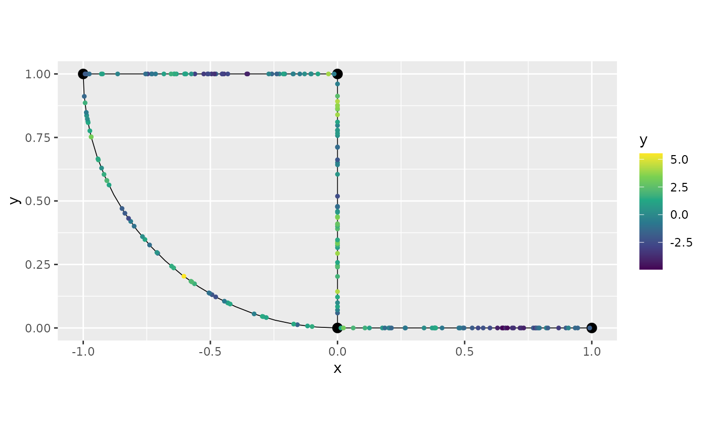
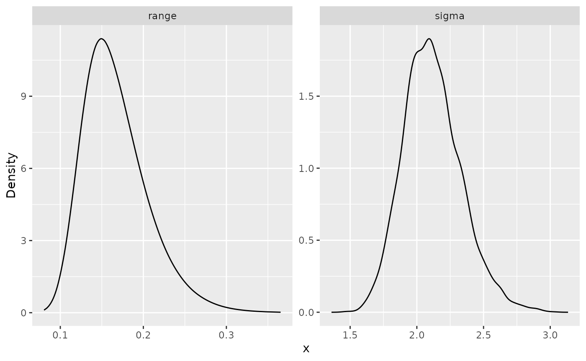
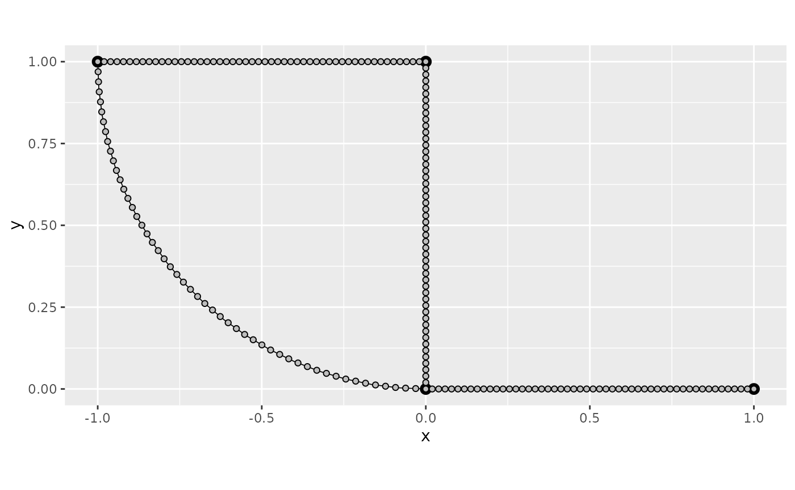
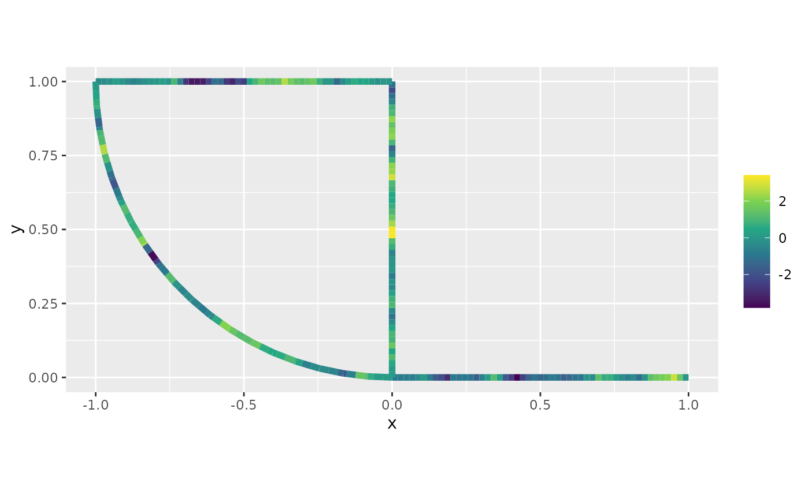
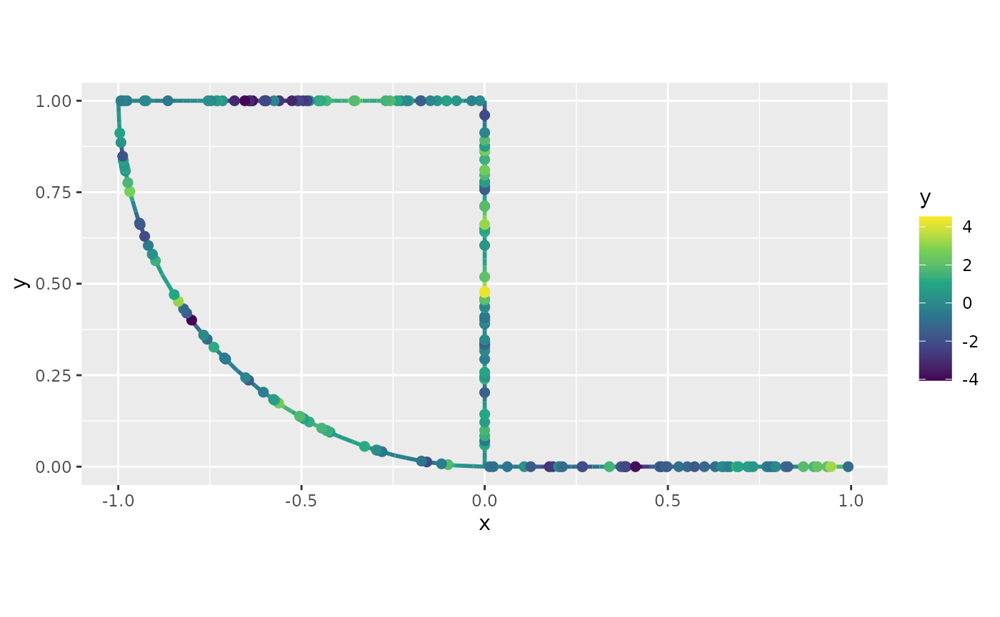
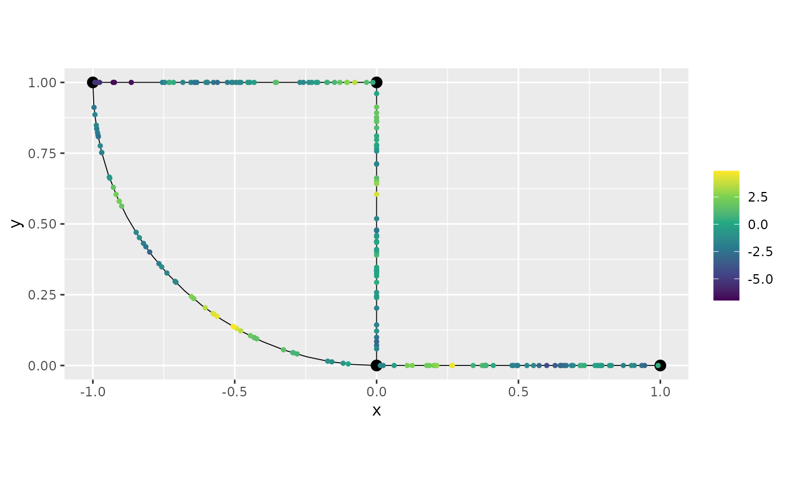
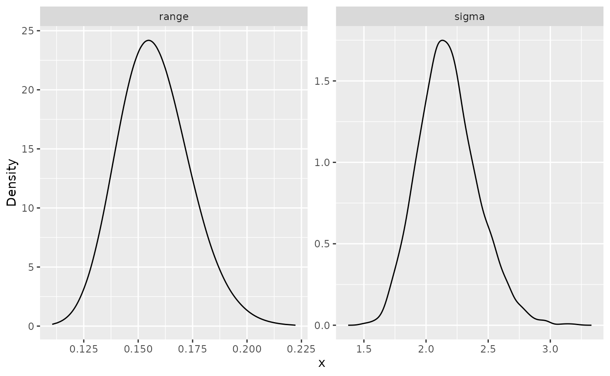
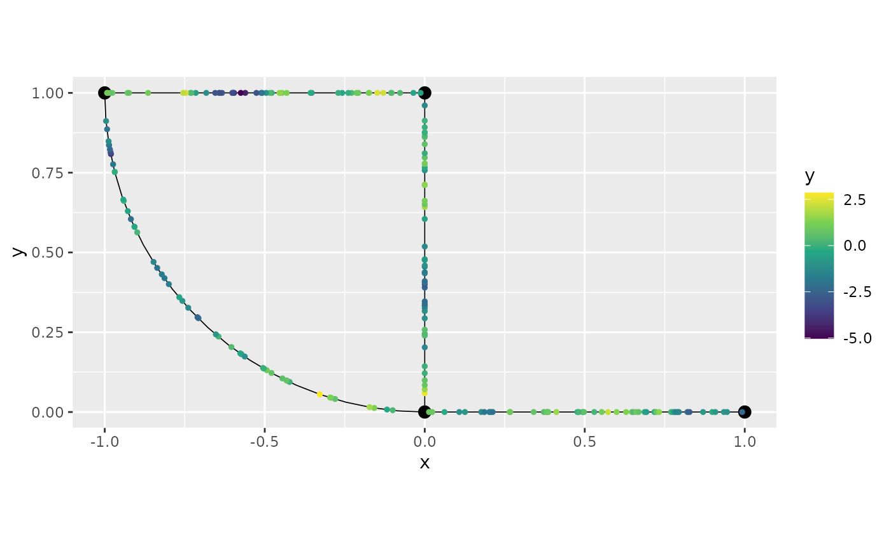
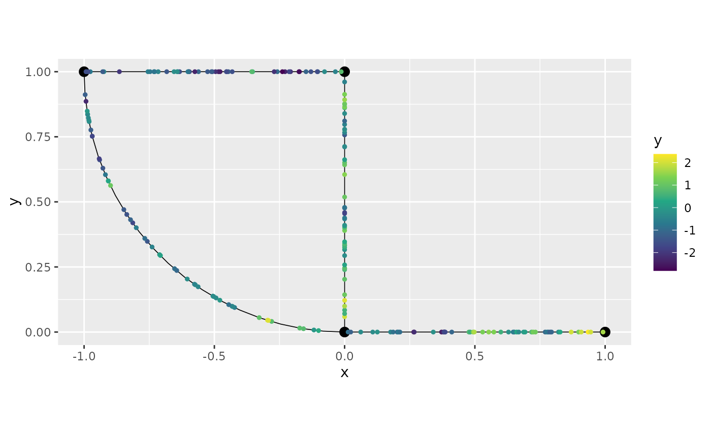

# INLA interface for Whittle--Matérn fields on metric graphs

## Introduction

In this vignette we will present our `R-INLA` interface to
Whittle–Matérn fields. The underlying theory for this approach is
provided in [Bolin et al. (2024)](https://arxiv.org/abs/2205.06163) and
[Bolin et al. (2023)](https://arxiv.org/abs/2304.10372).

For an introduction to the `metric_graph` class, please see the [Working
with metric
graphs](https://davidbolin.github.io/MetricGraph/articles/metric_graph.md)
vignette.

For handling data manipulation on metric graphs, see [Data manipulation
on metric
graphs](https://davidbolin.github.io/MetricGraph/articles/metric_graph_data.md)

For a simplification of the `R-INLA` interface, see the [inlabru
interface of Whittle–Matérn
fields](https://davidbolin.github.io/MetricGraph/articles/inlabru_interface.md)
vignette.

In the [Gaussian random fields on metric
graphs](https://davidbolin.github.io/MetricGraph/articles/random_fields.md)
vignette, we introduce all the models in metric graphs contained in this
package, as well as, how to perform statistical tasks on these models,
but without the `R-INLA` or `inlabru` interfaces.

We will present our `R-INLA` interface to the Whittle-Matérn fields by
providing a step-by-step illustration.

The Whittle–Matérn fields are specified as solutions to the stochastic
differential equation
``` math
  (\kappa^2 - \Delta)^{\alpha} \tau u = \mathcal{W}
```
on the metric graph $`\Gamma`$. We can work with these models without
any approximations if the smoothness parameter $`\alpha`$ is an integer,
and this is what we focus on in this vignette. For details on the case
of a general smoothness parameter, see [Whittle–Matérn fields with
general
smoothness](https://davidbolin.github.io/MetricGraph/articles/fem_models.md).

## A toy dataset

Let us begin by loading the `MetricGraph` package and creating a metric
graph:

``` r

library(MetricGraph)

edge1 <- rbind(c(0,0),c(1,0))
edge2 <- rbind(c(0,0),c(0,1))
edge3 <- rbind(c(0,1),c(-1,1))
theta <- seq(from=pi,to=3*pi/2,length.out = 20)
edge4 <- cbind(sin(theta),1+ cos(theta))
edges = list(edge1, edge2, edge3, edge4)
graph <- metric_graph$new(edges = edges)
```

Let us add 50 random locations in each edge where we will have
observations:

``` r

obs_per_edge <- 50
obs_loc <- NULL
for(i in 1:(graph$nE)) {
  obs_loc <- rbind(obs_loc,
                   cbind(rep(i,obs_per_edge), 
                   runif(obs_per_edge)))
}
```

We will now sample in these observation locations and plot the latent
field:

``` r

sigma <- 2
alpha <- 1
nu <- alpha - 0.5
r <- 0.15 # r stands for range


u <- sample_spde(range = r, sigma = sigma, alpha = alpha,
                 graph = graph, PtE = obs_loc)
graph$plot(X = u, X_loc = obs_loc)
```


Let us now generate the observed responses, which we will call `y`. We
will also plot the observed responses on the metric graph.

``` r

n_obs <- length(u)
sigma.e <- 0.1

y <- u + sigma.e * rnorm(n_obs)
graph$plot(X = y, X_loc = obs_loc)
```


## `R-INLA` implementation

We are now in a position to fit the model with our `R-INLA`
implementation. To this end, we need to add the observations to the
graph, which we will do with the `add_observations()` method.

``` r

df_graph <- data.frame(y = y, edge_number = obs_loc[,1],
                        distance_on_edge = obs_loc[,2])
# Adding observations
graph$add_observations(data=df_graph, normalized=TRUE)
graph$plot(data="y")
```



Now, we load the `R-INLA` package and create the `inla` model object
with the `graph_spde` function. By default we have `alpha=1`.

``` r

library(INLA)
spde_model <- graph_spde(graph)
```

Now, we need to create the data object with the
[`graph_data_spde()`](https://davidbolin.github.io/MetricGraph/reference/graph_data_spde.md)
function, in which we need to provide a name for the random effect,
which we will call `field`:

``` r

data_spde <- graph_data_spde(graph_spde = spde_model, name = "field")
```

The remaining is standard in `R-INLA`. We create the formula object and
the `inla.stack` object with the
[`inla.stack()`](https://rdrr.io/pkg/INLA/man/inla.stack.html) function.
The data needs to be in the `graph` (by using the `add_observations()`
method) and should be supplied to the stack by the components of the
`data_spde` list obtained from the
[`graph_data_spde()`](https://davidbolin.github.io/MetricGraph/reference/graph_data_spde.md)
function:

``` r

f.s <- y ~ -1 + Intercept + f(field, model = spde_model)

stk_dat <- inla.stack(data = data_spde[["data"]], 
                        A = data_spde[["basis"]], 
                        effects = c(
      data_spde[["index"]],
      list(Intercept = 1)
    ))
```

Now, we use the
[`inla.stack.data()`](https://rdrr.io/pkg/INLA/man/inla.stack.html)
function:

``` r

data_stk <- inla.stack.data(stk_dat)
```

Finally, we fit the model:

``` r

spde_fit <- inla(f.s, data = data_stk, 
                  control.predictor=list(A=inla.stack.A(stk_dat)),
                               num.threads = "1:1")
```

Let us now obtain the estimates in the original scale by using the
[`spde_metric_graph_result()`](https://davidbolin.github.io/MetricGraph/reference/spde_metric_graph_result.md)
function, then taking a
[`summary()`](https://rdrr.io/r/base/summary.html):

``` r

spde_result <- spde_metric_graph_result(spde_fit, "field", spde_model)

summary(spde_result)
```

    ##           mean        sd 0.025quant 0.5quant 0.975quant     mode
    ## sigma 2.116690 0.2197720   1.728420 2.100660   2.598590 2.091770
    ## range 0.167032 0.0394885   0.106045 0.161194   0.260193 0.149314

We will now compare the means of the estimated values with the true
values:

``` r

  result_df <- data.frame(
    parameter = c("std.dev", "range"),
    true = c(sigma, r),
    mean = c(
      spde_result$summary.sigma$mean,
      spde_result$summary.range$mean
    ),
    mode = c(
      spde_result$summary.sigma$mode,
      spde_result$summary.range$mode
    )
  )
  print(result_df)
```

    ##   parameter true      mean      mode
    ## 1   std.dev 2.00 2.1166917 2.0917686
    ## 2     range 0.15 0.1670317 0.1493142

We can also plot the posterior marginal densities with the help of the
[`gg_df()`](https://davidbolin.github.io/MetricGraph/reference/gg_df.metric_graph_spde_result.md)
function:

``` r

  posterior_df_fit <- gg_df(spde_result)

  library(ggplot2)

  ggplot(posterior_df_fit) + geom_line(aes(x = x, y = y)) + 
  facet_wrap(~parameter, scales = "free") + labs(y = "Density")
```



### Kriging with our INLA implementation

Let us begin by obtaining an evenly spaced mesh with respect to the base
graph:

``` r

obs_per_edge_prd <- 50
graph$build_mesh(n = obs_per_edge_prd)
```

Let us plot the resulting graph:

``` r

graph$plot(mesh=TRUE)
```



We will now add the observations on the mesh locations to the graph we
fitted the `R-INLA` model. To this end we will use the
`add_mesh_observations()` method. We will enter the response variables
as `NA`. We can get the number of mesh nodes by counting the number of
rows of the `mesh$PtE` attribute.

``` r

n_obs_mesh <- nrow(graph$mesh$PtE)
y_prd <- rep(NA, n_obs_mesh)
data_mesh <- data.frame(y = y_prd)
graph$add_mesh_observations(data = data_mesh)
```

    ## Adding observations...

    ## Assuming the observations are normalized by the length of the edge.

We will now fit a new model with `R-INLA` with this new graph that
contains the prediction locations. To this end, we create a new model
object with the
[`graph_spde()`](https://davidbolin.github.io/MetricGraph/reference/graph_spde.md)
function:

``` r

spde_model_prd <- graph_spde(graph)
```

Now, let us create a new data object for prediction. Observe that we
need to set `drop_all_na` to `FALSE` in order to not remove the
prediction locations:

``` r

data_spde_prd <- graph_data_spde(spde_model_prd, drop_all_na = FALSE, name="field")
```

We will create a new vector of response variables, concatenating `y` to
`y_prd`, then create a new formula object and the `inla.stack` object:

``` r

f_s_prd <- y ~ -1 + Intercept + f(field, model = spde_model_prd)

stk_dat_prd <- inla.stack(data = data_spde_prd[["data"]], 
                        A = data_spde_prd[["basis"]], 
                        effects = c(
      data_spde_prd[["index"]],
      list(Intercept = 1)
    ))
```

Now, we use the
[`inla.stack.data()`](https://rdrr.io/pkg/INLA/man/inla.stack.html)
function and fit the model:

``` r

data_stk_prd <- inla.stack.data(stk_dat_prd)

spde_fit_prd <- inla(f_s_prd, data = data_stk_prd,
                               num.threads = "1:1")
```

We will now extract the means at the prediction locations:

``` r

idx_prd <- which(is.na(data_spde_prd[["data"]][["y"]]))

m_prd <- spde_fit_prd$summary.fitted.values$mean[idx_prd]
```

To improve visualization, we will plot the posterior means using the
[`plot()`](https://rdrr.io/r/graphics/plot.default.html) method:

``` r

graph$plot_function(X = m_prd, vertex_size = 0, edge_width = 2)
```



Finally, we can plot the predictions together with the data:

``` r

p <- graph$plot_function(X = m_prd, vertex_size = 0, edge_width = 1)
graph$plot(data="y", vertex_size = 0, data_size = 2, p = p, edge_width = 0)
```



### An example with `alpha = 2`

We will now show an example where the parameter `alpha` is equal to 2.
There is essentially no change in the commands above. Let us first clear
the observations:

``` r

graph$clear_observations()
```

Let us now simulate the data with `alpha=2`. We will now sample in these
observation locations and plot the latent field:

``` r

sigma <- 2
alpha <- 2
nu <- alpha - 0.5
r <- 0.15 # r stands for range


u <- sample_spde(range = r, sigma = sigma, alpha = alpha,
                 graph = graph, PtE = obs_loc)
graph$plot(X = u, X_loc = obs_loc)
```



In the same way as before we will generate `y` and add the observations:

``` r

n_obs <- length(u)
sigma.e <- 0.1

y <- u + sigma.e * rnorm(n_obs)

df_graph <- data.frame(y = y, edge_number = obs_loc[,1],
                        distance_on_edge = obs_loc[,2])

graph$add_observations(data=df_graph, normalized=TRUE)
```

Let us now create the model object for `alpha=2`:

``` r

spde_model_alpha2 <- graph_spde(graph, alpha = 2)
```

Now, we will create the new data object with the
[`graph_data_spde()`](https://davidbolin.github.io/MetricGraph/reference/graph_data_spde.md)
function, in which we need to provide a name for the random effect,
which we will call `field`:

``` r

data_spde_alpha2 <- graph_data_spde(graph_spde = spde_model_alpha2, 
                            name = "field")
```

We now proceed as before to prepare to fit the model:

``` r

f.s.2 <- y ~ -1 + Intercept + f(field, model = spde_model_alpha2)

stk_dat2 <- inla.stack(data = data_spde_alpha2[["data"]], 
                        A = data_spde_alpha2[["basis"]], 
                        effects = c(
      data_spde_alpha2[["index"]],
      list(Intercept = 1)
    ))

data_stk2 <- inla.stack.data(stk_dat2)
```

Finally, we fit the model:

``` r

spde_fit_alpha2 <- inla(f.s.2, data = data_stk2, 
          control.predictor=list(A=inla.stack.A(stk_dat2)),
                               num.threads = "1:1")
```

Let us now obtain the estimates in the original scale by using the
[`spde_metric_graph_result()`](https://davidbolin.github.io/MetricGraph/reference/spde_metric_graph_result.md)
function, then taking a
[`summary()`](https://rdrr.io/r/base/summary.html):

``` r

spde_result_alpha2 <- spde_metric_graph_result(spde_fit_alpha2, 
                            "field", spde_model_alpha2)

summary(spde_result_alpha2)
```

    ##           mean        sd 0.025quant 0.5quant 0.975quant     mode
    ## sigma 2.425040 0.3006850   1.891510 2.407000   3.065680 2.410210
    ## range 0.183765 0.0200204   0.147749 0.182645   0.226294 0.180304

We will now compare the means of the estimated values with the true
values:

``` r

  result_df_alpha2 <- data.frame(
    parameter = c("std.dev", "range"),
    true = c(sigma, r),
    mean = c(
      spde_result_alpha2$summary.sigma$mean,
      spde_result_alpha2$summary.range$mean
    ),
    mode = c(
      spde_result_alpha2$summary.sigma$mode,
      spde_result_alpha2$summary.range$mode
    )
  )
  print(result_df_alpha2)
```

    ##   parameter true      mean      mode
    ## 1   std.dev 2.00 2.4250392 2.4102104
    ## 2     range 0.15 0.1837645 0.1803036

We can also plot the posterior marginal densities with the help of the
[`gg_df()`](https://davidbolin.github.io/MetricGraph/reference/gg_df.metric_graph_spde_result.md)
function:

``` r

  posterior_df_fit <- gg_df(spde_result_alpha2)

  library(ggplot2)

  ggplot(posterior_df_fit) + geom_line(aes(x = x, y = y)) + 
  facet_wrap(~parameter, scales = "free") + labs(y = "Density")
```



### Fitting `R-INLA` models with replicates

We will now illustrate how to use our `R-INLA` implementation to fit
models with replicates.

To simplify exposition, we will use the same base graph. So, we begin by
clearing the observations.

``` r

graph$clear_observations()
```

We will use the same observation locations as for the previous cases.
Let us sample 30 replicates:

``` r

sigma_rep <- 1.5
alpha_rep <- 1
nu_rep <- alpha_rep - 0.5
r_rep <- 0.2 # r stands for range
kappa_rep <- sqrt(8 * nu_rep) / r_rep

n_repl <- 30

u_rep <- sample_spde(range = r_rep, sigma = sigma_rep,
                 alpha = alpha_rep,
                 graph = graph, PtE = obs_loc,
                 nsim = n_repl)
```

Let us now generate the observed responses, which we will call `y_rep`.

``` r

n_obs_rep <- nrow(u_rep)
sigma_e <- 0.1

y_rep <- u_rep + sigma_e * matrix(rnorm(n_obs_rep * n_repl),
                                    ncol=n_repl)
```

The
[`sample_spde()`](https://davidbolin.github.io/MetricGraph/reference/sample_spde.md)
function returns a matrix in which each replicate is a column. We need
to stack the columns together and a column to indicate the replicate:

``` r

dl_graph <- lapply(1:ncol(y_rep), function(i){data.frame(y = y_rep[,i],
                                          edge_number = obs_loc[,1],
                                          distance_on_edge = obs_loc[,2],
                                          repl = i)})
dl_graph <- do.call(rbind, dl_graph)
```

We can now add the the observations by setting the `group` argument to
`repl`:

``` r

graph$add_observations(data = dl_graph, normalized=TRUE, 
                            group = "repl",
                            edge_number = "edge_number",
                            distance_on_edge = "distance_on_edge")
```

    ## Adding observations...

    ## Assuming the observations are normalized by the length of the edge.

By definition the
[`plot()`](https://rdrr.io/r/graphics/plot.default.html) method plots
the first replicate. We can select the other replicates with the `group`
argument. See the [Working with metric
graphs](https://davidbolin.github.io/MetricGraph/articles/metric_graphs.md)
for more details.

``` r

graph$plot(data="y")
```



Let us plot another replicate:

``` r

graph$plot(data="y", group=2)
```



Let us now create the model object:

``` r

spde_model_rep <- graph_spde(graph)
```

Let us first consider a case in which we do not use all replicates.
Then, we consider the case in which we use all replicates.

Thus, let us assume we want only to consider replicates 1, 3, 5, 7 and
9. To this end, we the index object by using the
[`graph_data_spde()`](https://davidbolin.github.io/MetricGraph/reference/graph_data_spde.md)
function with the argument `repl` set to the replicates we want, in this
case `c(1,3,5,7,9)`:

``` r

data_spde <- graph_data_spde(graph_spde=spde_model_rep,
                      name="field", repl = c(1,3,5,7,9), repl_col = "repl")
```

Next, we create the stack object, remembering that we need to input the
components from `data_spde`:

``` r

stk_dat_rep <- inla.stack(data = data_spde[["data"]], 
                        A = data_spde[["basis"]], 
                        effects = c(
      data_spde[["index"]],
      list(Intercept = 1)
    ))
```

We now create the formula object, adding the name of the field (in our
case `field`) attached with `.repl` a the `replicate` argument inside
the [`f()`](https://rdrr.io/pkg/INLA/man/f.html) function.

``` r

f_s_rep <- y ~ -1 + Intercept + 
    f(field, model = spde_model_rep, 
        replicate = field.repl)
```

Then, we create the stack object with The
[`inla.stack.data()`](https://rdrr.io/pkg/INLA/man/inla.stack.html)
function:

``` r

data_stk_rep <- inla.stack.data(stk_dat_rep)
```

Now, we fit the model:

``` r

spde_fit_rep <- inla(f_s_rep, data = data_stk_rep, 
                control.predictor=list(A=inla.stack.A(stk_dat_rep)),
                               num.threads = "1:1")
```

Let us see the estimated values in the original scale:

``` r

spde_result_rep <- spde_metric_graph_result(spde_fit_rep, 
                        "field", spde_model_rep)

summary(spde_result_rep)
```

    ##           mean        sd 0.025quant 0.5quant 0.975quant     mode
    ## sigma 1.411850 0.0650133   1.292830 1.408520   1.548020 1.399490
    ## range 0.166329 0.0170868   0.136284 0.165047   0.203329 0.161913

Let us compare with the true values:

``` r

  result_df_rep <- data.frame(
    parameter = c("std.dev", "range"),
    true = c(sigma_rep, r_rep),
    mean = c(
      spde_result_rep$summary.sigma$mean,
      spde_result_rep$summary.range$mean
    ),
    mode = c(
      spde_result_rep$summary.sigma$mode,
      spde_result_rep$summary.range$mode
    )
  )
  print(result_df_rep)
```

    ##   parameter true      mean      mode
    ## 1   std.dev  1.5 1.4118459 1.3994889
    ## 2     range  0.2 0.1663293 0.1619129

Now, let us consider the case with all replicates. We create a new data
object by using the
[`graph_data_spde()`](https://davidbolin.github.io/MetricGraph/reference/graph_data_spde.md)
function with the argument `repl` set to `.all`:

``` r

data_spde_rep <- graph_data_spde(graph_spde=spde_model_rep, 
                    name="field", 
                    repl = ".all", repl_col = "repl")
```

Now the stack:

``` r

stk_dat_rep <- inla.stack(data = data_spde_rep[["data"]], 
                        A = data_spde_rep[["basis"]], 
                        effects = c(
      data_spde_rep[["index"]],
      list(Intercept = 1)
    ))
```

We now create the formula object in the same way as before:

``` r

f_s_rep <- y ~ -1 + Intercept + 
    f(field, model = spde_model_rep, 
        replicate = field.repl)
```

Then, we create the stack object with The
[`inla.stack.data()`](https://rdrr.io/pkg/INLA/man/inla.stack.html)
function:

``` r

data_stk_rep <- inla.stack.data(stk_dat_rep)
```

Now, we fit the model:

``` r

spde_fit_rep <- inla(f_s_rep, data = data_stk_rep,
                               num.threads = "1:1")
```

Let us see the estimated values in the original scale:

``` r

spde_result_rep <- spde_metric_graph_result(spde_fit_rep, 
                        "field", spde_model_rep)

summary(spde_result_rep)
```

    ##           mean         sd 0.025quant 0.5quant 0.975quant     mode
    ## sigma 1.501300 0.03278750   1.433900 1.502390   1.563830 1.503950
    ## range 0.209541 0.00986362   0.189545 0.209871   0.228151 0.211406

Let us compare with the true values:

``` r

  result_df_rep <- data.frame(
    parameter = c("std.dev", "range"),
    true = c(sigma_rep, r_rep),
    mean = c(
      spde_result_rep$summary.sigma$mean,
      spde_result_rep$summary.range$mean
    ),
    mode = c(
      spde_result_rep$summary.sigma$mode,
      spde_result_rep$summary.range$mode
    )
  )
  print(result_df_rep)
```

    ##   parameter true      mean      mode
    ## 1   std.dev  1.5 1.5012965 1.5039473
    ## 2     range  0.2 0.2095413 0.2114064

Bolin, David, Alexandre B. Simas, and Jonas Wallin. 2023. “Statistical
Properties of Gaussian Whittle–Matérn Fields on Metric Graphs.”
*arXiv:2304.10372*.

Bolin, David, Alexandre B. Simas, and Jonas Wallin. 2024. “Gaussian
Whittle–Matérn Fields on Metric Graphs.” *Bernoulli* 30: 1611–39.
