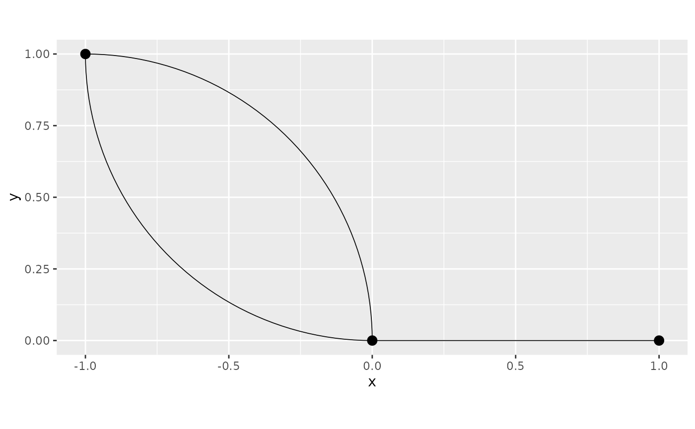
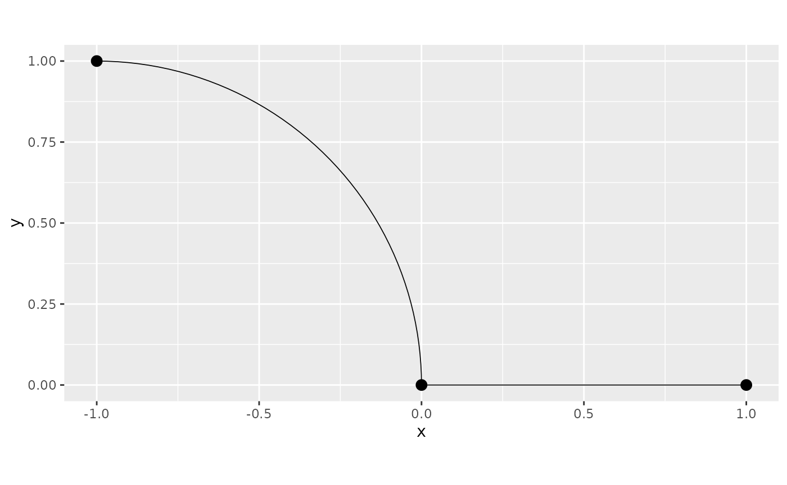
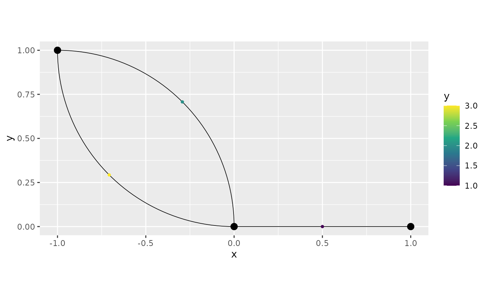

# On isotropic covariances on metric graphs with non-Euclidean edges

## Introduction

In this vignette we will investigate the behavior of isotropic
covariance functions (with respect to the resistance metric) on metric
graphs with non-Euclidean edges. This boils down to studying the
resistance metric on metric graphs with non-Euclidean edges.

More precisely, we will show that when dealing with metric graphs with
non-Euclidean edges, the addition or removal of vertices of degree 2 can
have a severe impact on the resistance metric and, a fortiori, on the
covariance function.

The effect of this study is that if one fits an isotropic model on a
metric graph with non-Euclidean edges by turning the observations into
vertices, then the resulting model is different from what one would
expect. Indeed, the model might change when doing predictions (as one
would need to add further observations as vertices to obtain
predictions). Furthermore, if one does not add observations as vertices,
then the actual covariance function might not be valid [Anderes et al.
(2020)](https://projecteuclid.org/journals/annals-of-statistics/volume-48/issue-4/Isotropic-covariance-functions-on-graphs-and-their-edges/10.1214/19-AOS1896.full).
Actually, in [Anderes et al.
(2020)](https://projecteuclid.org/journals/annals-of-statistics/volume-48/issue-4/Isotropic-covariance-functions-on-graphs-and-their-edges/10.1214/19-AOS1896.full),
such models were not defined, as they only define Gaussian models with
isotropic covariance functions for metric graphs with Euclidean edges.
One option, therefore, would be to simply not allow one to fit such
models at all as they are not consistent. However, in the package we
chose to only give a warning, and let the user decide what to do.

## A simple example

We start by creating a metric graph with multiple edges. This metric
graph does not have Euclidean edges:

``` r

edge1 <- rbind(c(0,0),c(1,0))
theta1 <- seq(from=pi/2,to=0,length.out = 50)
theta2 <- seq(from=pi,to=3*pi/2,length.out = 50)
edge2 <- cbind(sin(theta1)-1,cos(theta1))
edge3 <- cbind(sin(theta2),1+ cos(theta2))
edges = list(edge1, edge2, edge3)

graph <- metric_graph$new(edges = edges)

graph$plot()
```



One can also check if a metric graph has Euclidean edges by calling the
`check_euclidean()` method, then calling the
[`summary()`](https://rdrr.io/r/base/summary.html):

``` r

graph$check_euclidean()
summary(graph)
#> A metric graph object with:
#> 
#> Vertices:
#>   Total: 3 
#>   Degree 1: 1;  Degree 2: 1;  Degree 3: 1; 
#>   With incompatible directions:  2 
#> 
#> Edges: 
#>   Total: 3 
#>   Lengths: 
#>       Min: 1  ; Max: 1.570729  ; Total: 4.141458 
#>   Weights: 
#>       Min: 1  ; Max: 1 
#>   That are circles:  0 
#> 
#> Graph units: 
#>   Vertices unit:  None  ; Lengths unit:  None 
#> 
#> Longitude and Latitude coordinates:  FALSE
#> 
#> Some characteristics of the graph:
#>   Connected: TRUE
#>   Has loops: FALSE
#>   Has multiple edges: TRUE
#>   Is a tree: FALSE
#>   Distance consistent: TRUE
#>   Has Euclidean edges: FALSE
#> 
#> Computed quantities inside the graph: 
#>   Laplacian:  FALSE  ; Geodesic distances:  TRUE 
#>   Resistance distances:  FALSE  ; Finite element matrices:  FALSE 
#> 
#> Mesh: The graph has no mesh! 
#> 
#> Data: The graph has no data!
#> 
#> Tolerances: 
#>   vertex-vertex:  0.001 
#>   vertex-edge:  0.001 
#>   edge-edge:  0
```

Let us now compute the resistance distances between the vertices using
the `compute_resdist()` method:

``` r

graph$compute_resdist()
```

We can now observe the resistance distances in the `res_dist` element of
`graph`:

``` r

res_dist_graph <- graph$res_dist[[1]]
```

In reality, what is being actually done to the metric graph, is that one
of the edges is, in practice, being ignored. Indeed, let us create a
metric graph with Euclidean edges obtained by removing one of the edges,
and compute the resistance distance between its vertices. Thus, we start
by creating such a metric graph:

``` r

edge1 <- rbind(c(0,0),c(1,0))
theta1 <- seq(from=pi/2,to=0,length.out = 50)
edge2 <- cbind(sin(theta1)-1,cos(theta1))
edges2 = list(edge1, edge2)

graph2 <- metric_graph$new(edges = edges2)

graph2$plot()
```



Observe that it has Euclidean edges:

``` r

graph2$check_euclidean()
summary(graph2)
#> A metric graph object with:
#> 
#> Vertices:
#>   Total: 3 
#>   Degree 1: 2;  Degree 2: 1; 
#>   With incompatible directions:  1 
#> 
#> Edges: 
#>   Total: 2 
#>   Lengths: 
#>       Min: 1  ; Max: 1.570729  ; Total: 2.570729 
#>   Weights: 
#>       Min: 1  ; Max: 1 
#>   That are circles:  0 
#> 
#> Graph units: 
#>   Vertices unit:  None  ; Lengths unit:  None 
#> 
#> Longitude and Latitude coordinates:  FALSE
#> 
#> Some characteristics of the graph:
#>   Connected: TRUE
#>   Has loops: FALSE
#>   Has multiple edges: FALSE
#>   Is a tree: TRUE
#>   Distance consistent: TRUE
#>   Has Euclidean edges: TRUE
#> 
#> Computed quantities inside the graph: 
#>   Laplacian:  FALSE  ; Geodesic distances:  TRUE 
#>   Resistance distances:  FALSE  ; Finite element matrices:  FALSE 
#> 
#> Mesh: The graph has no mesh! 
#> 
#> Data: The graph has no data!
#> 
#> Tolerances: 
#>   vertex-vertex:  0.001 
#>   vertex-edge:  0.001 
#>   edge-edge:  0
```

Let us now compute the resistance distances:

``` r

graph2$compute_resdist()
```

Now, let us compare the resistance distances:

``` r

identical(res_dist_graph, graph2$res_dist[[1]])
#> [1] TRUE
```

Therefore, indeed, one of the edges is being ignored in practice.

Let us now see what happens when we have observations on both edges, and
compute the resistance distances on the resulting metric graph (in which
the observations were turned into vertices).

To this end, let us create some observations and add them to `graph`:

``` r

df_data <- data.frame(edge_number = c(1,2,3), distance_on_edge = c(0.5,0.5,0.5), y = c(1,2,3))

graph$add_observations(data = df_data, normalized = TRUE)
#> Adding observations...
#> Assuming the observations are normalized by the length of the edge.

graph$plot(data="y")
```



Let us now compute the resistance distances between the original
vertices. To this end we will use the `compute_resdist()` method with
the arguments `full=TRUE` to compute the resistance distance at all
available locations, and `include_vertices=TRUE` to include the original
vertices of the metric graph in the result.

``` r

graph$compute_resdist(full=TRUE, include_vertices = TRUE)
```

Since we have 3 vertices, the resistance distances between the original
vertices are given by the elements 1 to 3 of the resulting matrix:

``` r

res_dist_orig <- graph$res_dist[[1]][1:3,1:3]
res_dist_orig
#> 3 x 3 Matrix of class "dgeMatrix"
#>           [,1]     [,2]      [,3]
#> [1,] 0.0000000 1.000000 0.7853645
#> [2,] 1.0000000 0.000000 1.7853645
#> [3,] 0.7853645 1.785365 0.0000000
```

We can observe that the resistance distances are very different. Thus,
the impact of adding observations when computing resistance distances on
non-Euclidean metric graphs is severe.

In particular, the impact on the covariance function is severe. For
example, let us consider an exponential covariance function with
`sigma=1` and `kappa=1`:

``` r

exp_covariance(res_dist_graph, theta = c(1,1))
#> 3 x 3 Matrix of class "dgeMatrix"
#>           [,1]       [,2]       [,3]
#> [1,] 1.0000000 0.36787944 0.20789356
#> [2,] 0.3678794 1.00000000 0.07647977
#> [3,] 0.2078936 0.07647977 1.00000000
```

and

``` r

exp_covariance(res_dist_orig, theta = c(1,1))
#> 3 x 3 Matrix of class "dgeMatrix"
#>           [,1]      [,2]      [,3]
#> [1,] 1.0000000 0.3678794 0.4559535
#> [2,] 0.3678794 1.0000000 0.1677359
#> [3,] 0.4559535 0.1677359 1.0000000
```

This shows that these are two different models. One considering the
original metric graph, and another, considering the metric graph with
the added observations. Therefore, when one considers a model with
isotropic covariance function on a metric graph with non-Euclidean edges
to perform statistical analysis, different models are considered in the
different stages of the statistical analysis. More precisely, one
believes the model being considered only depends on the original
vertices of the metric graph, when, in reality, when fitting the model,
the resistance distances are computed on a different metric graph that
was obtained when the observations were turned into vertices of a new
metric graph. Finally, when one does prediction, yet another metric
graph will be considered, namely, the metric graph in which the
prediction locations were added as vertices of yet another metric graph.

Thus, we do not recommend using isotropic covariance models on metric
graphs with non-Euclidean edges, even if the model is capable of being
fitted, as there will be several inconsistencies between the original
model, the fitted model, and the model used to obtain predictions.

It is important to mention that the same phenomenon occur in the Matérn
Gaussian models based on the graph Laplacian. Whenever we want to do
prediction, we need to add the observation locations as vertices, thus
modifying the graph. This means that there is an inconsistency between
the model used to fit the data, and the model used to obtain prediction.

Anderes, Ethan, Jesper Møller, and Jakob G. Rasmussen. 2020. “Isotropic
Covariance Functions on Graphs and Their Edges.” *Annals of Statistics*
48: 2478–503.
