# Working with metric graphs

## Introduction

Networks such as street or river networks are examples of metric graphs.
A compact metric graph $`\Gamma`$ consists of a set of finitely many
vertices $`\mathcal{V}=\{v_i\}`$ and a finite set
$`\mathcal{E}=\{e_j\}`$ of edges connecting the vertices. Each edge
$`e`$ is a curve of finite length $`l_e`$ that connects two vertices.
These curves are parameterized by arc length and a location
$`s\in \Gamma`$ is a position on an edge, and can thus be represented as
a touple $`(e,t)`$ where $`t\in[0,l_e]`$. Compared to regular graphs,
where one typically defines functions on the vertices, we are for metric
graphs interested in function that are defined on both the vertices and
the edges.

In this vignette we will introduce the `metric_graph` class of the
`MetricGraph` package. This class provides a user friendly
representation of metric graphs, and we will show how to use the class
to construct and visualize metric graphs, add data to them, and work
with functions defined on the graphs.

For details about Gaussian processes and inference on metric graphs, we
refer to the Vignettes

- [Gaussian random fields on metric
  graphs](https://davidbolin.github.io/MetricGraph/articles/random_fields.md)
- [INLA interface of Whittle–Matérn
  fields](https://davidbolin.github.io/MetricGraph/articles/inla_interface.md)
- [inlabru interface of Whittle–Matérn
  fields](https://davidbolin.github.io/MetricGraph/articles/inlabru_interface.md)
- [Whittle–Matérn fields with general
  smoothness](https://davidbolin.github.io/MetricGraph/articles/fem_models.md)

## Constructing metric graphs

### Basic constructions and properties

A metric graph can be constructed in two ways. The first is to specify
all edges in the graph as a `list` object, where each entry is a matrix.
To illustrate this, we first construct the following edges

``` r

edge1 <- rbind(c(0,0),c(1,0))
edge2 <- rbind(c(0,0),c(0,1))
edge3 <- rbind(c(0,1),c(-1,1))
theta <- seq(from=pi,to=3*pi/2,length.out = 50)
edge4 <- cbind(sin(theta),1+ cos(theta))
edges = list(edge1, edge2, edge3, edge4)
```

We can now create the graph based on the `edges` object as follows

``` r

graph <- metric_graph$new(edges = edges)
graph$plot()
```


The plot function that was used to create the plot above has various
parameters to set the sizes and colors of the vertices and edges, and it
has a `plotly` argument to visualize the graph in 3D. For this to work,
the `plotly` library must be installed.

``` r

graph$plot(type = "plotly", vertex_size = 5, vertex_color = "blue",
           edge_color = "red", edge_width = 2)
```

It is also important to know that the `2d` version of the
[`plot()`](https://rdrr.io/r/graphics/plot.default.html) method returns
a `ggplot2` object and can be modified as such. For instance:

``` r

p <- graph$plot()
p + ggplot2::labs(title = "Metric graph",
          x = "long", y = "lat")
```

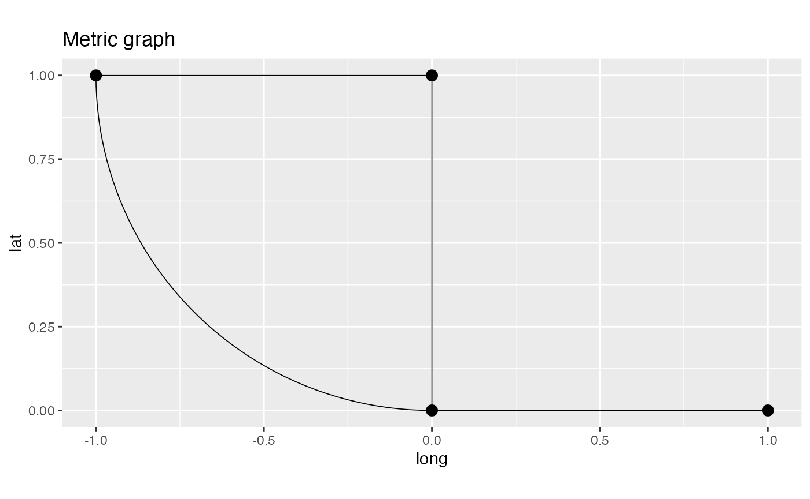

Similarly, the `3d` version of the
[`plot()`](https://rdrr.io/r/graphics/plot.default.html) method returns
a `plotly` object that can also be modified. For instance:

``` r

p <- graph$plot(type = "plotly")
p <- plotly::layout(p, title = "Metric graph", 
              scene = list(xaxis=
              list(title = "Long"),yaxis=list(title = "Lat")))
p
```

We can now obtain various properties of the graph: The vertex matrix,
which specifies the Euclidian coordinates of the vertices is

``` r

graph$V
```

    ##       X Y
    ## [1,]  0 0
    ## [2,]  1 0
    ## [3,]  0 1
    ## [4,] -1 1

and the edge matrix that specified the edges of the graph (i.e., which
vertices that are connected by edges) is

``` r

graph$E
```

    ##      [,1] [,2]
    ## [1,]    1    2
    ## [2,]    1    3
    ## [3,]    3    4
    ## [4,]    1    4

To obtain the geodesic (shortest path) distance between the vertices, we
can use the function `compute_geodist`:

``` r

graph$compute_geodist()
graph$geo_dist
```

    ## $.vertices
    ##          [,1]     [,2] [,3]     [,4]
    ## [1,] 0.000000 1.000000    1 1.570729
    ## [2,] 1.000000 0.000000    2 2.570729
    ## [3,] 1.000000 2.000000    0 1.000000
    ## [4,] 1.570729 2.570729    1 0.000000

The second option it to construct the graph using two matrices `V` and
`E` that specify the locations (in Euclidean space) of the vertices and
the edges. In this case, it is assumed that the graph only has straight
edges:

``` r

V <- rbind(c(0, 0), c(1, 0), c(0, 1), c(-1, 1))
E <- rbind(c(1, 2), c(1, 3), c(3, 4), c(4, 1))
graph2 <- metric_graph$new(V = V, E = E)
```

    ## Starting graph creation...

    ## LongLat is set to FALSE

    ## Creating edges...

    ## Setting edge weights...

    ## Computing bounding box...

    ## Setting up edges

    ## Merging close vertices

    ## Total construction time: 0.29 secs

    ## Creating and updating vertices...

    ## Storing the initial graph...

    ## Computing the relative positions of the edges...

``` r

graph2$plot()
```

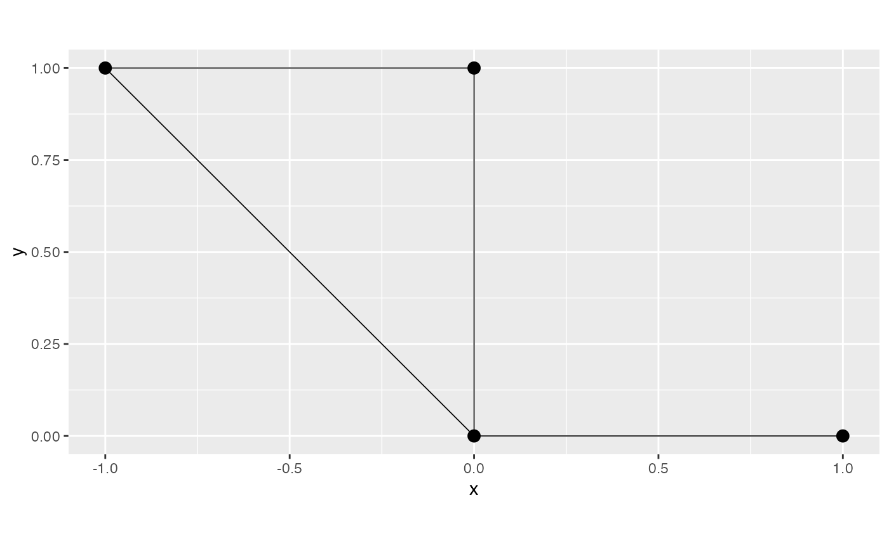

A third option is to create a graph from a `SpatialLines` object:

``` r

library(sp)
line1 <- Line(rbind(c(0,0),c(1,0)))
line2 <- Line(rbind(c(0,0),c(0,1)))
line3 <- Line(rbind(c(0,1),c(-1,1)))
theta <- seq(from=pi,to=3*pi/2,length.out = 50)
line4 <- Line(cbind(sin(theta),1+ cos(theta)))
Lines = sp::SpatialLines(list(Lines(list(line1),ID="1"),
                              Lines(list(line2),ID="2"),
                              Lines(list(line3),ID="3"),
                              Lines(list(line4),ID="4")))

graph <- metric_graph$new(edges = Lines)                    
graph$plot()
```


A final option is to create from a `MULTILINESTRING` object:

``` r

library(sf)
line1 <- st_linestring(rbind(c(0,0),c(1,0)))
line2 <- st_linestring(rbind(c(0,0),c(0,1)))
line3 <- st_linestring(rbind(c(0,1),c(-1,1)))
theta <- seq(from=pi,to=3*pi/2,length.out = 50)
line4 <- st_linestring(cbind(sin(theta),1+ cos(theta)))
multilinestring = st_multilinestring(list(line1, line2, line3, line4))

graph <- metric_graph$new(edges = multilinestring)                    
graph$plot()
```

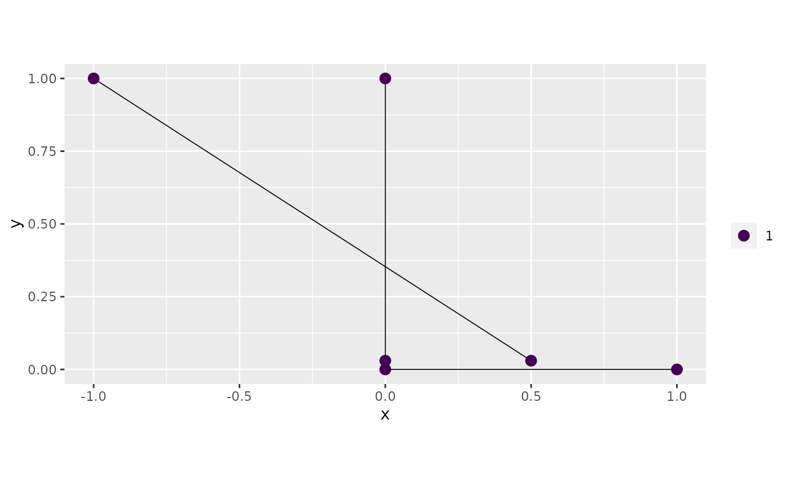

### Tolerances for merging vertices and edges

The constructor of the graph has one argument, `perform_merges` and an
additional argument `tolerance` which is used for connecting edges that
are close in Euclidean space. Specifically, the `tolerance` argument is
given as a list with three elements:

- `vertex_vertex` vertices that are closer than this number are merged
  (the default value is `1e-7`)
- `vertex_edge` if a vertex at the end of one edge is closer than this
  number to another edge, this vertex is connected to that edge (the
  default value is `1e-7`)
- `edge_edge` if two edges at some point are closer than this number, a
  new vertex is added at that point and the two edges are connected (the
  default value is `0` which means that the option is not used)

These options are often needed when constructing graphs based on real
data, for example from OpenStreetMap as we will see later. To illustrate
these options, suppose that we want to construct a graph from the
following three edges. We will set `perform_merges` to `TRUE`, to show
how they are merged with the default choice of tolerances.

``` r

edge1 <- rbind(c(0,0),c(1,0))
edge2 <- rbind(c(0,0.03),c(0,0.75))
edge3 <- rbind(c(-1,1),c(0.5,0.03))
edge4 <- rbind(c(0,0.75), c(0,1))
edge5 <- rbind(c(-1,0), c(-1, 0.9995))
edges =  list(edge1, edge2, edge3, edge4, edge5)
graph3 <- metric_graph$new(edges = edges, perform_merges = TRUE)
graph3$plot(degree = TRUE)
print(graph3$nV)
```

    ## [1] 8

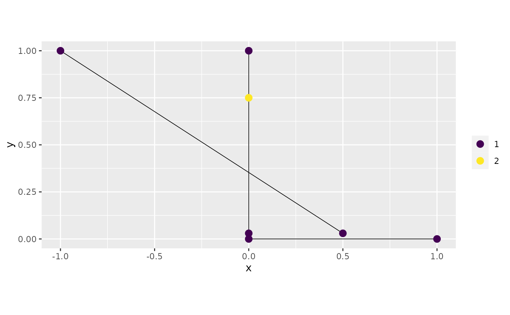

We added the option `degree=TRUE` to the plot here to visualize the
degrees of each vertex. As expected, one sees that all vertices have
degree 1, and none of the three edges are connected. If these are
streets in a street network, one might suspect that the two vertices at
$`(0,0)`$ and $`(0,0.03)`$ really should be the same vertex so that the
two edges are connected. This can be adjusted by increasing the
`vertex_vertex` tolerance:

``` r

graph3 <- metric_graph$new(edges = edges, perform_merges = TRUE,
                             tolerance = list(vertex_vertex = 0.05))
graph3$plot(degree = TRUE)
```

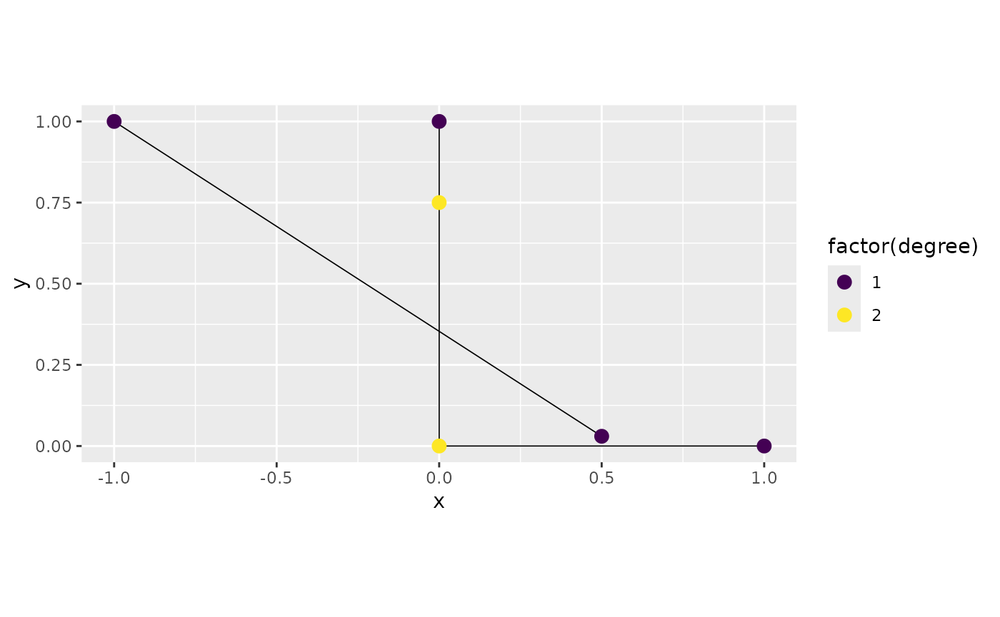

One might also want to add the vertex at $`(0.5, 0.03)`$ as a vertex on
the first edge, so that the two edges there are connected. This can be
done by adjusting the `vertex_edge` tolerance:

``` r

graph3 <- metric_graph$new(edges = edges, perform_merges = TRUE,
                                       tolerance = list(vertex_vertex = 0.05,
                                                           vertex_edge = 0.1))
graph3$plot(degree = TRUE)
```

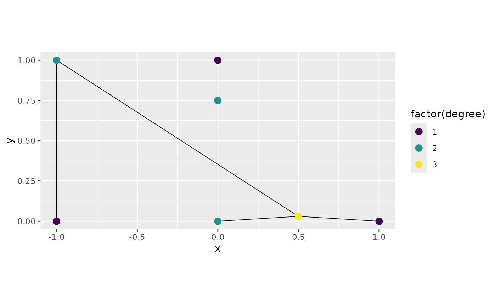

We can see that the vertex at $`(0.5,0)`$ was indeed connected with the
edge from $`(0,0)`$ to $`(1,0)`$ and that vertex now has degree 3 since
it is connected with three edges. One can also note that the `edges`
object that was used to create the graph is modified internally in the
`metric_graph` object so that the connections are visualized correctly
in the sense that all edges are actually shown as connected edges.

Finally, to add a vertex at the intersection between `edge2` and `edge3`
we can adjust the `edge_edge` tolerance:

``` r

graph3 <- metric_graph$new(edges = edges, perform_merges = TRUE,
                                        tolerance = list(vertex_vertex = 0.2,
                                                           vertex_edge = 0.1,
                                                           edge_edge = 0.001))
graph3$plot(degree = TRUE)
```

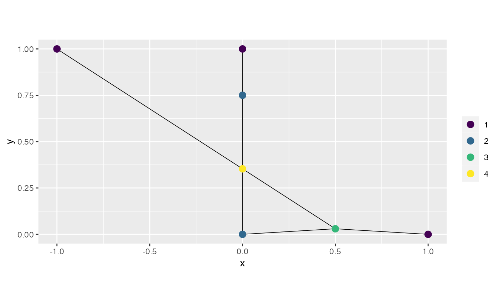

Now, the structure of the metric graph does not change if we add or
remove vertices of degree 2. Because of this,one might want to remove
vertices of degree 2 since this can reduce computational costs. This can
be done by setting the `remove_deg2` argument while creating the graph:

``` r

graph3 <- metric_graph$new(edges = edges, perform_merges = TRUE,
                                        tolerance = list(vertex_vertex = 0.2,
                                                           vertex_edge = 0.1,
                                                           edge_edge = 0.001),
                           remove_deg2 = TRUE)
graph3$plot(degree = TRUE)
```

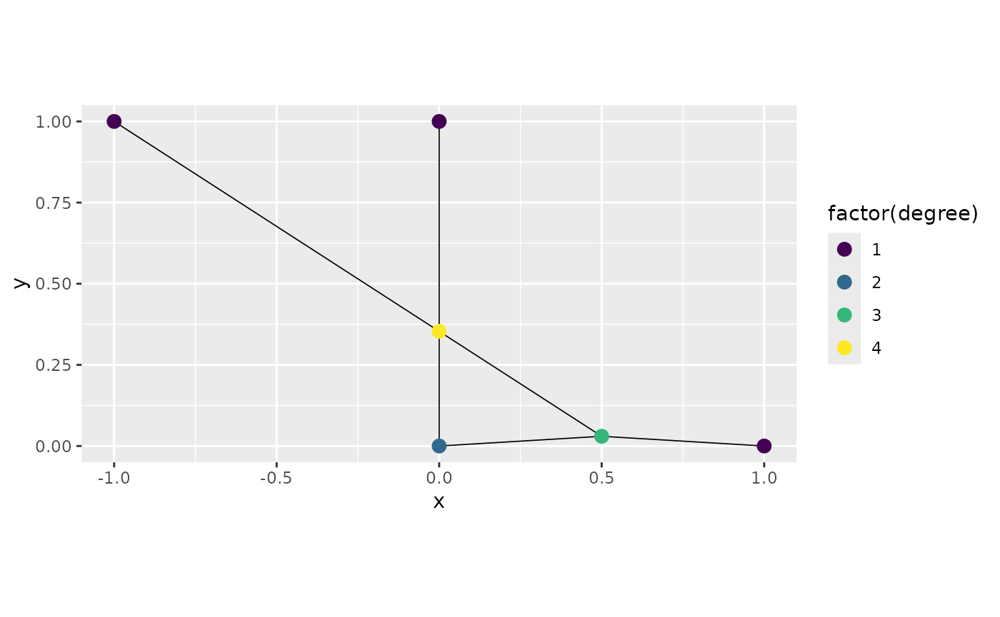

Observe that one vertex of degree 2 was not removed. This is due to the
fact that if we consider the direction, this vertex has directions
incompatible for removal. We can see this by setting the argument
`direction=TRUE` in the
[`plot()`](https://rdrr.io/r/graphics/plot.default.html) method:

``` r

graph3$plot(direction = TRUE)
```

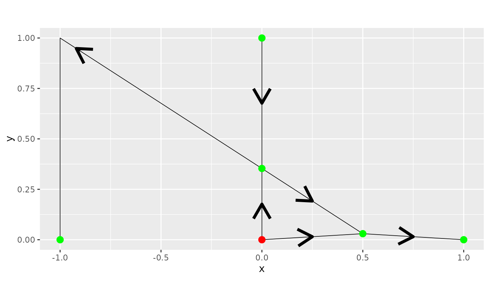

We can also avoid performing these merges by setting using the default
constructor (which is equivalent to set the `perform_merges` argument to
`FALSE`):

``` r

graph4 <- metric_graph$new(edges = edges)
graph4$plot(degree = TRUE)
```

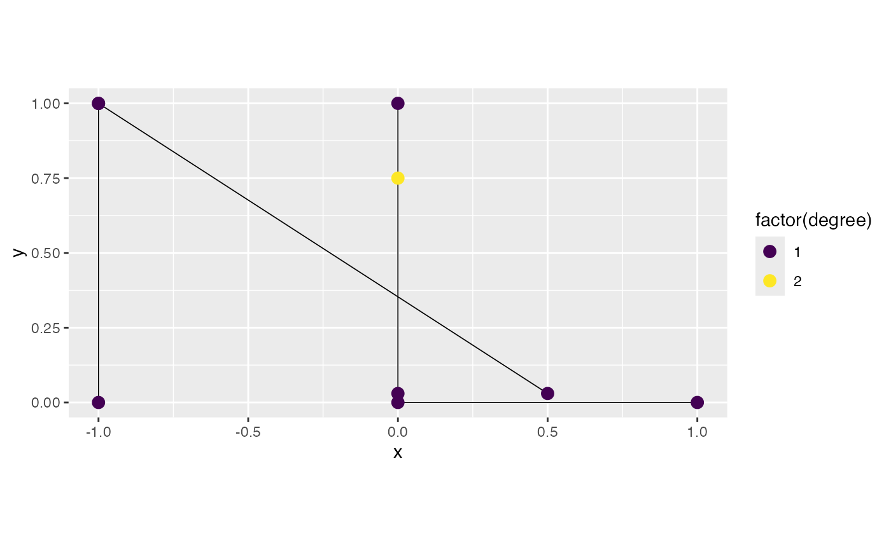

Observe that the two vertices around the point $`(-1,1)`$ were merged.
This is because there is an additional step to merge close vertices that
is performed even with `perform_merges` set to `FALSE`. To also skip
this merge, we can also set `merge_close_vertices` to `FALSE`:

``` r

graph4 <- metric_graph$new(edges = edges, merge_close_vertices=FALSE)
graph4$plot(degree = TRUE)
```


We can see now that the two vertices around the point $`(-1,1)`$ were
not merged.

### Edge lengths

Whenever we create a metric graph, the edge lengths will be
automatically computed by obtaining the lengths of the edges. However,
sometimes one might want to provide manual edge lengths.

Let us consider the following example:

``` r

library(sp)
line1 <- Line(rbind(c(0,0),c(1,0)))
line2 <- Line(rbind(c(0,0),c(0,1)))
line3 <- Line(rbind(c(0,1),c(-1,1)))
theta <- seq(from=pi,to=3*pi/2,length.out = 25)
line4 <- Line(cbind(sin(theta),1+ cos(theta)))
Lines = sp::SpatialLines(list(Lines(list(line1),ID="1"),
                              Lines(list(line2),ID="2"),
                              Lines(list(line3),ID="3"),
                              Lines(list(line4),ID="4")))

graph <- metric_graph$new(edges = Lines)                 
graph$plot()
```

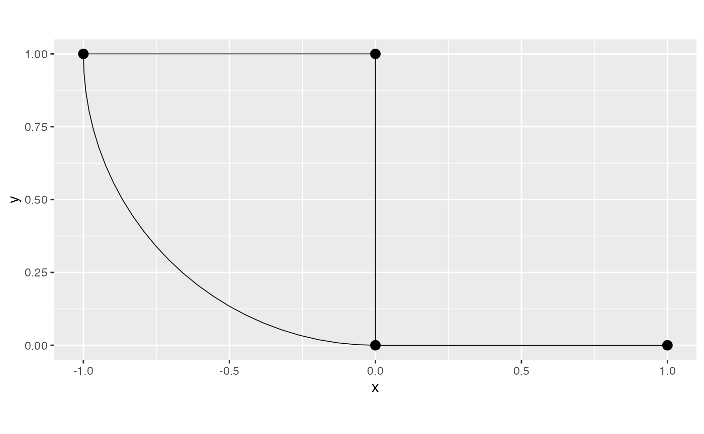

We can obtain the edge lenghts by using the `get_edge_lengths()` method:

``` r

graph$get_edge_lengths()
```

    ## [1] 1.000000 1.000000 1.000000 1.570516

Observer that we know that the actual length of edge 4 is $`\pi/2`$,
which is not quite right (observe that edge 4 is an approximation of a
quarter of a circle by a polygon with 25 points):

``` r

pi/2 - graph$get_edge_lengths()[4]
```

    ## [1] 0.0002803513

We can provide the actual edge lengths, by using the
`set_manual_edge_lengths()` method:

``` r

graph$set_manual_edge_lengths(c(1,1,1,pi/2))
graph$get_edge_lengths()
```

    ## [1] 1.000000 1.000000 1.000000 1.570796

We can also manually provide the edge lengths when creating the metric
graph:

``` r

graph <- metric_graph$new(edges = Lines, manual_edge_lengths = c(1,1,1,pi/2))
graph$get_edge_lengths() 
```

    ## [1] 1.000000 1.000000 1.000000 1.570796

However, it is important to note that if one passes the
manual_edge_lengths when creating the graph, it will automatically set
`perform_merges` to `FALSE`, as there is no consistent way to obtain the
edge lengths after the merges from the manual edge lengths.
Nevertheless, `merge_close_vertices` can be set to `TRUE`.

### Characteristics of the graph

A brief summary of the main characteristics of the graph can be obtained
by the `compute_characteristics()` method:

``` r

graph3$compute_characteristics()
```

We can, then, view those characteristics by simply printing the
`metric_graph` object:

``` r

graph3
```

    ## A metric graph with  6  vertices and  6  edges.
    ## 
    ## Vertices:
    ##   Degree 1: 3;  Degree 2: 1;  Degree 3: 1;  Degree 4: 1; 
    ##   With incompatible directions:  1 
    ## 
    ## Edges: 
    ##   Lengths: 
    ##       Min: 0.3533333  ; Max: 2.190873  ; Total: 4.788107 
    ##   Weights: 
    ##       Min: 1  ; Max: 1 
    ##   That are circles:  0 
    ## 
    ## Graph units: 
    ##   Vertices unit:  None  ; Lengths unit:  None 
    ## 
    ## Longitude and Latitude coordinates:  FALSE
    ## 
    ## Some characteristics of the graph:
    ##   Connected: TRUE
    ##   Has loops: FALSE
    ##   Has multiple edges: FALSE
    ##   Is a tree: FALSE
    ##   Distance consistent: unknown

    ## To check if the graph satisfies the distance consistency, run the `check_distance_consistency()` method.

    ##   Has Euclidean edges: unknown

    ## To check if the graph has Euclidean edges, run the `check_euclidean()` method.

Observe that we do not know that the graph has Euclidean edges. We can
check by using the `check_euclidean()` method:

``` r

graph3$check_euclidean()
```

Let us view the characteristics again:

``` r

graph3
```

    ## A metric graph with  6  vertices and  6  edges.
    ## 
    ## Vertices:
    ##   Degree 1: 3;  Degree 2: 1;  Degree 3: 1;  Degree 4: 1; 
    ##   With incompatible directions:  1 
    ## 
    ## Edges: 
    ##   Lengths: 
    ##       Min: 0.3533333  ; Max: 2.190873  ; Total: 4.788107 
    ##   Weights: 
    ##       Min: 1  ; Max: 1 
    ##   That are circles:  0 
    ## 
    ## Graph units: 
    ##   Vertices unit:  None  ; Lengths unit:  None 
    ## 
    ## Longitude and Latitude coordinates:  FALSE
    ## 
    ## Some characteristics of the graph:
    ##   Connected: TRUE
    ##   Has loops: FALSE
    ##   Has multiple edges: FALSE
    ##   Is a tree: FALSE
    ##   Distance consistent: TRUE
    ##   Has Euclidean edges: TRUE

It can happen that we have that the graph does not have Euclidean edges
without the need to check the distance consistency. However, if one
wants to check if the graph satisfies the distance consistency
assumption, one can run the `check_distance_consistency()` function:

``` r

graph3$check_distance_consistency()
```

Further, the individual characteristics can be accessed (after running
the `compute_characteristics()` method) through the `characteristics`
component of the graph object:

``` r

graph3$characteristics
```

    ## $has_loops
    ## [1] FALSE
    ## 
    ## $connected
    ## [1] TRUE
    ## 
    ## $has_multiple_edges
    ## [1] FALSE
    ## 
    ## $is_tree
    ## [1] FALSE
    ## 
    ## $distance_consistency
    ## [1] TRUE
    ## 
    ## $euclidean
    ## [1] TRUE

### Summaries of metric graphs

We can also obtain a summary of the informations contained on a metric
graph object by using the
[`summary()`](https://rdrr.io/r/base/summary.html) method. Let us obtain
a summary of informations of `graph3`:

``` r

summary(graph3)
```

    ## A metric graph object with:
    ## 
    ## Vertices:
    ##   Total: 6 
    ##   Degree 1: 3;  Degree 2: 1;  Degree 3: 1;  Degree 4: 1; 
    ##   With incompatible directions:  1 
    ## 
    ## Edges: 
    ##   Total: 6 
    ##   Lengths: 
    ##       Min: 0.3533333  ; Max: 2.190873  ; Total: 4.788107 
    ##   Weights: 
    ##       Min: 1  ; Max: 1 
    ##   That are circles:  0 
    ## 
    ## Graph units: 
    ##   Vertices unit:  None  ; Lengths unit:  None 
    ## 
    ## Longitude and Latitude coordinates:  FALSE
    ## 
    ## Some characteristics of the graph:
    ##   Connected: TRUE
    ##   Has loops: FALSE
    ##   Has multiple edges: FALSE
    ##   Is a tree: FALSE
    ##   Distance consistent: TRUE
    ##   Has Euclidean edges: TRUE
    ## 
    ## Computed quantities inside the graph: 
    ##   Laplacian:  FALSE  ; Geodesic distances:  TRUE 
    ##   Resistance distances:  FALSE  ; Finite element matrices:  FALSE 
    ## 
    ## Mesh: The graph has no mesh! 
    ## 
    ## Data: The graph has no data!
    ## 
    ## Tolerances: 
    ##   vertex-vertex:  0.2 
    ##   vertex-edge:  0.1 
    ##   edge-edge:  0.001

Observe that there are some quantities that were not computed on the
summary. We can see how to compute them by setting the argument
`messages` to `TRUE`:

``` r

summary(graph3, messages = TRUE)
```

    ## A metric graph object with:
    ## 
    ## Vertices:
    ##   Total: 6 
    ##   Degree 1: 3;  Degree 2: 1;  Degree 3: 1;  Degree 4: 1; 
    ##   With incompatible directions:  1 
    ## 
    ## Edges: 
    ##   Total: 6 
    ##   Lengths: 
    ##       Min: 0.3533333  ; Max: 2.190873  ; Total: 4.788107 
    ##   Weights: 
    ##       Min: 1  ; Max: 1 
    ##   That are circles:  0 
    ## 
    ## Graph units: 
    ##   Vertices unit:  None  ; Lengths unit:  None 
    ## 
    ## Longitude and Latitude coordinates:  FALSE
    ## 
    ## Some characteristics of the graph:
    ##   Connected: TRUE
    ##   Has loops: FALSE
    ##   Has multiple edges: FALSE
    ##   Is a tree: FALSE
    ##   Distance consistent: TRUE
    ##   Has Euclidean edges: TRUE
    ## 
    ## Computed quantities inside the graph: 
    ##   Laplacian:  FALSE  ; Geodesic distances:  TRUE

    ## To compute the Laplacian, run the 'compute_laplacian()' method.

    ##   Resistance distances:  FALSE  ; Finite element matrices:  FALSE

    ## To compute the resistance distances, run the 'compute_resdist()' method.

    ## To compute the finite element matrices, run the 'compute_fem()' method.

    ## 
    ## Mesh: The graph has no mesh!

    ## To build the mesh, run the 'build_mesh()' method.

    ## 
    ## Data: The graph has no data!

    ## To add observations, use the 'add_observations()' method.

    ## 
    ## Tolerances: 
    ##   vertex-vertex:  0.2 
    ##   vertex-edge:  0.1 
    ##   edge-edge:  0.001

Finally, the [`summary()`](https://rdrr.io/r/base/summary.html) can also
be accessed from the metric graph object:

``` r

graph3$summary()
```

    ## A metric graph object with:
    ## 
    ## Vertices:
    ##   Total: 6 
    ##   Degree 1: 3;  Degree 2: 1;  Degree 3: 1;  Degree 4: 1; 
    ##   With incompatible directions:  1 
    ## 
    ## Edges: 
    ##   Total: 6 
    ##   Lengths: 
    ##       Min: 0.3533333  ; Max: 2.190873  ; Total: 4.788107 
    ##   Weights: 
    ##       Min: 1  ; Max: 1 
    ##   That are circles:  0 
    ## 
    ## Graph units: 
    ##   Vertices unit:  None  ; Lengths unit:  None 
    ## 
    ## Longitude and Latitude coordinates:  FALSE
    ## 
    ## Some characteristics of the graph:
    ##   Connected: TRUE
    ##   Has loops: FALSE
    ##   Has multiple edges: FALSE
    ##   Is a tree: FALSE
    ##   Distance consistent: TRUE
    ##   Has Euclidean edges: TRUE
    ## 
    ## Computed quantities inside the graph: 
    ##   Laplacian:  FALSE  ; Geodesic distances:  TRUE 
    ##   Resistance distances:  FALSE  ; Finite element matrices:  FALSE 
    ## 
    ## Mesh: The graph has no mesh! 
    ## 
    ## Data: The graph has no data!
    ## 
    ## Tolerances: 
    ##   vertex-vertex:  0.2 
    ##   vertex-edge:  0.1 
    ##   edge-edge:  0.001

### Vertices and edges

The metric graph object has the `edges` and `vertices` elements in its
list. We can get a quick summary from them by calling these elements:

``` r

graph3$vertices
```

    ## Vertices of the metric graph
    ## 
    ## Longitude and Latitude coordinates: FALSE 
    ## 
    ## Summary: 
    ##      x         y Degree Indegree Outdegree Problematic
    ## 1  0.0 0.0000000      2        0         2        TRUE
    ## 2  1.0 0.0000000      1        1         0       FALSE
    ## 3  0.5 0.0300000      3        2         1       FALSE
    ## 4  0.0 1.0000000      1        0         1       FALSE
    ## 5 -1.0 0.0000000      1        1         0       FALSE
    ## 6  0.0 0.3533333      4        2         2       FALSE

and

``` r

graph3$edges
```

    ## Edges of the metric graph
    ## 
    ## Longitude and Latitude coordinates: FALSE 
    ## 
    ## Summary: 
    ## 
    ## Edge 1 (first and last coordinates): 
    ##    x    y
    ##  0.0 0.00
    ##  0.5 0.03
    ## Total number of coordinates: 2 
    ## Edge length: 0.5008992 
    ## Weight: 1 
    ## 
    ## Kirchhoff weight: 1 
    ## 
    ## Directional weight: 1 
    ## 
    ## Edge 2 (first and last coordinates): 
    ##  x         y
    ##  0 0.0000000
    ##  0 0.3533333
    ## Total number of coordinates: 2 
    ## Edge length: 0.3533333 
    ## Weight: 1 
    ## 
    ## Kirchhoff weight: 1 
    ## 
    ## Directional weight: 1 
    ## 
    ## Edge 3 (first and last coordinates): 
    ##   x         y
    ##   0 0.3533333
    ##  -1 0.0000000
    ## Total number of coordinates: 3 
    ## Edge length: 2.190873 
    ## Weight: 1 
    ## 
    ## Kirchhoff weight: 1 
    ## 
    ## Directional weight: 1 
    ## 
    ## Edge 4 (first and last coordinates): 
    ##  x         y
    ##  0 1.0000000
    ##  0 0.3533333
    ## Total number of coordinates: 3 
    ## Edge length: 0.6466667 
    ## Weight: 1 
    ## 
    ## Kirchhoff weight: 1 
    ## 
    ## Directional weight: 1

    ## # 2 more edges

    ## # Use `print(n=...)` to see more edges

We can also look at individual edges and vertices. For example, let us
look at vertice number 2:

``` r

graph3$vertices[[2]]
```

    ## Vertex 2 of the metric graph
    ## 
    ## Longitude and Latitude coordinates: FALSE 
    ## 
    ## Summary: 
    ##  x y Degree Indegree Outdegree Problematic
    ##  1 0      1        1         0       FALSE

Similarly, let us look at edge number 4:

``` r

graph3$edges[[4]]
```

    ## Edge 4 of the metric graph
    ## 
    ## Longitude and Latitude coordinates: FALSE 
    ## 
    ## Coordinates of the vertices of the edge: 
    ##  x         y
    ##  0 1.0000000
    ##  0 0.3533333
    ## 
    ## Coordinates of the edge:
    ##  x         y
    ##  0 1.0000000
    ##  0 0.7500000
    ##  0 0.3533333
    ## 
    ## Relative positions of the edge:
    ##  Edge number Distance on edge
    ##            4        0.0000000
    ##            4        0.3865979
    ##            4        1.0000000
    ## 
    ## Total number of coordinates: 3 
    ## Edge length: 0.6466667 
    ## Weight: 1 
    ## Kirchhoff weight: 1 
    ## 
    ## Directional weight: 1

We have a message informing us that the relative positions of the edges
were not computed. They are used to produce better plots when using the
`plot_function()` method, see the section “Improving the plot obtained
by `plot_function`” below. To compute the relative positions, we run the
`compute_PtE_edges()` method:

``` r

graph3$compute_PtE_edges()
```

Now, we take a look at edge number 4 again:

``` r

graph3$edges[[4]]
```

    ## Edge 4 of the metric graph
    ## 
    ## Longitude and Latitude coordinates: FALSE 
    ## 
    ## Coordinates of the vertices of the edge: 
    ##  x         y
    ##  0 1.0000000
    ##  0 0.3533333
    ## 
    ## Coordinates of the edge:
    ##  x         y
    ##  0 1.0000000
    ##  0 0.7500000
    ##  0 0.3533333
    ## 
    ## Relative positions of the edge:
    ##  Edge number Distance on edge
    ##            4        0.0000000
    ##            4        0.3865979
    ##            4        1.0000000
    ## 
    ## Total number of coordinates: 3 
    ## Edge length: 0.6466667 
    ## Weight: 1 
    ## Kirchhoff weight: 1 
    ## 
    ## Directional weight: 1

### Understanding coordinates on graphs

The locations of the vertices are specified in Euclidean coordinates.
However, when specifying a position on the graph, it is not practical to
work with Euclidean coordinates since not all locations in Euclidean
space are locations on the graph. It is instead better to specify a
location on the graph by the touple $`(i, t)`$, where $`i`$ denotes the
number of the edge and $`t`$ is the location on the edge. The location
$`t`$ can either be specified as the distance from the start of the edge
(and then takes values between 0 and the length of the edge) or as the
normalized distance from the start of the edge (and then takes values
between 0 and 1). The function `coordinates` can be used to convert
between coordinates in Euclidean space and locations on the graph. For
example the location at distance 0.2 from the start of the second edge
is:

``` r

graph$coordinates(PtE = matrix(c(2, 0.2), 1,2), normalized = FALSE)
```

    ##      [,1] [,2]
    ## [1,]    0  0.2

In this case, since the edge has length 1, the location of the point at
normalized distance 0.2 from the start of the edge is the same:

``` r

graph$coordinates(PtE = matrix(c(2, 0.2), 1,2), normalized = TRUE)
```

    ##      [,1] [,2]
    ## [1,]    0  0.2

The function can also be used to find the closest location on the graph
for a location in Euclidean space:

``` r

graph$coordinates(XY = matrix(c(0, 0.2), 1,2))
```

    ##      [,1] [,2]
    ## [1,]    2  0.2

In this case, the `normalized` argument decides whether the returned
value should be given in normalized distance or not.

### Methods for working with real data

To illustrate the useage of `metric_graph` on some real data, we use the
`osmdata` package to download data from OpenStreetMap. In the following
code, we extract highways for a part of the city of Copenhagen:

``` r

library(osmdata)
bbox <- c(12.5900, 55.6000, 12.6850, 55.6450)
call <- opq(bbox)
call <- add_osm_feature(call, key = "highway",value=c("motorway", "primary",
                                                        "secondary", "tertiary"))
data_sf <- osmdata_sf(call)

graph5 <- metric_graph$new(lapply(data_sf$osm_lines$geometry, 
  function(dat){sf::st_coordinates(dat)[,1:2]}))
graph5$plot(vertex_size = 0)
```

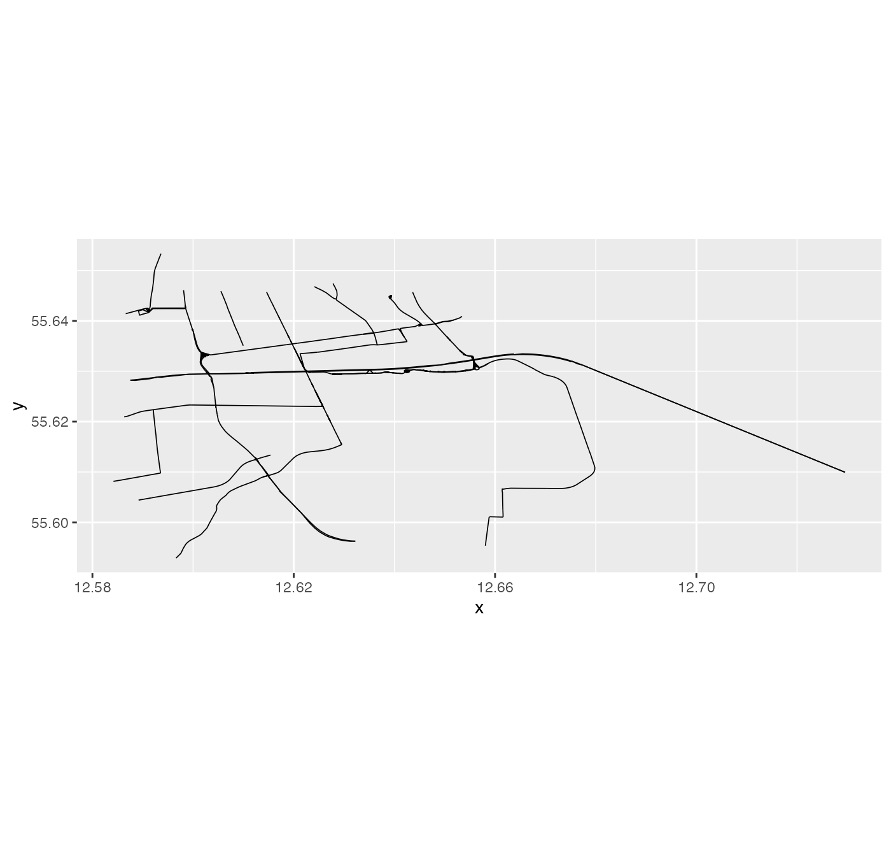

There are a few things to note about data like this. The first is that
the coordinates are given in Longitude and Latitude. Because of this,
the edge lengths are by default given in degrees, which may result in
very small numbers:

``` r

range(graph5$get_edge_lengths())
```

    ## [1] 6.516993e-05 5.636913e-02

This may cause numerical instabilities when dealing with random fields
on the graph, and it also makes it difficult to interpret results
(unless one has a good intuition about distances in degrees). To avoid
such problems, it is better to set the `longlat` argument when
constructing the graph:

``` r

graph5 <- metric_graph$new(lapply(data_sf$osm_lines$geometry, 
  function(dat){sf::st_coordinates(dat)[,1:2]}), longlat = TRUE)
```

This tells the constructor that the coordinates are given in Longitude
and Latitude and that distances should be calculated in km. So if we now
look at the edge lengths, they are given in km:

``` r

range(graph5$get_edge_lengths())
```

    ## Units: [km]
    ## [1] 0.001650041 4.042991481

Alternatively, and more conveniently, whenever the `sf` object has a
valid `crs`, it will automatically use this `crs` to set the correct
coordinate reference system (CRS) in the metric graph. Above, we ended
up removing the `crs` when we created the `linestring` object from the
resulting `osm_lines`. Let us, instead, build the graph directly using
the `osmdata_sf` object:

``` r

graph5 <- metric_graph$new(data_sf)
```

We can see now that `graph5` automatically has the correct CRS:

``` r

graph5
```

    ## A metric graph with  347  vertices and  366  edges.
    ## 
    ## Vertices:
    ##   Degree 1: 29;  Degree 2: 266;  Degree 3: 39;  Degree 4: 11;  Degree 5: 2; 
    ##   With incompatible directions:  5 
    ## 
    ## Edges: 
    ##   Lengths: 
    ##       Min: 0.001650041  ; Max: 4.042991  ; Total: 68.82467 
    ##   Weights: 
    ##       Columns: osm_id name alt_name animal_crossing:animal bicycle bridge cycleway cycleway:both cycleway:left cycleway:right cycleway:width destination destination:lanes destination:ref destination:symbol foot hazard hazmat:conditional highway horse int_ref junction lane_markings lanes lanes:backward lanes:forward layer lit mapillary maxheight maxspeed maxspeed:advisory maxspeed:variable maxweight:signed mofa motorcar name:etymology name:etymology:wikidata name:etymology:wikipedia name:sv noname note oneway operator operator:wikidata operator:wikipedia placement priority ref shoulder sidewalk sidewalk:both:surface sidewalk:left sidewalk:left:surface sidewalk:right sidewalk:right:surface smoothness source:maxspeed start_date surface toll traffic_calming tunnel tunnel:alt_name:da tunnel:alt_name:sv tunnel:name tunnel:name:da tunnel:name:de tunnel:name:en tunnel:name:sv tunnel:official_name turn:lanes turn:lanes:backward turn:lanes:forward width wikidata .weights 
    ##   That are circles:  0 
    ## 
    ## Graph units: 
    ##   Vertices unit:  degree  ; Lengths unit:  km 
    ## 
    ## Longitude and Latitude coordinates:  TRUE
    ##   Which spatial package:  sp 
    ##   CRS:  EPSG:4326

This also allows us to plot the graph interactively with the underlying
world map, if the data has a coordinate reference system, by setting
`type = "mapview"` in the
[`plot()`](https://rdrr.io/r/graphics/plot.default.html) method:

``` r

graph5$plot(type = "mapview", vertex_size = 0)
```

We can also check the edge lengths:

``` r

range(graph5$get_edge_lengths())
```

    ## Units: [km]
    ## [1] 0.001650041 4.042991481

Another advantage of adding the `osmdata` object, is that the metric
graph automatically adds the edge observations as `edge_weights`:

``` r

graph5$get_edge_weights()
```

    ## # A tibble: 366 × 77
    ##    osm_id  name          alt_name animal_crossing:anim…¹ bicycle bridge cycleway
    ##    <chr>   <chr>         <chr>    <chr>                  <chr>   <chr>  <chr>   
    ##  1 1525051 Backersvej    NA       NA                     NA      NA     lane    
    ##  2 1692808 Saltværksvej  NA       NA                     yes     NA     track   
    ##  3 1698015 NA            NA       NA                     no      NA     NA      
    ##  4 1700205 Tårnbyvej     NA       NA                     yes     NA     track   
    ##  5 1754353 Løjtegårdsvej NA       NA                     NA      NA     track   
    ##  6 1880381 Stenlandsvej  NA       NA                     use_si… NA     separate
    ##  7 1880526 A.P. Møllers… NA       NA                     NA      NA     no      
    ##  8 2373286 Kastruplundg… NA       NA                     NA      NA     no      
    ##  9 3431744 Kirstinehøj   NA       NA                     NA      NA     track   
    ## 10 3431748 Tømmerupvej   NA       NA                     NA      NA     track   
    ## # ℹ 356 more rows
    ## # ℹ abbreviated name: ¹​`animal_crossing:animal`
    ## # ℹ 70 more variables: `cycleway:both` <chr>, `cycleway:left` <chr>,
    ## #   `cycleway:right` <chr>, `cycleway:width` <chr>, destination <chr>,
    ## #   `destination:lanes` <chr>, `destination:ref` <chr>,
    ## #   `destination:symbol` <chr>, foot <chr>, hazard <chr>,
    ## #   `hazmat:conditional` <chr>, highway <chr>, horse <chr>, int_ref <chr>, …

We can also let the color of the edges be determined by some edge
weight. For example, let us take `maxspeed`:

``` r

graph5$plot(vertex_size = 0, edge_weight = "maxspeed", 
        type="mapview")
```

    ## Warning in RColorBrewer::brewer.pal(n = length(levels(edges_sf[[edge_weight]])), : minimal value for n is 3, returning requested palette with 3 different levels

    ## Warning: Found less unique colors (3) than unique zcol values (6)! 
    ## Recycling color vector.
    ## Warning: Found less unique colors (3) than unique zcol values (6)! 
    ## Recycling color vector.

Similarly, we can also set the edge width based on an edge weight (for
this case, we can only use `type = "ggplot"`, which is the default). In
this example we will choose the column `lanes` to determine the edge
widths. If the number of lanes is not available, the edge will be
removed (we will replace the `NA`s by zero).

``` r

graph5$set_edge_weights(weights = graph5$mutate_weights(lanes = ifelse(is.na(lanes),0,lanes), lanes = as.numeric(lanes)))
graph5$plot(vertex_size = 0, edge_weight = "maxspeed", edge_width_weight = "lanes")
```

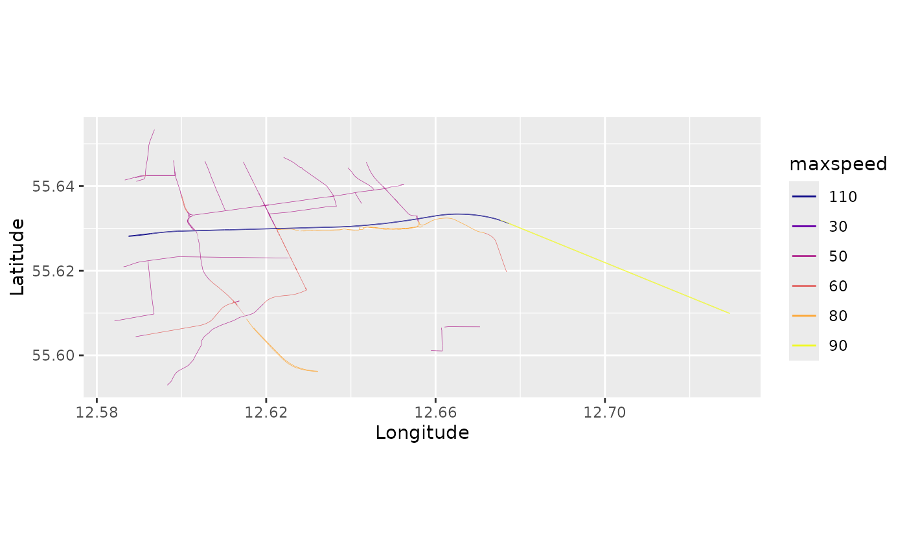

However, observe that the edge widths are always relative, with the
largest being set to `edge_width`. So, let us set `edge_width` to 4 to
make it easier to perceive the differences:

``` r

graph5$set_edge_weights(weights = graph5$mutate_weights(lanes = ifelse(is.na(lanes),0,lanes), lanes = as.numeric(lanes)))
graph5$plot(vertex_size = 0, edge_weight = "maxspeed", edge_width_weight = "lanes", edge_width = 4)
```

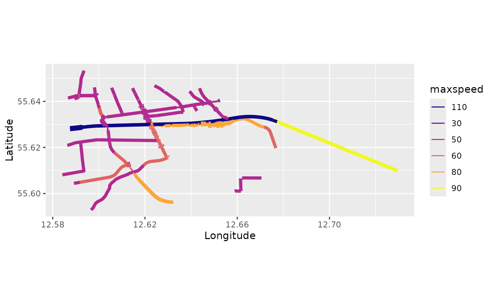

If one does not want to have the edge weights added, one must set
`include_edge_weights` to `FALSE`:

``` r

graph5 <- metric_graph$new(data_sf, include_edge_weights=FALSE)
graph5$get_edge_weights()
```

    ## # A tibble: 366 × 1
    ##    .weights
    ##       <dbl>
    ##  1        1
    ##  2        1
    ##  3        1
    ##  4        1
    ##  5        1
    ##  6        1
    ##  7        1
    ##  8        1
    ##  9        1
    ## 10        1
    ## # ℹ 356 more rows

Similarly, if one wants just to add some columns of the `osmdata` object
as edge weights, one can pass a vector with the column names as the
`include_edge_weights` argument. For example, let us only get the
columns `highway` and `lanes`:

``` r

graph5 <- metric_graph$new(data_sf, include_edge_weights=c("highway", "lanes"))
graph5$get_edge_weights()
```

    ## # A tibble: 366 × 3
    ##    highway  lanes .weights
    ##    <chr>    <chr>    <dbl>
    ##  1 tertiary NA           1
    ##  2 tertiary 4            1
    ##  3 tertiary 1            1
    ##  4 tertiary 3            1
    ##  5 tertiary 1            1
    ##  6 tertiary 2            1
    ##  7 tertiary 2            1
    ##  8 tertiary 2            1
    ##  9 tertiary 3            1
    ## 10 tertiary 2            1
    ## # ℹ 356 more rows

The same idea also works is one has an `sf` object instead. Let us
obtain the `sf` version from the `osmdata` object:

``` r

data_sf <- osmdata_sf(call)
```

We can now directly create the metric graph object:

``` r

graph5 <- metric_graph$new(data_sf)
```

Let us check that `graph5` still has the correct CRS:

``` r

graph5
```

    ## A metric graph with  347  vertices and  366  edges.
    ## 
    ## Vertices:
    ##   Degree 1: 29;  Degree 2: 266;  Degree 3: 39;  Degree 4: 11;  Degree 5: 2; 
    ##   With incompatible directions:  5 
    ## 
    ## Edges: 
    ##   Lengths: 
    ##       Min: 0.001650041  ; Max: 4.042991  ; Total: 68.82467 
    ##   Weights: 
    ##       Columns: osm_id name alt_name animal_crossing:animal bicycle bridge cycleway cycleway:both cycleway:left cycleway:right cycleway:width destination destination:lanes destination:ref destination:symbol foot hazard hazmat:conditional highway horse int_ref junction lane_markings lanes lanes:backward lanes:forward layer lit mapillary maxheight maxspeed maxspeed:advisory maxspeed:variable maxweight:signed mofa motorcar name:etymology name:etymology:wikidata name:etymology:wikipedia name:sv noname note oneway operator operator:wikidata operator:wikipedia placement priority ref shoulder sidewalk sidewalk:both:surface sidewalk:left sidewalk:left:surface sidewalk:right sidewalk:right:surface smoothness source:maxspeed start_date surface toll traffic_calming tunnel tunnel:alt_name:da tunnel:alt_name:sv tunnel:name tunnel:name:da tunnel:name:de tunnel:name:en tunnel:name:sv tunnel:official_name turn:lanes turn:lanes:backward turn:lanes:forward width wikidata .weights 
    ##   That are circles:  0 
    ## 
    ## Graph units: 
    ##   Vertices unit:  degree  ; Lengths unit:  km 
    ## 
    ## Longitude and Latitude coordinates:  TRUE
    ##   Which spatial package:  sp 
    ##   CRS:  EPSG:4326

and the correct edge lengths:

``` r

range(graph5$get_edge_lengths())
```

    ## Units: [km]
    ## [1] 0.001650041 4.042991481

Also, that it has the edge weights:

``` r

graph5$get_edge_weights()
```

    ## # A tibble: 366 × 77
    ##    osm_id  name          alt_name animal_crossing:anim…¹ bicycle bridge cycleway
    ##    <chr>   <chr>         <chr>    <chr>                  <chr>   <chr>  <chr>   
    ##  1 1525051 Backersvej    NA       NA                     NA      NA     lane    
    ##  2 1692808 Saltværksvej  NA       NA                     yes     NA     track   
    ##  3 1698015 NA            NA       NA                     no      NA     NA      
    ##  4 1700205 Tårnbyvej     NA       NA                     yes     NA     track   
    ##  5 1754353 Løjtegårdsvej NA       NA                     NA      NA     track   
    ##  6 1880381 Stenlandsvej  NA       NA                     use_si… NA     separate
    ##  7 1880526 A.P. Møllers… NA       NA                     NA      NA     no      
    ##  8 2373286 Kastruplundg… NA       NA                     NA      NA     no      
    ##  9 3431744 Kirstinehøj   NA       NA                     NA      NA     track   
    ## 10 3431748 Tømmerupvej   NA       NA                     NA      NA     track   
    ## # ℹ 356 more rows
    ## # ℹ abbreviated name: ¹​`animal_crossing:animal`
    ## # ℹ 70 more variables: `cycleway:both` <chr>, `cycleway:left` <chr>,
    ## #   `cycleway:right` <chr>, `cycleway:width` <chr>, destination <chr>,
    ## #   `destination:lanes` <chr>, `destination:ref` <chr>,
    ## #   `destination:symbol` <chr>, foot <chr>, hazard <chr>,
    ## #   `hazmat:conditional` <chr>, highway <chr>, horse <chr>, int_ref <chr>, …

The argument `include_edge_weights` can also be used in same manner for
`osmdata_sf` objects.

The second thing to note is that the constructor gave a warning that the
graph is not connected. This might not be ideal for modeling and we may
want to study the different connected components separately. If this is
not a concern, one can set the argument `check_connected = FALSE` while
creating the graph. In this case the check is skipped and no warning is
printed; the resulting `metric_graph` works exactly as a connected one
(see [Working with disconnected metric
graphs](https://davidbolin.github.io/MetricGraph/articles/graph_components.md)
for a focused walkthrough).

To inspect the components we can use `get_components()`, which returns a
list of `metric_graph` objects sorted by total edge length:

``` r

comps <- graph5$get_components()
length(comps)
```

    ## [1] 3

``` r

sapply(comps, function(g) sum(as.numeric(g$edge_lengths)))
```

    ## [1] 49.257010  9.786714  9.780944

To draw every component in its own colour we pass `components = TRUE` to
[`plot()`](https://rdrr.io/r/graphics/plot.default.html):

``` r

graph5$plot(vertex_size = 0, type = "mapview", components = TRUE)
```

One reason for having multiple components here might be that we set the
tolerance for merging nodes too low. In fact, by looking at the edge
lengths we see that we have vertices that are as close as

``` r

min(graph5$get_edge_lengths(unit='m'))
```

    ## 1.650041 [m]

meters. Let us increase the tolerances so that vertices that are at most
a distance of 100 meters (0.1km) apart should be merged:

``` r

graph5 <- metric_graph$new(data_sf,
                           tolerance = list(vertex_vertex = 0.1),
                           check_connected = FALSE)
graph5$plot(vertex_size = 0, type = "mapview", components = TRUE)
```

With this choice, let us check the number of connected components:

``` r

length(graph5$get_components())
```

    ## [1] 1

If we want to keep only the largest connected component for further
analysis, we can take the first entry of `get_components()` (components
are sorted by total edge length, descending):

``` r

graph5 <- graph5$get_components()[[1]]
```

Let us take a quick look at its vertices and edges:

``` r

graph5$vertices
```

    ## Vertices of the metric graph
    ## 
    ## Longitude and Latitude coordinates: TRUE 
    ## Coordinate reference system: EPSG:4326 
    ## 
    ## Summary: 
    ##    Longitude Latitude Degree Indegree Outdegree Problematic
    ## 1   12.62782 55.64742      1        0         1       FALSE
    ## 2   12.62844 55.64436      3        3         0        TRUE
    ## 3   12.61968 55.63542     10        4         6       FALSE
    ## 4   12.64288 55.63024     23       11        12       FALSE
    ## 5   12.62580 55.62302     17        8         9       FALSE
    ## 6   12.58937 55.64109      2        0         2        TRUE
    ## 7   12.59120 55.64169     10        5         5       FALSE
    ## 8   12.66141 55.60655      4        2         2       FALSE
    ## 9   12.66156 55.60241      2        1         1       FALSE
    ## 10  12.64146 55.63763      9        4         5       FALSE

    ## # 92 more rows

    ## # Use `print(n=...)` to see more rows

and

``` r

graph5$edges
```

    ## Edges of the metric graph
    ## 
    ## Longitude and Latitude coordinates: TRUE 
    ## Coordinate reference system: EPSG:4326 
    ## 
    ## Summary: 
    ## 
    ## Edge 1 (first and last coordinates): 
    ##  Longitude Latitude
    ##   12.62782 55.64742
    ##   12.62844 55.64436
    ## Total number of coordinates: 18 
    ## Edge length: 0.3470128 km 
    ## Weights: 
    ##   osm_id       name alt_name animal_crossing:animal bicycle bridge cycleway
    ##  1525051 Backersvej     <NA>                   <NA>    <NA>   <NA>     lane
    ##  cycleway:both cycleway:left cycleway:right cycleway:width destination
    ##           <NA>          <NA>           <NA>           <NA>        <NA>
    ##  destination:lanes destination:ref destination:symbol foot hazard
    ##               <NA>            <NA>               <NA> <NA>   <NA>
    ##  hazmat:conditional  highway horse int_ref junction lane_markings lanes
    ##                <NA> tertiary  <NA>    <NA>     <NA>          <NA>  <NA>
    ##  lanes:backward lanes:forward layer lit mapillary maxheight maxspeed
    ##            <NA>          <NA>  <NA> yes      <NA>      <NA>       50
    ##  maxspeed:advisory maxspeed:variable maxweight:signed mofa motorcar
    ##               <NA>              <NA>             <NA> <NA>     <NA>
    ##         name:etymology name:etymology:wikidata name:etymology:wikipedia name:sv
    ##  Peter Gjertsen Backer              Q130367378                     <NA>    <NA>
    ##  noname note oneway operator operator:wikidata operator:wikipedia placement
    ##    <NA> <NA>   <NA>     <NA>              <NA>               <NA>      <NA>
    ##  priority  ref shoulder sidewalk sidewalk:both:surface sidewalk:left
    ##      <NA> <NA>     <NA>     both                  <NA>          <NA>
    ##  sidewalk:left:surface sidewalk:right sidewalk:right:surface smoothness
    ##                   <NA>           <NA>                   <NA>       <NA>
    ##  source:maxspeed start_date surface toll traffic_calming tunnel
    ##             <NA>       <NA> asphalt <NA>            <NA>   <NA>
    ##  tunnel:alt_name:da tunnel:alt_name:sv tunnel:name tunnel:name:da
    ##                <NA>               <NA>        <NA>           <NA>
    ##  tunnel:name:de tunnel:name:en tunnel:name:sv tunnel:official_name turn:lanes
    ##            <NA>           <NA>           <NA>                 <NA>       <NA>
    ##  turn:lanes:backward turn:lanes:forward width  wikidata .weights
    ##                 <NA>               <NA>  <NA> Q84085767        1
    ## 
    ## Kirchhoff weight: 1 
    ## 
    ## Directional weight: 1 
    ## 
    ## Edge 2 (first and last coordinates): 
    ##  Longitude Latitude
    ##   12.61968 55.63542
    ##   12.61968 55.63542
    ## Total number of coordinates: 7 
    ## Edge length: 0.1219161 km 
    ## Weights: 
    ##   osm_id         name alt_name animal_crossing:animal bicycle bridge cycleway
    ##  1692808 Saltværksvej     <NA>                   <NA>     yes   <NA>    track
    ##  cycleway:both cycleway:left cycleway:right cycleway:width destination
    ##           <NA>          <NA>           <NA>           <NA>        <NA>
    ##  destination:lanes destination:ref destination:symbol foot hazard
    ##               <NA>            <NA>               <NA>  yes   <NA>
    ##  hazmat:conditional  highway horse int_ref junction lane_markings lanes
    ##                <NA> tertiary  <NA>    <NA>     <NA>          <NA>     4
    ##  lanes:backward lanes:forward layer lit mapillary maxheight maxspeed
    ##               3             1  <NA> yes      <NA>      <NA>       50
    ##  maxspeed:advisory maxspeed:variable maxweight:signed mofa motorcar
    ##               <NA>              <NA>             <NA> <NA>     <NA>
    ##  name:etymology name:etymology:wikidata name:etymology:wikipedia name:sv noname
    ##            <NA>              Q130262817                     <NA>    <NA>   <NA>
    ##  note oneway operator operator:wikidata operator:wikipedia placement priority
    ##  <NA>   <NA>     <NA>              <NA>               <NA>      <NA>     <NA>
    ##   ref shoulder sidewalk sidewalk:both:surface sidewalk:left
    ##  <NA>     <NA>     both                  <NA>          <NA>
    ##  sidewalk:left:surface sidewalk:right sidewalk:right:surface smoothness
    ##                   <NA>           <NA>                   <NA>       <NA>
    ##  source:maxspeed start_date surface toll traffic_calming tunnel
    ##         DK:urban       <NA> asphalt <NA>            <NA>   <NA>
    ##  tunnel:alt_name:da tunnel:alt_name:sv tunnel:name tunnel:name:da
    ##                <NA>               <NA>        <NA>           <NA>
    ##  tunnel:name:de tunnel:name:en tunnel:name:sv tunnel:official_name turn:lanes
    ##            <NA>           <NA>           <NA>                 <NA>       <NA>
    ##  turn:lanes:backward turn:lanes:forward width wikidata .weights
    ##   left|through|right               <NA>  <NA>     <NA>        1
    ## 
    ## Kirchhoff weight: 1 
    ## 
    ## Directional weight: 1 
    ## 
    ## Edge 3 (first and last coordinates): 
    ##  Longitude Latitude
    ##   12.64288 55.63024
    ##   12.64288 55.63024
    ## Total number of coordinates: 10 
    ## Edge length: 0.1033293 km 
    ## Weights: 
    ##   osm_id name alt_name animal_crossing:animal bicycle bridge cycleway
    ##  1698015 <NA>     <NA>                   <NA>      no   <NA>     <NA>
    ##  cycleway:both cycleway:left cycleway:right cycleway:width destination
    ##           <NA>          <NA>           <NA>           <NA>        <NA>
    ##  destination:lanes destination:ref destination:symbol foot hazard
    ##               <NA>            <NA>               <NA>   no   <NA>
    ##  hazmat:conditional  highway horse int_ref   junction lane_markings lanes
    ##                <NA> tertiary  <NA>    <NA> roundabout          <NA>     1
    ##  lanes:backward lanes:forward layer lit mapillary maxheight maxspeed
    ##            <NA>          <NA>  <NA> yes      <NA>      <NA>       80
    ##  maxspeed:advisory maxspeed:variable maxweight:signed mofa motorcar
    ##               <NA>              <NA>             <NA> <NA>     <NA>
    ##  name:etymology name:etymology:wikidata name:etymology:wikipedia name:sv noname
    ##            <NA>                    <NA>                     <NA>    <NA>    yes
    ##  note oneway operator operator:wikidata operator:wikipedia placement priority
    ##  <NA>   <NA>     <NA>              <NA>               <NA>      <NA>     <NA>
    ##   ref shoulder sidewalk sidewalk:both:surface sidewalk:left
    ##  <NA>     <NA>       no                  <NA>          <NA>
    ##  sidewalk:left:surface sidewalk:right sidewalk:right:surface smoothness
    ##                   <NA>           <NA>                   <NA>       <NA>
    ##  source:maxspeed start_date surface toll traffic_calming tunnel
    ##         DK:rural       <NA> asphalt <NA>            <NA>   <NA>
    ##  tunnel:alt_name:da tunnel:alt_name:sv tunnel:name tunnel:name:da
    ##                <NA>               <NA>        <NA>           <NA>
    ##  tunnel:name:de tunnel:name:en tunnel:name:sv tunnel:official_name turn:lanes
    ##            <NA>           <NA>           <NA>                 <NA>       <NA>
    ##  turn:lanes:backward turn:lanes:forward width wikidata .weights
    ##                 <NA>               <NA>  <NA>     <NA>        1
    ## 
    ## Kirchhoff weight: 1 
    ## 
    ## Directional weight: 1 
    ## 
    ## Edge 4 (first and last coordinates): 
    ##  Longitude Latitude
    ##   12.61968 55.63542
    ##   12.61968 55.63542
    ## Total number of coordinates: 4 
    ## Edge length: 0.1250789 km 
    ## Weights: 
    ##   osm_id      name alt_name animal_crossing:animal bicycle bridge cycleway
    ##  1700205 Tårnbyvej     <NA>                   <NA>     yes   <NA>    track
    ##  cycleway:both cycleway:left cycleway:right cycleway:width destination
    ##           <NA>          <NA>           <NA>           <NA>        <NA>
    ##  destination:lanes destination:ref destination:symbol foot hazard
    ##               <NA>            <NA>               <NA>  yes   <NA>
    ##  hazmat:conditional  highway horse int_ref junction lane_markings lanes
    ##                <NA> tertiary  <NA>    <NA>     <NA>          <NA>     3
    ##  lanes:backward lanes:forward layer lit mapillary maxheight maxspeed
    ##               2             1  <NA> yes      <NA>      <NA>       50
    ##  maxspeed:advisory maxspeed:variable maxweight:signed mofa motorcar
    ##               <NA>              <NA>             <NA> <NA>     <NA>
    ##  name:etymology name:etymology:wikidata name:etymology:wikipedia name:sv noname
    ##            <NA>                  Q28173                     <NA>    <NA>   <NA>
    ##  note oneway operator operator:wikidata operator:wikipedia placement priority
    ##  <NA>   <NA>     <NA>              <NA>               <NA>      <NA>     <NA>
    ##   ref shoulder sidewalk sidewalk:both:surface sidewalk:left
    ##  <NA>     <NA>     both                  <NA>          <NA>
    ##  sidewalk:left:surface sidewalk:right sidewalk:right:surface smoothness
    ##                   <NA>           <NA>                   <NA>       <NA>
    ##  source:maxspeed start_date surface toll traffic_calming tunnel
    ##         DK:urban       <NA> asphalt <NA>            <NA>   <NA>
    ##  tunnel:alt_name:da tunnel:alt_name:sv tunnel:name tunnel:name:da
    ##                <NA>               <NA>        <NA>           <NA>
    ##  tunnel:name:de tunnel:name:en tunnel:name:sv tunnel:official_name turn:lanes
    ##            <NA>           <NA>           <NA>                 <NA>       <NA>
    ##  turn:lanes:backward turn:lanes:forward width wikidata .weights
    ##   left|through;right               <NA>  <NA>     <NA>        1
    ## 
    ## Kirchhoff weight: 1 
    ## 
    ## Directional weight: 1

    ## # 274 more edges

    ## # Use `print(n=...)` to see more edges

Also observe that it has the corresponding edge weights:

``` r

graph5$get_edge_weights()
```

    ## # A tibble: 278 × 77
    ##    osm_id  name          alt_name animal_crossing:anim…¹ bicycle bridge cycleway
    ##    <chr>   <chr>         <chr>    <chr>                  <chr>   <chr>  <chr>   
    ##  1 1525051 Backersvej    NA       NA                     NA      NA     lane    
    ##  2 1692808 Saltværksvej  NA       NA                     yes     NA     track   
    ##  3 1698015 NA            NA       NA                     no      NA     NA      
    ##  4 1700205 Tårnbyvej     NA       NA                     yes     NA     track   
    ##  5 1754353 Løjtegårdsvej NA       NA                     NA      NA     track   
    ##  6 1880381 Stenlandsvej  NA       NA                     use_si… NA     separate
    ##  7 1880526 A.P. Møllers… NA       NA                     NA      NA     no      
    ##  8 2373286 Kastruplundg… NA       NA                     NA      NA     no      
    ##  9 3431744 Kirstinehøj   NA       NA                     NA      NA     track   
    ## 10 3431748 Tømmerupvej   NA       NA                     NA      NA     track   
    ## # ℹ 268 more rows
    ## # ℹ abbreviated name: ¹​`animal_crossing:animal`
    ## # ℹ 70 more variables: `cycleway:both` <chr>, `cycleway:left` <chr>,
    ## #   `cycleway:right` <chr>, `cycleway:width` <chr>, destination <chr>,
    ## #   `destination:lanes` <chr>, `destination:ref` <chr>,
    ## #   `destination:symbol` <chr>, foot <chr>, hazard <chr>,
    ## #   `hazmat:conditional` <chr>, highway <chr>, horse <chr>, int_ref <chr>, …

It is also relevant to obtain a summary of this graph:

``` r

summary(graph5)
```

    ## A metric graph object with:
    ## 
    ## Vertices:
    ##   Total: 102 
    ##   Degree 1: 13;  Degree 2: 31;  Degree 3: 6;  Degree 4: 22;  Degree 5: 2; 
    ##   Degree 6: 5;  Degree 7: 1;  Degree 8: 2;  Degree 9: 5;  Degree 10: 5; 
    ##   Degree 11: 2;  Degree 12: 1;  Degree 13: 1;  Degree 17: 1;  Degree 19: 1; 
    ##   Degree 23: 1;  Degree 24: 1;  Degree 29: 1;  Degree 58: 1; 
    ##   With incompatible directions:  2 
    ## 
    ## Edges: 
    ##   Total: 278 
    ##   Lengths: 
    ##       Min: 0.004165961  ; Max: 4.042991  ; Total: 95.69644 
    ##   Weights: 
    ##       Columns: osm_id name alt_name animal_crossing:animal bicycle bridge cycleway cycleway:both cycleway:left cycleway:right cycleway:width destination destination:lanes destination:ref destination:symbol foot hazard hazmat:conditional highway horse int_ref junction lane_markings lanes lanes:backward lanes:forward layer lit mapillary maxheight maxspeed maxspeed:advisory maxspeed:variable maxweight:signed mofa motorcar name:etymology name:etymology:wikidata name:etymology:wikipedia name:sv noname note oneway operator operator:wikidata operator:wikipedia placement priority ref shoulder sidewalk sidewalk:both:surface sidewalk:left sidewalk:left:surface sidewalk:right sidewalk:right:surface smoothness source:maxspeed start_date surface toll traffic_calming tunnel tunnel:alt_name:da tunnel:alt_name:sv tunnel:name tunnel:name:da tunnel:name:de tunnel:name:en tunnel:name:sv tunnel:official_name turn:lanes turn:lanes:backward turn:lanes:forward width wikidata .weights 
    ##   That are circles:  139 
    ## 
    ## Graph units: 
    ##   Vertices unit:  degree  ; Lengths unit:  km 
    ## 
    ## Longitude and Latitude coordinates:  TRUE
    ##   Which spatial package:  sp 
    ##   CRS:  EPSG:4326
    ## 
    ## Some characteristics of the graph:
    ##   Connected: TRUE
    ##   Has loops: TRUE
    ##   Has multiple edges: TRUE
    ##   Is a tree: FALSE
    ##   Distance consistent: FALSE
    ##   Has Euclidean edges: FALSE
    ## 
    ## Computed quantities inside the graph: 
    ##   Laplacian:  FALSE  ; Geodesic distances:  TRUE 
    ##   Resistance distances:  FALSE  ; Finite element matrices:  FALSE 
    ## 
    ## Mesh: The graph has no mesh! 
    ## 
    ## Data: The graph has no data!
    ## 
    ## Tolerances: 
    ##   vertex-vertex:  0.1 
    ##   vertex-edge:  1e-07 
    ##   edge-edge:  0

We have that this graph does not have Euclidean edges. Also observe that
we have the units for the vertices and lengths, and also the coordinate
reference system being used by this object.

Alternatively, one can also add create metric graphs from `SSN` objects.
All one needs to do is to directly pass the `SSN` object as `edges`.
This will also ensure that the correct `CRS` is used. For example:

``` r

library(SSN2)

copy_lsn_to_temp()
path <- file.path(tempdir(), "MiddleFork04.ssn")

mf04p <- ssn_import(
  path = path,
  predpts = c("pred1km", "CapeHorn"),
  overwrite = TRUE
)

river_graph <- metric_graph$new(mf04p)
```

Let us take a look at the graph:

``` r

river_graph$plot()
```

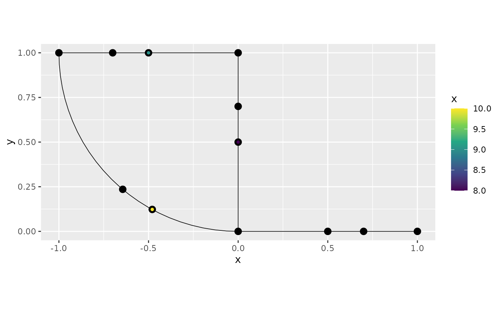

Let us also look at the interactive plot with the underlying map:

``` r

river_graph$plot(vertex_size = 0, type = "mapview")
```

Similarly to `osmdata` objects, when using `SSN` objects, the edge
observations are also added as edge weights:

``` r

river_graph$get_edge_weights()
```

    ## # A tibble: 163 × 17
    ##      rid    COMID GNIS_NAME   REACHCODE FTYPE FCODE AREAWTMAP   SLOPE rcaAreaKm2
    ##    <int>    <int> <chr>       <chr>     <chr> <int>     <dbl>   <dbl>      <dbl>
    ##  1     1 23519365 Bear Valle… 17060205… Stre… 46006     1001. 0.00274     4.65  
    ##  2     2 23519367 Bear Valle… 17060205… Stre… 46006     1002. 0.0071      0.839 
    ##  3     3 23519369 Bear Valle… 17060205… Stre… 46006     1003. 0.0036      3.91  
    ##  4     4 23519295 Bear Valle… 17060205… Stre… 46006     1010. 0.0147      0.0495
    ##  5     5 23519297 Bear Valle… 17060205… Stre… 46006     1007. 0.00568     5.02  
    ##  6     6 23519299 Bear Valle… 17060205… Stre… 46006     1003. 0.00104     0.992 
    ##  7     7 23519301 Bear Valle… 17060205… Stre… 46006     1006. 0.00271     1.46  
    ##  8     8 23519303 Bear Valle… 17060205… Stre… 46006     1009. 0.00055     0.597 
    ##  9     9 23519305 Bear Valle… 17060205… Stre… 46006     1009. 0.00026     1.32  
    ## 10    10 23519307 Bear Valle… 17060205… Stre… 46006     1009. 0.00042     0.865 
    ## # ℹ 153 more rows
    ## # ℹ 8 more variables: h2oAreaKm2 <dbl>, Length <dbl>, upDist <dbl>,
    ## #   areaPI <dbl>, afvArea <dbl>, netID <dbl>, netgeom <chr>, .weights <dbl>

The argument `include_edge_weights` can also be used in same manner for
`SSN` objects.

However, for `SSN` objects, observations are also automatically added in
the metric graph creation:

``` r

river_graph$get_data()
```

    ## # A tibble: 45 × 32
    ##      rid   pid STREAMNAME     COMID AREAWTMAP   SLOPE ELEV_DEM Source  Summer_mn
    ##    <int> <int> <chr>          <int>     <dbl>   <dbl>    <int> <chr>       <dbl>
    ##  1     1     3 Bear Valley 23519365     1001. 0.00274     1958 RMRS_M…      14.6
    ##  2     1     2 Bear Valley 23519365     1001. 0.00274     1952 RMRS_M…      14.7
    ##  3     1     1 Bear Valley 23519365     1001. 0.00274     1947 RMRS_M…      14.9
    ##  4     5     5 Bear Valley 23519297     1007. 0.00568     1932 RMRS_M…      14.5
    ##  5     5     4 Bear Valley 23519297     1007. 0.00568     1923 RMRS_M…      15.2
    ##  6    10     6 Bear Valley 23519307     1009. 0.00042     1940 RMRS_M…      15.3
    ##  7    13     7 Bear Valley 23519313     1010. 0           1940 RMRS_M…      15.1
    ##  8    15     8 Bear Valley 23519317     1013. 0.00297     1945 RMRS_M…      14.9
    ##  9    17    10 Elk         23519321     1025. 0           1950 RMRS_M…      15.0
    ## 10    17     9 Elk         23519321     1025. 0           1948 RMRS_M…      15.0
    ## # ℹ 35 more rows
    ## # ℹ 23 more variables: MaxOver20 <dbl>, C16 <dbl>, C20 <dbl>, C24 <dbl>,
    ## #   FlowCMS <dbl>, AirMEANc <dbl>, AirMWMTc <dbl>, rcaAreaKm2 <dbl>,
    ## #   h2oAreaKm2 <dbl>, ratio <dbl>, snapdist <dbl>, upDist <dbl>, afvArea <dbl>,
    ## #   locID <int>, netID <dbl>, netgeom <chr>, .distance_to_graph <dbl>,
    ## #   .edge_number <dbl>, .distance_on_edge <dbl>, .group <chr>, .loc_idx <int>,
    ## #   .coord_x <dbl>, .coord_y <dbl>

With respect to addition of data in `SSN` objects, we have the option
`include_obs` that acts in the same manner as the `include_edge_weights`
argument. For example, one can choose to not include the data by setting
`include_obs` to `FALSE`:

``` r

river_graph <- metric_graph$new(mf04p, include_obs = FALSE)
```

Let us confirm that no data was added:

``` r

river_graph$get_data()
```

    ## Error in `river_graph$get_data()`:
    ## ! The graph does not contain data.

Finally, one can select which columns to add, by passing the names (or
numbers) of the columns as the `include_edge_weights` argument.

``` r

river_graph <- metric_graph$new(mf04p, include_obs = c("SLOPE", "Summer_mn"))
```

and the data:

``` r

river_graph$get_data()
```

    ## # A tibble: 45 × 9
    ##      SLOPE Summer_mn .distance_to_graph .edge_number .distance_on_edge .group
    ##      <dbl>     <dbl>              <dbl>        <dbl>             <dbl> <chr> 
    ##  1 0.00274      14.6                  0            1            0.207  1     
    ##  2 0.00274      14.7                  0            1            0.374  1     
    ##  3 0.00274      14.9                  0            1            0.986  1     
    ##  4 0.00568      14.5                  0            5            0.484  1     
    ##  5 0.00568      15.2                  0            5            0.768  1     
    ##  6 0.00042      15.3                  0           10            0.719  1     
    ##  7 0            15.1                  0           13            0.386  1     
    ##  8 0.00297      14.9                  0           15            0.0926 1     
    ##  9 0            15.0                  0           17            0.188  1     
    ## 10 0            15.0                  0           17            0.818  1     
    ## # ℹ 35 more rows
    ## # ℹ 3 more variables: .loc_idx <int>, .coord_x <dbl>, .coord_y <dbl>

## Adding data to the graph

Given that we have constructed the metric graph, we can now add data to
it. For further details on data manipulation on metric graphs, see [Data
manipulation on metric
graphs](https://davidbolin.github.io/MetricGraph/articles/metric_graph_data.md).
As an example, let us consider the first graph again and suppose that we
have observations at a distance 0.5 from the start of each edge. One way
of specifying this is as follows

``` r

obs.loc <- cbind(1:4, rep(0.5, 4))
obs <- c(1,2,3,4)
df_graph <- data.frame(y = obs, edge_number = obs.loc[,1], 
                        distance_on_edge = obs.loc[,2])
graph$add_observations(data = df_graph)
```

    ## Adding observations...

    ## Assuming the observations are NOT normalized by the length of the edge.

``` r

graph$plot(data = "y", data_size = 2)
```


In certain situations, it might be easier to specify the relative
distances on the edges, so that 0 represents the start and 1 the end of
the edge (instead of the edge length). To do so, we can simply specify
`normalized = TRUE` when adding the observations. For example, let us
add one more observation at the midpoint of the fourth edge:

``` r

obs.loc <- matrix(c(4, 0.5),1,2)
obs <- c(5)
df_new <- data.frame(y=obs, edge_number = obs.loc[,1], 
                          distance_on_edge = obs.loc[,2])
graph$add_observations(data=df_new, normalized = TRUE)
```

    ## Adding observations...

    ## Assuming the observations are normalized by the length of the edge.

``` r

graph$plot(data = "y")
```


An alternative method is to specify the observations as spatial points
objects, where the locations are given in Euclidean coordinates. In this
case the observations are added to the closes location on the graph:

``` r

obs.loc <- rbind(c(0.7, 0), c(0, 0.2))
obs <- c(6,7)
points <- SpatialPointsDataFrame(coords = obs.loc,
                                 data = data.frame(y = obs))
graph$add_observations(points)
```

    ## Adding observations...

    ## Converting data to PtE

``` r

graph$plot(data = "y")
```


If we want to replace the data in the object, we can use
`clear_observations()` to remove all current data:

``` r

graph$clear_observations()
```

The `metric_graph` object can hold multiple variables of data, and one
can also specify a `group` argument that it useful for specifying that
data is grouped, which for example is the case with data observed at
different time points. As an example, let us add two variables observed
at two separate time points:

``` r

obs.loc <- cbind(c(1:4, 1:4), c(rep(0.5, 4), rep(0.7, 4)))
df_rep <- data.frame(y = c(1, 2, NA, 3, 4, 6, 5, 7),
                     x = c(NA, 8, 9, 10, 11, 12, 13, NA),
                     edge_number = obs.loc[,1], 
                     distance_on_edge = obs.loc[,2],
                     time = c(rep(1, 4), rep(2, 4)))
graph$add_observations(data = df_rep, group = "time")
```

    ## Adding observations...

    ## Assuming the observations are NOT normalized by the length of the edge.

If `NA` is given in some variable, this indicates that this specific
variable is not measured at that location and group. We can now plot the
individual variables by specifying their names in the plot function
together with the group number that we want to see. By default the first
group is shown.

``` r

graph$plot(data = "y", group = 2)
```

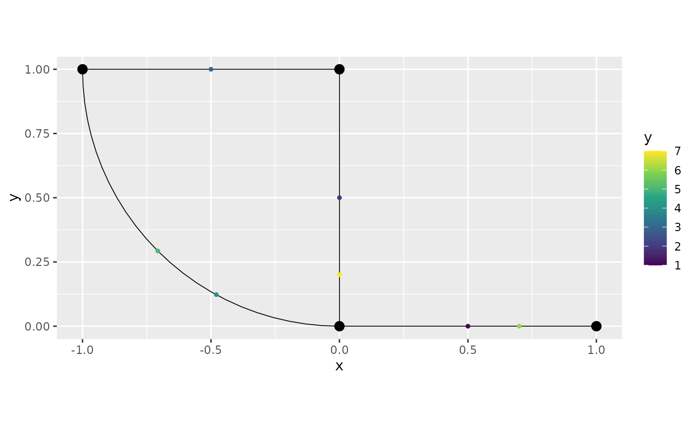

In some cases, we might want to add the observation locations as
vertices in the graph. This can be done as follows:

``` r

graph$observation_to_vertex()
graph$plot(data = "x", group = 1)
```


One can note that the command adds all observation locations, from all
groups as vertices.

Finally, let us obtain a summary of the graph containing data:

``` r

summary(graph)
```

    ## A metric graph object with:
    ## 
    ## Vertices:
    ##   Total: 12 
    ##   Degree 1: 1;  Degree 2: 10;  Degree 3: 1; 
    ##   With incompatible directions:  2 
    ## 
    ## Edges: 
    ##   Total: 12 
    ##   Lengths: 
    ##       Min: 0.2  ; Max: 0.8707963  ; Total: 4.570796 
    ##   Weights: 
    ##       Min: 1  ; Max: 1 
    ##   That are circles:  0 
    ## 
    ## Graph units: 
    ##   Vertices unit:  None  ; Lengths unit:  None 
    ## 
    ## Longitude and Latitude coordinates:  FALSE
    ## 
    ## Some characteristics of the graph:
    ##   Connected: TRUE
    ##   Has loops: FALSE
    ##   Has multiple edges: FALSE
    ##   Is a tree: FALSE
    ##   Distance consistent: TRUE
    ##   Has Euclidean edges: TRUE
    ## 
    ## Computed quantities inside the graph: 
    ##   Laplacian:  FALSE  ; Geodesic distances:  TRUE 
    ##   Resistance distances:  FALSE  ; Finite element matrices:  FALSE 
    ## 
    ## Mesh: The graph has no mesh! 
    ## 
    ## Data: 
    ##   Columns:  y x time 
    ##   Groups:  time 
    ## 
    ## Tolerances: 
    ##   vertex-vertex:  0.001 
    ##   vertex-edge:  0.001 
    ##   edge-edge:  0

When dealing with `SSN` objects, one can also directly add the `SSN`
object as data:

``` r

river_graph$clear_observations()
river_graph$add_observations(data = mf04p)
```

We can see that the data has been added correctly:

``` r

river_graph$get_data()
```

    ## # A tibble: 45 × 32
    ##      rid   pid STREAMNAME     COMID AREAWTMAP   SLOPE ELEV_DEM Source  Summer_mn
    ##    <int> <int> <chr>          <int>     <dbl>   <dbl>    <int> <chr>       <dbl>
    ##  1     1     3 Bear Valley 23519365     1001. 0.00274     1958 RMRS_M…      14.6
    ##  2     1     2 Bear Valley 23519365     1001. 0.00274     1952 RMRS_M…      14.7
    ##  3     1     1 Bear Valley 23519365     1001. 0.00274     1947 RMRS_M…      14.9
    ##  4     5     5 Bear Valley 23519297     1007. 0.00568     1932 RMRS_M…      14.5
    ##  5     5     4 Bear Valley 23519297     1007. 0.00568     1923 RMRS_M…      15.2
    ##  6    10     6 Bear Valley 23519307     1009. 0.00042     1940 RMRS_M…      15.3
    ##  7    13     7 Bear Valley 23519313     1010. 0           1940 RMRS_M…      15.1
    ##  8    15     8 Bear Valley 23519317     1013. 0.00297     1945 RMRS_M…      14.9
    ##  9    17    10 Elk         23519321     1025. 0           1950 RMRS_M…      15.0
    ## 10    17     9 Elk         23519321     1025. 0           1948 RMRS_M…      15.0
    ## # ℹ 35 more rows
    ## # ℹ 23 more variables: MaxOver20 <dbl>, C16 <dbl>, C20 <dbl>, C24 <dbl>,
    ## #   FlowCMS <dbl>, AirMEANc <dbl>, AirMWMTc <dbl>, rcaAreaKm2 <dbl>,
    ## #   h2oAreaKm2 <dbl>, ratio <dbl>, snapdist <dbl>, upDist <dbl>, afvArea <dbl>,
    ## #   locID <int>, netID <dbl>, netgeom <chr>, .distance_to_graph <dbl>,
    ## #   .edge_number <dbl>, .distance_on_edge <dbl>, .group <chr>, .loc_idx <int>,
    ## #   .coord_x <dbl>, .coord_y <dbl>

We can also plot the data:

``` r

river_graph$plot(data = "Summer_mn", vertex_size = 0.25)
```


Let us clear the observations from the river graph:

``` r

river_graph$clear_observations()
```

One can also directly add `sf` objects into the metric graph. For
example, the object `mf04p$obs` is an `sf` object.

We can also add the obsevations as:

``` r

river_graph$add_observations(data = mf04p$obs)
```

We can see that the observations have been added accordingly:

``` r

river_graph$get_data()
```

    ## # A tibble: 45 × 32
    ##      rid   pid STREAMNAME     COMID AREAWTMAP   SLOPE ELEV_DEM Source  Summer_mn
    ##    <int> <int> <chr>          <int>     <dbl>   <dbl>    <int> <chr>       <dbl>
    ##  1     1     3 Bear Valley 23519365     1001. 0.00274     1958 RMRS_M…      14.6
    ##  2     1     2 Bear Valley 23519365     1001. 0.00274     1952 RMRS_M…      14.7
    ##  3     1     1 Bear Valley 23519365     1001. 0.00274     1947 RMRS_M…      14.9
    ##  4     5     5 Bear Valley 23519297     1007. 0.00568     1932 RMRS_M…      14.5
    ##  5     5     4 Bear Valley 23519297     1007. 0.00568     1923 RMRS_M…      15.2
    ##  6    10     6 Bear Valley 23519307     1009. 0.00042     1940 RMRS_M…      15.3
    ##  7    13     7 Bear Valley 23519313     1010. 0           1940 RMRS_M…      15.1
    ##  8    15     8 Bear Valley 23519317     1013. 0.00297     1945 RMRS_M…      14.9
    ##  9    17    10 Elk         23519321     1025. 0           1950 RMRS_M…      15.0
    ## 10    17     9 Elk         23519321     1025. 0           1948 RMRS_M…      15.0
    ## # ℹ 35 more rows
    ## # ℹ 23 more variables: MaxOver20 <dbl>, C16 <dbl>, C20 <dbl>, C24 <dbl>,
    ## #   FlowCMS <dbl>, AirMEANc <dbl>, AirMWMTc <dbl>, rcaAreaKm2 <dbl>,
    ## #   h2oAreaKm2 <dbl>, ratio <dbl>, snapdist <dbl>, upDist <dbl>, afvArea <dbl>,
    ## #   locID <int>, netID <dbl>, netgeom <chr>, .distance_to_graph <dbl>,
    ## #   .edge_number <dbl>, .distance_on_edge <dbl>, .group <chr>, .loc_idx <int>,
    ## #   .coord_x <dbl>, .coord_y <dbl>

## Working with functions on metric graphs

When working with data on metric graphs, one often wants to display
functions on the graph. The best way to visualize functions on the graph
is to evaluate them on a fine mesh over the graph and then use
`plot_function`. To illustrate this procedure, let us consider the
following graph:

``` r

V <- rbind(c(0, 0), c(1, 0), c(1, 1), c(0, 1), c(-1, 1), c(-1, 0), c(0, -1))
E <- rbind(c(1, 2), c(2, 3), c(3, 4), c(4, 5),
           c(5, 6), c(6, 1), c(4, 1),c(1, 7))
graph <- metric_graph$new(V = V, E = E)
graph$build_mesh(h = 0.5)
graph$plot(mesh=TRUE)
```


In the command `build_mesh`, the argument `h` decides the largest
spacing between nodes in the mesh. As can be seen in the plot, the mesh
is very coarse, so let’s reduce the value of `h` and rebuild the mesh:

``` r

  graph$build_mesh(h = 0.01)
```

Suppose now that we want to display the function $`f(x, y) = x^2 - y^2`$
on this graph. We then first evaluate it on the vertices of the mesh and
then use the function `plot_function` to display it:

``` r

x <- graph$mesh$V[, 1]
y <- graph$mesh$V[, 2]
f <- x^2 - y^2
graph$plot_function(X = f)
```

    ## Warning: The `X` argument of `plot_function()` is deprecated as of MetricGraph
    ## 1.3.0.9000.
    ## ℹ Please use the `newdata` argument instead.
    ## ℹ The argument `X` is deprecated; please use `newdata` to ensure the correct
    ##   order when plotting.
    ## This warning is displayed once per session.
    ## Call `lifecycle::last_lifecycle_warnings()` to see where this warning was
    ## generated.

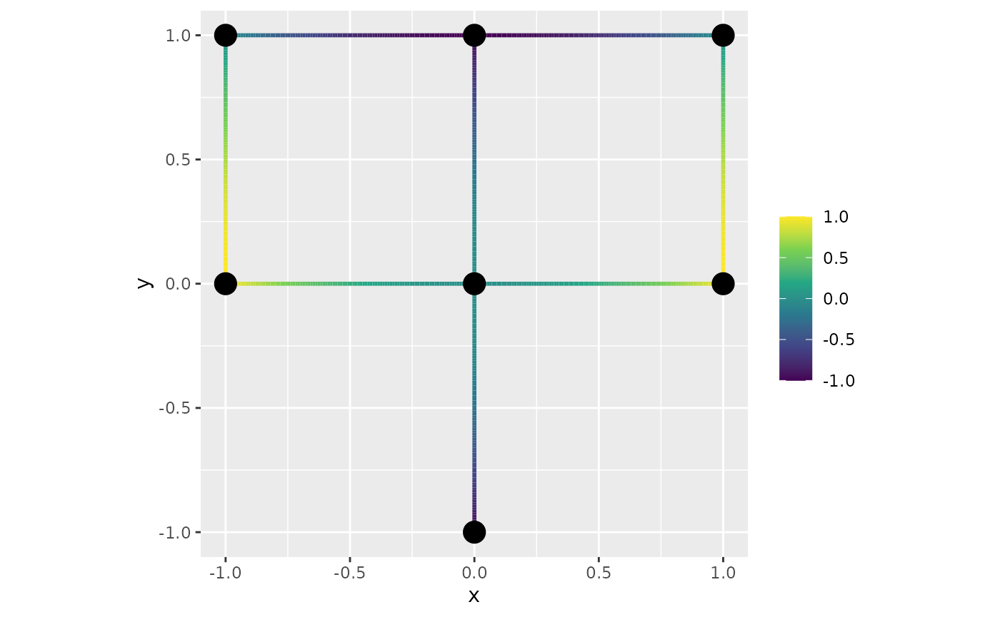

Alternatively, we can set `type = "plotly"` in the plot command to get a
3D visualization of the function:

``` r

graph$plot_function(X = f, type = "plotly")
```

When the first argument of `plot_function` is a vector, the function
assumes that the values in the vector are the values of the function
evaluated at the vertices of the mesh. As an alternative, one can also
provide a new dataset. To illustrate this, let us first construct a set
of locations that are evenly spaced over each edge. Then, we will
convert the data to Euclidean coordinates so that we can evaluate the
function above. Then, process the data and finally plot the result:

``` r

n.e <- 30
PtE <- cbind(rep(1:graph$nE, each = n.e), 
             rep(seq(from = 0, to = 1, length.out = n.e), graph$nE))        
XY <- graph$coordinates(PtE)
f <- XY[, 1]^2 - XY[, 2]^2
data_f <- data.frame(f = f, "edge_number" = PtE[,1], 
            "distance_on_edge" = PtE[,2])
data_f <- graph$process_data(data = data_f, normalized=TRUE)            
graph$plot_function(data = "f", newdata = data_f, type = "plotly")
```

Alternatively, we can add the data to the graph, and directly plot by
using the `data` argument. To illustration purposes, we will build this
next plot as a 2d plot:

``` r

graph$add_observations(data = data_f, clear_obs = TRUE, normalized = TRUE)
```

    ## Adding observations...

    ## Assuming the observations are normalized by the length of the edge.

    ## Warning in graph$add_observations(data = data_f, clear_obs = TRUE, normalized =
    ## TRUE): There is at least one 'column' of the data with repeated (possibly
    ## different) values at the same location for the same group variable. Only one of
    ## these values will be used. Consider using the group variable to differentiate
    ## between these values or provide different names for such variables.

``` r

graph$plot_function(data = "f")
```


### Further details on `plot_function`

By default, the values along the edges are interpolated try to provide a
better plot. This behavior can be disabled by setting `interpolate_plot`
to `FALSE`.

We begin by recreating the first graph we used in this vignette:

``` r

edge1 <- rbind(c(0,0),c(1,0))
edge2 <- rbind(c(0,0),c(0,1))
edge3 <- rbind(c(0,1),c(-1,1))
theta <- seq(from=pi,to=3*pi/2,length.out = 50)
edge4 <- cbind(sin(theta),1+ cos(theta))
edges = list(edge1, edge2, edge3, edge4)

graph <- metric_graph$new(edges = edges)
```

Let us create a coarse mesh, so the interpolation can be easily seen.

``` r

graph$build_mesh(h=0.8)
graph$plot(mesh=TRUE)
```

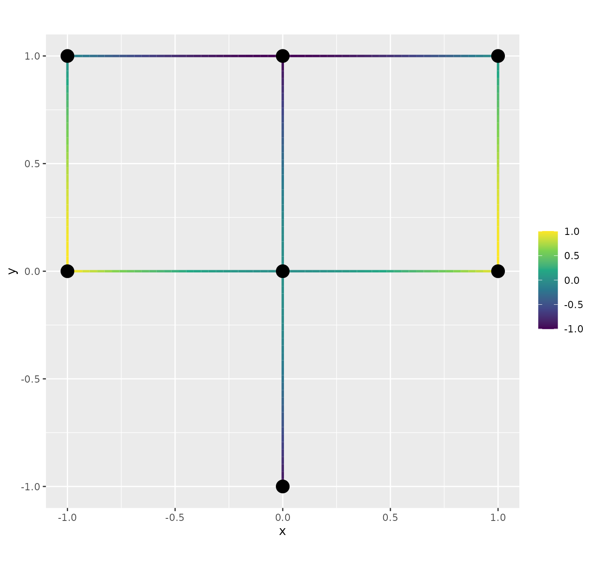

Let us compute the function the same function as before on this mesh:

``` r

XY <- graph$mesh$V
f <- XY[, 1]^2 - XY[, 2]^2
```

We can directly plot from the mesh values. Let us start with the
default, the interpolated plot:

``` r

graph$plot_function(f)
```


We can, now, turn off the interpolation by setting `interpolate_plot` to
`FALSE`:

``` r

graph$plot_function(f, interpolate_plot = FALSE)
```


Alternatively, we can supply the data through the `newdata` argument. To
such an end, we will need to supply the `data.frame`. So let us build
it:

``` r

df_f <- data.frame(edge_number = graph$mesh$VtE[,1],
                    distance_on_edge = graph$mesh$VtE[,2],
                    f = f)
```

Let us now process the `data.frame` to the graph’s internal data format
using the `process_data()` method:

``` r

df_f <- graph$process_data(data = df_f, normalized=TRUE)
```

We will now plot this function. First, let us do the default plot from
`plot_function`:

``` r

graph$plot_function(data = "f", newdata= df_f)
```

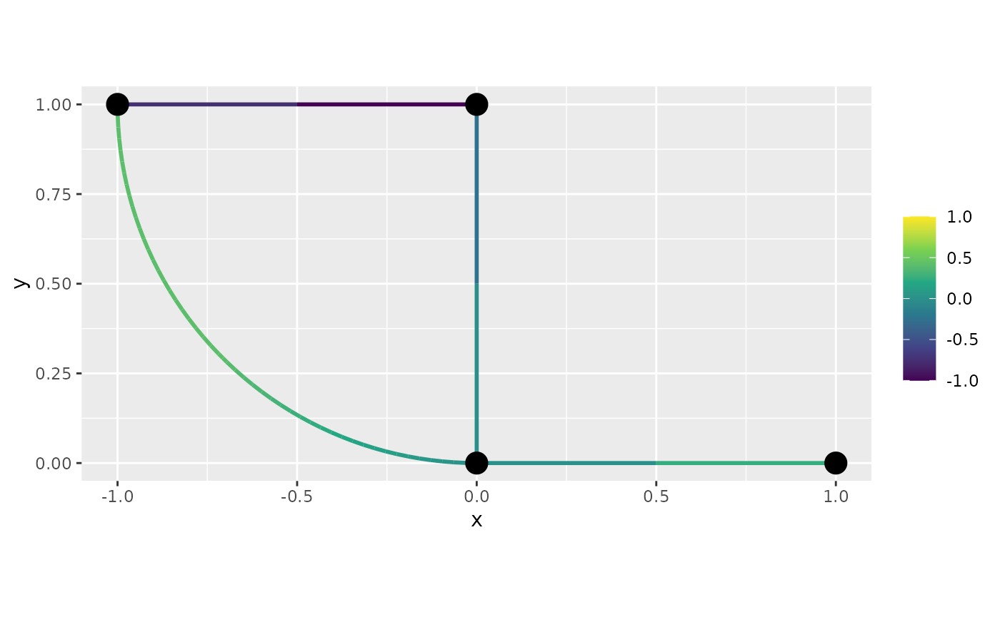

Let us now, create the same plot with `interpolate_plot=FALSE`:

``` r

graph$plot_function(data = "f", newdata= df_f, interpolate_plot=FALSE)
```

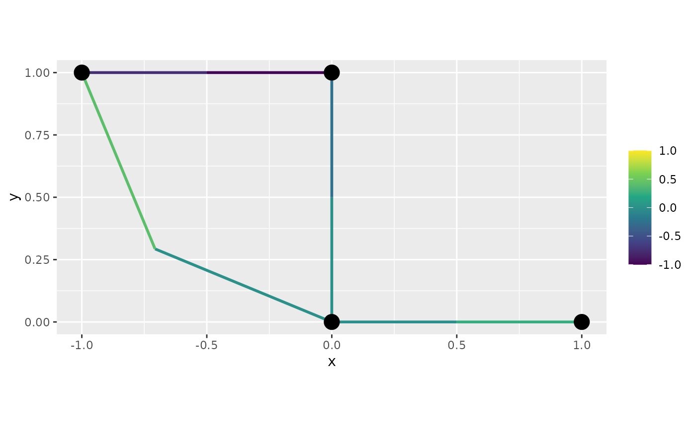

Let us now obtain a 3d plot. First, of the default version:

``` r

graph$plot_function(data = "f", newdata= df_f, type = "plotly")
```

Now, of the non-interpolated version:

``` r

graph$plot_function(data = "f", newdata= df_f, type = "plotly",
                    interpolate_plot = FALSE)
```

#### Note about continuity

However, it is important to observe that `plot_function` assumes
continuity of the function by default. Let us see an example of a
discontinuous function, and observe the effect of `plot_function`.

For example, let us consider the function that takes the edge number
(normalized). Let us also refine the mesh a bit, so it is easier to
observe what is happening.

``` r

graph$build_mesh(h=0.2)
f <- graph$mesh$VtE[,1]/4
```

Let us proceed with the creation of the `data.frame` and processing of
the data:

``` r

df_f <- data.frame(edge_number = graph$mesh$VtE[,1],
                    distance_on_edge = graph$mesh$VtE[,2],
                    f = f)
df_f <- graph$process_data(data = df_f, normalized=TRUE)
```

We will now plot this function with the default plot from
`plot_function`:

``` r

graph$plot_function(data = "f", newdata= df_f)
```

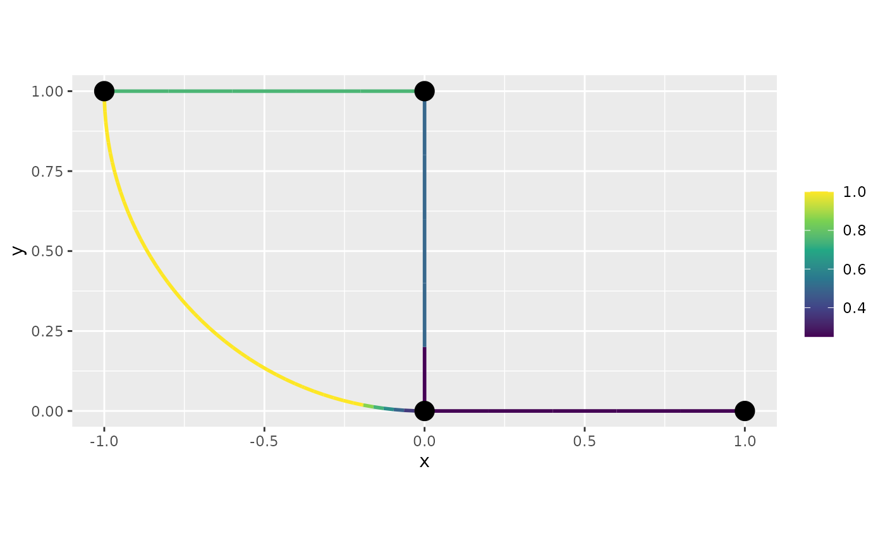

Let us now, create the same plot with `interpolate_plot=FALSE`:

``` r

graph$plot_function(data = "f", newdata= df_f, interpolate_plot=FALSE)
```


Let us now obtain a 3d plot. First, of the default version:

``` r

graph$plot_function(data = "f", newdata= df_f, type = "plotly")
```

Now, of the non-interpolated version:

``` r

graph$plot_function(data = "f", newdata= df_f, type = "plotly",
                    interpolate_plot = FALSE)
```

Observe that for both versions we have the same behavior around the
vertices (which are the discontinuity points).

To work with discontinuous functions, the simplest option is to create a
mesh that does not assume continuity:

``` r

graph$build_mesh(h=0.8, continuous = FALSE)
```

In this mesh, each vertex is split into one vertex per edge connecting
to the vertex, which allows for discontinuous functions.

``` r

f <- graph$mesh$PtE[,1]/4
graph$plot_function(f)
```


Similarly to the case for continuous meshes, we have the
`interpolate_plot` option:

``` r

graph$plot_function(f, interpolate_plot = FALSE)
```

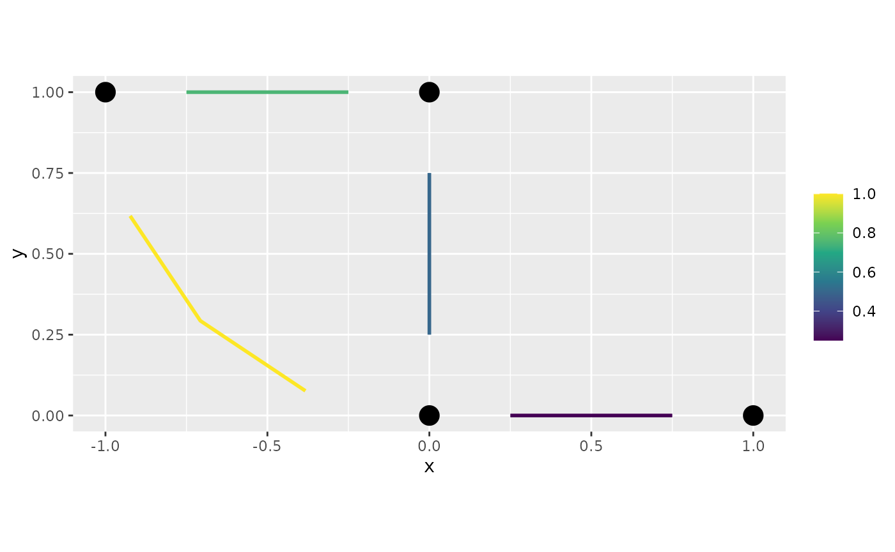

Now, the 3d plot:

``` r

graph$plot_function(f, type = "plotly", interpolate_plot = FALSE)
```

Alternatively, we can similarly plot by setting the `data.frame` and
passing the `newdata` argument:

``` r

df_f <- data.frame(edge_number = graph$mesh$VtE[,1],
                    distance_on_edge = graph$mesh$VtE[,2],
                    f = f)
df_f <- graph$process_data(data = df_f, normalized=TRUE)
```

Let us now build the plots. In this case, we need to set the
`continuous` argument to `FALSE`. First the 2d plot:

``` r

graph$plot_function(data = "f", newdata= df_f, 
                      continuous = FALSE)
```


Now, the 3d plot:

``` r

graph$plot_function(data = "f", newdata= df_f, type = "plotly",
                    continuous = FALSE)
```
