# Data manipulation on metric graphs

## Introduction

In this vignette we will provide some examples of data manipulation on
metric graphs. More precisely, we will show how to add data to the
metric graph, how to retrieve the data, how to do data manipulation
using some of the `tidyverse` tools. Finally, we will show how add the
results of these manipulations back to the metric graph.

As an example throughout the vignette, we consider the following metric
graph:

``` r

edge1 <- rbind(c(0,0),c(1,0))
edge2 <- rbind(c(0,0),c(0,1))
edge3 <- rbind(c(0,1),c(-1,1))
theta <- seq(from=pi,to=3*pi/2,length.out = 20)
edge4 <- cbind(sin(theta),1+ cos(theta))
edges = list(edge1, edge2, edge3, edge4)
graph <- metric_graph$new(edges = edges)
graph$plot()
```

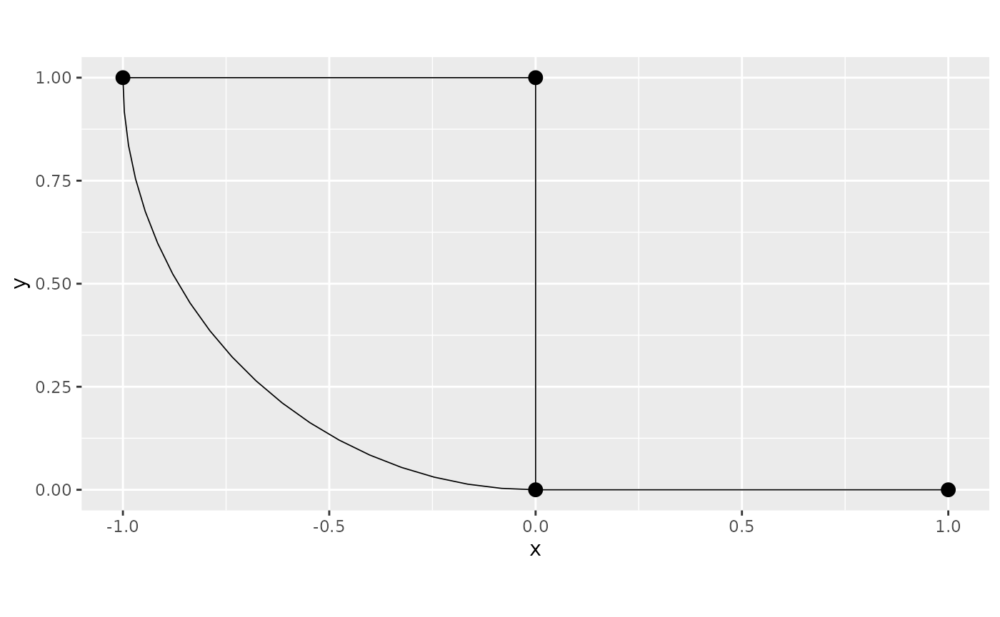

For further details on the construction of metric graphs, see [Working
with metric
graphs](https://davidbolin.github.io/MetricGraph/articles/metric_graphs.md)

## Adding and accessing data on metric graphs

Let us start by generating some data to be added to the metric graph
object we created, namely `graph`. We first generate the locations:

``` r

obs_per_edge <- 50
obs_loc <- NULL
for(i in 1:(graph$nE)) {
  obs_loc <- rbind(obs_loc,
                   cbind(rep(i,obs_per_edge), 
                   runif(obs_per_edge)))
}
```

Now, we will generate the data and build a `data.frame` to be added to
the metric graph:

``` r

y <- rnorm(graph$nE * obs_per_edge)

df_data <- data.frame(y=y, edge = obs_loc[,1], pos = obs_loc[,2])
```

We can now add the data to the graph by using the
`add_mesh_observations()` method. We will add the data by providing the
edge number and relative distance on the edge. To this end, when adding
the data, we need to supply the names of the columns that contain the
edge number and the distance on edge by entering the `edge_number` and
`distance_on_edge` arguments. Further, since we are providing the
relative distance, we need to set the `normalized` argument to `TRUE`:

``` r

graph$add_observations(data = df_data, edge_number = "edge", 
                    distance_on_edge = "pos", normalized = TRUE)
```

    ## Adding observations...

    ## Assuming the observations are normalized by the length of the edge.

We can check that the data was successfully added by retrieving them
from the metric graph using the `get_data()` method:

``` r

graph$get_data()
```

    ## # A tibble: 200 × 7
    ##          y .edge_number .distance_on_edge .group .loc_idx .coord_x .coord_y
    ##      <dbl>        <dbl>             <dbl> <chr>     <int>    <dbl>    <dbl>
    ##  1 -0.0736            1            0.0134 1             1   0.0134        0
    ##  2  2.09              1            0.0233 1             2   0.0233        0
    ##  3  1.68              1            0.0618 1             3   0.0618        0
    ##  4 -0.528             1            0.108  1             4   0.108         0
    ##  5 -0.180             1            0.126  1             5   0.126         0
    ##  6 -0.462             1            0.177  1             6   0.177         0
    ##  7 -1.52              1            0.186  1             7   0.186         0
    ##  8 -0.655             1            0.202  1             8   0.202         0
    ##  9 -0.636             1            0.206  1             9   0.206         0
    ## 10  1.34              1            0.212  1            10   0.212         0
    ## # ℹ 190 more rows

We can also visualize the data by using the
[`plot()`](https://rdrr.io/r/graphics/plot.default.html) method and
specifying which column we would like to plot:

``` r

graph$plot(data = "y")
```

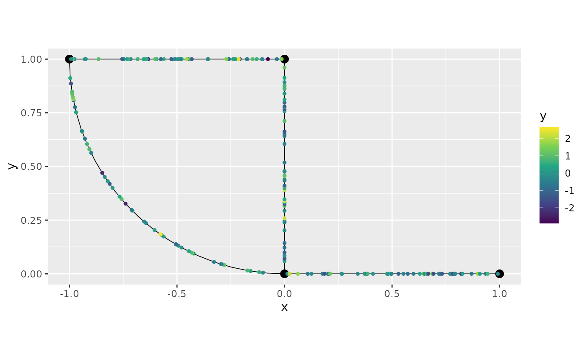

We can add more data to the metric graph by using the
`add_observations()` method again. To this end, let us create an
additional dataset. This time, we will add it using spatial coordinates.
In this case, we will generate `50` uniform locations to be the `x`
coordinate of the data, and we will keep the `y` coordinate equal to
zero. Further, we will generate `50` more realizations of a standard
gaussian variable as the `y2` variable.

``` r

coordx <- runif(50)
coordy <- 0
y2 <- rnorm(50)

df_data2 <- data.frame(y2 = y2, coordx = coordx, coordy = coordy)
```

Let us add this dataset. Now, we need to set `data_coords` to
`"spatial"` and we need to supply the names of the columns of the `x`
and `y` coordinates:

``` r

graph$add_observations(data = df_data2, data_coords = "spatial", 
                            coord_x = "coordx", coord_y = "coordy")
```

    ## Adding observations...

    ## Converting data to PtE

Let us check that the data was successfully added:

``` r

graph$get_data()
```

    ## # A tibble: 250 × 9
    ##          y     y2 .distance_to_graph .edge_number .distance_on_edge .group
    ##      <dbl>  <dbl>              <dbl>        <dbl>             <dbl> <chr> 
    ##  1 -0.0736 NA                     NA            1            0.0134 1     
    ##  2  2.09   NA                     NA            1            0.0233 1     
    ##  3 NA       0.278                  0            1            0.0308 1     
    ##  4 NA      -2.26                   0            1            0.0574 1     
    ##  5  1.68   NA                     NA            1            0.0618 1     
    ##  6 NA      -0.636                  0            1            0.0649 1     
    ##  7 NA       1.31                   0            1            0.0978 1     
    ##  8 NA      -0.334                  0            1            0.107  1     
    ##  9 -0.528  NA                     NA            1            0.108  1     
    ## 10 -0.180  NA                     NA            1            0.126  1     
    ## # ℹ 240 more rows
    ## # ℹ 3 more variables: .loc_idx <int>, .coord_x <dbl>, .coord_y <dbl>

We can also plot:

``` r

graph$plot(data = "y2")
```

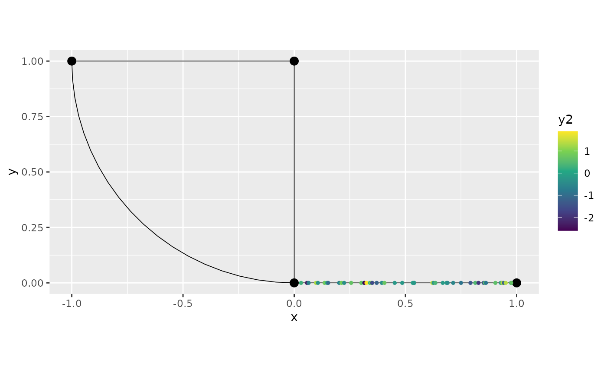

Observe that `NAs` were added, since `df_data` does not contain the
column `y2` and `df_data2` does not contain the column `y`.

By default, the `get_data()` method excludes all rows in which all the
variables are `NA` (the location variables are not considered here). We
can also show the rows that do not contain any `NA` observations by
using the `drop_na` argument in the `get_data()` method:

``` r

graph$get_data(drop_na = TRUE)
```

    ## # A tibble: 0 × 9
    ## # ℹ 9 variables: y <dbl>, y2 <dbl>, .distance_to_graph <dbl>,
    ## #   .edge_number <dbl>, .distance_on_edge <dbl>, .group <chr>, .loc_idx <int>,
    ## #   .coord_x <dbl>, .coord_y <dbl>

Observe that there is no row, since all of them contain at least one
`NA`.

Suppose now that we want to replace the metric graph data by a new
dataset. To this end we have two options. The first one is to use the
`clear_observations()` method, then add the observations:

``` r

graph$clear_observations()
```

We will now create the dataset we want to add. To simplify, we will use
the default naming for the edge number and distance on edge, so that we
do not need to specify them in the `add_observations()` method:

``` r

y3 <- rnorm(graph$nE * obs_per_edge)

df_data3 <- data.frame(y3=y3, edge_number = obs_loc[,1], distance_on_edge = obs_loc[,2])
```

We can now add the data. Remember to set `normalized` to `TRUE` since we
are providing the relative distance on edge:

``` r

graph$add_observations(data = df_data3, normalized = TRUE)
```

    ## Adding observations...

    ## Assuming the observations are normalized by the length of the edge.

and check:

``` r

graph$get_data()
```

    ## # A tibble: 200 × 7
    ##         y3 .edge_number .distance_on_edge .group .loc_idx .coord_x .coord_y
    ##      <dbl>        <dbl>             <dbl> <chr>     <int>    <dbl>    <dbl>
    ##  1  1.90              1            0.0134 1             1   0.0134        0
    ##  2 -0.710             1            0.0233 1             2   0.0233        0
    ##  3  1.15              1            0.0618 1             3   0.0618        0
    ##  4  1.12              1            0.108  1             4   0.108         0
    ##  5 -0.715             1            0.126  1             5   0.126         0
    ##  6 -2.13              1            0.177  1             6   0.177         0
    ##  7  1.44              1            0.186  1             7   0.186         0
    ##  8  1.76              1            0.202  1             8   0.202         0
    ##  9 -0.0565            1            0.206  1             9   0.206         0
    ## 10  1.59              1            0.212  1            10   0.212         0
    ## # ℹ 190 more rows

The second way to replace the data in the metric graph is to set the
`clear_obs` argument to `TRUE`. We will also create a new dataset using
the default naming for the `x` and `y` coordinates, so we do not need to
specify them:

``` r

df_data4 <- data.frame(y4 = exp(y2), coord_x = coordx, coord_y = coordy)
```

and we add them (remember to set `data_coords` to `"spatial"`):

``` r

graph$add_observations(data = df_data4, clear_obs = TRUE, 
                            data_coords = "spatial")
```

    ## Adding observations...

    ## Converting data to PtE

and we can check it replaced:

``` r

graph$get_data()
```

    ## # A tibble: 50 × 8
    ##       y4 .distance_to_graph .edge_number .distance_on_edge .group .loc_idx
    ##    <dbl>              <dbl>        <dbl>             <dbl> <chr>     <int>
    ##  1 1.32                   0            1            0.0308 1             1
    ##  2 0.104                  0            1            0.0574 1             2
    ##  3 0.530                  0            1            0.0649 1             3
    ##  4 3.72                   0            1            0.0978 1             4
    ##  5 0.716                  0            1            0.107  1             5
    ##  6 2.23                   0            1            0.136  1             6
    ##  7 1.19                   0            1            0.147  1             7
    ##  8 0.345                  0            1            0.153  1             8
    ##  9 0.564                  0            1            0.202  1             9
    ## 10 2.50                   0            1            0.213  1            10
    ## # ℹ 40 more rows
    ## # ℹ 2 more variables: .coord_x <dbl>, .coord_y <dbl>

## Adding grouped data to metric graphs

The graph structure also allow to add grouped data. To this end we need
to specify which column of the data will be the grouping variable.

To illustrate, let us generate a grouped data. We will use the same
locations we generated in the previous section.

``` r

n.repl <- 5

y_repl <- rnorm(n.repl * graph$nE * obs_per_edge)
repl <- rep(1:n.repl, each = graph$nE * obs_per_edge)
```

Let us now create the `data.frame` with the grouped data, where the
grouping variable is `repl`:

``` r

df_data_repl <- data.frame(y = y_repl, repl = repl, 
                  edge_number = rep(obs_loc[,1], times = n.repl), 
                  distance_on_edge = rep(obs_loc[,2], times = n.repl))
```

We can now add this `data.frame` to the graph by using the
`add_observations()` method. We need to set `normalized` to `TRUE`,
since we have relative distances on edge. We also need to set the
`group` argument to `repl`, since `repl` is our grouping variable.
Finally, we will also set `clear_obs` to `TRUE` since we want to replace
the existing data.

``` r

graph$add_observations(data = df_data_repl, 
                        normalized = TRUE, 
                        clear_obs = TRUE, 
                        group = "repl")
```

    ## Adding observations...

    ## Assuming the observations are normalized by the length of the edge.

Let us check the graph data. Observe that the grouping variable is now
`.group`.

``` r

graph$get_data()
```

    ## # A tibble: 1,000 × 8
    ##         y  repl .edge_number .distance_on_edge .group .loc_idx .coord_x .coord_y
    ##     <dbl> <int>        <dbl>             <dbl> <chr>     <int>    <dbl>    <dbl>
    ##  1  1.50      1            1            0.0134 1             1   0.0134        0
    ##  2 -1.79      1            1            0.0233 1             2   0.0233        0
    ##  3  0.488     1            1            0.0618 1             3   0.0618        0
    ##  4 -0.385     1            1            0.108  1             4   0.108         0
    ##  5  0.905     1            1            0.126  1             5   0.126         0
    ##  6 -0.145     1            1            0.177  1             6   0.177         0
    ##  7  2.00      1            1            0.186  1             7   0.186         0
    ##  8 -1.16      1            1            0.202  1             8   0.202         0
    ##  9  0.879     1            1            0.206  1             9   0.206         0
    ## 10 -0.816     1            1            0.212  1            10   0.212         0
    ## # ℹ 990 more rows

We can obtain the data for a given group by setting the `group` argument
in the `get_data()` method:

``` r

graph$get_data(group = "3")
```

    ## # A tibble: 200 × 8
    ##          y  repl .edge_number .distance_on_edge .group .loc_idx .coord_x
    ##      <dbl> <int>        <dbl>             <dbl> <chr>     <int>    <dbl>
    ##  1  1.11       3            1            0.0134 3             1   0.0134
    ##  2  0.774      3            1            0.0233 3             2   0.0233
    ##  3  0.464      3            1            0.0618 3             3   0.0618
    ##  4 -1.62       3            1            0.108  3             4   0.108 
    ##  5 -1.48       3            1            0.126  3             5   0.126 
    ##  6 -0.815      3            1            0.177  3             6   0.177 
    ##  7 -1.25       3            1            0.186  3             7   0.186 
    ##  8  0.0646     3            1            0.202  3             8   0.202 
    ##  9  0.129      3            1            0.206  3             9   0.206 
    ## 10 -0.881      3            1            0.212  3            10   0.212 
    ## # ℹ 190 more rows
    ## # ℹ 1 more variable: .coord_y <dbl>

We can also provide the group argument as a vector:

``` r

graph$get_data(group = c("3","5"))
```

    ## # A tibble: 400 × 8
    ##          y  repl .edge_number .distance_on_edge .group .loc_idx .coord_x
    ##      <dbl> <int>        <dbl>             <dbl> <chr>     <int>    <dbl>
    ##  1  1.11       3            1            0.0134 3             1   0.0134
    ##  2  0.774      3            1            0.0233 3             2   0.0233
    ##  3  0.464      3            1            0.0618 3             3   0.0618
    ##  4 -1.62       3            1            0.108  3             4   0.108 
    ##  5 -1.48       3            1            0.126  3             5   0.126 
    ##  6 -0.815      3            1            0.177  3             6   0.177 
    ##  7 -1.25       3            1            0.186  3             7   0.186 
    ##  8  0.0646     3            1            0.202  3             8   0.202 
    ##  9  0.129      3            1            0.206  3             9   0.206 
    ## 10 -0.881      3            1            0.212  3            10   0.212 
    ## # ℹ 390 more rows
    ## # ℹ 1 more variable: .coord_y <dbl>

The [`plot()`](https://rdrr.io/r/graphics/plot.default.html) method
works similarly. We can plot the data from a specific group by
specifying which group we would like to plot:

``` r

graph$plot(data = "y", group = "3")
```


## More advanced grouping

Besides being able to group data acoording to one column of the data, we
can also group the data with respect to several columns of the data. Let
us generate a new data set:

``` r

n.repl <- 10

y_repl <- rnorm(n.repl * graph$nE * obs_per_edge)
repl_1 <- rep(1:n.repl, each = graph$nE * obs_per_edge)
repl_2 <- rep(c("a","b","c","d","e"), times = 2 * graph$nE * obs_per_edge)

df_adv_grp <- data.frame(data.frame(y = y_repl, 
                  repl_1 = repl_1, repl_2 = repl_2,
                  edge_number = rep(obs_loc[,1], times = n.repl), 
                  distance_on_edge = rep(obs_loc[,2], times = n.repl)))
```

Let us now add these observations on the graph and group them by
`c("repl_1","repl_2")`:

``` r

graph$add_observations(data = df_adv_grp, 
                        normalized = TRUE, 
                        clear_obs = TRUE, 
                        group = c("repl_1", "repl_2"))
```

    ## Adding observations...

    ## Assuming the observations are normalized by the length of the edge.

Let us take a look at the grouped variables. They are stored in the
`.group` column:

``` r

graph$get_data()
```

    ## # A tibble: 2,000 × 9
    ##         y repl_1 repl_2 .edge_number .distance_on_edge .group .loc_idx .coord_x
    ##     <dbl>  <int> <chr>         <dbl>             <dbl> <chr>     <int>    <dbl>
    ##  1  1.15       1 a                 1             0.206 1.a           9    0.206
    ##  2 -0.529      1 a                 1             0.266 1.a          11    0.266
    ##  3  0.344      1 a                 1             0.386 1.a          18    0.386
    ##  4  0.921      1 a                 1             0.482 1.a          21    0.482
    ##  5 -0.626      1 a                 1             0.498 1.a          23    0.498
    ##  6  0.760      1 a                 1             0.668 1.a          32    0.668
    ##  7  0.101      1 a                 1             0.789 1.a          41    0.789
    ##  8  1.31       1 a                 1             0.821 1.a          43    0.821
    ##  9 -1.35       1 a                 1             0.898 1.a          46    0.898
    ## 10 -1.05       1 a                 1             0.935 1.a          48    0.935
    ## # ℹ 1,990 more rows
    ## # ℹ 1 more variable: .coord_y <dbl>

Observe that the `group` variable is created, by default, by pasting the
group variables together with the `.` as separator. We can change the
separator using the `group_sep` argument:

``` r

graph$add_observations(data = df_adv_grp, 
                        normalized = TRUE, 
                        clear_obs = TRUE, 
                        group = c("repl_1", "repl_2"),
                        group_sep = ":")
```

    ## Adding observations...

    ## Assuming the observations are normalized by the length of the edge.

Then,

``` r

graph$get_data()
```

    ## # A tibble: 2,000 × 9
    ##         y repl_1 repl_2 .edge_number .distance_on_edge .group .loc_idx .coord_x
    ##     <dbl>  <int> <chr>         <dbl>             <dbl> <chr>     <int>    <dbl>
    ##  1  1.15       1 a                 1             0.206 1:a           9    0.206
    ##  2 -0.529      1 a                 1             0.266 1:a          11    0.266
    ##  3  0.344      1 a                 1             0.386 1:a          18    0.386
    ##  4  0.921      1 a                 1             0.482 1:a          21    0.482
    ##  5 -0.626      1 a                 1             0.498 1:a          23    0.498
    ##  6  0.760      1 a                 1             0.668 1:a          32    0.668
    ##  7  0.101      1 a                 1             0.789 1:a          41    0.789
    ##  8  1.31       1 a                 1             0.821 1:a          43    0.821
    ##  9 -1.35       1 a                 1             0.898 1:a          46    0.898
    ## 10 -1.05       1 a                 1             0.935 1:a          48    0.935
    ## # ℹ 1,990 more rows
    ## # ℹ 1 more variable: .coord_y <dbl>

To plot the data for a particular group, we simply select the group
variable we want to plot. Let us plot `y` for `repl_1` equal to `3` and
`repl_2` equal to `c`:

``` r

graph$plot(data = "y", group = "3:c")
```

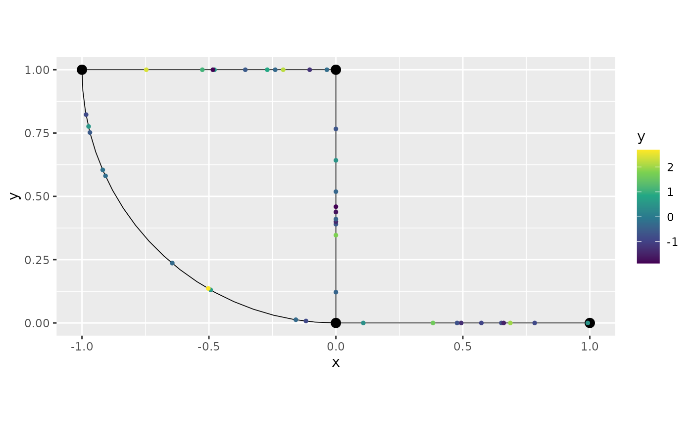

## Identifying data that is away from the metric graph

Whenever we use the `add_observations()` method, it returns the data
that was removed (if there was any). We can use this information to
visualize what is going on and decide what to do with this data. There
are two types of removed data, the ones that were removed due to being
projected to the same place, or the ones that were removed due to being
farther than the tolerance.

To make things simple, let us work with the previous dataset:

``` r

data_df <- as.data.frame(graph$get_data(group = "1:a"))
data_df <- data_df[,c("y", ".coord_x", ".coord_y")]
```

Let us now include observations that are not contained in the graph.

``` r

data_df_tmp <- data.frame(y = rnorm(20), .coord_x = 0.5, .coord_y = runif(20))
data_df <- rbind(data_df,data_df_tmp)
```

We start by looking at the graph, and the observations that we created
outside the metric graph:

``` r

library(ggplot2)
graph$plot() + geom_point(data_df_tmp, mapping = aes(x=.coord_x, y=.coord_y), color="red")
```

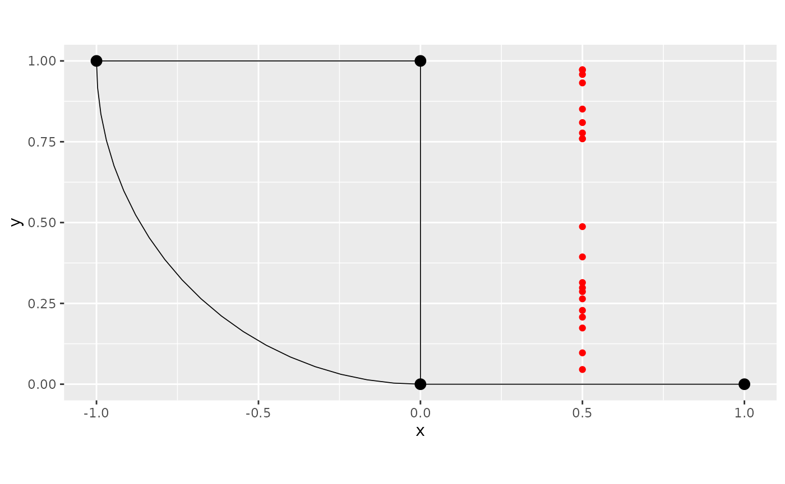

Let us now add these observations to the graph, but we will store the
returned object:

``` r

rem_obs <- graph$add_observations(data = data_df, clear_obs = TRUE,
                                  data_coords = "spatial",
                                  coord_x = ".coord_x",
                                  coord_y = ".coord_y")
```

    ## Adding observations...

    ## Converting data to PtE

    ## Warning in system.time({: There were points projected at the same location.
    ## Only the closest point was kept. To keep all the observations change
    ## 'duplicated_strategy' to 'jitter'.

Let us look at the element `rem_obs`:

``` r

rem_obs
```

    ## $removed
    ##             y .coord_x   .coord_y
    ## 1   0.4232452      0.5 0.29823745
    ## 2  -0.5192331      0.5 0.26404506
    ## 3  -1.2447383      0.5 0.09702358
    ## 4  -0.1604400      0.5 0.17389470
    ## 5   1.0215809      0.5 0.48740037
    ## 6  -0.2034348      0.5 0.28642464
    ## 7   0.4112782      0.5 0.22832722
    ## 8  -1.0145804      0.5 0.39375818
    ## 9  -1.6322899      0.5 0.31439710
    ## 10 -0.2341612      0.5 0.20753836

We can see that there were only data that were removed due to being
projected at the same location.

Let us now plot the data, and add the points that were removed in red:

``` r

graph$plot(data = "y") + geom_point(rem_obs$removed, mapping = aes(x=.coord_x, y=.coord_y), color="red")
```

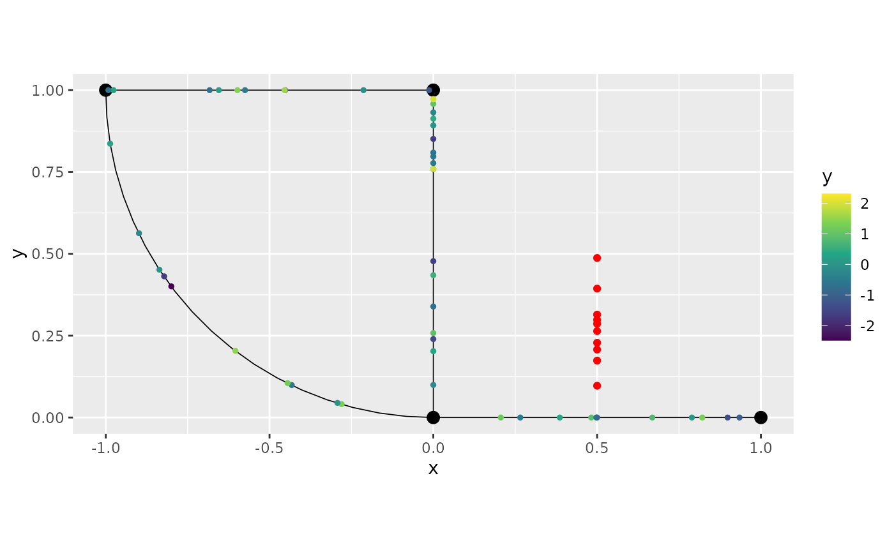

We can observe that we ended up adding more than one would want due to
the tolerance for adding observations in this case. Let us reduce the
tolerance, and repeat the procedure:

``` r

rem_obs <- graph$add_observations(data = data_df, clear_obs = TRUE,
                                  data_coords = "spatial",
                                  coord_x = ".coord_x",
                                  coord_y = ".coord_y",
                                  tolerance = 0.1)
```

    ## Adding observations...

    ## Converting data to PtE

    ## Warning in system.time({: There were points projected at the same location.
    ## Only the closest point was kept. To keep all the observations change
    ## 'duplicated_strategy' to 'jitter'.

    ## Warning in system.time({: There were points that were farther than the
    ## tolerance. These points were removed. If you want them projected into the
    ## graph, please increase the tolerance. The total number of points removed due do
    ## being far is 18

Let us now look at `rem_obs`:

``` r

rem_obs
```

    ## $removed
    ##           y .coord_x   .coord_y
    ## 1 -1.244738      0.5 0.09702358
    ## 
    ## $far_data
    ##             y .coord_x  .coord_y
    ## 1   0.4232452      0.5 0.2982374
    ## 2  -0.5192331      0.5 0.2640451
    ## 3   1.9191114      0.5 0.7595126
    ## 4  -0.1604400      0.5 0.1738947
    ## 5   1.0215809      0.5 0.4874004
    ## 6  -0.6328309      0.5 0.8092854
    ## 7  -0.2034348      0.5 0.2864246
    ## 8   0.4112782      0.5 0.2283272
    ## 9  -1.0145804      0.5 0.3937582
    ## 10  0.9982877      0.5 0.9581020
    ## 11 -1.6322899      0.5 0.3143971
    ## 12 -0.2341612      0.5 0.2075384
    ## 13 -1.6551095      0.5 0.8510350
    ## 14  2.3088834      0.5 0.9720656
    ## 15 -0.2635556      0.5 0.9320120
    ## 16  1.9971085      0.5 0.9729072
    ## 17 -0.2428420      0.5 0.7591693
    ## 18 -0.5547395      0.5 0.7771089

We can see that there were both data removed due to being projected to
the same place, as well as due to being too far away. Let us plot the
ones due to being projected to the same place in red, and the ones that
are far away in blue:

Let us now plot the data, and add the points that were removed in red:

``` r

graph$plot(data = "y") + geom_point(rem_obs$removed, mapping = aes(x=.coord_x, y=.coord_y), color="red") + 
    geom_point(rem_obs$far_data, mapping = aes(x=.coord_x, y=.coord_y), color="blue")
```

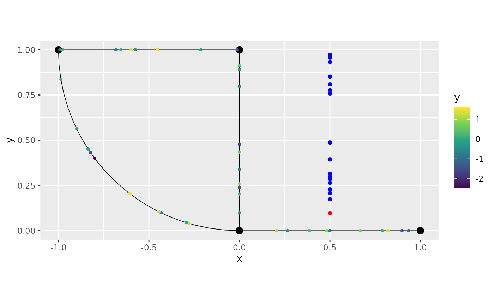

Therefore, the practitioner can use this information, to decide the best
strategy to handle such observations.

## Merging observations when adding them

Let us now consider the situation in which we have observations very
close, which can sometimes might lead to instabilities when fitting
models. By default nothing is done is this case. To handle such cases,
we have the `tolerance_merge` argument, for which observations on a
common edge within this tolerance will be merged, for which the default
value is `0`. We have three alternative strategies: `remove`, `merge`
and `average`. These can be set by using the `merge_strategy` argument.

It is also important to note that, by default, the removed observations
due to merge will be returned from the `add_observations()` call.

Let us illustrate with a simple example. First, with the merge strategy
set to `merge`. For this strategy, the observations will be merged by
filling the `NA` columns of the observations within the tolerance
region, by some non-NA value from an observation within the same
tolerance region.

Let us create a simple `data.frame` with some observations that are
close to each other:

``` r

df_graph <- data.frame(
    y = c(NA, 2, 3, 4, 1, 10),
    edge_number = c(1, 2, 3, 4, 1, 2),
    distance_on_edge = c(0.5, 0.5, 0.5, 0.5, 0.449, 0.45),
    z = c(10, NA, 30, 40, NA, 60),
    w = c("a", "b", "c", "d", "e", NA)
)

graph$add_observations(data = df_graph, normalized = TRUE, clear_obs = TRUE)
```

    ## Adding observations...

    ## Assuming the observations are normalized by the length of the edge.

let us look at the data

``` r

graph$get_data()
```

    ## # A tibble: 6 × 9
    ##       y     z w     .edge_number .distance_on_edge .group .loc_idx .coord_x
    ##   <dbl> <dbl> <chr>        <dbl>             <dbl> <chr>     <int>    <dbl>
    ## 1     1    NA e                1             0.449 1             1    0.449
    ## 2    NA    10 a                1             0.5   1             2    0.5  
    ## 3    10    60 NA               2             0.45  1             3    0    
    ## 4     2    NA b                2             0.5   1             4    0    
    ## 5     3    30 c                3             0.5   1             5   -0.5  
    ## 6     4    40 d                4             0.5   1             6   -0.707
    ## # ℹ 1 more variable: .coord_y <dbl>

We will merge these observations, with the removal strategy, by setting
`tolerance_merge` to `0.1`:

``` r

graph$add_observations(data = df_graph, normalized = TRUE, clear_obs = TRUE, 
                        merge_strategy = "merge", tolerance_merge = 0.1)
```

    ## Adding observations...

    ## Assuming the observations are normalized by the length of the edge.

    ## $removed_merge
    ##    y  z w .edge_number .distance_on_edge
    ## 1 NA 10 a            1               0.5
    ## 2  2 NA b            2               0.5

We can see from the output that the merged observations were returned.
Now, let us look at the data added to the graph with this merge
strategy:

``` r

graph$get_data()
```

    ## # A tibble: 4 × 9
    ##       y     z w     .edge_number .distance_on_edge .group .loc_idx .coord_x
    ##   <dbl> <dbl> <chr>        <dbl>             <dbl> <chr>     <int>    <dbl>
    ## 1     1    10 e                1             0.449 1             1    0.449
    ## 2    10    60 b                2             0.45  1             2    0    
    ## 3     3    30 c                3             0.5   1             3   -0.5  
    ## 4     4    40 d                4             0.5   1             4   -0.707
    ## # ℹ 1 more variable: .coord_y <dbl>

We can observe that the `NA` values were filled by the ones from the
observations within the same tolerance region.

Now, let us see the `remove` strategy. For this strategy, the
observations that are within the tolerance from each other will be
removed, keeping only one observation per “tolerance region”.

``` r

graph$add_observations(data = df_graph, normalized = TRUE, clear_obs = TRUE, 
                        merge_strategy = "remove", tolerance_merge = 0.1)
```

    ## Adding observations...

    ## Assuming the observations are normalized by the length of the edge.

    ## $removed_merge
    ##    y  z w .edge_number .distance_on_edge
    ## 1 NA 10 a            1               0.5
    ## 2  2 NA b            2               0.5

We can see the removed observations due to merge, now let us check the
added observations:

``` r

graph$get_data()
```

    ## # A tibble: 4 × 9
    ##       y     z w     .edge_number .distance_on_edge .group .loc_idx .coord_x
    ##   <dbl> <dbl> <chr>        <dbl>             <dbl> <chr>     <int>    <dbl>
    ## 1     1    NA e                1             0.449 1             1    0.449
    ## 2    10    60 NA               2             0.45  1             2    0    
    ## 3     3    30 c                3             0.5   1             3   -0.5  
    ## 4     4    40 d                4             0.5   1             4   -0.707
    ## # ℹ 1 more variable: .coord_y <dbl>

We can see that the observations that were within the tolerance region
were removed, and the added observations did not have their `NA` values
filled in. So, it was a simple removal of observations within the same
tolerance region.

Finally, let us look at the `average` merge strategy. For this strategy,
the non-NA values of numerical columns of observations that are within
the tolerance from each other will be averaged, keeping only one
observation per “tolerance region”. But for non-numerical columns, the
behavior is identical to the `merge` strategy, that is, if the column
has a non-NA value, it will be kept as is, but if it has an NA value, a
search for a non-NA value will be performed across the observations
within the tolerance region. Let us illustrate this:

``` r

graph$add_observations(data = df_graph, normalized = TRUE, clear_obs = TRUE, 
                        merge_strategy = "average", tolerance_merge = 0.1)
```

    ## Adding observations...

    ## Assuming the observations are normalized by the length of the edge.

    ## $removed_merge
    ##    y  z w .edge_number .distance_on_edge
    ## 1 NA 10 a            1               0.5
    ## 2  2 NA b            2               0.5

Observe that the removed observations due to merge were returned. Now,
let us look at the data inside the graph:

``` r

graph$get_data()
```

    ## # A tibble: 4 × 9
    ##       y     z w     .edge_number .distance_on_edge .group .loc_idx .coord_x
    ##   <dbl> <dbl> <chr>        <dbl>             <dbl> <chr>     <int>    <dbl>
    ## 1     1    10 e                1             0.449 1             1    0.449
    ## 2     6    60 b                2             0.45  1             2    0    
    ## 3     3    30 c                3             0.5   1             3   -0.5  
    ## 4     4    40 d                4             0.5   1             4   -0.707
    ## # ℹ 1 more variable: .coord_y <dbl>

We can observe that for columns `z` and `w`, the `NA` values were filled
by the ones from the observations within the same tolerance region.
However, for column `y`, the non-NA values were averaged.

## Manipulating data from metric graphs in the tidyverse style

In this section we will present some data manipulation tools that are
implemented in metric graphs and can be safely used.

The tools are based on
[`dplyr::select()`](https://dplyr.tidyverse.org/reference/select.html),
[`dplyr::mutate()`](https://dplyr.tidyverse.org/reference/mutate.html),
[`dplyr::filter()`](https://dplyr.tidyverse.org/reference/filter.html),
[`dplyr::summarise()`](https://dplyr.tidyverse.org/reference/summarise.html)
and
[`tidyr::drop_na()`](https://tidyr.tidyverse.org/reference/drop_na.html).

Let us generate a dataset that will be widely used throughout this
section and add this to the metric graph object. Observe that we are
replacing the existing data by setting `clear_obs` to `TRUE`:

``` r

df_tidy <- data.frame(y=y, y2 = exp(y), y3 = y^2, y4 = sin(y),
       edge_number = obs_loc[,1], distance_on_edge = obs_loc[,2])

# Ordering to simplify presentation with NA data
ord_idx <- order(df_tidy[["edge_number"]], 
                df_tidy[["distance_on_edge"]])
df_tidy <- df_tidy[ord_idx,]

# Setting some NA data
df_tidy[["y"]][1] <- df_tidy[["y2"]][1] <- NA
df_tidy[["y3"]][1] <- df_tidy[["y4"]][1] <- NA

df_tidy[["y2"]][2] <- NA
df_tidy[["y3"]][3] <- NA

graph$add_observations(data = df_tidy, clear_obs = TRUE, normalized = TRUE)
```

    ## Adding observations...

    ## Assuming the observations are normalized by the length of the edge.

Let us look at the complete data:

``` r

graph$get_data(drop_all_na = FALSE)
```

    ## # A tibble: 200 × 10
    ##         y     y2      y3     y4 .edge_number .distance_on_edge .group .loc_idx
    ##     <dbl>  <dbl>   <dbl>  <dbl>        <dbl>             <dbl> <chr>     <int>
    ##  1 NA     NA     NA      NA                1            0.0134 1             1
    ##  2  2.09  NA      4.36    0.870            1            0.0233 1             2
    ##  3  1.68   5.38  NA       0.994            1            0.0618 1             3
    ##  4 -0.528  0.590  0.279  -0.504            1            0.108  1             4
    ##  5 -0.180  0.836  0.0322 -0.179            1            0.126  1             5
    ##  6 -0.462  0.630  0.213  -0.445            1            0.177  1             6
    ##  7 -1.52   0.219  2.31   -0.999            1            0.186  1             7
    ##  8 -0.655  0.520  0.428  -0.609            1            0.202  1             8
    ##  9 -0.636  0.530  0.404  -0.594            1            0.206  1             9
    ## 10  1.34   3.83   1.80    0.974            1            0.212  1            10
    ## # ℹ 190 more rows
    ## # ℹ 2 more variables: .coord_x <dbl>, .coord_y <dbl>

### select

The verb `select` allows one to choose which columns to keep or to
remove.

For example, let us select the columns `y` and `y2` from the metric
graph dataset using the
[`select()`](https://davidbolin.github.io/MetricGraph/reference/select.metric_graph_data.md)
method:

``` r

graph$select(y,y2)
```

    ## # A tibble: 199 × 7
    ##         y     y2 .group .edge_number .distance_on_edge .coord_x .coord_y
    ##     <dbl>  <dbl> <chr>         <dbl>             <dbl>    <dbl>    <dbl>
    ##  1  2.09  NA     1                 1            0.0233   0.0233        0
    ##  2  1.68   5.38  1                 1            0.0618   0.0618        0
    ##  3 -0.528  0.590 1                 1            0.108    0.108         0
    ##  4 -0.180  0.836 1                 1            0.126    0.126         0
    ##  5 -0.462  0.630 1                 1            0.177    0.177         0
    ##  6 -1.52   0.219 1                 1            0.186    0.186         0
    ##  7 -0.655  0.520 1                 1            0.202    0.202         0
    ##  8 -0.636  0.530 1                 1            0.206    0.206         0
    ##  9  1.34   3.83  1                 1            0.212    0.212         0
    ## 10 -0.620  0.538 1                 1            0.266    0.266         0
    ## # ℹ 189 more rows

First, observe that this `select` verb is metric graph friendly since it
does not remove the columns related to spatial locations.

Also observe that the first original row, that contains only `NA` was
removed by default. To return all the rows, we can set the argument
`.drop_all_na` to `FALSE`:

``` r

graph$select(y, y2, .drop_all_na = FALSE)
```

    ## # A tibble: 200 × 7
    ##         y     y2 .group .edge_number .distance_on_edge .coord_x .coord_y
    ##     <dbl>  <dbl> <chr>         <dbl>             <dbl>    <dbl>    <dbl>
    ##  1 NA     NA     1                 1            0.0134   0.0134        0
    ##  2  2.09  NA     1                 1            0.0233   0.0233        0
    ##  3  1.68   5.38  1                 1            0.0618   0.0618        0
    ##  4 -0.528  0.590 1                 1            0.108    0.108         0
    ##  5 -0.180  0.836 1                 1            0.126    0.126         0
    ##  6 -0.462  0.630 1                 1            0.177    0.177         0
    ##  7 -1.52   0.219 1                 1            0.186    0.186         0
    ##  8 -0.655  0.520 1                 1            0.202    0.202         0
    ##  9 -0.636  0.530 1                 1            0.206    0.206         0
    ## 10  1.34   3.83  1                 1            0.212    0.212         0
    ## # ℹ 190 more rows

Further, observe that the second row also contain an `NA` value in `y2`.
To remove all the rows that contain `NA` for at least one variable, we
can set the argument `.drop_na` to `TRUE`:

``` r

graph$select(y, y2, .drop_na = TRUE)
```

    ## # A tibble: 198 × 7
    ##         y    y2 .group .edge_number .distance_on_edge .coord_x .coord_y
    ##     <dbl> <dbl> <chr>         <dbl>             <dbl>    <dbl>    <dbl>
    ##  1  1.68  5.38  1                 1            0.0618   0.0618        0
    ##  2 -0.528 0.590 1                 1            0.108    0.108         0
    ##  3 -0.180 0.836 1                 1            0.126    0.126         0
    ##  4 -0.462 0.630 1                 1            0.177    0.177         0
    ##  5 -1.52  0.219 1                 1            0.186    0.186         0
    ##  6 -0.655 0.520 1                 1            0.202    0.202         0
    ##  7 -0.636 0.530 1                 1            0.206    0.206         0
    ##  8  1.34  3.83  1                 1            0.212    0.212         0
    ##  9 -0.620 0.538 1                 1            0.266    0.266         0
    ## 10 -0.100 0.905 1                 1            0.267    0.267         0
    ## # ℹ 188 more rows

Moreover, if we want to remove a column, we can simply use the
[`select()`](https://davidbolin.github.io/MetricGraph/reference/select.metric_graph_data.md)
method together with adding a minus sign `-` in front of the column we
want to be removed. For example, to remove `y2`, we can do:

``` r

graph$select(-y2)
```

    ## # A tibble: 200 × 9
    ##         y      y3     y4 .edge_number .distance_on_edge .group .loc_idx .coord_x
    ##     <dbl>   <dbl>  <dbl>        <dbl>             <dbl> <chr>     <int>    <dbl>
    ##  1 NA     NA      NA                1            0.0134 1             1   0.0134
    ##  2  2.09   4.36    0.870            1            0.0233 1             2   0.0233
    ##  3  1.68  NA       0.994            1            0.0618 1             3   0.0618
    ##  4 -0.528  0.279  -0.504            1            0.108  1             4   0.108 
    ##  5 -0.180  0.0322 -0.179            1            0.126  1             5   0.126 
    ##  6 -0.462  0.213  -0.445            1            0.177  1             6   0.177 
    ##  7 -1.52   2.31   -0.999            1            0.186  1             7   0.186 
    ##  8 -0.655  0.428  -0.609            1            0.202  1             8   0.202 
    ##  9 -0.636  0.404  -0.594            1            0.206  1             9   0.206 
    ## 10  1.34   1.80    0.974            1            0.212  1            10   0.212 
    ## # ℹ 190 more rows
    ## # ℹ 1 more variable: .coord_y <dbl>

Alternatively, we can combine the
[`select()`](https://davidbolin.github.io/MetricGraph/reference/select.metric_graph_data.md)
function with the output of `get_data()` to obtain the same results:

``` r

graph$get_data() %>% select(y,y2)
```

    ## # A tibble: 200 × 7
    ##         y     y2 .group .edge_number .distance_on_edge .coord_x .coord_y
    ##     <dbl>  <dbl> <chr>         <dbl>             <dbl>    <dbl>    <dbl>
    ##  1 NA     NA     1                 1            0.0134   0.0134        0
    ##  2  2.09  NA     1                 1            0.0233   0.0233        0
    ##  3  1.68   5.38  1                 1            0.0618   0.0618        0
    ##  4 -0.528  0.590 1                 1            0.108    0.108         0
    ##  5 -0.180  0.836 1                 1            0.126    0.126         0
    ##  6 -0.462  0.630 1                 1            0.177    0.177         0
    ##  7 -1.52   0.219 1                 1            0.186    0.186         0
    ##  8 -0.655  0.520 1                 1            0.202    0.202         0
    ##  9 -0.636  0.530 1                 1            0.206    0.206         0
    ## 10  1.34   3.83  1                 1            0.212    0.212         0
    ## # ℹ 190 more rows

Observe that the spatial locations columns were not removed as well. To
avoid removing `NA` variables, we need to set the argument `drop_all_na`
to `FALSE` when using the `get_data()` method:

``` r

graph$get_data(drop_all_na = FALSE) %>% select(y,y2)
```

    ## # A tibble: 200 × 7
    ##         y     y2 .group .edge_number .distance_on_edge .coord_x .coord_y
    ##     <dbl>  <dbl> <chr>         <dbl>             <dbl>    <dbl>    <dbl>
    ##  1 NA     NA     1                 1            0.0134   0.0134        0
    ##  2  2.09  NA     1                 1            0.0233   0.0233        0
    ##  3  1.68   5.38  1                 1            0.0618   0.0618        0
    ##  4 -0.528  0.590 1                 1            0.108    0.108         0
    ##  5 -0.180  0.836 1                 1            0.126    0.126         0
    ##  6 -0.462  0.630 1                 1            0.177    0.177         0
    ##  7 -1.52   0.219 1                 1            0.186    0.186         0
    ##  8 -0.655  0.520 1                 1            0.202    0.202         0
    ##  9 -0.636  0.530 1                 1            0.206    0.206         0
    ## 10  1.34   3.83  1                 1            0.212    0.212         0
    ## # ℹ 190 more rows

We can proceed similarly to remove `y2`:

``` r

graph$get_data() %>% select(-y2)
```

    ## # A tibble: 200 × 9
    ##         y      y3     y4 .edge_number .distance_on_edge .group .loc_idx .coord_x
    ##     <dbl>   <dbl>  <dbl>        <dbl>             <dbl> <chr>     <int>    <dbl>
    ##  1 NA     NA      NA                1            0.0134 1             1   0.0134
    ##  2  2.09   4.36    0.870            1            0.0233 1             2   0.0233
    ##  3  1.68  NA       0.994            1            0.0618 1             3   0.0618
    ##  4 -0.528  0.279  -0.504            1            0.108  1             4   0.108 
    ##  5 -0.180  0.0322 -0.179            1            0.126  1             5   0.126 
    ##  6 -0.462  0.213  -0.445            1            0.177  1             6   0.177 
    ##  7 -1.52   2.31   -0.999            1            0.186  1             7   0.186 
    ##  8 -0.655  0.428  -0.609            1            0.202  1             8   0.202 
    ##  9 -0.636  0.404  -0.594            1            0.206  1             9   0.206 
    ## 10  1.34   1.80    0.974            1            0.212  1            10   0.212 
    ## # ℹ 190 more rows
    ## # ℹ 1 more variable: .coord_y <dbl>

Finally, observe that this is a modification of
[`dplyr::select()`](https://dplyr.tidyverse.org/reference/select.html)
made to be user-friendly to metric graphs, since it keeps the spatial
locations. For example, if we use the standard version of
[`dplyr::select()`](https://dplyr.tidyverse.org/reference/select.html)
the result is different:

``` r

graph$get_data() %>% dplyr:::select.data.frame(y,y2)
```

    ## # A tibble: 200 × 2
    ##         y     y2
    ##     <dbl>  <dbl>
    ##  1 NA     NA    
    ##  2  2.09  NA    
    ##  3  1.68   5.38 
    ##  4 -0.528  0.590
    ##  5 -0.180  0.836
    ##  6 -0.462  0.630
    ##  7 -1.52   0.219
    ##  8 -0.655  0.520
    ##  9 -0.636  0.530
    ## 10  1.34   3.83 
    ## # ℹ 190 more rows

### filter

The `filter` verb selects rows based on conditions on the variables. For
example, let us select the variables that are on `edge_number` 3, with
`distance_on_edge` greater than 0.5:

``` r

filtered_data <- graph$filter(`.edge_number` == 3, `.distance_on_edge` > 0.5)
```

We can plot the result using the
[`plot()`](https://rdrr.io/r/graphics/plot.default.html) method together
with the `newdata` argument to supply the modified dataset:

``` r

graph$plot(data = "y", newdata = filtered_data)
```

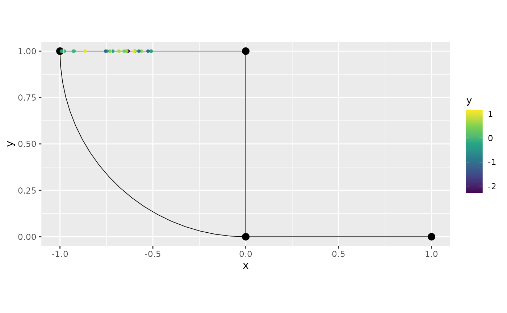

The behavior with `NA` variables is exactly the same as with the
[`select()`](https://davidbolin.github.io/MetricGraph/reference/select.metric_graph_data.md)
method. For example, we can remove the rows that contain `NA` variables
by setting `drop_na` to `TRUE`:

``` r

graph$filter(y > 1, .drop_na = TRUE)
```

    ## # A tibble: 30 × 10
    ##        y    y2    y3    y4 .edge_number .distance_on_edge .group .loc_idx
    ##    <dbl> <dbl> <dbl> <dbl>        <dbl>             <dbl> <chr>     <int>
    ##  1  1.34  3.83  1.80 0.974            1             0.212 1            10
    ##  2  1.18  3.24  1.38 0.923            1             0.647 1            29
    ##  3  1.43  4.19  2.05 0.990            1             0.687 1            33
    ##  4  1.77  5.85  3.12 0.981            1             0.898 1            46
    ##  5  2.21  9.08  4.87 0.805            2             0.258 1            61
    ##  6  1.00  2.72  1.00 0.841            2             0.316 1            63
    ##  7  2.31 10.1   5.33 0.740            2             0.339 1            67
    ##  8  2.08  7.97  4.31 0.875            2             0.390 1            69
    ##  9  1.87  6.48  3.49 0.956            2             0.407 1            71
    ## 10  1.44  4.23  2.08 0.992            2             0.455 1            75
    ## # ℹ 20 more rows
    ## # ℹ 2 more variables: .coord_x <dbl>, .coord_y <dbl>

To conclude, we can also use the
[`filter()`](https://davidbolin.github.io/MetricGraph/reference/filter.metric_graph_data.md)
function on top of the result of the `get_data()` method:

``` r

filtered_data2 <- graph$get_data() %>% filter(y > 1)
```

Let us plot:

``` r

graph$plot(data = "y", newdata = filtered_data2)
```

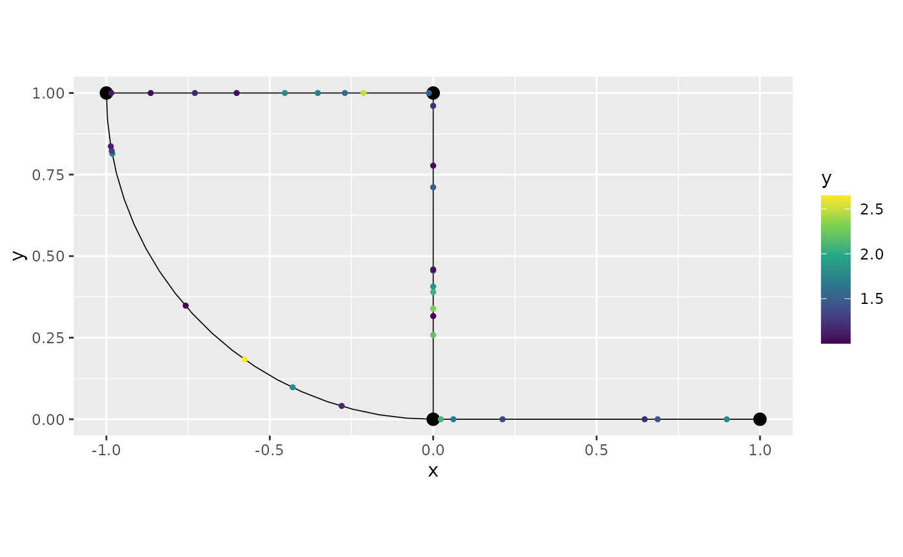

### mutate

The `mutate` verb creates new columns, or modify existing columns, as
functions of the existing columns. Let us create a new column, `new_y`,
obtained as the sum of `y` and `y2`:

``` r

graph$mutate(new_y = y+y2)
```

    ## # A tibble: 200 × 11
    ##         y     y2      y3     y4 .edge_number .distance_on_edge .group .loc_idx
    ##     <dbl>  <dbl>   <dbl>  <dbl>        <dbl>             <dbl> <chr>     <int>
    ##  1 NA     NA     NA      NA                1            0.0134 1             1
    ##  2  2.09  NA      4.36    0.870            1            0.0233 1             2
    ##  3  1.68   5.38  NA       0.994            1            0.0618 1             3
    ##  4 -0.528  0.590  0.279  -0.504            1            0.108  1             4
    ##  5 -0.180  0.836  0.0322 -0.179            1            0.126  1             5
    ##  6 -0.462  0.630  0.213  -0.445            1            0.177  1             6
    ##  7 -1.52   0.219  2.31   -0.999            1            0.186  1             7
    ##  8 -0.655  0.520  0.428  -0.609            1            0.202  1             8
    ##  9 -0.636  0.530  0.404  -0.594            1            0.206  1             9
    ## 10  1.34   3.83   1.80    0.974            1            0.212  1            10
    ## # ℹ 190 more rows
    ## # ℹ 3 more variables: .coord_x <dbl>, .coord_y <dbl>, new_y <dbl>

The behavior with `NA` data is the same as for the
[`filter()`](https://davidbolin.github.io/MetricGraph/reference/filter.metric_graph_data.md)
and
[`select()`](https://davidbolin.github.io/MetricGraph/reference/select.metric_graph_data.md)
methods. For example, if we want to keep all the data, we can set
`.drop_all_na` to \`FALSE:

``` r

graph$mutate(new_y = y+y2, .drop_all_na=FALSE)
```

    ## # A tibble: 200 × 11
    ##         y     y2      y3     y4 .edge_number .distance_on_edge .group .loc_idx
    ##     <dbl>  <dbl>   <dbl>  <dbl>        <dbl>             <dbl> <chr>     <int>
    ##  1 NA     NA     NA      NA                1            0.0134 1             1
    ##  2  2.09  NA      4.36    0.870            1            0.0233 1             2
    ##  3  1.68   5.38  NA       0.994            1            0.0618 1             3
    ##  4 -0.528  0.590  0.279  -0.504            1            0.108  1             4
    ##  5 -0.180  0.836  0.0322 -0.179            1            0.126  1             5
    ##  6 -0.462  0.630  0.213  -0.445            1            0.177  1             6
    ##  7 -1.52   0.219  2.31   -0.999            1            0.186  1             7
    ##  8 -0.655  0.520  0.428  -0.609            1            0.202  1             8
    ##  9 -0.636  0.530  0.404  -0.594            1            0.206  1             9
    ## 10  1.34   3.83   1.80    0.974            1            0.212  1            10
    ## # ℹ 190 more rows
    ## # ℹ 3 more variables: .coord_x <dbl>, .coord_y <dbl>, new_y <dbl>

Let us modify the variable `y3` and at the same time remove all the
`NA`:

``` r

graph$mutate(y3 = ifelse(y>1,1,-1), .drop_na = TRUE)
```

    ## # A tibble: 197 × 10
    ##         y    y2    y3     y4 .edge_number .distance_on_edge .group .loc_idx
    ##     <dbl> <dbl> <dbl>  <dbl>        <dbl>             <dbl> <chr>     <int>
    ##  1 -0.528 0.590    -1 -0.504            1             0.108 1             4
    ##  2 -0.180 0.836    -1 -0.179            1             0.126 1             5
    ##  3 -0.462 0.630    -1 -0.445            1             0.177 1             6
    ##  4 -1.52  0.219    -1 -0.999            1             0.186 1             7
    ##  5 -0.655 0.520    -1 -0.609            1             0.202 1             8
    ##  6 -0.636 0.530    -1 -0.594            1             0.206 1             9
    ##  7  1.34  3.83      1  0.974            1             0.212 1            10
    ##  8 -0.620 0.538    -1 -0.581            1             0.266 1            11
    ##  9 -0.100 0.905    -1 -0.100            1             0.267 1            12
    ## 10 -0.324 0.723    -1 -0.319            1             0.340 1            13
    ## # ℹ 187 more rows
    ## # ℹ 2 more variables: .coord_x <dbl>, .coord_y <dbl>

Finally, we can also apply the
[`mutate()`](https://davidbolin.github.io/MetricGraph/reference/mutate.metric_graph_data.md)
function the result of the `get_data()` method, and also pipe it to the
[`plot()`](https://rdrr.io/r/graphics/plot.default.html) method (we are
also changing the scale to discrete):

``` r

library(ggplot2)

graph$get_data() %>% mutate(new_y = y+y2, 
                        y3=as.factor(ifelse(y>1,1,-1))) %>% 
                        graph$plot(data = "y3") + 
                        scale_colour_discrete()
```

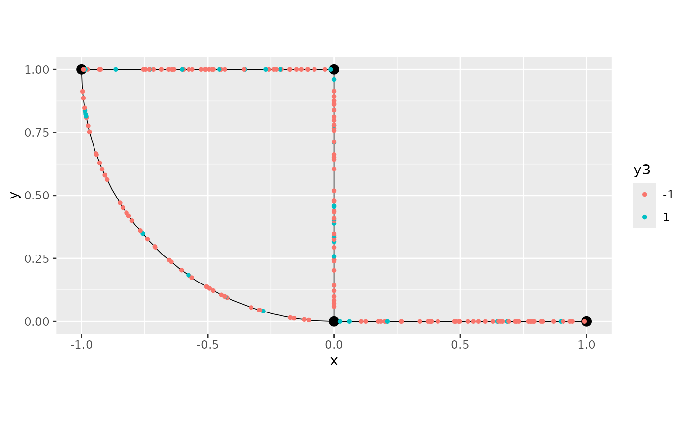

### summarise

The `summarise` verb creates summaries of selected columns based on
groupings. For metric graphs, the groups always include the edge number
(`.edge_number`) and relative distance on edge (`.distance_on_edge`). By
using the argument `.include_graph_groups`, the internal metric graph
group variable, namely `.group`, will also be added to the
[`summarise()`](https://davidbolin.github.io/MetricGraph/reference/summarise.metric_graph_data.md)
group. Finally, additional groups can be passed by the `.groups`
argument.

To illustrate, we will use the `data.frame` from the group example:

``` r

graph$add_observations(data = df_data_repl, 
                normalized = TRUE, 
                clear_obs = TRUE, 
                group = "repl")
```

    ## Adding observations...

    ## Assuming the observations are normalized by the length of the edge.

We can see the data:

``` r

graph$get_data()
```

    ## # A tibble: 1,000 × 8
    ##         y  repl .edge_number .distance_on_edge .group .loc_idx .coord_x .coord_y
    ##     <dbl> <int>        <dbl>             <dbl> <chr>     <int>    <dbl>    <dbl>
    ##  1  1.50      1            1            0.0134 1             1   0.0134        0
    ##  2 -1.79      1            1            0.0233 1             2   0.0233        0
    ##  3  0.488     1            1            0.0618 1             3   0.0618        0
    ##  4 -0.385     1            1            0.108  1             4   0.108         0
    ##  5  0.905     1            1            0.126  1             5   0.126         0
    ##  6 -0.145     1            1            0.177  1             6   0.177         0
    ##  7  2.00      1            1            0.186  1             7   0.186         0
    ##  8 -1.16      1            1            0.202  1             8   0.202         0
    ##  9  0.879     1            1            0.206  1             9   0.206         0
    ## 10 -0.816     1            1            0.212  1            10   0.212         0
    ## # ℹ 990 more rows

Let us `summarise` the data by obtaining the mean of `y` at each
location across all groups:

``` r

graph$summarise(mean_y = mean(y))
```

    ## # A tibble: 200 × 6
    ##    .edge_number .distance_on_edge .coord_x .coord_y  mean_y .group
    ##           <dbl>             <dbl>    <dbl>    <dbl>   <dbl>  <dbl>
    ##  1            1            0.0134   0.0134        0  0.578       1
    ##  2            1            0.0233   0.0233        0  0.407       1
    ##  3            1            0.0618   0.0618        0  0.638       1
    ##  4            1            0.108    0.108         0 -0.327       1
    ##  5            1            0.126    0.126         0 -0.942       1
    ##  6            1            0.177    0.177         0 -0.156       1
    ##  7            1            0.186    0.186         0  0.0925      1
    ##  8            1            0.202    0.202         0 -0.0548      1
    ##  9            1            0.206    0.206         0  0.345       1
    ## 10            1            0.212    0.212         0 -0.546       1
    ## # ℹ 190 more rows

Let us now obtain the standard deviation of `y` at each location and
plot it:

``` r

graph$summarise(sd_y = sd(y)) %>% graph$plot(data = "sd_y")
```


### drop_na

The `drop_na` verb removes rows that contain `NA` for the selected
columns. To illustrate, let us add the `df_tidy` back to the metric
graph, replacing the existing dataset:

``` r

graph$add_observations(data = df_tidy, clear_obs=TRUE, normalized=TRUE)
```

    ## Adding observations...

    ## Assuming the observations are normalized by the length of the edge.

Now, let us take a look at this dataset:

``` r

graph$get_data(drop_all_na = FALSE)
```

    ## # A tibble: 200 × 10
    ##         y     y2      y3     y4 .edge_number .distance_on_edge .group .loc_idx
    ##     <dbl>  <dbl>   <dbl>  <dbl>        <dbl>             <dbl> <chr>     <int>
    ##  1 NA     NA     NA      NA                1            0.0134 1             1
    ##  2  2.09  NA      4.36    0.870            1            0.0233 1             2
    ##  3  1.68   5.38  NA       0.994            1            0.0618 1             3
    ##  4 -0.528  0.590  0.279  -0.504            1            0.108  1             4
    ##  5 -0.180  0.836  0.0322 -0.179            1            0.126  1             5
    ##  6 -0.462  0.630  0.213  -0.445            1            0.177  1             6
    ##  7 -1.52   0.219  2.31   -0.999            1            0.186  1             7
    ##  8 -0.655  0.520  0.428  -0.609            1            0.202  1             8
    ##  9 -0.636  0.530  0.404  -0.594            1            0.206  1             9
    ## 10  1.34   3.83   1.80    0.974            1            0.212  1            10
    ## # ℹ 190 more rows
    ## # ℹ 2 more variables: .coord_x <dbl>, .coord_y <dbl>

For example, let us remove the rows such that `y3` is `NA`, we simply
apply the
[`drop_na()`](https://davidbolin.github.io/MetricGraph/reference/drop_na.metric_graph_data.md)
method passing the column `y3`:

``` r

graph$drop_na(y3)
```

    ## # A tibble: 198 × 10
    ##         y     y2     y3     y4 .edge_number .distance_on_edge .group .loc_idx
    ##     <dbl>  <dbl>  <dbl>  <dbl>        <dbl>             <dbl> <chr>     <int>
    ##  1  2.09  NA     4.36    0.870            1            0.0233 1             2
    ##  2 -0.528  0.590 0.279  -0.504            1            0.108  1             4
    ##  3 -0.180  0.836 0.0322 -0.179            1            0.126  1             5
    ##  4 -0.462  0.630 0.213  -0.445            1            0.177  1             6
    ##  5 -1.52   0.219 2.31   -0.999            1            0.186  1             7
    ##  6 -0.655  0.520 0.428  -0.609            1            0.202  1             8
    ##  7 -0.636  0.530 0.404  -0.594            1            0.206  1             9
    ##  8  1.34   3.83  1.80    0.974            1            0.212  1            10
    ##  9 -0.620  0.538 0.385  -0.581            1            0.266  1            11
    ## 10 -0.100  0.905 0.0100 -0.100            1            0.267  1            12
    ## # ℹ 188 more rows
    ## # ℹ 2 more variables: .coord_x <dbl>, .coord_y <dbl>

We can also remove the rows such that either `y2` or `y3` is `NA`:

``` r

graph$drop_na(y2, y3)
```

    ## # A tibble: 197 × 10
    ##         y    y2     y3     y4 .edge_number .distance_on_edge .group .loc_idx
    ##     <dbl> <dbl>  <dbl>  <dbl>        <dbl>             <dbl> <chr>     <int>
    ##  1 -0.528 0.590 0.279  -0.504            1             0.108 1             4
    ##  2 -0.180 0.836 0.0322 -0.179            1             0.126 1             5
    ##  3 -0.462 0.630 0.213  -0.445            1             0.177 1             6
    ##  4 -1.52  0.219 2.31   -0.999            1             0.186 1             7
    ##  5 -0.655 0.520 0.428  -0.609            1             0.202 1             8
    ##  6 -0.636 0.530 0.404  -0.594            1             0.206 1             9
    ##  7  1.34  3.83  1.80    0.974            1             0.212 1            10
    ##  8 -0.620 0.538 0.385  -0.581            1             0.266 1            11
    ##  9 -0.100 0.905 0.0100 -0.100            1             0.267 1            12
    ## 10 -0.324 0.723 0.105  -0.319            1             0.340 1            13
    ## # ℹ 187 more rows
    ## # ℹ 2 more variables: .coord_x <dbl>, .coord_y <dbl>

If we simply run the
[`drop_na()`](https://davidbolin.github.io/MetricGraph/reference/drop_na.metric_graph_data.md)
method, this is equivalent to run the `get_data()` method with the
argument `drop_na` set to `TRUE`:

``` r

identical(graph$drop_na(), graph$get_data(drop_na=TRUE))
```

    ## [1] FALSE

Finally, we can also directly apply the
[`drop_na()`](https://davidbolin.github.io/MetricGraph/reference/drop_na.metric_graph_data.md)
function to the result of the `get_data()` method:

``` r

graph$get_data(drop_all_na = FALSE) %>% drop_na(y3)
```

    ## # A tibble: 198 × 10
    ##         y     y2     y3     y4 .edge_number .distance_on_edge .group .loc_idx
    ##     <dbl>  <dbl>  <dbl>  <dbl>        <dbl>             <dbl> <chr>     <int>
    ##  1  2.09  NA     4.36    0.870            1            0.0233 1             2
    ##  2 -0.528  0.590 0.279  -0.504            1            0.108  1             4
    ##  3 -0.180  0.836 0.0322 -0.179            1            0.126  1             5
    ##  4 -0.462  0.630 0.213  -0.445            1            0.177  1             6
    ##  5 -1.52   0.219 2.31   -0.999            1            0.186  1             7
    ##  6 -0.655  0.520 0.428  -0.609            1            0.202  1             8
    ##  7 -0.636  0.530 0.404  -0.594            1            0.206  1             9
    ##  8  1.34   3.83  1.80    0.974            1            0.212  1            10
    ##  9 -0.620  0.538 0.385  -0.581            1            0.266  1            11
    ## 10 -0.100  0.905 0.0100 -0.100            1            0.267  1            12
    ## # ℹ 188 more rows
    ## # ℹ 2 more variables: .coord_x <dbl>, .coord_y <dbl>

### Combining multiple verbs

The resulting data from applying the previous verbs are safe in the
sense that they are friendly to the metric graph environment. Thus, the
result after applying one verb can be used as input of any of the
remaining verbs.

For this example we will consider the `df_data_repl` dataset. Let us add
to the graph (replacing the existing data):

``` r

graph$add_observations(data = df_data_repl, 
                        normalized = TRUE, 
                        clear_obs = TRUE, 
                        group = "repl")
```

    ## Adding observations...

    ## Assuming the observations are normalized by the length of the edge.

``` r

graph$get_data(drop_all_na = FALSE)
```

    ## # A tibble: 1,000 × 8
    ##         y  repl .edge_number .distance_on_edge .group .loc_idx .coord_x .coord_y
    ##     <dbl> <int>        <dbl>             <dbl> <chr>     <int>    <dbl>    <dbl>
    ##  1  1.50      1            1            0.0134 1             1   0.0134        0
    ##  2 -1.79      1            1            0.0233 1             2   0.0233        0
    ##  3  0.488     1            1            0.0618 1             3   0.0618        0
    ##  4 -0.385     1            1            0.108  1             4   0.108         0
    ##  5  0.905     1            1            0.126  1             5   0.126         0
    ##  6 -0.145     1            1            0.177  1             6   0.177         0
    ##  7  2.00      1            1            0.186  1             7   0.186         0
    ##  8 -1.16      1            1            0.202  1             8   0.202         0
    ##  9  0.879     1            1            0.206  1             9   0.206         0
    ## 10 -0.816     1            1            0.212  1            10   0.212         0
    ## # ℹ 990 more rows

We will now create a new variable `new_y` which is the exponential of
`y`, then filter the data to be on edges `1` and `2`, summarise to get
the means of `new_y` at all positions (across the different groups, from
the `_.group` variable) and plot it:

``` r

graph$mutate(new_y = exp(y)) %>% filter(`.edge_number` %in% c(1,2)) %>% 
            summarise(mean_new_y = mean(new_y)) %>% 
            graph$plot(data = "mean_new_y")
```

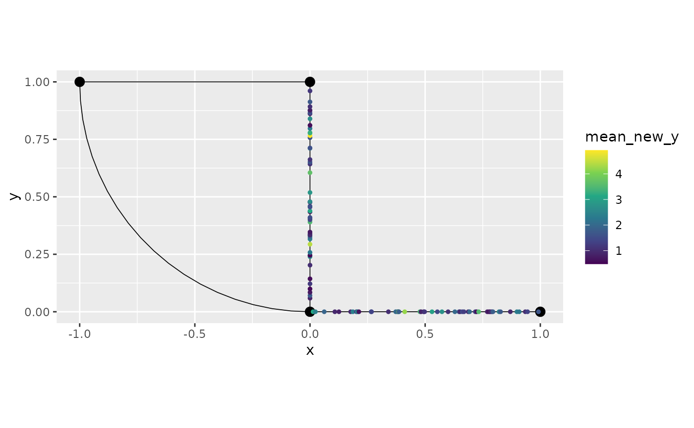

## Replacing the data in the metric graph by manipulated data

Let us suppose we want to replace the internal data by the data obtained
from these manipulations. This is very simple, all we need to do is to
pass the resulting data to the `data` argument from the
`add_observations()` method. It is important to note that if the input
is the result of those verbs, `mutate`, `select`, `filter`, `summarise`
or `drop_na`, or any combination of them, then there is no need to set
any of the other arguments of the `add_observations()` method, one
should simply supply the `data` argument with such dataset. For example,
let us consider the dataset from the previous section. We will replace
the data, so we will set `clear_obs` to `TRUE`:

``` r

graph$add_observations(data = graph$mutate(new_y = exp(y)) %>% 
                        filter(`.edge_number` %in% c(1,2)) %>% 
                                summarise(mean_new_y = mean(new_y)),
                                clear_obs = TRUE)
```

    ## Adding observations...

    ## Assuming the observations are NOT normalized by the length of the edge.

We can now observe the result:

``` r

graph$get_data()
```

    ## # A tibble: 100 × 7
    ##    .coord_x .coord_y mean_new_y .edge_number .distance_on_edge .group .loc_idx
    ##       <dbl>    <dbl>      <dbl>        <dbl>             <dbl> <chr>     <int>
    ##  1   0.0134        0      3.15             1            0.0134 1             1
    ##  2   0.0233        0      2.43             1            0.0233 1             2
    ##  3   0.0618        0      1.92             1            0.0618 1             3
    ##  4   0.108         0      0.931            1            0.108  1             4
    ##  5   0.126         0      0.814            1            0.126  1             5
    ##  6   0.177         0      0.968            1            0.177  1             6
    ##  7   0.186         0      2.40             1            0.186  1             7
    ##  8   0.202         0      1.24             1            0.202  1             8
    ##  9   0.206         0      2.60             1            0.206  1             9
    ## 10   0.212         0      0.643            1            0.212  1            10
    ## # ℹ 90 more rows

We can also save it to a separate variable and use as input:

``` r

df_temp <- graph$mutate(even_newer_y = mean_new_y^2)
graph$add_observations(data = df_temp, clear_obs = TRUE)
```

    ## Adding observations...

    ## Assuming the observations are NOT normalized by the length of the edge.

We can check that it was properly added:

``` r

graph$get_data()
```

    ## # A tibble: 100 × 8
    ##    .coord_x .coord_y mean_new_y even_newer_y .edge_number .distance_on_edge
    ##       <dbl>    <dbl>      <dbl>        <dbl>        <dbl>             <dbl>
    ##  1   0.0134        0      3.15         9.90             1            0.0134
    ##  2   0.0233        0      2.43         5.89             1            0.0233
    ##  3   0.0618        0      1.92         3.69             1            0.0618
    ##  4   0.108         0      0.931        0.867            1            0.108 
    ##  5   0.126         0      0.814        0.663            1            0.126 
    ##  6   0.177         0      0.968        0.937            1            0.177 
    ##  7   0.186         0      2.40         5.76             1            0.186 
    ##  8   0.202         0      1.24         1.53             1            0.202 
    ##  9   0.206         0      2.60         6.73             1            0.206 
    ## 10   0.212         0      0.643        0.413            1            0.212 
    ## # ℹ 90 more rows
    ## # ℹ 2 more variables: .group <chr>, .loc_idx <int>

## Edge Weights Manipulation in Metric Graphs

We will demonstrate edge weights manipulation using various
tidyverse-style verbs, including `select`, `mutate`, `filter`,
`summarise`, and `drop_na`. We will also introduce some `NA` values for
illustration.

### Adding Edge Weights to the Metric Graph

We begin by creating a dataset of edge weights and adding it to the
metric graph:

``` r

set.seed(123)

# Generate edge weight data
edge_weights_df <- data.frame(
  weight = runif(graph$nE),
  weight2 = rnorm(graph$nE),
  weight3 = runif(graph$nE) * 100
)

# Introduce some NA values
edge_weights_df$weight[1] <- NA
edge_weights_df$weight2[2] <- NA
edge_weights_df$weight3[3] <- NA

# Set edge weights in the metric graph
graph$set_edge_weights(weights = edge_weights_df)

# Display the edge weights
graph$get_edge_weights()
```

    ## # A tibble: 4 × 4
    ##   weight weight2 weight3 .weights
    ##    <dbl>   <dbl>   <dbl>    <dbl>
    ## 1 NA       1.56     67.8        1
    ## 2  0.788  NA        57.3        1
    ## 3  0.409   0.129    NA          1
    ## 4  0.883   1.72     90.0        1

### Selecting Specific Edge Weight Columns

The `select_weights()` method allows us to choose specific columns from
the edge weight dataset. Let’s select `weight` and `weight2`, while
preserving all rows, even if they contain `NA`:

``` r

graph$select_weights(weight, weight2, .drop_all_na = FALSE)
```

    ## # A tibble: 4 × 2
    ##   weight weight2
    ##    <dbl>   <dbl>
    ## 1 NA       1.56 
    ## 2  0.788  NA    
    ## 3  0.409   0.129
    ## 4  0.883   1.72

### Filtering Edge Weights

We can filter rows based on conditions. For example, let’s filter rows
where `weight > 0.5` and remove rows containing `NA` values:

``` r

graph$filter_weights(weight > 0.5, .drop_na = TRUE)
```

    ## # A tibble: 1 × 4
    ##   weight weight2 weight3 .weights
    ##    <dbl>   <dbl>   <dbl>    <dbl>
    ## 1  0.883    1.72    90.0        1

We can also filter edge weights using standard tidyverse functions:

``` r

filtered_weights <- graph$get_edge_weights() %>% filter(weight > 0.5)
```

### Creating New Columns Using `mutate_weights()`

We will now create a new column `weight_log`, which is the logarithm of
`weight + 1`:

``` r

graph$mutate_weights(weight_log = log(weight + 1))
```

    ## # A tibble: 4 × 5
    ##   weight weight2 weight3 .weights weight_log
    ##    <dbl>   <dbl>   <dbl>    <dbl>      <dbl>
    ## 1 NA       1.56     67.8        1     NA    
    ## 2  0.788  NA        57.3        1      0.581
    ## 3  0.409   0.129    NA          1      0.343
    ## 4  0.883   1.72     90.0        1      0.633

We can plot the result after applying the mutation. To this end, we
first set the new edges as the result from `mutate_weights`, then we
plot:

``` r

graph$set_edge_weights(weights = graph$mutate_weights(weight_log = log(weight + 1)))
graph$plot(edge_weight = "weight_log")
```

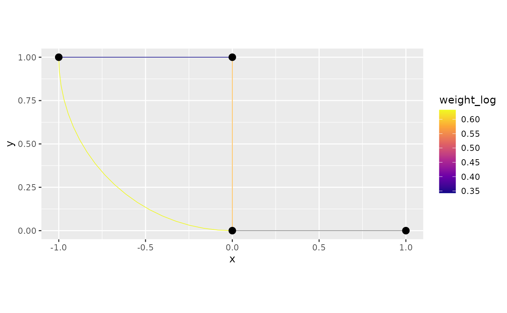

### Summarising Edge Weights

We can summarise edge weights by calculating the mean of `weight` and
`weight2` for all edges:

``` r

graph$summarise_weights(mean_weight = mean(weight, na.rm = TRUE), 
                        mean_weight2 = mean(weight2, na.rm = TRUE))
```

    ## # A tibble: 1 × 2
    ##   mean_weight mean_weight2
    ##         <dbl>        <dbl>
    ## 1       0.693         1.13

If we want to group by edge numbers or other columns, we can use the
`.groups` argument:

``` r

graph$summarise_weights(mean_weight = mean(weight, na.rm = TRUE), 
                        mean_weight2 = mean(weight2, na.rm = TRUE), 
                        .groups = ".weights")
```

    ## # A tibble: 1 × 3
    ##   .weights mean_weight mean_weight2
    ##      <dbl>       <dbl>        <dbl>
    ## 1        1       0.693         1.13

### Removing Rows with NA Values

To remove rows that contain `NA` values for the `weight` and `weight2`
columns, we use the `drop_na_weights()` method:

``` r

graph$drop_na_weights(weight, weight2)
```

    ## # A tibble: 2 × 5
    ##   weight weight2 weight3 .weights weight_log
    ##    <dbl>   <dbl>   <dbl>    <dbl>      <dbl>
    ## 1  0.409   0.129    NA          1      0.343
    ## 2  0.883   1.72     90.0        1      0.633

We can also directly apply
[`drop_na()`](https://davidbolin.github.io/MetricGraph/reference/drop_na.metric_graph_data.md)
to the result of `get_edge_weights()`:

``` r

graph$get_edge_weights() %>% drop_na(weight, weight2)
```

    ## # A tibble: 2 × 5
    ##   weight weight2 weight3 .weights weight_log
    ##    <dbl>   <dbl>   <dbl>    <dbl>      <dbl>
    ## 1  0.409   0.129    NA          1      0.343
    ## 2  0.883   1.72     90.0        1      0.633

### Combining Multiple Verbs

Finally, let us combine multiple verbs to manipulate the edge weights.
We will mutate the weights, filter for certain conditions, and summarise
them:

``` r

graph$mutate_weights(new_weight = weight * 10) %>% 
       filter(weight > 0.2) %>% 
       summarise(mean_new_weight = mean(new_weight, na.rm = TRUE))
```

    ## # A tibble: 1 × 1
    ##   mean_new_weight
    ##             <dbl>
    ## 1            6.93
