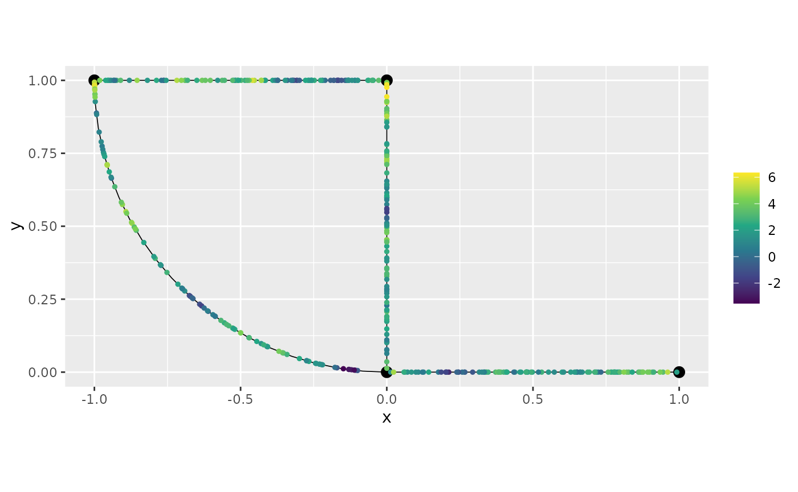
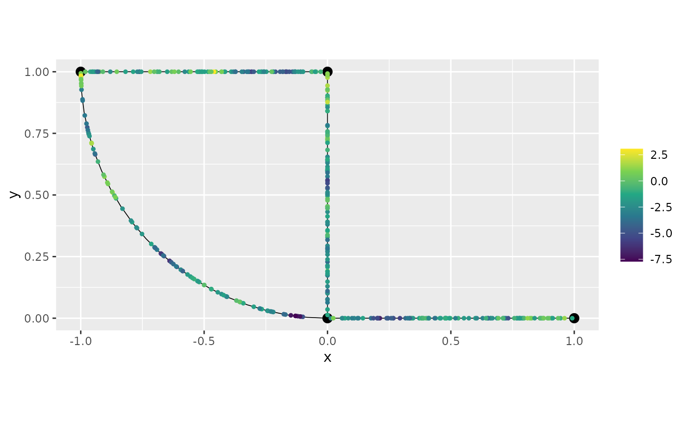
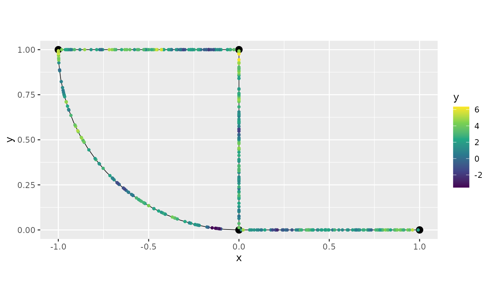

# An example with multiple likelihoods in INLA and inlabru

## Introduction

In this vignette we will show how to fit a model with multiple
likelihoods with our `INLA` and `inlabru` implementations. We will
consider the following model:
``` math
Y_{1i} = \beta_1 + u(s_i) + \varepsilon_{1i},
```
``` math
Y_{2i} = \beta_2 + u(s_i) + \varepsilon_{2i},
```
where $`s_1,\ldots,s_n`$ are locations on a compact metric graph
$`\Gamma`$, $`u(\cdot)`$ is a Whittle–Matérn field with `alpha=1`,
$`i=1,\ldots,n`$, $`\epsilon_{11},\ldots, \epsilon_{1n}`$ are i.i.d.
random variables following $`N(0, \sigma_1^2)`$, and
$`\epsilon_{21}, \ldots, \epsilon_{2n}`$ are i.i.d. random variables
following $`N(0,\sigma_2^2)`$, finally, we will take $`n=400`$.

## A toy dataset

We will start by generating the dataset. Let us load the `MetricGraph`
package and create the metric graph:

``` r

library(MetricGraph)

edge1 <- rbind(c(0,0),c(1,0))
edge2 <- rbind(c(0,0),c(0,1))
edge3 <- rbind(c(0,1),c(-1,1))
theta <- seq(from=pi,to=3*pi/2,length.out = 20)
edge4 <- cbind(sin(theta),1+ cos(theta))
edges = list(edge1, edge2, edge3, edge4)
graph <- metric_graph$new(edges = edges)
```

Let us add 100 random locations in each edge where we will have
observations:

``` r

obs_per_edge <- 100
obs_loc <- NULL
for(i in 1:(graph$nE)) {
  obs_loc <- rbind(obs_loc,
                   cbind(rep(i,obs_per_edge), 
                   runif(obs_per_edge)))
}
```

We will now sample in these observation locations and plot the latent
field:

``` r

sigma <- 2
alpha <- 1
nu <- alpha - 0.5
r <- 0.15 # r stands for range

u <- sample_spde(range = r, sigma = sigma, alpha = alpha,
                 graph = graph, PtE = obs_loc)
graph$plot(X = u, X_loc = obs_loc)
```


Let us now generate the observed responses for both likelihoods, which
we will call, respectively, `y1` and `y2`. We will also plot the
observed responses on the metric graph.

``` r

beta1 = 2
beta2 = -2
n_obs <- length(u)
sigma1.e <- 0.2
sigma2.e <- 0.5

y1 <- beta1 + u + sigma1.e * rnorm(n_obs)
y2 <- beta2 + u + sigma2.e * rnorm(n_obs)
```

Let us plot the observations from `y1`:

``` r

graph$plot(X = y1, X_loc = obs_loc)
```



and from `y2`:

``` r

graph$plot(X = y2, X_loc = obs_loc)
```



## Fitting models with multiple likelihoods in `R-INLA`

We are now in a position to fit the model with our `R-INLA`
implementation. To this end, we need to add the observations to the
graph, which we will do with the `add_observations()` method. We will
create a column on the `data.frame` to indicate which likelihood the
observed variable belongs to. We will also the intercepts as columns.

``` r

df_graph1 <- data.frame(y = y1, intercept_1 = 1, intercept_2 = NA,
                        edge_number = obs_loc[,1],
                        distance_on_edge = obs_loc[,2],
                        likelihood = 1)
df_graph2 <- data.frame(y = y2, intercept_1 = NA,
                        intercept_2 = 1,
                        edge_number = obs_loc[,1],
                        distance_on_edge = obs_loc[,2],
                        likelihood = 2)      
df_graph <- rbind(df_graph1, df_graph2)               
```

Let us now add the observations and set the `likelihood` column as
`group`:

``` r

graph$add_observations(data=df_graph, normalized=TRUE, group = "likelihood")
graph$plot(data="y")
```



Now, we load the `R-INLA` package and create the `inla` model object
with the `graph_spde` function. By default we have `alpha=1`.

``` r

library(INLA)
spde_model <- graph_spde(graph)
```

Now, we need to create the data object with the
[`graph_data_spde()`](https://davidbolin.github.io/MetricGraph/reference/graph_data_spde.md)
function, in which we need to provide a name for the random effect,
which we will call `field`, and we need to provide the covariates. We
also need to pass the column that contains the number of the likelihood
for the data

``` r

data_spde <- graph_data_spde(graph_spde = spde_model, 
                name = "field", likelihood_col = "likelihood",
                resp_col = "y",
                covariates = c("intercept_1", "intercept_2"))
```

The remaining is standard in `R-INLA`. We create the formula object and
the `inla.stack` objects with the
[`inla.stack()`](https://rdrr.io/pkg/INLA/man/inla.stack.html) function.

Let us start by creating the formula:

``` r

f.s <- y ~ -1 + f(intercept_1, model = "linear") + 
        f(intercept_2, model = "linear") + 
        f(field, model = spde_model)
```

Let us now create the `inla.stack` objects, one for each likelihood. To
such an end, we simply supply the data in `data_spde` obtained from
using `graph_data_spde`:

``` r

stk_dat1 <- inla.stack(data = data_spde[[1]][["data"]], 
                        A = data_spde[[1]][["basis"]], 
                        effects = data_spde[[1]][["index"]]
    )
stk_dat2 <- inla.stack(data = data_spde[[2]][["data"]], 
                        A = data_spde[[2]][["basis"]], 
                        effects = data_spde[[2]][["index"]]
    )
stk_dat <- inla.stack(stk_dat1, stk_dat2)    
```

Now, we use the
[`inla.stack.data()`](https://rdrr.io/pkg/INLA/man/inla.stack.html):

``` r

data_stk <- inla.stack.data(stk_dat)
```

Finally, we fit the model:

``` r

spde_fit <- inla(f.s, family = c("gaussian", "gaussian"), 
    data = data_stk, control.predictor=list(A=inla.stack.A(stk_dat)),
                               num.threads = "1:1")
```

Let us now obtain the estimates in the original scale by using the
[`spde_metric_graph_result()`](https://davidbolin.github.io/MetricGraph/reference/spde_metric_graph_result.md)
function, then taking a
[`summary()`](https://rdrr.io/r/base/summary.html):

``` r

spde_result <- spde_metric_graph_result(spde_fit, "field", spde_model)

summary(spde_result)
```

    ##           mean        sd 0.025quant 0.5quant 0.975quant      mode
    ## sigma 1.812710 0.1505710  1.5373300 1.804330   2.131780 1.7622800
    ## range 0.105875 0.0193226  0.0739313 0.103744   0.149581 0.0993824

We will now compare the means of the estimated values with the true
values:

``` r

  result_df <- data.frame(
    parameter = c("std.dev", "range"),
    true = c(sigma, r),
    mean = c(
      spde_result$summary.sigma$mean,
      spde_result$summary.range$mean
    ),
    mode = c(
      spde_result$summary.sigma$mode,
      spde_result$summary.range$mode
    )
  )
  print(result_df)
```

    ##   parameter true      mean       mode
    ## 1   std.dev 2.00 1.8127141 1.76227576
    ## 2     range 0.15 0.1058747 0.09938235

Let us now look at the estimates of the measurement errors and compare
with the true ones:

``` r

meas_err_df <- data.frame(
    parameter = c("sigma1.e", "sigma2.e"),
    true = c(sigma1.e, sigma2.e),
    mean = sqrt(1/spde_fit$summary.hyperpar$mean[1:2]),
    mode = sqrt(1/spde_fit$summary.hyperpar$mode[1:2])
  )
print(meas_err_df)
```

    ##   parameter true      mean      mode
    ## 1  sigma1.e  0.2 0.1375004 0.1565566
    ## 2  sigma2.e  0.5 0.5263937 0.5283836

Finally, let us look at the estimates of the intercepts:

``` r

intercept_df <- data.frame(
    parameter = c("beta1", "beta2"),
    true = c(beta1, beta2),
    mean = spde_fit$summary.fixed$mean,
    mode = spde_fit$summary.fixed$mode
  )
print(intercept_df)
```

    ##   parameter true      mean      mode
    ## 1     beta1    2  2.112196  2.112311
    ## 2     beta2   -2 -1.890963 -1.890849

## Fitting models with multiple likelihoods in `inlabru`

For this section recall the objects `spde_model` obtained above. Let us
create a new data object. Observe that for `inlabru` we do not need to
provide the `covariates` argument.

``` r

data_spde_bru <- graph_data_spde(graph_spde = spde_model, 
                name = "field", likelihood_col = "likelihood",
                resp_col = "y", loc_name = "loc")
```

We begin by loading `inlabru` library and setting up the likelihoods. To
this end, we will use the first entry of `data_spde_bru` to supply the
data for the first likelihood, and the second entry to supply the data
for the second likelihood.

``` r

library(inlabru)

lik1 <- like(formula = y ~ intercept_1 + field,
            data=data_spde_bru[[1]][["data"]])
```

    ## Warning: `like()` was deprecated in inlabru 2.12.0.
    ## ℹ Please use `bru_obs()` instead.
    ## This warning is displayed once per session.
    ## Call `lifecycle::last_lifecycle_warnings()` to see where this warning was
    ## generated.

    ## Warning in bru_log_warn(paste0("Non data-frame list-like data supplied; ", : Non data-frame list-like data supplied; guessing is_rowwise=FALSE.
    ##   Specify is_rowwise explicitly to avoid this warning.

``` r

lik2 <- like(formula = y ~ intercept_2 + field,
            data=data_spde_bru[[2]][["data"]])            
```

    ## Warning in bru_log_warn(paste0("Non data-frame list-like data supplied; ", : Non data-frame list-like data supplied; guessing is_rowwise=FALSE.
    ##   Specify is_rowwise explicitly to avoid this warning.

Now, we create the model component:

``` r

cmp <-  ~ -1 + intercept_1(intercept_1) + 
        intercept_2(intercept_2) + 
        field(loc, model = spde_model)
```

Then, we fit the model:

``` r

spde_bru_fit <-  bru(cmp, lik1, lik2, 
                      options = list(num.threads = 1:1))
```

Let us now obtain the estimates in the original scale by using the
[`spde_metric_graph_result()`](https://davidbolin.github.io/MetricGraph/reference/spde_metric_graph_result.md)
function, then taking a
[`summary()`](https://rdrr.io/r/base/summary.html):

``` r

spde_bru_result <- spde_metric_graph_result(spde_bru_fit, "field", spde_model)

summary(spde_bru_result)
```

    ##           mean        sd 0.025quant 0.5quant 0.975quant      mode
    ## sigma 1.814400 0.1470300  1.5476000 1.806240   2.121770 1.7826300
    ## range 0.105875 0.0193226  0.0739313 0.103744   0.149581 0.0993824

We will now compare the means of the estimated values with the true
values:

``` r

  result_bru_df <- data.frame(
    parameter = c("std.dev", "range"),
    true = c(sigma, r),
    mean = c(
      spde_bru_result$summary.sigma$mean,
      spde_bru_result$summary.range$mean
    ),
    mode = c(
      spde_bru_result$summary.sigma$mode,
      spde_bru_result$summary.range$mode
    )
  )
  print(result_bru_df)
```

    ##   parameter true      mean       mode
    ## 1   std.dev 2.00 1.8144016 1.78262777
    ## 2     range 0.15 0.1058747 0.09938235

Let us now look at the estimates of the measurement errors and compare
with the true ones:

``` r

meas_err_bru_df <- data.frame(
    parameter = c("sigma1.e", "sigma2.e"),
    true = c(sigma1.e, sigma2.e),
    mean = sqrt(1/spde_bru_fit$summary.hyperpar$mean[1:2]),
    mode = sqrt(1/spde_bru_fit$summary.hyperpar$mode[1:2])
  )
print(meas_err_bru_df)
```

    ##   parameter true      mean      mode
    ## 1  sigma1.e  0.2 0.1375004 0.1565566
    ## 2  sigma2.e  0.5 0.5263937 0.5283836

Finally, let us look at the estimates of the intercepts:

``` r

intercept_df <- data.frame(
    parameter = c("beta1", "beta2"),
    true = c(beta1, beta2),
    mean = spde_bru_fit$summary.fixed$mean,
    mode = spde_bru_fit$summary.fixed$mode
  )
print(intercept_df)
```

    ##   parameter true      mean      mode
    ## 1     beta1    2  2.112196  2.112311
    ## 2     beta2   -2 -1.890963 -1.890849

## A toy dataset with multiple likelihoods and replicates

Let us now proceed similarly, but now we will consider a case in which
we have multiple likelihoods and replicates.

To simplify exposition, we will use the same base graph. So, we begin by
clearing the observations.

``` r

graph$clear_observations()
```

We will use the same observation locations as for the previous cases.
Let us sample 10 replicates:

``` r

sigma_rep <- 1.5
alpha_rep <- 1
nu_rep <- alpha_rep - 0.5
r_rep <- 0.2 # r stands for range
kappa_rep <- sqrt(8 * nu_rep) / r_rep

n_repl <- 10

u_rep <- sample_spde(range = r_rep, sigma = sigma_rep,
                 alpha = alpha_rep,
                 graph = graph, PtE = obs_loc,
                 nsim = n_repl)
```

Let us now generate the observed responses, which we will call `y_rep`.

``` r

beta1 = 2
beta2 = -2

sigma1.e <- 0.2
sigma2.e <- 0.5

n_obs_rep <- nrow(u_rep)

y1_rep <- beta1 + u_rep + sigma1.e * matrix(rnorm(n_obs_rep * n_repl),
                                    ncol=n_repl)     
y2_rep <- beta2 + u_rep + sigma2.e * matrix(rnorm(n_obs_rep * n_repl),
                                    ncol=n_repl)            
```

## Fitting the model with multiple likelihoods and replicates in `R-INLA`

The
[`sample_spde()`](https://davidbolin.github.io/MetricGraph/reference/sample_spde.md)
function returns a matrix in which each replicate is a column. We need
to stack the columns together and a column to indicate the replicat.
Further, we need to do it for each likelihood:

``` r

dl1_graph <- lapply(1:ncol(y1_rep), function(i){data.frame(y = y1_rep[,i],
                                          edge_number = obs_loc[,1],
                                          distance_on_edge = obs_loc[,2],
                                          likelihood = 1,
                                          intercept_1 = 1,
                                          intercept_2 = NA,
                                          repl = i)})
dl1_graph <- do.call(rbind, dl1_graph)
```

and

``` r

dl2_graph <- lapply(1:ncol(y2_rep), function(i){data.frame(y = y2_rep[,i],
                                          edge_number = obs_loc[,1],
                                          distance_on_edge = obs_loc[,2],
                                          likelihood = 2,
                                          intercept_1 = NA,
                                          intercept_2 = 1,
                                          repl = i)})
dl2_graph <- do.call(rbind, dl2_graph)
```

We now join them:

``` r

dl_graph <- rbind(dl1_graph, dl2_graph)
```

We can now add the the observations by setting the `group` argument to
`c("repl", "likelihood")`:

``` r

graph$add_observations(data = dl_graph, normalized=TRUE, 
                            group = c("repl", "likelihood"),
                            edge_number = "edge_number",
                            distance_on_edge = "distance_on_edge")
```

Let us now create the model object:

``` r

spde_model_rep <- graph_spde(graph)
```

Let us first consider a case in which we do not use all replicates.
Then, we consider the case in which we use all replicates.

Thus, let us assume we want only to consider replicates 1, 3, 5, 7 and
9. To this end, we the index object by using the
[`graph_data_spde()`](https://davidbolin.github.io/MetricGraph/reference/graph_data_spde.md)
function with the argument `repl` set to the replicates we want, in this
case `c(1,3,5,7,9)`. Observe that here we need to pass `repl_col`, as
the internal grouping variable is not the replicate variable.

``` r

data_spde_repl <- graph_data_spde(graph_spde=spde_model_rep,
                      name="field", repl = c(1,3,5,7,9), repl_col = "repl", 
                      likelihood_col = "likelihood", resp_col = "y",
                      covariates = c("intercept_1", "intercept_2"))
```

Next, we create the stack objects, remembering that we need to input the
components from `data_spde` for each likelihood:

``` r

stk_dat_rep1 <- inla.stack(data = data_spde_repl[[1]][["data"]], 
                        A = data_spde_repl[[1]][["basis"]], 
                        effects = data_spde_repl[[1]][["index"]]
    )
stk_dat_rep2 <- inla.stack(data = data_spde_repl[[2]][["data"]], 
                        A = data_spde_repl[[2]][["basis"]], 
                        effects = data_spde_repl[[2]][["index"]]
    )

stk_dat_rep <- inla.stack(stk_dat_rep1, stk_dat_rep2)
```

We now create the formula object, adding the name of the field (in our
case `field`) attached with `.repl` a the `replicate` argument inside
the [`f()`](https://rdrr.io/pkg/INLA/man/f.html) function.

``` r

f_s_rep <- y ~ -1 + intercept_1 + intercept_2 + 
    f(field, model = spde_model_rep, 
        replicate = field.repl)
```

Then, we create the stack object with The
[`inla.stack.data()`](https://rdrr.io/pkg/INLA/man/inla.stack.html)
function:

``` r

data_stk_rep <- inla.stack.data(stk_dat_rep)
```

Now, we fit the model:

``` r

spde_fit_rep <- inla(f_s_rep, family = c("gaussian", "gaussian"), 
                data = data_stk_rep, 
                control.predictor=list(A=inla.stack.A(stk_dat_rep)),
                               num.threads = "1:1")
```

Let us see the estimated values in the original scale:

``` r

spde_result_rep <- spde_metric_graph_result(spde_fit_rep, 
                        "field", spde_model_rep)

summary(spde_result_rep)
```

    ##           mean        sd 0.025quant 0.5quant 0.975quant     mode
    ## sigma 1.362710 0.0623030   1.245220 1.361530   1.488450 1.362950
    ## range 0.180086 0.0181401   0.147774 0.178876   0.218905 0.176196

Let us compare with the true values:

``` r

  result_df_rep <- data.frame(
    parameter = c("std.dev", "range"),
    true = c(sigma_rep, r_rep),
    mean = c(
      spde_result_rep$summary.sigma$mean,
      spde_result_rep$summary.range$mean
    ),
    mode = c(
      spde_result_rep$summary.sigma$mode,
      spde_result_rep$summary.range$mode
    )
  )
  print(result_df_rep)
```

    ##   parameter true      mean     mode
    ## 1   std.dev  1.5 1.3627082 1.362947
    ## 2     range  0.2 0.1800859 0.176196

Let us now look at the estimates of the measurement errors and compare
with the true ones:

``` r

meas_err_df <- data.frame(
    parameter = c("sigma1.e", "sigma2.e"),
    true = c(sigma1.e, sigma2.e),
    mean = sqrt(1/spde_fit_rep$summary.hyperpar$mean[1:2]),
    mode = sqrt(1/spde_fit_rep$summary.hyperpar$mode[1:2])
  )
print(meas_err_df)
```

    ##   parameter true      mean      mode
    ## 1  sigma1.e  0.2 0.2009009 0.2020441
    ## 2  sigma2.e  0.5 0.4954272 0.4958153

Finally, let us look at the estimates of the intercepts:

``` r

intercept_df <- data.frame(
    parameter = c("beta1", "beta2"),
    true = c(beta1, beta2),
    mean = spde_fit_rep$summary.fixed$mean,
    mode = spde_fit_rep$summary.fixed$mode
  )
print(intercept_df)
```

    ##   parameter true      mean      mode
    ## 1     beta1    2  1.873590  1.873742
    ## 2     beta2   -2 -2.114198 -2.114046

## Fitting models with multiple likelihoods and replicates in `inlabru`

For this section recall the objects `spde_model_rep` obtained above. Let
us create a new data object:

``` r

data_spde_bru_repl <- graph_data_spde(graph_spde = spde_model_rep, 
                name="field", loc_name = "loc", 
                repl = c(1,3,5,7,9), repl_col = "repl", 
                likelihood_col = "likelihood", resp_col = "y")
```

Let us obtain the `repl` indexes from the `data_spde_bru_repl` object:

``` r

repl <- data_spde_bru_repl[["repl"]]
```

Let us now construct the likelihoods:

``` r

lik1_repl <- like(formula = y ~ intercept_1 + field,
            data=data_spde_bru_repl[[1]][["data"]])
```

    ## Warning in bru_log_warn(paste0("Non data-frame list-like data supplied; ", : Non data-frame list-like data supplied; guessing is_rowwise=FALSE.
    ##   Specify is_rowwise explicitly to avoid this warning.

``` r

lik2_repl <- like(formula = y ~ intercept_2 + field,
            data=data_spde_bru_repl[[2]][["data"]])            
```

    ## Warning in bru_log_warn(paste0("Non data-frame list-like data supplied; ", : Non data-frame list-like data supplied; guessing is_rowwise=FALSE.
    ##   Specify is_rowwise explicitly to avoid this warning.

Now, we create the model component, using the replicates index we
obtained above:

``` r

cmp_repl <-  ~ -1 + intercept_1(intercept_1) + 
        intercept_2(intercept_2) + 
        field(loc, model = spde_model_rep, replicate = repl)
```

Then, we fit the model:

``` r

spde_bru_fit_repl <-  bru(cmp_repl, lik1_repl, lik2_repl,
                      options = list(num.threads = 1:1))
```

Let us now obtain the estimates in the original scale by using the
[`spde_metric_graph_result()`](https://davidbolin.github.io/MetricGraph/reference/spde_metric_graph_result.md)
function, then taking a
[`summary()`](https://rdrr.io/r/base/summary.html):

``` r

spde_bru_result_repl <- spde_metric_graph_result(spde_bru_fit_repl, "field", spde_model_rep)

summary(spde_bru_result_repl)
```

    ##           mean        sd 0.025quant 0.5quant 0.975quant     mode
    ## sigma 1.362140 0.0627913   1.242760 1.359700   1.488530 1.346930
    ## range 0.180086 0.0181401   0.147774 0.178876   0.218905 0.176196

We will now compare the means of the estimated values with the true
values:

``` r

  result_bru_repl_df <- data.frame(
    parameter = c("std.dev", "range"),
    true = c(sigma_rep, r_rep),
    mean = c(
      spde_bru_result_repl$summary.sigma$mean,
      spde_bru_result_repl$summary.range$mean
    ),
    mode = c(
      spde_bru_result_repl$summary.sigma$mode,
      spde_bru_result_repl$summary.range$mode
    )
  )
  print(result_bru_repl_df)
```

    ##   parameter true      mean     mode
    ## 1   std.dev  1.5 1.3621351 1.346932
    ## 2     range  0.2 0.1800859 0.176196

Let us now look at the estimates of the measurement errors and compare
with the true ones:

``` r

meas_err_bru_repl_df <- data.frame(
    parameter = c("sigma1.e", "sigma2.e"),
    true = c(sigma1.e, sigma2.e),
    mean = sqrt(1/spde_bru_fit_repl$summary.hyperpar$mean[1:2]),
    mode = sqrt(1/spde_bru_fit_repl$summary.hyperpar$mode[1:2])
  )
print(meas_err_bru_repl_df)
```

    ##   parameter true      mean      mode
    ## 1  sigma1.e  0.2 0.2009009 0.2020441
    ## 2  sigma2.e  0.5 0.4954272 0.4958153

Finally, let us look at the estimbates of the intercepts:

``` r

intercept_repl_df <- data.frame(
    parameter = c("beta1", "beta2"),
    true = c(beta1, beta2),
    mean = spde_bru_fit_repl$summary.fixed$mean,
    mode = spde_bru_fit_repl$summary.fixed$mode
  )
print(intercept_repl_df)
```

    ##   parameter true      mean      mode
    ## 1     beta1    2  1.873590  1.873742
    ## 2     beta2   -2 -2.114198 -2.114046
