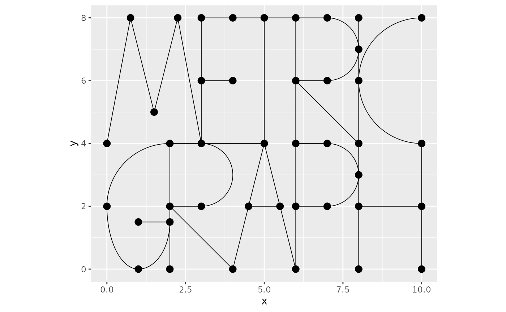
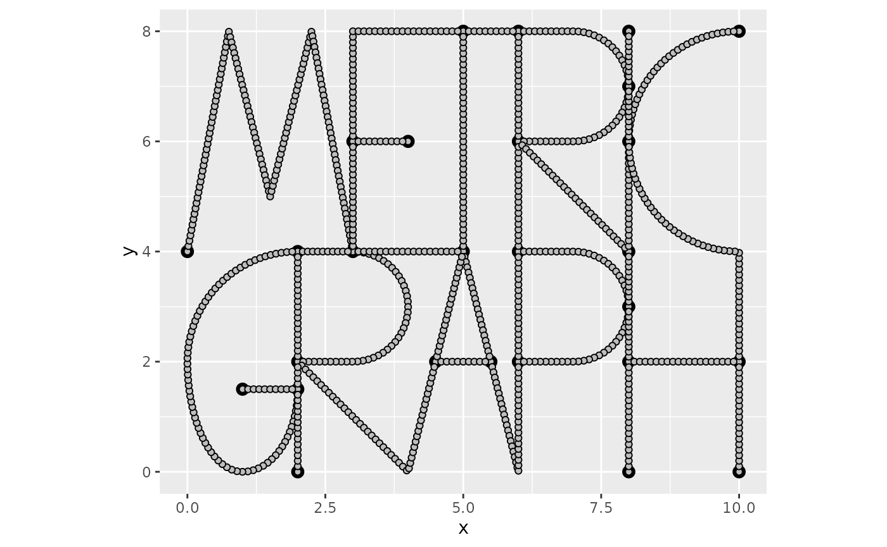
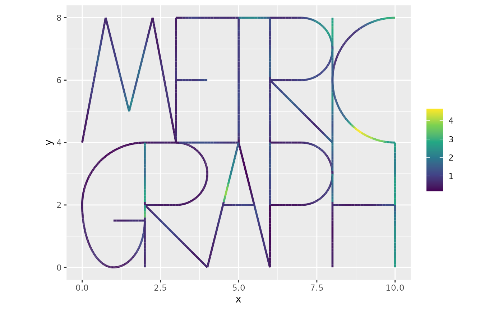
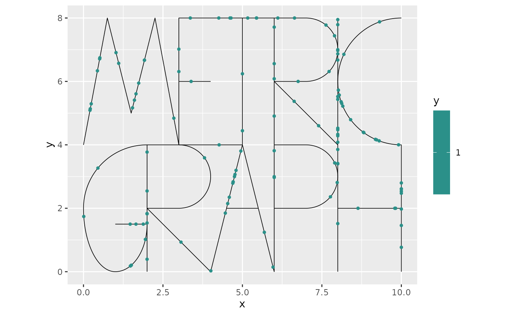
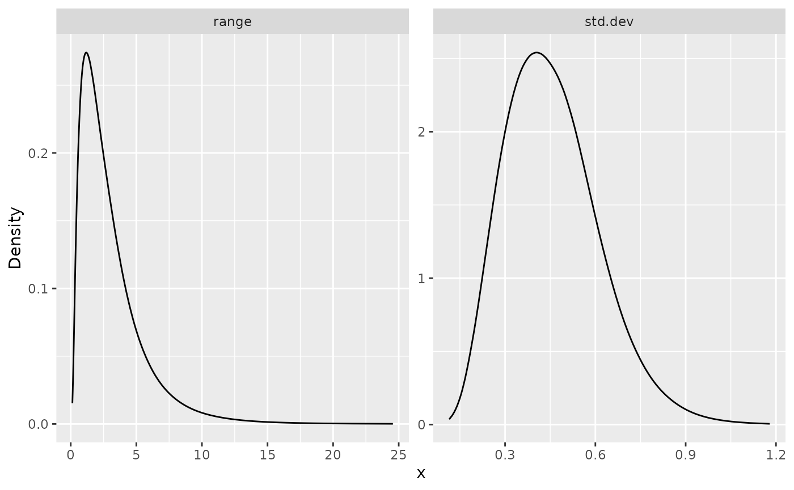
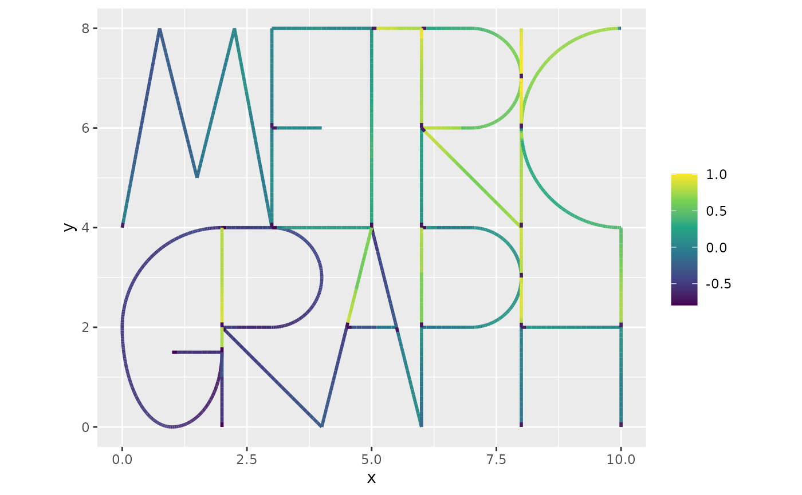
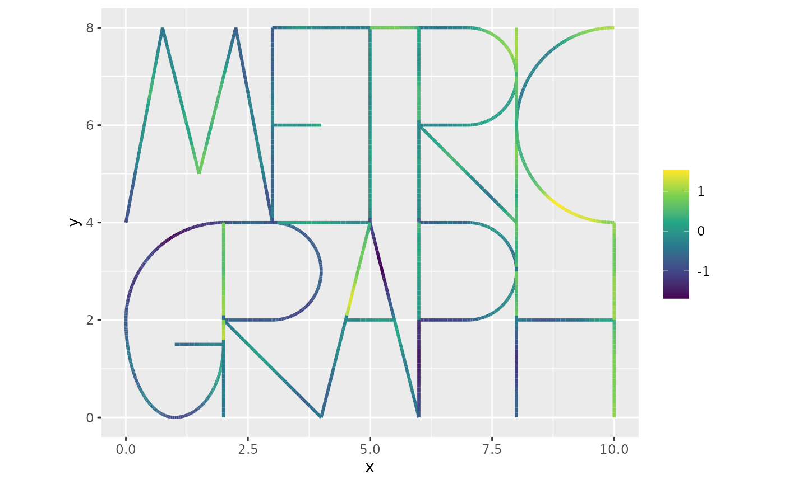

# Log-Gaussian Cox processes on metric graphs

### Introduction

In this vignette we will introduce how to work with log-Gaussian Cox
processes based on Whittle–Matérn fields on metric graphs. To simplify
the integration with `R-INLA` and `inlabru` hese models are constructed
using finite element approximations as implemented in the `rSPDE`
package. The theoretical details will be given in the forthcoming
article (Bolin et al. 2023).

### Constructing the graph and the mesh

We begin by loading the `rSPDE`, `MetricGraph` and `INLA` packages:

``` r

library(rSPDE)
library(MetricGraph)
library(INLA)
```

As an example, we consider the default graph in the package:

``` r

graph <- metric_graph$new(tolerance = list(vertex_vertex = 1e-1, vertex_edge = 1e-3, edge_edge = 1e-3),
                          remove_deg2 = TRUE)
graph$plot()
```



To construct a FEM approximation of a Whittle–Matérn field, we must
first construct a mesh on the graph.

``` r

graph$build_mesh(h = 0.1)
graph$plot(mesh=TRUE)
```



The next step is to build the mass and stiffness matrices for the FEM
basis.

``` r

  graph$compute_fem()
```

We are now ready to specify the and sample from a log-Gaussian Cox
process model with intensity $`\lambda = \exp(\beta + u)`$ where
$`\beta`$ is an intercept and $`u`$ is a Gaussian Whittle–Matérn field
specified by
``` math
(\kappa^2 - \Delta)^{\alpha/2} \tau u = \mathcal{W}.
```
For this we can use the function `graph_lgcp` as follows:

``` r

  sigma <- 0.5
  range <- 2
  alpha <- 2
  cov_lgcp <- graph$mesh$VtE[,1]/max(graph$mesh$VtE[,1])
  lgcp_sample <- graph_lgcp_sim(intercept = -1 + 2*cov_lgcp, sigma = sigma,
                            range = range, alpha = alpha,
                            graph = graph)
```

The object returned by the function is a list with the simulated
Gaussian process and the points on the graph. We can plot the simulated
intensity function as

``` r

graph$plot_function(X = exp(lgcp_sample$u), vertex_size = 0)
```



To plot the simulated points, we can add them to the graph and then
plot:

``` r

graph$add_observations(data = data.frame(y=rep(1,length(lgcp_sample$edge_loc)),
                                         edge_number = lgcp_sample$edge_number,
                                         distance_on_edge = lgcp_sample$edge_loc,
                                         cov_lgcp = lgcp_sample$edge_number),
                       normalized = TRUE)
```

    ## Adding observations...

    ## Assuming the observations are normalized by the length of the edge.

``` r

graph$plot(vertex_size = 0, data = "y")
```



In order to fit a log-Gaussian Cox process model, we need to specify
integration points on the graph, be able to evaluate the covariates at
such integration points. This process is a bit involved, so we have
created an interface to simplify the process. In this interface, by
default, the covariates are interpolated from the data provided in the
`graph` object to obtain their values at the integration points.

The integration points are defined, by default, as the mesh locations if
the metric graph object has a mesh. If the mesh is not provided, one
must either provide the integration points manually or build a mesh.

At the end of the vignette, we will also show how to fit the model in
`INLA` without using our `INLA` interface for LGCP models.

## Fitting LGCP models with our `INLA` interface

We will now fit the model using our `INLA` interface. To such an end, we
will clear the observations from the graph and add the data to the
graph.

``` r

graph$clear_observations()

#Add the data together with the exposure terms
graph$add_observations(data = data.frame(y = rep(1,length(lgcp_sample$edge_loc)),
                                         edge_number = lgcp_sample$edge_number,
                                         distance_on_edge = lgcp_sample$edge_loc,
                                         Intercept = 1,
                                         cov_lgcp = lgcp_sample$edge_number/max(lgcp_sample$edge_number)),
                       normalized = TRUE)
```

    ## Adding observations...

    ## Assuming the observations are normalized by the length of the edge.

We have added the response variable $`y`$, however, this is not strictly
necessary. If such a response variable is not provided, it will be
assumed that all locations correspond to observed points.

Let us now create the `rSPDE` model object:

``` r

rspde_model <- rspde.metric_graph(graph, nu = alpha - 1/2)
```

We can now fit the model using the
[`lgcp_graph()`](https://davidbolin.github.io/MetricGraph/reference/lgcp_graph.md)
function:

``` r

inla_fit <- lgcp_graph(y ~ -1 + Intercept + cov_lgcp + 
                      f(field, model = rspde_model), graph=graph)
```

Let us observe the `inla_fit` object:

``` r

summary(inla_fit)
```

    ## Time used:
    ##     Pre = 0.15, Running = 0.777, Post = 0.0344, Total = 0.961 
    ## Fixed effects:
    ##             mean    sd 0.025quant 0.5quant 0.975quant   mode kld
    ## Intercept -0.619 0.328     -1.275   -0.617      0.021 -0.616   0
    ## cov_lgcp   1.217 0.494      0.243    1.217      2.189  1.217   0
    ## 
    ## Random effects:
    ##   Name     Model
    ##     field CGeneric
    ## 
    ## Model hyperparameters:
    ##                    mean    sd 0.025quant 0.5quant 0.975quant   mode
    ## Theta1 for field -0.606 0.281     -1.192   -0.595     -0.089 -0.543
    ## Theta2 for field  0.872 0.663     -0.472    0.886      2.138  0.943
    ## 
    ## Marginal log-Likelihood:  -103.77 
    ##  is computed 
    ## Posterior summaries for the linear predictor and the fitted values are computed
    ## (Posterior marginals needs also 'control.compute=list(return.marginals.predictor=TRUE)')

Let us extract the estimates in the original scale by using the
[`spde_metric_graph_result()`](https://davidbolin.github.io/MetricGraph/reference/spde_metric_graph_result.md)
function, then taking a
[`summary()`](https://rdrr.io/r/base/summary.html):

``` r

spde_result <- spde_metric_graph_result(inla_fit, "field", rspde_model)

summary(spde_result)
```

    ##             mean       sd 0.025quant 0.5quant 0.975quant     mode
    ## std.dev 0.566934 0.155763   0.305471 0.553637   0.911241 0.526013
    ## range   2.957470 2.062930   0.632181 2.432960   8.404230 1.564980

We will now compare the means of the estimated values with the true
values:

``` r

  result_df <- data.frame(
    parameter = c("std.dev", "range"),
    true = c(sigma, range),
    mean = c(
      spde_result$summary.std.dev$mean,
      spde_result$summary.range$mean
    ),
    mode = c(
      spde_result$summary.std.dev$mode,
      spde_result$summary.range$mode
    )
  )
  print(result_df)
```

    ##   parameter true     mean      mode
    ## 1   std.dev  0.5 0.566934 0.5260129
    ## 2     range  2.0 2.957473 1.5649835

If we have the actual values of the covariates at the integration
points, we can pass them to the
[`lgcp_graph()`](https://davidbolin.github.io/MetricGraph/reference/lgcp_graph.md)
function via the `manual_covariates` argument.

``` r

manual_covariates <- data.frame(Intercept = 1,
                      cov_lgcp = graph$mesh$VtE[,1]/max(lgcp_sample$edge_number),
                      .group = 1)
inla_fit <- lgcp_graph(y ~ -1 + Intercept + cov_lgcp + f(field, model = rspde_model), 
             graph=graph, manual_covariates = manual_covariates, interpolate = FALSE)
```

Let us observe the new `inla_fit` object:

``` r

summary(inla_fit)
```

    ## Time used:
    ##     Pre = 0.143, Running = 0.73, Post = 0.0271, Total = 0.899 
    ## Fixed effects:
    ##             mean    sd 0.025quant 0.5quant 0.975quant   mode kld
    ## Intercept -0.818 0.282     -1.387   -0.814     -0.277 -0.814   0
    ## cov_lgcp   1.775 0.393      1.011    1.772      2.556  1.772   0
    ## 
    ## Random effects:
    ##   Name     Model
    ##     field CGeneric
    ## 
    ## Model hyperparameters:
    ##                    mean    sd 0.025quant 0.5quant 0.975quant   mode
    ## Theta1 for field -0.844 0.358     -1.608   -0.824     -0.208 -0.727
    ## Theta2 for field  0.823 0.805     -0.861    0.857      2.298  1.015
    ## 
    ## Marginal log-Likelihood:  -97.44 
    ##  is computed 
    ## Posterior summaries for the linear predictor and the fitted values are computed
    ## (Posterior marginals needs also 'control.compute=list(return.marginals.predictor=TRUE)')

We can now extract the estimates in the original scale

``` r

spde_result <- spde_metric_graph_result(inla_fit, "field", rspde_model)

summary(spde_result)
```

    ##             mean       sd 0.025quant 0.5quant 0.975quant    mode
    ## std.dev 0.457014 0.157056   0.201970 0.441544   0.808332 0.40474
    ## range   3.074480 2.535790   0.429986 2.382000   9.844050 1.18158

We can also plot the posterior marginal densities with the help of the
[`gg_df()`](https://davidbolin.github.io/MetricGraph/reference/gg_df.metric_graph_spde_result.md)
function:

``` r

  posterior_df_fit <- gg_df(spde_result)

  library(ggplot2)

  ggplot(posterior_df_fit) + geom_line(aes(x = x, y = y)) + 
  facet_wrap(~parameter, scales = "free") + labs(y = "Density")
```



Finally, we can plot the estimated field $`u`$:

``` r

n.obs <- length(graph$get_data()$y)
n.field <- dim(graph$mesh$VtE)[1]
u_posterior <- inla_fit$summary.linear.predictor$mean[(n.obs+1):(n.obs+n.field)]
graph$plot_function(X = u_posterior, vertex_size = 0)
```



This can be compared with the field that was used to generate the data:

``` r

graph$plot_function(X = lgcp_sample$u, vertex_size = 0)
```



We can also fit the model using the exact model by using the
[`graph_spde()`](https://davidbolin.github.io/MetricGraph/reference/graph_spde.md)
function as the SPDE model, and we also set the `LGCP` argument to
`TRUE`:

``` r

spde_model <- graph_spde(graph, alpha = 1, LGCP = TRUE)
```

Let us now fit the model:

``` r

inla_fit_spde <- lgcp_graph(y ~ -1 + Intercept + cov_lgcp + 
                          f(field, model = spde_model), graph=graph)
```

Let us observe the new `inla_fit_spde` object:

``` r

summary(inla_fit_spde)
```

    ## Time used:
    ##     Pre = 0.162, Running = 0.749, Post = 0.0312, Total = 0.942 
    ## Fixed effects:
    ##             mean    sd 0.025quant 0.5quant 0.975quant   mode kld
    ## Intercept -0.586 0.250     -1.076   -0.586     -0.097 -0.586   0
    ## cov_lgcp   1.266 0.407      0.469    1.266      2.064  1.266   0
    ## 
    ## Random effects:
    ##   Name     Model
    ##     field CGeneric
    ## 
    ## Model hyperparameters:
    ##                   mean    sd 0.025quant 0.5quant 0.975quant  mode
    ## Theta1 for field  1.24 0.798     -0.266     1.22       2.87  1.12
    ## Theta2 for field -1.49 1.352     -4.271    -1.45       1.05 -1.27
    ## 
    ## Marginal log-Likelihood:  -102.38 
    ##  is computed 
    ## Posterior summaries for the linear predictor and the fitted values are computed
    ## (Posterior marginals needs also 'control.compute=list(return.marginals.predictor=TRUE)')

We can now extract the estimates in the original scale

``` r

spde_result <- spde_metric_graph_result(inla_fit_spde, "field", spde_model)

summary(spde_result)
```

    ##           mean       sd 0.025quant 0.5quant 0.975quant     mode
    ## sigma 2.142420 0.562560  1.2141800  2.09352    3.38826 2.070980
    ## range 0.518013 0.882188  0.0143577  0.23718    2.79804 0.030461

## An example with replicates in our `INLA` interface

We start by simulating the data.

``` r

  n.rep <- 5
  sigma <- 0.5
  range <- 2
  alpha <- 2
  cov_lgcp <- graph$mesh$VtE[,1]/max(graph$mesh$VtE[,1])  
  max_edge_num <- max(graph$mesh$VtE[,1])
  lgcp_sample_rep <- graph_lgcp_sim(n = n.rep, intercept = -1 + 2*cov_lgcp, sigma = sigma,
                            range = range, alpha = alpha,
                            graph = graph)
```

Let us clear the observations from the graph and add the simulated data.

``` r

graph$clear_observations()

df_rep <- data.frame(y=rep(1,length(lgcp_sample_rep[[1]]$edge_loc)),
                     edge_number = lgcp_sample_rep[[1]]$edge_number,
                     distance_on_edge = lgcp_sample_rep[[1]]$edge_loc,
                     Intercept = 1,
                     cov_lgcp = lgcp_sample_rep[[1]]$edge_number/max_edge_num,
                     rep = rep(1,length(lgcp_sample_rep[[1]]$edge_loc)))

for(i in 2:n.rep){
  df_rep <- rbind(df_rep, data.frame(y=rep(1,length(lgcp_sample_rep[[i]]$edge_loc)),
                                       edge_number = lgcp_sample_rep[[i]]$edge_number,
                                       distance_on_edge = lgcp_sample_rep[[i]]$edge_loc,
                                       Intercept = 1,
                                       cov_lgcp = lgcp_sample_rep[[i]]$edge_number/max_edge_num,
                                       rep = rep(i,length(lgcp_sample_rep[[i]]$edge_loc))))
}

graph$add_observations(data = df_rep,
                       normalized = TRUE,
                        group = "rep")
```

    ## Adding observations...

    ## Assuming the observations are normalized by the length of the edge.

Let us now fit the model. In this case, the default column for the
replicates is `.group`, and also, by default, all replicates will be
used.

``` r

inla_fit <- lgcp_graph(y ~ -1 + Intercept + cov_lgcp + f(field, model = rspde_model, replicate = field.repl), graph=graph)
```

Let us observe the `inla_fit` object:

``` r

summary(inla_fit)
```

    ## Time used:
    ##     Pre = 0.15, Running = 2.59, Post = 0.125, Total = 2.86 
    ## Fixed effects:
    ##             mean    sd 0.025quant 0.5quant 0.975quant   mode kld
    ## Intercept -0.806 0.149     -1.100   -0.806     -0.515 -0.806   0
    ## cov_lgcp   1.371 0.229      0.922    1.371      1.819  1.371   0
    ## 
    ## Random effects:
    ##   Name     Model
    ##     field CGeneric
    ## 
    ## Model hyperparameters:
    ##                    mean    sd 0.025quant 0.5quant 0.975quant   mode
    ## Theta1 for field -0.624 0.148     -0.924   -0.621     -0.341 -0.609
    ## Theta2 for field  1.408 0.341      0.739    1.407      2.082  1.402
    ## 
    ## Marginal log-Likelihood:  -472.13 
    ##  is computed 
    ## Posterior summaries for the linear predictor and the fitted values are computed
    ## (Posterior marginals needs also 'control.compute=list(return.marginals.predictor=TRUE)')

Let us now extract the estimates in the original scale

``` r

spde_result <- spde_metric_graph_result(inla_fit, "field", rspde_model)

summary(spde_result)
```

    ##             mean        sd 0.025quant 0.5quant 0.975quant     mode
    ## std.dev 0.541597 0.0795084   0.398111 0.537648   0.709556 0.531493
    ## range   4.328110 1.5091100   2.106240 4.081340   7.972460 3.623470

As in the previous case, we can also supply the covariates manually:

``` r

manual_covariates <- data.frame(
      Intercept = 1,
      cov_lgcp = rep(graph$mesh$VtE[,1]/max(graph$mesh$VtE[,1]), 5),
      .group = rep(1:5, each = nrow(graph$mesh$VtE))
    )
inla_fit <- lgcp_graph(y ~ -1 + Intercept + cov_lgcp + 
            f(field, model = rspde_model, replicate = field.repl), 
              graph=graph, manual_covariates = manual_covariates)
```

Let us observe the `inla_fit` object:

``` r

summary(inla_fit)
```

    ## Time used:
    ##     Pre = 0.147, Running = 2.36, Post = 0.105, Total = 2.61 
    ## Fixed effects:
    ##             mean    sd 0.025quant 0.5quant 0.975quant   mode kld
    ## Intercept -0.988 0.124     -1.233   -0.987     -0.747 -0.987   0
    ## cov_lgcp   1.889 0.182      1.533    1.889      2.247  1.889   0
    ## 
    ## Random effects:
    ##   Name     Model
    ##     field CGeneric
    ## 
    ## Model hyperparameters:
    ##                   mean    sd 0.025quant 0.5quant 0.975quant  mode
    ## Theta1 for field -0.86 0.185      -1.24   -0.855     -0.512 -0.83
    ## Theta2 for field  1.46 0.427       0.62    1.463      2.302  1.47
    ## 
    ## Marginal log-Likelihood:  -440.05 
    ##  is computed 
    ## Posterior summaries for the linear predictor and the fitted values are computed
    ## (Posterior marginals needs also 'control.compute=list(return.marginals.predictor=TRUE)')

Let us now extract the estimates in the original scale

``` r

spde_result <- spde_metric_graph_result(inla_fit, "field", rspde_model)

summary(spde_result)
```

    ##             mean       sd 0.025quant 0.5quant 0.975quant     mode
    ## std.dev 0.430313 0.078658    0.29010 0.426074   0.597544 0.419663
    ## range   4.721710 2.083590    1.87198 4.318340   9.920010 3.613590

We can also fit the model with replicates using the exact model:

``` r

inla_fit_spde_rep <- lgcp_graph(y ~ -1 + Intercept + cov_lgcp + 
                               f(field, model = spde_model, replicate = field.repl), 
                               graph=graph)
```

Let us observe the `inla_fit_spde_rep` object:

``` r

summary(inla_fit_spde_rep)
```

    ## Time used:
    ##     Pre = 0.171, Running = 3.32, Post = 0.137, Total = 3.63 
    ## Fixed effects:
    ##             mean    sd 0.025quant 0.5quant 0.975quant   mode kld
    ## Intercept -0.805 0.154     -1.108   -0.805     -0.502 -0.804   0
    ## cov_lgcp   1.329 0.229      0.878    1.329      1.778  1.329   0
    ## 
    ## Random effects:
    ##   Name     Model
    ##     field CGeneric
    ## 
    ## Model hyperparameters:
    ##                    mean    sd 0.025quant 0.5quant 0.975quant   mode
    ## Theta1 for field -0.633 0.273      -1.18   -0.628     -0.107 -0.611
    ## Theta2 for field  1.666 0.527       0.65    1.658      2.725  1.627
    ## 
    ## Marginal log-Likelihood:  -472.53 
    ##  is computed 
    ## Posterior summaries for the linear predictor and the fitted values are computed
    ## (Posterior marginals needs also 'control.compute=list(return.marginals.predictor=TRUE)')

We can now extract the estimates in the original scale

``` r

spde_result_rep <- spde_metric_graph_result(inla_fit_spde_rep, "field", spde_model)

summary(spde_result_rep)
```

    ##           mean        sd 0.025quant 0.5quant 0.975quant    mode
    ## sigma 0.609965 0.0921866   0.441388  0.60662   0.801715 0.58510
    ## range 6.075630 3.4547500   1.930170  5.24073  15.103500 3.93607

## Fitting LGCP models without our `INLA` interface

We are now in a position to fit the model with our `R-INLA`
implementation, without using our `INLA` interface for LGCP models. When
working with log-Gaussian Cox processes, the likelihood has a term
$`\int_\Gamma \exp(u(s)) ds`$ that needs to be handled separately. This
is done by using the mid-point rule as suggested for SPDE models by
[Simpson et al.
(2016)](https://academic.oup.com/biomet/article/103/1/49/2389990) where
we approximate
``` math
\int_\Gamma \exp(u(s)) ds \approx \sum_{i=1}^p \widetilde{a}_i \exp\left(u(\widetilde{s}_i)\right).
```
Using the fact that $`u(s) = \sum_{j=1}^n \varphi(s) u_i`$ from the FEM
approximation, we can write the integral as
$`\widetilde{\alpha}^T\exp(\widetilde{A}u)`$ where
$`\widetilde{A}_{ij} = \varphi_j(\widetilde{s}_i)`$ and
$`\widetilde{a}`$ is a vector with integration weights. These quantities
can be obtained as

``` r

Atilde <- graph$fem_basis(graph$mesh$VtE)
atilde <- graph$mesh$weights
```

The weights are used as exposure terms in the Poisson likelihood in
R-INLA. Because of this, the easiest way to construct the model is to
add the integration points as zero observations in the graph, with
corresponding exposure weights. We also need to add the exposure terms
(which are zero) for the actual observation locations:

``` r

#clear the previous data in the graph
graph$clear_observations()

#Add the data together with the exposure terms
graph$add_observations(data = data.frame(y = rep(1,length(lgcp_sample$edge_loc)),
                                         e = rep(0,length(lgcp_sample$edge_loc)),
                                         edge_number = lgcp_sample$edge_number,
                                         distance_on_edge = lgcp_sample$edge_loc,
                                         Intercept = 1,
                                         cov_lgcp = lgcp_sample$edge_number/max(lgcp_sample$edge_number)),
                       normalized = TRUE)
```

    ## Adding observations...

    ## Assuming the observations are normalized by the length of the edge.

``` r

#Add integration points
graph$add_observations(data = data.frame(y = rep(0,length(atilde)),
                                         e = atilde,
                                         edge_number = graph$mesh$VtE[,1],
                                         distance_on_edge = graph$mesh$VtE[,2],
                                         Intercept = 1,
                                         cov_lgcp = graph$mesh$VtE[,1]/max(lgcp_sample$edge_number)),
                       normalized = TRUE)
```

    ## Adding observations...
    ## Assuming the observations are normalized by the length of the edge.

We now create the `inla` model object with the `graph_spde` function.
For simplicity, we assume that $`\alpha`$ is known and fixed to the true
value in the model.

``` r

rspde_model <- rspde.metric_graph(graph, nu = alpha - 1/2)
```

Next, we compute the auxiliary data:

``` r

data_rspde <- graph_data_spde(rspde_model, name="field", covariates = c("Intercept","cov_lgcp"))
```

We now create the `inla.stack` object with the
[`inla.stack()`](https://rdrr.io/pkg/INLA/man/inla.stack.html) function.
At this stage, it is important that the data has been added to the
`graph` since it is supplied to the stack by using the
`graph_spde_data()` function.

``` r

stk <- inla.stack(data = data_rspde[["data"]], 
                  A = data_rspde[["basis"]],
                  effects = data_rspde[["index"]])
```

We can now fit the model using `R-INLA`:

``` r

spde_fit <- inla(y ~ -1 + Intercept + cov_lgcp + f(field, model = rspde_model), 
                 family = "poisson", data = inla.stack.data(stk),
                 control.predictor = list(A = inla.stack.A(stk), compute = TRUE),
                 E = inla.stack.data(stk)$e)
```

Let us extract the estimates in the original scale by using the
[`spde_metric_graph_result()`](https://davidbolin.github.io/MetricGraph/reference/spde_metric_graph_result.md)
function, then taking a
[`summary()`](https://rdrr.io/r/base/summary.html):

``` r

spde_result <- rspde.result(spde_fit, "field", rspde_model)

summary(spde_result)
```

    ##             mean       sd 0.025quant 0.5quant 0.975quant    mode
    ## std.dev 0.457014 0.157056   0.201970 0.441544   0.808331 0.40474
    ## range   3.074470 2.535780   0.429988 2.382000   9.844030 1.18158

We will now compare the means of the estimated values with the true
values:

``` r

  result_df <- data.frame(
    parameter = c("std.dev", "range"),
    true = c(sigma, range),
    mean = c(
      spde_result$summary.std.dev$mean,
      spde_result$summary.range$mean
    ),
    mode = c(
      spde_result$summary.std.dev$mode,
      spde_result$summary.range$mode
    )
  )
  print(result_df)
```

    ##   parameter true      mean      mode
    ## 1   std.dev  0.5 0.4570136 0.4047397
    ## 2     range  2.0 3.0744746 1.1815837

## An example with replicates

We now clear the previous data and add the new data together with the
exposure terms

``` r

  graph$clear_observations()
  df_rep <- data.frame(y=rep(1,length(lgcp_sample_rep[[1]]$edge_loc)),
                                             e = rep(0,length(lgcp_sample_rep[[1]]$edge_loc)),
                                         edge_number = lgcp_sample_rep[[1]]$edge_number,
                                         distance_on_edge = lgcp_sample_rep[[1]]$edge_loc,
                                         Intercept = 1,
                                         cov_lgcp = lgcp_sample_rep[[1]]$edge_number/max_edge_num,
                                         rep = rep(1,length(lgcp_sample_rep[[1]]$edge_loc)))

  df_rep <- rbind(df_rep, data.frame(y = rep(0,length(atilde)),
                                         e = atilde,
                                         edge_number = graph$mesh$VtE[,1],
                                         distance_on_edge = graph$mesh$VtE[,2],
                                         Intercept = 1,
                                         cov_lgcp = graph$mesh$VtE[,1]/max_edge_num,
                                         rep = rep(1,length(atilde))))
  for(i in 2:n.rep){
    df_rep <- rbind(df_rep, data.frame(y=rep(1,length(lgcp_sample_rep[[i]]$edge_loc)),
                                             e = rep(0,length(lgcp_sample_rep[[i]]$edge_loc)),
                                         edge_number = lgcp_sample_rep[[i]]$edge_number,
                                         distance_on_edge = lgcp_sample_rep[[i]]$edge_loc,
                                         Intercept = 1,
                                         cov_lgcp = lgcp_sample_rep[[i]]$edge_number/max_edge_num,
                                         rep = rep(i,length(lgcp_sample_rep[[i]]$edge_loc))))
    df_rep <- rbind(df_rep, data.frame(y = rep(0,length(atilde)),
                                         e = atilde,
                                         edge_number = graph$mesh$VtE[,1],
                                         distance_on_edge = graph$mesh$VtE[,2],
                                         Intercept = 1,
                                         cov_lgcp = graph$mesh$VtE[,1]/max_edge_num,
                                         rep = rep(i,length(atilde))))                                        

  }

      graph$add_observations(data = df_rep,
                       normalized = TRUE,
                        group = "rep")
```

    ## Adding observations...

    ## Assuming the observations are normalized by the length of the edge.

We can now define and fit the model as previously

``` r

rspde_model <- rspde.metric_graph(graph, nu = alpha - 1/2)

data_rspde <- graph_data_spde(rspde_model, name = "field", 
                                  repl = ".all", repl_col = "rep", 
                                  covariates = c("Intercept","cov_lgcp"))

stk <- inla.stack(data = data_rspde[["data"]], 
                  A = data_rspde[["basis"]], 
                  effects = data_rspde[["index"]])

spde_fit <- inla(y ~ -1 + Intercept + cov_lgcp + 
                 f(field, model = rspde_model, replicate = field.repl), 
                 family = "poisson", data = inla.stack.data(stk),
                 control.predictor = list(A = inla.stack.A(stk), compute = TRUE),
                 E = inla.stack.data(stk)$e)
```

Let’s look at the summaries

``` r

spde_result <- rspde.result(spde_fit, "field", rspde_model)
summary(spde_result)
```

    ##             mean        sd 0.025quant 0.5quant 0.975quant     mode
    ## std.dev 0.430313 0.0786579    0.29010 0.426074   0.597544 0.419663
    ## range   4.721710 2.0835900    1.87198 4.318340   9.920010 3.613590

``` r

result_df <- data.frame(
    parameter = c("std.dev", "range"),
    true = c(sigma, range),
    mean = c(
      spde_result$summary.std.dev$mean,
      spde_result$summary.range$mean
    ),
    mode = c(
      spde_result$summary.std.dev$mode,
      spde_result$summary.range$mode
    )
  )
  print(result_df)
```

    ##   parameter true      mean      mode
    ## 1   std.dev  0.5 0.4303133 0.4196634
    ## 2     range  2.0 4.7217075 3.6135944

## Using precomputed data for efficient model fitting

When fitting multiple LGCP models with different formulas but the same
spatial structure and covariates, it can be very efficient to precompute
the expensive quantities once and reuse them. This is particularly
useful for model selection, cross-validation, or exploring different
covariate combinations.

The
[`precompute_lgcp_graph()`](https://davidbolin.github.io/MetricGraph/reference/precompute_lgcp_graph.md)
function allows us to precompute integration points, mesh setup, and
SPDE model structures. Then
[`lgcp_graph()`](https://davidbolin.github.io/MetricGraph/reference/lgcp_graph.md)
can use this precomputed data to fit models much faster. This approach
is especially beneficial when using exact SPDE models created with the
[`graph_spde()`](https://davidbolin.github.io/MetricGraph/reference/graph_spde.md)
function, as these models require more computationally expensive setup
operations compared to the rational SPDE models from the rSPDE package.

### Example without replicates

Let’s start with a timing comparison for the single replicate case.
First, we’ll set up the data and create a precomputed object:

``` r

# Clear and add the single replicate data
graph$clear_observations()
graph$add_observations(data = data.frame(y = rep(1,length(lgcp_sample$edge_loc)),
                                         edge_number = lgcp_sample$edge_number,
                                         distance_on_edge = lgcp_sample$edge_loc,
                                         Intercept = 1,
                                         cov_lgcp = lgcp_sample$edge_number/max(lgcp_sample$edge_number)),
                       normalized = TRUE)
```

    ## Adding observations...

    ## Assuming the observations are normalized by the length of the edge.

``` r

# Create precomputed object with all available covariates
precomputed_data <- precompute_lgcp_graph(
  resp_variable_name = "y",
  spde_model = spde_model,
  model_name = "field",
  graph = graph,
  covariates = c("Intercept", "cov_lgcp"),
  use_current_mesh = TRUE
)
```

Now let’s compare timings between the original approach and using
precomputed data:

``` r

# Time the original approach (multiple fits)
time_original <- system.time({
  fit1_orig <- lgcp_graph(y ~ -1 + Intercept + f(field, model = spde_model), 
                          graph = graph)
  fit2_orig <- lgcp_graph(y ~ -1 + Intercept + cov_lgcp + f(field, model = spde_model), 
                          graph = graph)
  fit3_orig <- lgcp_graph(y ~ -1 + cov_lgcp + f(field, model = spde_model), 
                          graph = graph)
})

# Time the precomputed approach (multiple fits)
time_precomputed <- system.time({
  fit1_precomp <- lgcp_graph(y ~ -1 + Intercept + f(field, model = spde_model), 
                             graph = graph, precomputed_data = precomputed_data)
  fit2_precomp <- lgcp_graph(y ~ -1 + Intercept + cov_lgcp + f(field, model = spde_model), 
                             graph = graph, precomputed_data = precomputed_data)
  fit3_precomp <- lgcp_graph(y ~ -1 + cov_lgcp + f(field, model = spde_model), 
                             graph = graph, precomputed_data = precomputed_data)
})

# Time for creating precomputed object
time_precompute <- system.time({
  precomputed_temp <- precompute_lgcp_graph(
  resp_variable_name = "y",
  spde_model = spde_model,
  model_name = "field",
  graph = graph,
  covariates = c("Intercept", "cov_lgcp"),
  use_current_mesh = TRUE
)
})

# Create timing comparison table
timing_single <- data.frame(
  Method = c("Original (3 fits)", "Precomputation", "Precomputed (3 fits)", "Total precomputed"),
  Time_seconds = c(
    time_original[["elapsed"]], 
    time_precompute[["elapsed"]], 
    time_precomputed[["elapsed"]],
    time_precompute[["elapsed"]] + time_precomputed[["elapsed"]]
  )
)

print("Timing comparison for single replicate:")
```

    ## [1] "Timing comparison for single replicate:"

``` r

print(timing_single)
```

    ##                 Method Time_seconds
    ## 1    Original (3 fits)        5.135
    ## 2       Precomputation        0.694
    ## 3 Precomputed (3 fits)        3.085
    ## 4    Total precomputed        3.779

Let’s verify that the results are equivalent by comparing the log
marginal likelihoods:

``` r

# Compare log marginal likelihoods to verify equivalence
# Log marginal likelihood comparison (fit2):
# Original:
print(fit2_orig$mlik[1])
```

    ## [1] -104.5083

``` r

# Precomputed:
print(fit2_precomp$mlik[1])
```

    ## [1] -104.5076

``` r

# Difference:
print(abs(fit2_orig$mlik[1] - fit2_precomp$mlik[1]))
```

    ## [1] 0.0007000778

#### Using manual covariates with precomputation

We can also use manual covariates with precomputation. This is useful
when you have the exact values of covariates at the integration points
(mesh nodes in `graph$mesh$VtE`):

``` r

# Create manual covariates based on mesh nodes
manual_covariates <- data.frame(
  Intercept = 1,
  cov_lgcp = graph$mesh$VtE[,1]/max(graph$mesh$VtE[,1]),
  .group = 1
)

# Precompute with manual covariates (interpolate = FALSE)
precomputed_manual <- precompute_lgcp_graph(
  graph = graph,
  resp_variable_name = "y",
  model_name = "field",
  covariates = c("Intercept", "cov_lgcp"),
  spde_model = spde_model,
  manual_covariates = manual_covariates,
  interpolate = FALSE,
  use_current_mesh = TRUE
)

# Fit model using manual covariates precomputed data
time_manual <- system.time({
  fit_manual <- lgcp_graph(y ~ -1 + Intercept + cov_lgcp + f(field, model = spde_model), 
                          graph = graph, precomputed_data = precomputed_manual)
})

# Manual covariates fit time (seconds):
print(time_manual[["elapsed"]])
```

    ## [1] 13.792

``` r

# Manual covariates log marginal likelihood:
print(fit_manual$mlik[1])
```

    ## [1] 36314.83

#### Performance optimization: avoiding graph cloning

For maximum performance, you can avoid cloning the graph by setting
`clone_graph = FALSE`. This works directly on the original graph, which
is faster but modifies the input:

``` r

# Performance comparison: with and without cloning
time_with_clone <- system.time({
  fit_clone <- lgcp_graph(y ~ -1 + Intercept + cov_lgcp + f(field, model = spde_model), 
                         graph = graph, clone_graph = TRUE)
})

time_without_clone <- system.time({
  fit_no_clone <- lgcp_graph(y ~ -1 + Intercept + cov_lgcp + f(field, model = spde_model), 
                            graph = graph, clone_graph = FALSE)
})

# Time with cloning (seconds):
print(time_with_clone[["elapsed"]])
```

    ## [1] 1.716

``` r

# Time without cloning (seconds):
print(time_without_clone[["elapsed"]])
```

    ## [1] 1.766

``` r

# Speedup factor:
print(paste(round(time_with_clone[["elapsed"]] / time_without_clone[["elapsed"]], 2), "x"))
```

    ## [1] "0.97 x"

``` r

# The results should be identical
# Log marginal likelihood difference:
print(abs(fit_clone$mlik[1] - fit_no_clone$mlik[1]))
```

    ## [1] 0.001085931

You can also use `clone_graph = FALSE` with precomputation for even
better performance:

``` r

# Precompute without cloning (faster but modifies the graph)
time_precomp_no_clone <- system.time({
  precomputed_no_clone <- precompute_lgcp_graph(
    resp_variable_name = "y",
    model_name = "field",
    graph = graph,
    covariates = c("Intercept", "cov_lgcp"),
    spde_model = spde_model,    
    clone_graph = FALSE
  )
})

# Fit using precomputed data without cloning
time_fit_no_clone <- system.time({
  fit_precomp_no_clone <- lgcp_graph(y ~ -1 + Intercept + cov_lgcp + f(field, model = rspde_model), 
                                    graph = graph, 
                                    precomputed_data = precomputed_no_clone)
})

# Precomputation time (no clone, seconds):
print(time_precomp_no_clone[["elapsed"]])
```

    ## [1] 0.734

``` r

# Fit time with precomputed data (no clone, seconds):
print(time_fit_no_clone[["elapsed"]])
```

    ## [1] 1.057

### Example with replicates

Now let’s do the same comparison for the replicated data. Since the
replicates coincide with the “.group” column, we can use the default
value for `repl` and `repl_col`. If this is not the case, you can
specify the `repl` (to determined which replicates to use, and set it to
“.all”, which is the default, if you want to use all replicates) and
`repl_col` arguments.

``` r

# Clear and add the replicated data
graph$clear_observations()
graph$add_observations(data = df_rep, normalized = TRUE, group = "rep")
```

    ## Adding observations...

    ## Assuming the observations are normalized by the length of the edge.

``` r

# Create precomputed object for replicated data
precomputed_data_rep <- precompute_lgcp_graph(
  graph = graph,
  resp_variable_name = "y",
  model_name = "field",
  spde_model = spde_model,
  covariates = c("Intercept", "cov_lgcp"),
  use_current_mesh = TRUE
)

fit_precomp_rep <- lgcp_graph(y ~ -1 + Intercept + f(field, model = spde_model, replicate = field.repl), 
                                 graph = graph, precomputed_data = precomputed_data_rep)
```

#### Using manual covariates with replicates

For replicated data, manual covariates must include the replicate
structure. Since the replicates in the manual covariates are not
`.group`, we need to specify the `repl_col` argument.

``` r

# Create manual covariates for replicated data based on mesh nodes
manual_covariates_rep <- data.frame(
  Intercept = 1,
  cov_lgcp = rep(graph$mesh$VtE[,1]/max(graph$mesh$VtE[,1]), 5),
  rep = rep(1:5, each = nrow(graph$mesh$VtE))
)

# Precompute with manual covariates for replicates
precomputed_manual_rep <- precompute_lgcp_graph(
  graph = graph,
  resp_variable_name = "y",
  model_name = "field",
  spde_model = rspde_model,
  covariates = c("Intercept", "cov_lgcp"),
  manual_covariates = manual_covariates_rep,
  interpolate = FALSE,
  repl_col = "rep",
  use_current_mesh = TRUE
)

# Fit model using manual covariates for replicates
time_manual_rep <- system.time({
  fit_manual_rep <- lgcp_graph(y ~ -1 + Intercept + cov_lgcp + f(field, model = rspde_model, replicate = field.repl), 
                              graph = graph, precomputed_data = precomputed_manual_rep)
})

# Manual covariates (replicates) fit time (seconds):
print(time_manual_rep[["elapsed"]])
```

    ## [1] 2.598

``` r

# Manual covariates (replicates) log marginal likelihood:
print(fit_manual_rep$mlik[1])
```

    ## [1] -440.3735

Bolin, David, Alexandre B. Simas, and Jonas Wallin. 2023. “Log-Cox
Gaussian Processes and Space-Time Models on Compact Metric Graphs.” In
*In Preparation*.

Simpson, Daniel, Janine B. Illian, Finn Lindgren, Siv H. Sørbye, and
Håvard Rue. 2016. “Going Off Grid: Computationally Efficient Inference
for Log-Gaussian Cox Processes.” *Biometrika*.
