# Gaussian random fields on metric graphs

## Introduction

In this vignette we will introduce how to work with Gaussian random
fields on metric graphs. The main models are the Whittle–Matérn fields
introduced in [Bolin et al. (2024)](https://arxiv.org/abs/2205.06163)
and [Bolin et al. (2023)](https://arxiv.org/abs/2304.10372).

The package also has support for isotropic Gaussian processes, and in
particular Gaussian processes with isotropic exponential covariance
functions as introduced by [Anderes et al.
(2020)](https://projecteuclid.org/journals/annals-of-statistics/volume-48/issue-4/Isotropic-covariance-functions-on-graphs-and-their-edges/10.1214/19-AOS1896.full).
Finally, Gaussian models based on the graph Laplacian, as introduced by
[Borovitskiy et al.
(2021)](http://proceedings.mlr.press/v130/borovitskiy21a/borovitskiy21a.pdf)
are also supported, even though these do not defined Gaussian processes
on the metric graph, but only at the vertices.

As an example throughout the vignette, we consider the following metric
graph:

``` r

edge1 <- rbind(c(0,0),c(1,0))
edge2 <- rbind(c(0,0),c(0,1))
edge3 <- rbind(c(0,1),c(-1,1))
theta <- seq(from=pi,to=3*pi/2,length.out = 20)
edge4 <- cbind(sin(theta),1+ cos(theta))
edges = list(edge1, edge2, edge3, edge4)
graph <- metric_graph$new(edges = edges)
graph$plot()
```


For further details on the construction of metric graphs, see [Working
with metric
graphs](https://davidbolin.github.io/MetricGraph/articles/metric_graphs.md)

## Whittle–Matérn fields

The Whittle–Matérn fields are specified as solutions to the stochastic
differential equation
``` math
  (\kappa^2 - \Delta)^{\alpha/2} \tau u = \mathcal{W}
```
on the metric graph $`\Gamma`$. We can work with these models without
and approximations if the smoothness parameter $`\alpha`$ is an integer,
and this is what we focus on in this vignette. For details on the case
of a general smoothness parameter, see [Whittle–Matérn fields with
general
smoothness](https://davidbolin.github.io/MetricGraph/articles/fem_models.md).

### Sampling

As an example, let us simulate the field $`u`$ on the graph using
$`\alpha = 1`$. To do so, we first need to specify where to sample it.
As a first example, let us specify some locations manually:

``` r

PtE <- cbind(rep(1:4, each = 4),
             rep(c(0.2, 0.4, 0.6, 0.8), times = 4))

sigma <- 1.3
alpha <- 1
range <- 0.2
u <- sample_spde(kappa = kappa, sigma = sigma, 
                 range = range,
                 graph = graph, PtE = PtE)
graph$plot(X = u, X_loc = PtE)
```

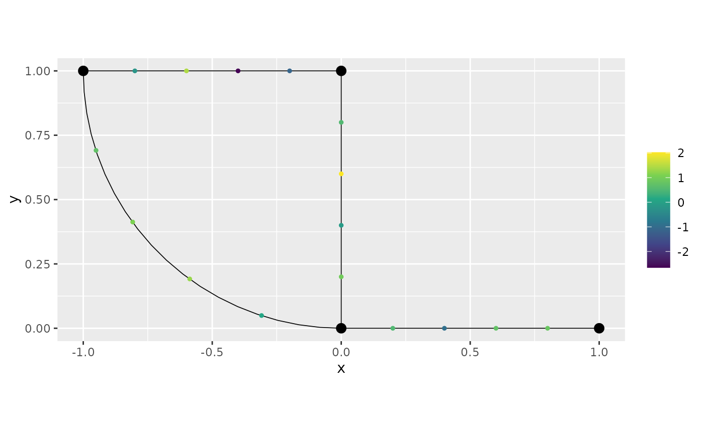

In many cases, one wants to sample the field at evenly spaced locations
over the graph. To avoid having to specify such locations manually, we
can first create a mesh on the graph

``` r

graph$build_mesh(h = 0.1)
graph$plot(mesh=TRUE)
```

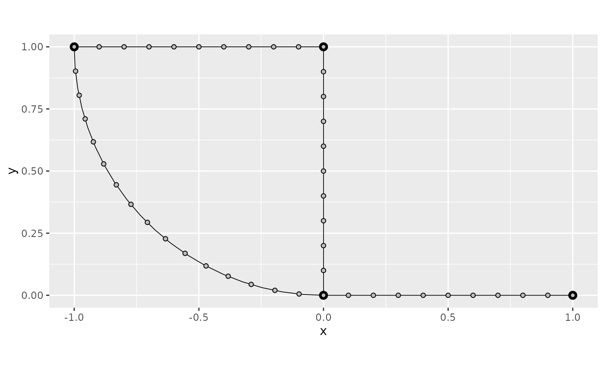

In the command `build_mesh`, the argument `h` decides the largest
spacing between nodes in the mesh. We can now sample the field on this
mesh and plot the result as a function as follows:

``` r

u <- sample_spde(range = range, sigma = sigma, alpha = alpha,
                 graph = graph, type = "mesh")
graph$plot_function(X = u)
```

    ## Warning: The `X` argument of `plot_function()` is deprecated as of MetricGraph
    ## 1.3.0.9000.
    ## ℹ Please use the `newdata` argument instead.
    ## ℹ The argument `X` is deprecated; please use `newdata` to ensure the correct
    ##   order when plotting.
    ## This warning is displayed once per session.
    ## Call `lifecycle::last_lifecycle_warnings()` to see where this warning was
    ## generated.

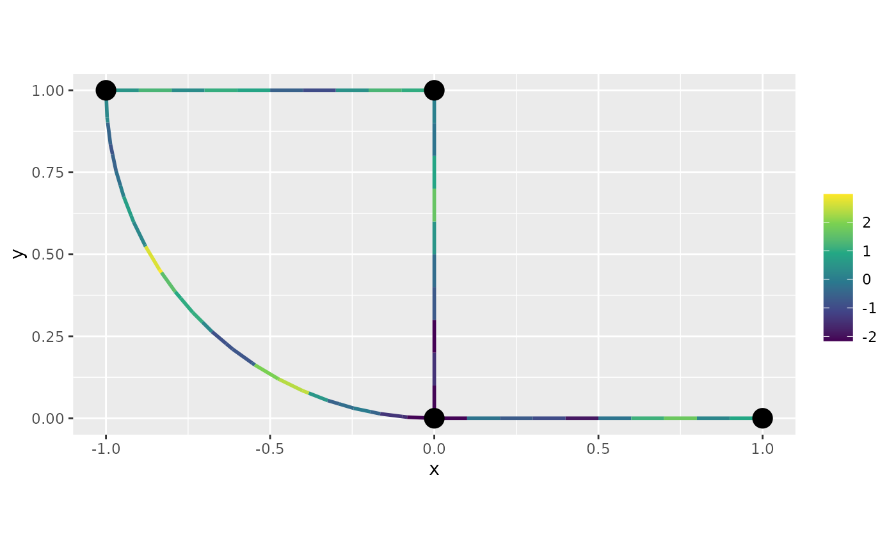

Let us construct a finer mesh, simulate the field, and visualize the
simulation in 3D by specifying the `plotly` argument in the plot
function:

``` r

graph$build_mesh(h = 0.01)


u <- sample_spde(range = range, sigma = sigma, alpha = alpha,
                 graph = graph, type = "mesh")
graph$plot_function(X = u, type = "plotly")
```

    ## Loading required namespace: plotly

Since $`\alpha=1`$, these sample paths are continuous but not
differentiable. To visualize the correlation structure of the field, we
can compute and plot the covariances between some point and all other
points in the graph as follows:

``` r

C <- spde_covariance(c(2, 0.2), range = range, sigma = sigma, alpha = 1,
                            graph = graph)
graph$plot_function(X = C, type = "plotly")
```

To obtain a field with differentiable sample paths, we can change to
$`\alpha=2`$. The corresponding covariance function then looks as
follows:

``` r

C <- spde_covariance(c(2, 0.2), range = range, sigma = sigma, alpha = 2,
                            graph = graph)
graph$plot_function(X = C, type = "plotly")
```

Let us simulate a process with $`\alpha=2`$ as well:

``` r

u <- sample_spde(range = range, sigma = sigma, alpha = 2,
                 graph = graph, type = "mesh")
graph$plot_function(X = u, type = "plotly")
```

### Inference

The `MetricGraph` package contains implementations of a linear mixed
effects models, where the random effect can be Whittle–Matérn fields,
and the model is observed under Gaussian measurement noise. We also
implemented random effects being SPDE fields obtained from the graph
Laplacian as well as models with isotropic covariances. In this section
we will illustrate these methods. For the use of the Whittle–Matérn
fields in more complicated hierarchical models, we recommend using the
interfaces to the `INLA` and `inlabru` packages. See [INLA interface of
Whittle–Matérn
fields](https://davidbolin.github.io/MetricGraph/articles/inla_interface.md)
and [inlabru interface of Whittle–Matérn
fields](https://davidbolin.github.io/MetricGraph/articles/inlabru_interface.md)
for further details on these.

Suppose that we want to estimate the model parameters of a
Whittle–Matérn field $`u(s)`$ observed under Gaussian measurement noise.
That is, we assume that we are given observations
``` math
y_i = u(s_i) + \varepsilon_i, \quad i=1,\ldots,n
```
where $`s_i\in \Gamma`$ are observation locations and $`\varepsilon_i`$
are independent centered Gaussian variables $`N(0,\sigma_e^2)`$
representing measurement noise.

Let us start by generating some data like this and adding it to the
metric graph. For further details on data manipulation on metric graphs,
see [Data manipulation on metric
graphs](https://davidbolin.github.io/MetricGraph/articles/metric_graph_data.md).

``` r

range <- 0.2
sigma <- 1.3
sigma_e <- 0.1
alpha <- 1

n.obs.per.edge <- 75
PtE <- NULL
for(i in 1:graph$nE){
  #add locations sampled at random to each edge
  PtE <- rbind(PtE, cbind(rep(i, n.obs.per.edge), runif(n.obs.per.edge)))
}

u <- sample_spde(range = range, sigma = sigma, alpha = alpha,
                 graph = graph, PtE = PtE)

y <- u + sigma_e*rnorm(n.obs.per.edge * graph$nE)

df_data <- data.frame(y = y, edge_number = PtE[,1],
                        distance_on_edge = PtE[,2])

graph$clear_observations() # Removing previous observations
graph$add_observations(data = df_data, normalized = TRUE)
```

    ## Adding observations...

    ## Assuming the observations are normalized by the length of the edge.

``` r

graph$plot(data = "y")
```

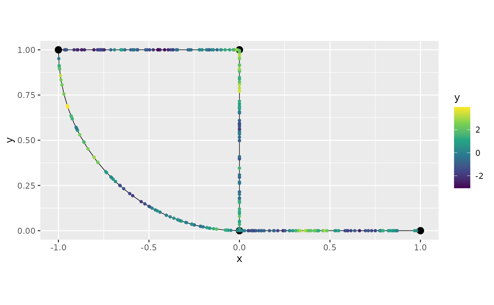

We can now use the
[`graph_lme()`](https://davidbolin.github.io/MetricGraph/reference/graph_lme.md)
function to fit the above model. By default a linear regression model is
chosen. Since we want to fit a model with a latent model given by a
Whittle-Matérn field with $`\alpha=1`$, we should set the `model`
argument to either `'alpha1'` or to
`list(model = 'WhittleMatern', alpha = 1)` (the first is more convenient
but less decriptive). We will choose `parameterization_latent` as
`"spde"` to obtain the estimated values for `kappa` and `sigma`. By
default it provides estimated values for the range parameter and
`sigma`.

``` r

res <- graph_lme(y ~ -1, graph = graph, model = 'WM1')

summary(res)
```

    ## 
    ## Latent model - Whittle-Matern with alpha = 1
    ## 
    ## Call:
    ## graph_lme(formula = y ~ -1, graph = graph, model = "WM1")

    ## 
    ## No fixed effects.

    ## 
    ## Random effects:
    ##       Estimate Std.error z-value
    ## tau   0.177149  0.009516  18.616
    ## kappa 6.064678  1.758753   3.448
    ## 
    ## Random effects (Matern parameterization):
    ##       Estimate Std.error z-value
    ## sigma  1.62085   0.22018   7.362
    ## range  0.32978   0.09452   3.489
    ## 
    ## Measurement error:
    ##          Estimate Std.error z-value
    ## std. dev  0.10765   0.02355   4.571
    ## ---
    ## Signif. codes:  0 '***' 0.001 '**' 0.01 '*' 0.05 '.' 0.1 ' ' 1 
    ## 
    ## Log-Likelihood:  -239.2584 
    ## Number of function calls by 'optim' = 19
    ## Optimization method used in 'optim' = L-BFGS-B
    ## 
    ## Time used to:     fit the model =  0.78698 secs

We can also take a glance at `res`:

``` r

glance(res)
```

    ## # A tibble: 1 × 9
    ##    nobs sigma logLik   AIC   BIC deviance df.residual model         alpha
    ##   <int> <dbl>  <dbl> <dbl> <dbl>    <dbl>       <dbl> <chr>         <dbl>
    ## 1   300 0.108  -239.  485.  496.     479.         297 WhittleMatern     1

Let us now compare with the true values:

``` r

sigma_e_est <- res$coeff$measurement_error
sigma_est <- res$matern_coeff$random_effects[1]
range_est <- res$matern_coeff$random_effects[2]
results <- data.frame(sigma_e = c(sigma_e, sigma_e_est),
                      sigma = c(sigma, sigma_est),
                      range = c(range, range_est),
                      row.names = c("Truth", "Estimate"))
print(results)
```

    ##            sigma_e    sigma     range
    ## Truth    0.1000000 1.300000 0.2000000
    ## Estimate 0.1076494 1.620853 0.3297784

Given these estimated parameters, we can now do kriging to estimate the
field at locations in the graph. As an example, we now estimate the
field on the regular mesh that we previously constructed.

``` r

u_est <- predict(res, data.frame(edge_number = graph$mesh$VtE[,1],
                        distance_on_edge = graph$mesh$VtE[,2]), normalized = TRUE)

graph$plot_function(X = u_est$mean, type = "plotly")
```

We can, alternatively, use the
[`augment()`](https://davidbolin.github.io/MetricGraph/reference/augment.graph_lme.md)
function:

``` r

pred_aug <- augment(res, data.frame(edge_number = graph$mesh$VtE[,1],
                        distance_on_edge = graph$mesh$VtE[,2]), normalized = TRUE)
p <- graph$plot_function(X = pred_aug[[".fitted"]], type = "plotly")
graph$plot(data = "y", p=p, type = "plotly")
```

The same procedure can be done with $`\alpha = 2`$. One can also
estimate $`\alpha`$ from data as described in the vignette
[Whittle–Matérn fields with general
smoothness](https://davidbolin.github.io/MetricGraph/articles/fem_models.md).

## Isotropic Gaussian processes

For metric graphs with Euclidean edges, [Anderes et al.
(2020)](https://projecteuclid.org/journals/annals-of-statistics/volume-48/issue-4/Isotropic-covariance-functions-on-graphs-and-their-edges/10.1214/19-AOS1896.full)
showed that one can define valid Gaussian processes through various
isotropic covariance functions if the distances between points are
measured in the so-called resistance metric $`d(\cdot,\cdot)`$. One
example of a valid covariance function is the isotropic exponential
covariance function
``` math
r(d(s,t)) = \sigma^2\exp(-\kappa d(s,t)).
```
To use this, or any other valid covariance, on a metric graph, the only
cumbersome thing is to compute the metric. The `metric_graph` class has
built in support for this, which we now illustrate.

Suppose that we want to sample a Gaussian process with an exponential
covariance on a the mesh in the graph that we considered above. For
this, we need to compute the resistance metric between the mesh
locations, which can be done as follows:

``` r

graph$compute_resdist_mesh()
```

We can now construct the covariance matrix for the process:

``` r

sigma <- 1
kappa <- 5
Sigma <- sigma^2*exp(-kappa*graph$mesh$res_dist)
graph$plot_function(X = Sigma[20,], type = "plotly")
```

One can note that this covariance function looks quite similar to that
of the Whittle–Matérn fields with $`\alpha = 1`$. Let us plot the
corresponding Whittle–Matérn covariance to compare:

``` r

P <- c(1, graph$mesh$V[20,1])
C.wm <- spde_covariance(P,range=2/kappa, sigma=sigma, graph=graph, alpha = 1)
p <- graph$plot_function(X = Sigma[20,], type = "plotly")
graph$plot_function(X = C.wm, type = "plotly", p = p, line_color = 'rgb(100,0,0)',
                    support_width = 0)
```

Because of the similarities between these two covairance functions, we
recomend using the Whittle–Matérn since it has Markov properties which
makes inference much faster if that is used. Further, that covariance is
well-defined for any compact metric graph, whereas the isotropic
exponential is only guaranteed to be positive definite if the graph has
Euclidean edges. See [Bolin et al.
(2023)](https://arxiv.org/abs/2304.10372) for further comparisons.

However, let us now illustrate how we can fit this covariance to data.
We first clear the observations that were previously added to the graph,
then simulate observation locations as above, sample the processes at
these locations, and finally construct the data to add to the metric
graph:

``` r

graph$clear_observations()
sigma <-1.5
kappa <- 20
sigma_e <- 0.1
n.obs.per.edge <- 50

PtE <- NULL
for(i in 1:graph$nE){
  PtE <- rbind(PtE, cbind(rep(i, n.obs.per.edge), runif(n.obs.per.edge)))
}
D <- graph$compute_resdist_PtE(PtE, normalized = TRUE)
# Sigma <- sigma^2*exp(-kappa*D)
Sigma <- as.matrix(exp_covariance(D, c(sigma, kappa)))
u <- t(chol(Matrix::forceSymmetric(Sigma)))%*%rnorm(n.obs.per.edge * graph$nE)
y <- u + sigma_e*rnorm(n.obs.per.edge * graph$nE)

df_isocov <- data.frame(y = as.vector(y), edge_number = PtE[,1],
                        distance_on_edge = PtE[,2])

graph$add_observations(data = df_isocov, normalized=TRUE)
```

    ## Adding observations...

    ## Assuming the observations are normalized by the length of the edge.

``` r

graph$plot(data = "y")
```

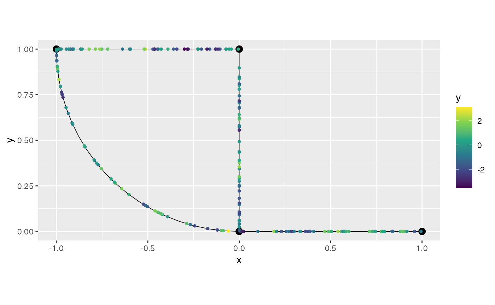

We can now fit the model with the
[`graph_lme()`](https://davidbolin.github.io/MetricGraph/reference/graph_lme.md)
function. We need to set model to `list(type="isoCov")`, by default the
exponential covariance will be used. Alternatively, if one wants to
directly use the isotropic exponential covariance function, one can
simply set the model to `isoexp`.

``` r

res_exp <- graph_lme(y ~ -1, graph = graph, model = list(type = "isoCov"))
```

    ## Warning in graph_lme(y ~ -1, graph = graph, model = list(type = "isoCov")): No
    ## check for Euclidean edges have been perfomed on this graph. The isotropic
    ## covariance models are only known to work for graphs with Euclidean edges. You
    ## can check if the graph has Euclidean edges by running the `check_euclidean()`
    ## method. See the vignette
    ## https://davidbolin.github.io/MetricGraph/articles/isotropic_noneuclidean.html
    ## for further details.

Observe that we received a warning saying that we did not check if the
graph has Euclidean edges. This is due to the fact that the isotropic
covariance models are only known to work for graphs with Euclidean
edges. Let us check if the graph has Euclidean edges. To this end, we
need to use the `check_euclidean()` method:

``` r

graph$check_euclidean()
```

Now, we simply call the graph to print its characteristics:

``` r

graph
```

    ## A metric graph with  4  vertices and  4  edges.
    ## 
    ## Vertices:
    ##   Degree 1: 1;  Degree 2: 2;  Degree 3: 1; 
    ##   With incompatible directions:  2 
    ## 
    ## Edges: 
    ##   Lengths: 
    ##       Min: 1  ; Max: 1.570349  ; Total: 4.570349 
    ##   Weights: 
    ##       Min: 1  ; Max: 1 
    ##   That are circles:  0 
    ## 
    ## Graph units: 
    ##   Vertices unit:  None  ; Lengths unit:  None 
    ## 
    ## Longitude and Latitude coordinates:  FALSE
    ## 
    ## Some characteristics of the graph:
    ##   Connected: TRUE
    ##   Has loops: FALSE
    ##   Has multiple edges: FALSE
    ##   Is a tree: FALSE
    ##   Distance consistent: TRUE
    ##   Has Euclidean edges: TRUE

We can see that this is a graph with Euclidean edges. Let us run the fit
again, and this time no warning will appear. Further, this time we will
set the model to `isoexp` for conveniency:

``` r

res_exp <- graph_lme(y ~ -1, graph = graph, model = "isoexp")
summary(res_exp)
```

    ## 
    ## Latent model - Covariance-based model
    ## 
    ## Call:
    ## graph_lme(formula = y ~ -1, graph = graph, model = "isoexp")

    ## 
    ## No fixed effects.

    ## 
    ## Random effects:
    ##       Estimate Std.error z-value
    ## tau     1.4150    0.1088   13.01
    ## kappa  25.8070    5.4788    4.71
    ## 
    ## Measurement error:
    ##          Estimate Std.error z-value
    ## std. dev  0.15026   0.08407   1.787
    ## ---
    ## Signif. codes:  0 '***' 0.001 '**' 0.01 '*' 0.05 '.' 0.1 ' ' 1 
    ## 
    ## Log-Likelihood:  -268.2396 
    ## Number of function calls by 'optim' = 21
    ## Optimization method used in 'optim' = L-BFGS-B
    ## 
    ## Time used to:     fit the model =  0.31058 secs

``` r

sigma_e_est <- res_exp$coeff$measurement_error
sigma_est <- res_exp$coeff$random_effects[1]
kappa_est <- res_exp$coeff$random_effects[2]

results <- data.frame(sigma_e = c(sigma_e, sigma_e_est),
                      sigma = c(sigma, sigma_est),
                      kappa = c(kappa, kappa_est),
                      row.names = c("Truth", "Estimate"))
print(results)
```

    ##            sigma_e    sigma    kappa
    ## Truth    0.1000000 1.500000 20.00000
    ## Estimate 0.1502642 1.414989 25.80701

Let us now compute the posterior mean for the field at the observation
locations:

``` r

u_est_exp <- predict(res_exp, df_isocov, normalized = TRUE)
graph$plot(X = u_est_exp$mean, X_loc = PtE)
```

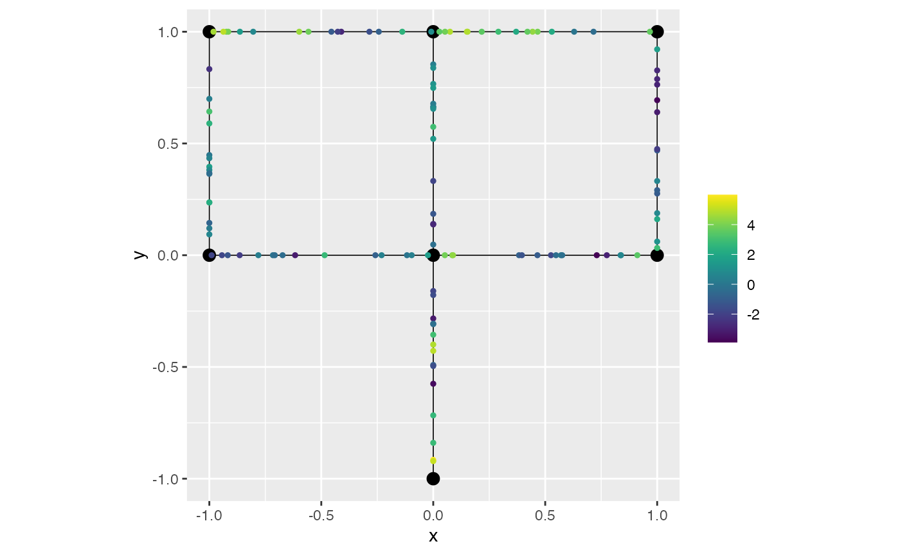

We can, alternatively, use the
[`augment()`](https://davidbolin.github.io/MetricGraph/reference/augment.graph_lme.md)
function:

``` r

pred_aug_exp <- augment(res_exp, data.frame(edge_number = graph$mesh$VtE[,1],
                        distance_on_edge = graph$mesh$VtE[,2]), normalized = TRUE)
p <- graph$plot_function(X = pred_aug_exp[[".fitted"]], type = "plotly")
graph$plot(data = "y", p=p, type = "plotly")
```

## Models based on the Graph Laplacian

A final set of Gaussian models that is supported by `MetricGraph` is the
Matérn type processes based on the graph Laplacian introduced by
[Borovitskiy et al.
(2021)](http://proceedings.mlr.press/v130/borovitskiy21a/borovitskiy21a.pdf).
These are multivariate Gaussian distributions, which are defined in the
vertices through the equation
``` math
(\kappa^2\mathbf{I} - \mathbf{\Delta}_\Gamma)^{\alpha/2}\mathbf{u} = \mathbf{W}
```
Here $`\mathbf{W}\sim N(0,\sigma^2\mathbf{I})`$ is a vector with
independent Gaussian variables and $`\mathbf{\Delta}_\Gamma`$ is the
graph Laplacian. Further, $`\mathbf{u}`$ is a vector with the values of
the process in the vertices of $`\Gamma`$, which by definition has
precision matrix
``` math
\mathbf{Q} = \sigma^{-2}(\kappa^2\mathbf{I} - \mathbf{\Delta}_\Gamma)^{\alpha}
```
Thus, to define these models, the only
\``difficult'' thing is to compute the graph Laplacian. The (weighted) graph Laplacian, where the weights are specified by the edge lengths can be computed by the function`compute_laplacian()`in the`metric_graph\`
object. We first generate some random locations, and then we compute the
Laplacian on these locations:

``` r

n.obs.per.edge <- 100
PtE <- NULL
for(i in 1:graph$nE){
  PtE <- rbind(PtE, cbind(rep(i, n.obs.per.edge), sort(runif(n.obs.per.edge))))
}
## Removing problematic locations (locations very close) to improve numerical stability
prob_points <- which(abs(diff(PtE[,2])) < 5e-3)
prob_points <- c(prob_points, which(PtE[,2] < 5e-3))
prob_points <- c(prob_points, which(PtE[,2] > 1 - 5e-3))

PtE <- PtE[!(1:nrow(PtE)%in%prob_points),]
df_temp <- data.frame(y = 0, edge_number = PtE[,1],
                        distance_on_edge = PtE[,2])
                        
graph$clear_observations()
graph$add_observations(data = df_temp, normalized = TRUE)
```

    ## Adding observations...

    ## Assuming the observations are normalized by the length of the edge.

``` r

graph$compute_laplacian()

GL <- graph$Laplacian[[1]]
```

Let us now generate the data for a graph Laplacian model with
$`\alpha=1`$:

``` r

library(Matrix)

tau <- 1
kappa <- 10
sigma_e <- 0.1

Q <- (kappa^2 * Diagonal(nrow(GL)) + GL) * tau^2
LQ <- chol(forceSymmetric(Q))
u <- solve(LQ, rnorm(nrow(Q)))[(attr(GL, "nV_idx") + 1):nrow(GL)] # The first attr(GL, "nV_idx") values are on the original vertices
y <- u + sigma_e*rnorm(length(u))

df_GL <- data.frame(y = as.vector(y), edge_number = PtE[,1],
                        distance_on_edge = PtE[,2])

graph$add_observations(data = df_GL, normalized=TRUE, clear_obs = TRUE)
```

    ## Adding observations...

    ## Assuming the observations are normalized by the length of the edge.

``` r

graph$plot(data = "y")
```

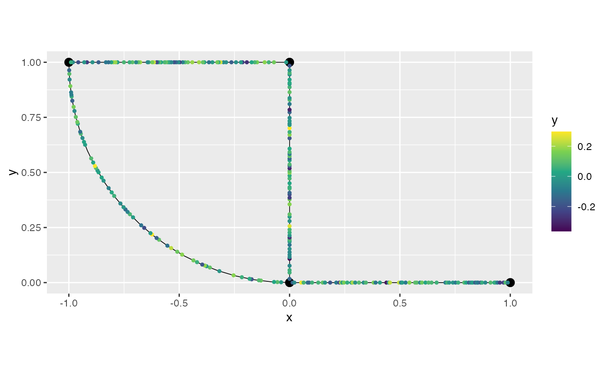

We can then fit the model to data similarly to how we fit the previous
models, with the help of the function
[`graph_lme()`](https://davidbolin.github.io/MetricGraph/reference/graph_lme.md):

``` r

res_GL <- graph_lme(y ~ -1, graph = graph, model = "GL1" )
```

    ## Warning in graph_lme(y ~ -1, graph = graph, model = "GL1"): All optimization
    ## methods failed to provide a positive-definite Hessian. The optimization method
    ## with largest likelihood was chosen. You can try to obtain a positive-definite
    ## Hessian by setting 'improve_hessian' to TRUE.

    ## Warning in sqrt(diag(inv_fisher)): NaNs produced

``` r

sigma_e_est <- res_GL$coeff$measurement_error
tau_est <- res_GL$coeff$random_effects[1]
kappa_est <- res_GL$coeff$random_effects[2]

results <- data.frame(sigma_e = c(sigma_e, sigma_e_est),
                      tau = c(tau, tau_est),
                      kappa = c(kappa, kappa_est),
                      row.names = c("Truth", "Estimate"))
print(results)
```

    ##             sigma_e       tau    kappa
    ## Truth    0.10000000 1.0000000 10.00000
    ## Estimate 0.01279282 0.2759945 26.27081

## A comparison using cross-validation

Let us now compare the different models in terms of predictive ability.
We start by simulating some data frome a Whittle–Matérn field with
$`\alpha = 2`$, fit all different models that we have discussed, and
then compare their predictive ability through leave-one-out
crossvalidation. To change things up a bit, let us consider a different
graph:

``` r

V <- rbind(c(0, 0),
           c(1, 0),
           c(1, 1),
           c(0, 1),
           c(-1, 1),
           c(-1, 0),
           c(0, -1))
E <- rbind(c(1, 2),
           c(2, 3),
           c(3, 4),
           c(4, 5),
           c(5, 6),
           c(6, 1),
           c(4, 1),
           c(1, 7))
graph <- metric_graph$new(V = V, E = E)
graph$plot()
```

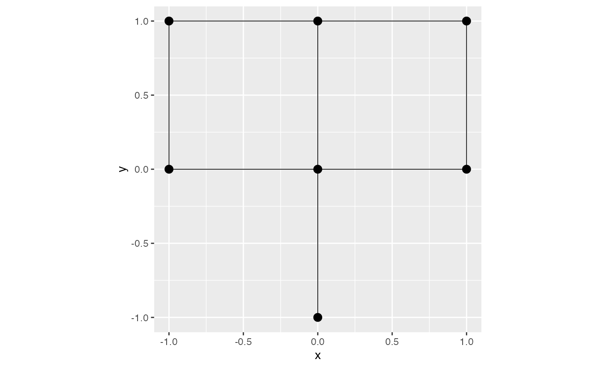

Let us now generate some observation locations at random locations on
each edge and sample the process:

``` r

range <- 0.15
sigma <- 2
sigma_e <- 0.3
theta <-  c(sigma_e, sigma, kappa)

n.obs.per.edge <- 15
PtE <- NULL
for(i in 1:graph$nE){
  #add locations sampled at random to each edge
  PtE <- rbind(PtE, cbind(rep(i, n.obs.per.edge), runif(n.obs.per.edge)))
}

u <- sample_spde(range = range, sigma = sigma, alpha = 2,
                 graph = graph, PtE = PtE, method = "Q")

y <- u + sigma_e*rnorm(n.obs.per.edge * graph$nE)

df_cv <- data.frame(y = y, edge_number = PtE[,1],
                      distance_on_edge = PtE[,2])

graph$add_observations(data=df_cv, normalized = TRUE)
```

    ## Adding observations...

    ## Assuming the observations are normalized by the length of the edge.

``` r

graph$plot(data = "y")
```

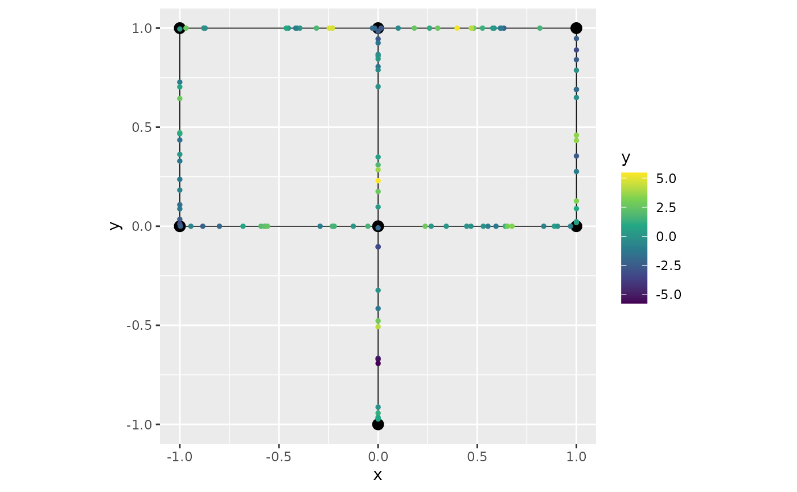

We now fit the different models to this data:

``` r

#alpha = 1 model
fit_alpha1 <- graph_lme(y ~ -1, graph=graph, model = list(type = "WhittleMatern", alpha = 1))

#alpha = 2 model
fit_alpha2 <- graph_lme(y ~ -1, graph=graph, model = list(type = "WhittleMatern", alpha = 2))

#Isotropic exponential
fit_isoexp <- graph_lme(y ~ -1, graph=graph, model = list(type = "isoCov"))
```

    ## Warning in graph_lme(y ~ -1, graph = graph, model = list(type = "isoCov")): No
    ## check for Euclidean edges have been perfomed on this graph. The isotropic
    ## covariance models are only known to work for graphs with Euclidean edges. You
    ## can check if the graph has Euclidean edges by running the `check_euclidean()`
    ## method. See the vignette
    ## https://davidbolin.github.io/MetricGraph/articles/isotropic_noneuclidean.html
    ## for further details.

``` r

#Graph Laplacian 
fit_GL1 <- graph_lme(y ~ -1, graph=graph, model = list(type = "graphLaplacian", alpha = 1))

fit_GL2 <- graph_lme(y ~ -1, graph=graph, model = list(type = "graphLaplacian", alpha = 2))
```

Finally, we use the function
[`posterior_crossvalidation()`](https://davidbolin.github.io/MetricGraph/reference/posterior_crossvalidation.md)
to perform leave-one-out cross validation based on the estimated
parameters and compare the results:

``` r

fitted_models_list <- list("alpha=1" = fit_alpha1, 
                    "alpha=2" = fit_alpha2, 
                    "isoExp" = fit_isoexp, 
                    "GL1" = fit_GL1, "GL2" = fit_GL2)

posterior_crossvalidation_loo(fitted_models_list, factor=1000)[["scores"]]
```

    ## # A tibble: 5 × 6
    ##   Model   logscore  crps scrps   mae  rmse
    ##   <chr>      <dbl> <dbl> <dbl> <dbl> <dbl>
    ## 1 alpha=1    1319.  598. 1014.  867. 1156.
    ## 2 alpha=2    1200.  545.  957.  794. 1055.
    ## 3 isoExp     1322.  600. 1015.  868. 1160.
    ## 4 GL1        1329.  610. 1019.  883. 1191.
    ## 5 GL2        1244.  574.  979.  829. 1125.

## A model with replicates

Let us illustrate now how one can fit a model with replicates. To this
end, we will consider the same graph from the previous example.

``` r

V <- rbind(c(0, 0),
           c(1, 0),
           c(1, 1),
           c(0, 1),
           c(-1, 1),
           c(-1, 0),
           c(0, -1))
E <- rbind(c(1, 2),
           c(2, 3),
           c(3, 4),
           c(4, 5),
           c(5, 6),
           c(6, 1),
           c(4, 1),
           c(1, 7))
graph <- metric_graph$new(V = V, E = E)
graph$plot()
```

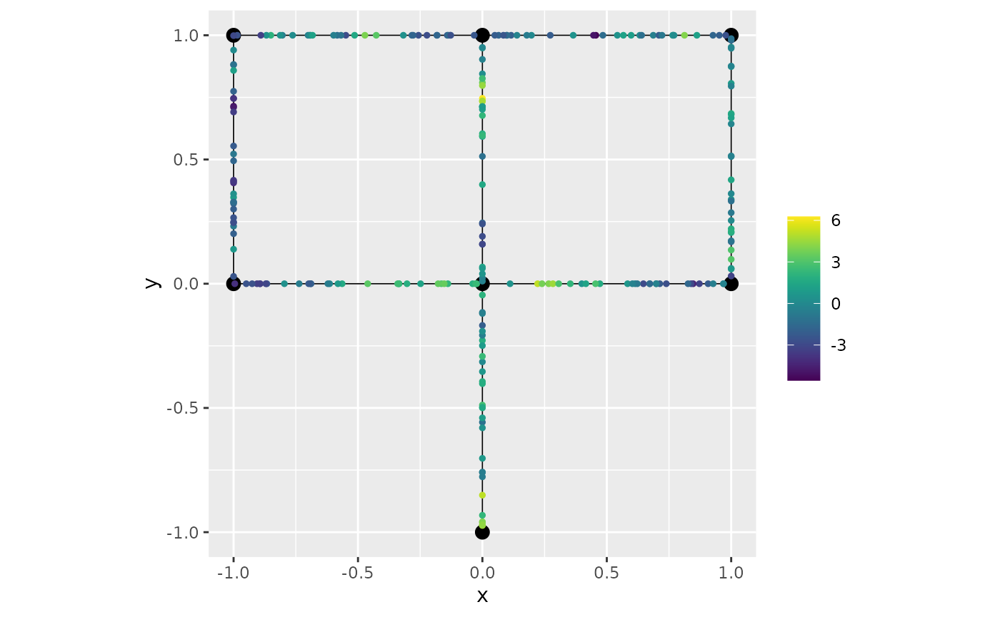

Let us now generate some observation locations at random locations on
each edge and sample the process. Let us sample from a Whitlle–Matérn
process on the metric graph with `alpha=1`. We will consider 20
replicates. To this end, we will set `nsim=20`:

``` r

library(tidyr)

range <- 0.15
sigma <- 2
sigma_e <- 0.1
theta <-  c(sigma_e, sigma, kappa)

n_repl <- 20

n.obs.per.edge <- 30
PtE <- NULL
for(i in 1:graph$nE){
  #add locations sampled at random to each edge
  PtE <- rbind(PtE, cbind(rep(i, n.obs.per.edge), runif(n.obs.per.edge)))
}

u <- sample_spde(range = range, sigma = sigma, alpha = 1,
                 graph = graph, PtE = PtE, nsim = n_repl)

y <- u + sigma_e*matrix(rnorm(n.obs.per.edge * graph$nE * n_repl), ncol = n_repl)

df_graph <- data.frame(y=y, edge_number = PtE[,1],
                      distance_on_edge = PtE[,2])

df_graph <- pivot_longer(df_graph, cols = `y.1`:`y.20`, names_to = "repl", values_to = "y")

graph$add_observations(data = df_graph, normalized = TRUE, group="repl")
```

To plot the first replicate, we can simply call `graph$plot(data=TRUE)`.
To plot another replicate, we set the argument `group` to the index of
the replicate we want to plot. Let us plot the first and second
replicates:

``` r

graph$plot(data="y")
```

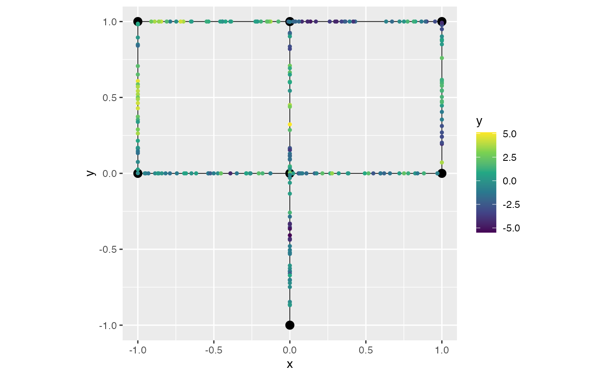

``` r

graph$plot(data="y", group="y.2")
```

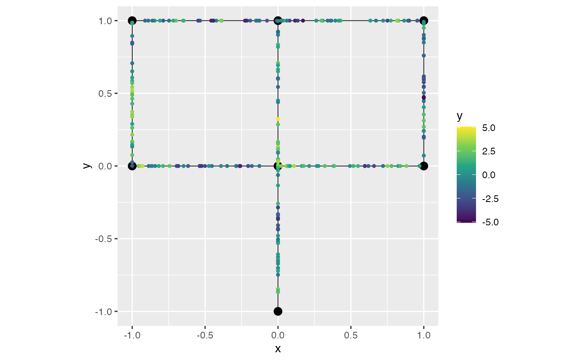

``` r

graph$plot(data="y", group=2)
```

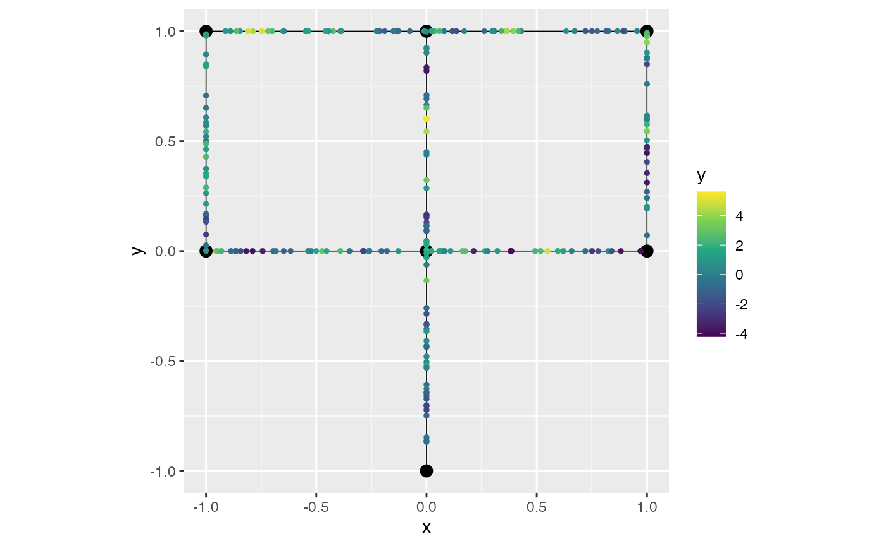

To fit the model, we simply proceed in an identical manner as for the
case without replicates by using the
[`graph_lme()`](https://davidbolin.github.io/MetricGraph/reference/graph_lme.md)
function:

``` r

fit_repl <- graph_lme(y ~ -1, graph = graph, model = "WM1")

sigma_e_est <- fit_repl$coeff$measurement_error
sigma_est <- fit_repl$matern_coeff$random_effects[1]
range_est <- fit_repl$matern_coeff$random_effects[2]
 
results <- data.frame(sigma_e = c(sigma_e, sigma_e_est),
                      sigma = c(sigma, sigma_est),
                      range = c(range, range_est),
                      row.names = c("Truth", "Estimate"))
print(results)
```

    ##             sigma_e    sigma     range
    ## Truth    0.10000000 2.000000 0.1500000
    ## Estimate 0.09276013 2.040728 0.1565558

Let us now fit a model with isotropic exponential covariance on the same
data:

``` r

fit_repl_isoexp <- graph_lme(y ~ -1, graph = graph,
                            model = list(type = "isoCov"))
```

    ## Warning in graph_lme(y ~ -1, graph = graph, model = list(type = "isoCov")): No
    ## check for Euclidean edges have been perfomed on this graph. The isotropic
    ## covariance models are only known to work for graphs with Euclidean edges. You
    ## can check if the graph has Euclidean edges by running the `check_euclidean()`
    ## method. See the vignette
    ## https://davidbolin.github.io/MetricGraph/articles/isotropic_noneuclidean.html
    ## for further details.

``` r

summary(fit_repl_isoexp)
```

    ## 
    ## Latent model - Covariance-based model
    ## 
    ## Call:
    ## graph_lme(formula = y ~ -1, graph = graph, model = list(type = "isoCov"))

    ## 
    ## No fixed effects.

    ## 
    ## Random effects:
    ##       Estimate Std.error z-value
    ## tau    2.03157   0.03554   57.17
    ## kappa 12.98270   0.54430   23.85
    ## 
    ## Measurement error:
    ##          Estimate Std.error z-value
    ## std. dev  0.09231   0.01014   9.106
    ## ---
    ## Signif. codes:  0 '***' 0.001 '**' 0.01 '*' 0.05 '.' 0.1 ' ' 1 
    ## 
    ## Log-Likelihood:  -7689.511 
    ## Number of function calls by 'optim' = 22
    ## Optimization method used in 'optim' = L-BFGS-B
    ## 
    ## Time used to:     fit the model =  4.05242 secs

To do kriging, we proceed in an identical way, by providing a
`data.frame` with the locations we want to obtain predictions.

Let us obtain predictions for the observation locations. By setting
`return_as_list` to `TRUE` we obtain a list of predictions, in which
each element consists of predictions for the corresponding replicate.

``` r

df_pred <-  data.frame(edge_number = PtE[,1],
                      distance_on_edge = PtE[,2])

pred_alpha1 <- predict(fit_repl, newdata = df_pred, normalized = TRUE, return_as_list = TRUE)
```

Let us now plot the predictions of the first replicate by using the
number which indicates the order of the replicate:

``` r

graph$plot(X = pred_alpha1$mean[[1]], X_loc = df_pred)
```

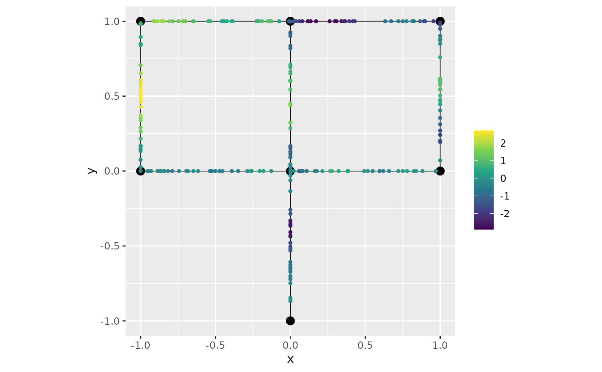

We can also use the name of the replicate. Let us plot the predictions
for replicate `y.15`:

``` r

graph$plot(X = pred_alpha1$mean[["y.15"]], X_loc = df_pred)
```

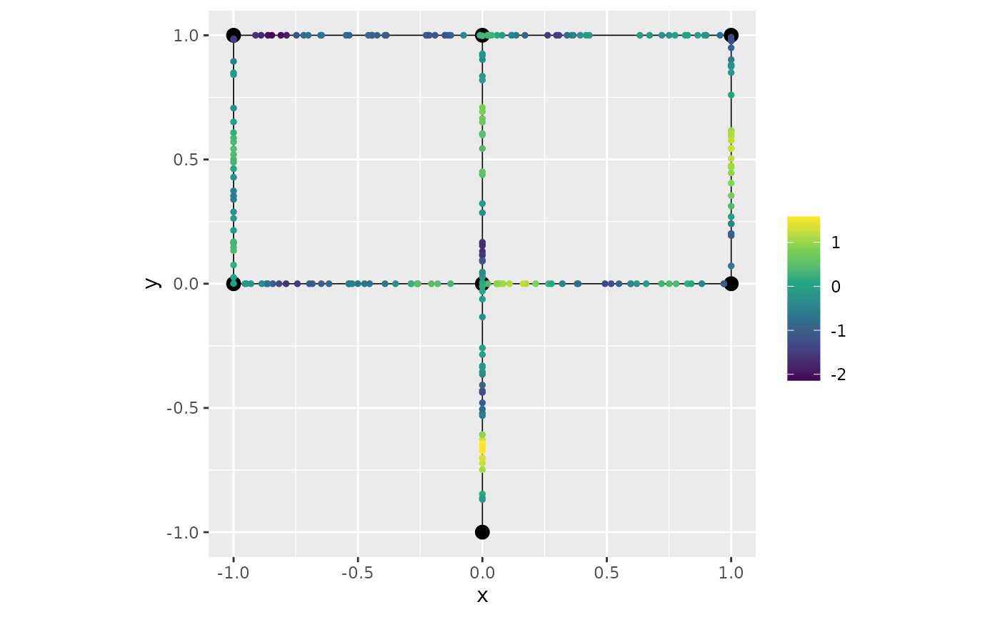

## A model with covariates

In this example we will consider the first graph:

``` r

edge1 <- rbind(c(0,0),c(1,0))
edge2 <- rbind(c(0,0),c(0,1))
edge3 <- rbind(c(0,1),c(-1,1))
theta <- seq(from=pi,to=3*pi/2,length.out = 20)
edge4 <- cbind(sin(theta),1+ cos(theta))
edges = list(edge1, edge2, edge3, edge4)
graph <- metric_graph$new(edges = edges)
graph$plot()
```


Let us now generate some observation locations at random locations on
each edge and sample the process. Let us sample from a Whitlle–Matérn
process on the metric graph with `alpha=1`. We will include an intercept
and covariates. The covariates can be added as columns in the
`data.frame` passed to the `add_observations()` function.

``` r

graph$clear_observations()
range <- 0.15
sigma <- 2
sigma_e <- 0.1
theta <-  c(sigma_e, sigma, kappa)

n.obs.per.edge <- 75
PtE <- NULL
for(i in 1:graph$nE){
  #add locations sampled at random to each edge
  PtE <- rbind(PtE, cbind(rep(i, n.obs.per.edge), runif(n.obs.per.edge)))
}

u <- sample_spde(range = range, sigma = sigma, alpha = 1,
                 graph = graph, PtE = PtE)

beta <- c(2,1)

X_cov <- cbind(1, runif(nrow(PtE)))

y <- X_cov %*% beta +  u + sigma_e*rnorm(n.obs.per.edge * graph$nE)
```

``` r

df_graph <- data.frame(y=y, x1 = X_cov[,2], edge_number = PtE[,1], distance_on_edge=PtE[,2])
graph$add_observations(data=df_graph, normalized = TRUE)
```

    ## Adding observations...

    ## Assuming the observations are normalized by the length of the edge.

Let us now estimate the parameters using the
[`graph_lme()`](https://davidbolin.github.io/MetricGraph/reference/graph_lme.md)
function:

``` r

fit_cov <- graph_lme(y ~ x1, graph = graph, model = "WM1")
sigma_e_est <- fit_cov$coeff$measurement_error
sigma_est <- fit_cov$matern_coeff$random_effects[1]
range_est <- fit_cov$matern_coeff$random_effects[2]
beta_1_est <- fit_cov$coeff$fixed_effects[1]
beta_2_est <- fit_cov$coeff$fixed_effects[2]
results <- data.frame(sigma_e = c(sigma_e, sigma_e_est),
                      sigma = c(sigma, sigma_est),
                      range = c(range, range_est),
                      beta_1 = c(beta[1], beta_1_est),
                      beta_2 = c(beta[2], beta_2_est),
                      row.names = c("Truth", "Estimate"))
print(results)
```

    ##            sigma_e    sigma     range   beta_1   beta_2
    ## Truth    0.1000000 2.000000 0.1500000 2.000000 1.000000
    ## Estimate 0.1737022 1.889517 0.1509286 1.601811 1.132982

To do kriging, we can use the
[`predict()`](https://rdrr.io/r/stats/predict.html) method together with
a `data.frame` containing the locations and the covariates at the
locations we want to obtain the predictions. Let us obtain predictions
for the observation locations:

``` r

pred_cov <- predict(fit_cov, newdata = df_graph, normalized = TRUE)
```

Let us now plot the predictions of the first replicate by using the
number which indicates the order of the replicate:

``` r

graph$plot(X = pred_cov$mean, X_loc = df_graph[,3:4])
```

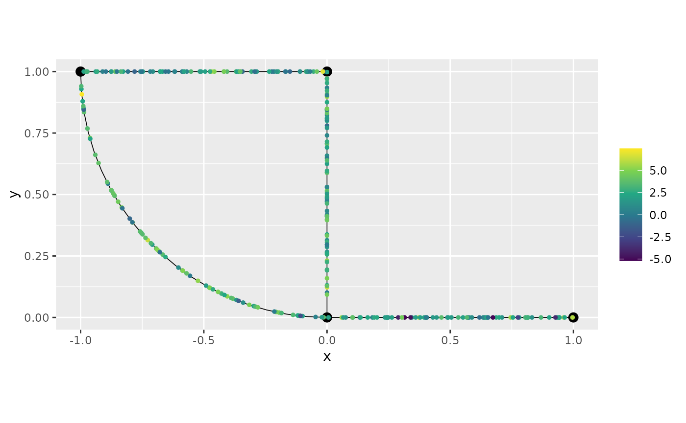

## A model with covariates and replicates

Let us consider the same graph from the previous example:

``` r

edge1 <- rbind(c(0,0),c(1,0))
edge2 <- rbind(c(0,0),c(0,1))
edge3 <- rbind(c(0,1),c(-1,1))
theta <- seq(from=pi,to=3*pi/2,length.out = 20)
edge4 <- cbind(sin(theta),1+ cos(theta))
edges = list(edge1, edge2, edge3, edge4)
graph <- metric_graph$new(edges = edges)
graph$plot()
```


Let us now generate some observation locations at random locations on
each edge and sample the process. Let us sample from a Whitlle–Matérn
process on the metric graph with `alpha=1` and 20 replicates. We will
include an intercept and covariates. The covariates can be added in the
`data.frame` passed to the `add_observations()` function.

``` r

range <- 0.2
sigma <- 2
sigma_e <- 0.1
theta <-  c(sigma_e, sigma, kappa)

n.obs.per.edge <- 30
n_repl <- 20
PtE <- NULL
for(i in 1:graph$nE){
  #add locations sampled at random to each edge
  PtE <- rbind(PtE, cbind(rep(i, n.obs.per.edge), runif(n.obs.per.edge)))
}

u <- sample_spde(range = range, sigma = sigma, alpha = 1,
                 graph = graph, PtE = PtE, nsim = n_repl)

beta <- c(2,1)

X_cov <- cbind(1, runif(nrow(PtE)))

y <- NULL
for(i in 1:n_repl){
  y_tmp <- X_cov %*% beta +  u[,i] + sigma_e*rnorm(n.obs.per.edge * graph$nE)
  y <- cbind(y, y_tmp)
}

data_list <- lapply(1:n_repl, function(i){data.frame(y = y[,i], x1 = X_cov[,2],
                                          edge_number = PtE[,1],
                                          distance_on_edge = PtE[,2], repl = i)})

df_graph <- do.call(rbind, data_list)

graph$add_observations(data = df_graph, normalized = TRUE, group = "repl")
```

    ## Adding observations...

    ## Assuming the observations are normalized by the length of the edge.

Let us now estimate the parameters with the
[`graph_lme()`](https://davidbolin.github.io/MetricGraph/reference/graph_lme.md)
function:

``` r

fit_cov_repl <- graph_lme(y ~ x1, graph = graph, model = "WM1")
sigma_e_est <- fit_cov_repl$coeff$measurement_error
sigma_est <- fit_cov_repl$matern_coeff$random_effects[1]
range_est <- fit_cov_repl$matern_coeff$random_effects[2]
beta_1_est <- fit_cov_repl$coeff$fixed_effects[1]
beta_2_est <- fit_cov_repl$coeff$fixed_effects[2]
results <- data.frame(sigma_e = c(sigma_e, sigma_e_est),
                      sigma = c(sigma, sigma_est),
                      range = c(range, range_est),
                      beta_1 = c(beta[1], beta_1_est),
                      beta_2 = c(beta[2], beta_2_est),
                      row.names = c("Truth", "Estimate"))
print(results)
```

    ##             sigma_e    sigma     range   beta_1   beta_2
    ## Truth    0.10000000 2.000000 0.2000000 2.000000 1.000000
    ## Estimate 0.09150327 1.923118 0.1836944 1.860836 1.013391

Finally, we can do kriging in an analogous manner to the previous cases.
Let us obtain predictions for the first replicate on the observation
locations:

``` r

df_pred <-  data.frame(edge_number = PtE[,1],
                      distance_on_edge = PtE[,2], x1 = X_cov[,2])

pred_cov_repl <- predict(fit_cov_repl, newdata = df_pred, normalized = TRUE, return_as_list = TRUE)
```

Let us now plot the predictions of the first replicate by using the
number which indicates the order of the replicate:

``` r

graph$plot(X = pred_cov_repl$mean[[1]], X_loc = df_pred[,1:2])
```

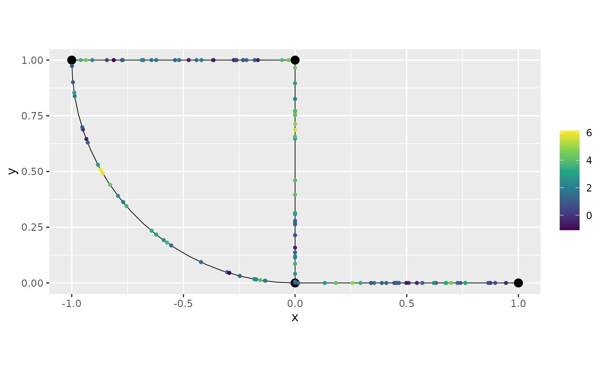

## References

Anderes, Ethan, Jesper Møller, and Jakob G. Rasmussen. 2020. “Isotropic
Covariance Functions on Graphs and Their Edges.” *Annals of Statistics*
48: 2478–503.

Bolin, David, Alexandre B. Simas, and Jonas Wallin. 2023. “Statistical
Properties of Gaussian Whittle–Matérn Fields on Metric Graphs.”
*arXiv:2304.10372*.

Bolin, David, Alexandre B. Simas, and Jonas Wallin. 2024. “Gaussian
Whittle–Matérn Fields on Metric Graphs.” *Bernoulli* 30: 1611–39.

Borovitskiy, Viacheslav, Iskander Azangulov, Alexander Terenin, Peter
Mostowsky, Marc Deisenroth, and Nicolas Durrande. 2021. “Matérn Gaussian
Processes on Graphs.” *International Conference on Artificial
Intelligence and Statistics*, 2593–601.
