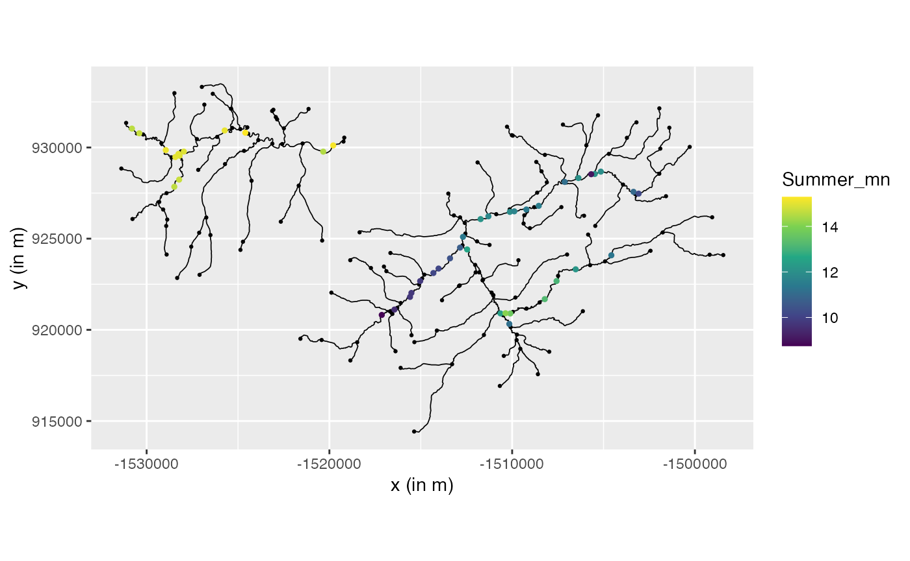

# An example with a river graph model

## Introduction

In this vignette we explore how to build a directional graph model on a
river network. The data is imported from the package `SSN2`.

## Setting up the data

Here we take the data as is described in the [Vignette of
`SSN2`](https://cran.r-project.org/web/packages/SSN2/vignettes/introduction.html).
We will use the `geometry` object from the `SSN` object to build the
`metricGraph` object. We also load the observations and the relevant
covariates. We assume that in the `geometry` object the lines are so
that they go downwards along the river.

``` r

library(MetricGraph)
library(SSN2)

copy_lsn_to_temp()
path <- file.path(tempdir(), "MiddleFork04.ssn")

mf04p <- ssn_import(
  path = path,
  predpts = c("pred1km", "CapeHorn"),
  overwrite = TRUE
)
```

To create the graph, we simply pass the `SSN` object as edges. This will
automatically extract the correct coordinate reference system (CRS). We
have found that, typically, `SSN` objects do not require merges.

``` r

graph <- metric_graph$new(mf04p)
```

Observe that this already added, by default, the observations and edge
weights contained in the `SSN` object:

``` r

dat <- graph$get_data()
dat
```

    ## # A tibble: 45 × 32
    ##      rid   pid STREAMNAME     COMID AREAWTMAP   SLOPE ELEV_DEM Source  Summer_mn
    ##    <int> <int> <chr>          <int>     <dbl>   <dbl>    <int> <chr>       <dbl>
    ##  1     1     3 Bear Valley 23519365     1001. 0.00274     1958 RMRS_M…      14.6
    ##  2     1     2 Bear Valley 23519365     1001. 0.00274     1952 RMRS_M…      14.7
    ##  3     1     1 Bear Valley 23519365     1001. 0.00274     1947 RMRS_M…      14.9
    ##  4     5     5 Bear Valley 23519297     1007. 0.00568     1932 RMRS_M…      14.5
    ##  5     5     4 Bear Valley 23519297     1007. 0.00568     1923 RMRS_M…      15.2
    ##  6    10     6 Bear Valley 23519307     1009. 0.00042     1940 RMRS_M…      15.3
    ##  7    13     7 Bear Valley 23519313     1010. 0           1940 RMRS_M…      15.1
    ##  8    15     8 Bear Valley 23519317     1013. 0.00297     1945 RMRS_M…      14.9
    ##  9    17    10 Elk         23519321     1025. 0           1950 RMRS_M…      15.0
    ## 10    17     9 Elk         23519321     1025. 0           1948 RMRS_M…      15.0
    ## # ℹ 35 more rows
    ## # ℹ 23 more variables: MaxOver20 <dbl>, C16 <dbl>, C20 <dbl>, C24 <dbl>,
    ## #   FlowCMS <dbl>, AirMEANc <dbl>, AirMWMTc <dbl>, rcaAreaKm2 <dbl>,
    ## #   h2oAreaKm2 <dbl>, ratio <dbl>, snapdist <dbl>, upDist <dbl>, afvArea <dbl>,
    ## #   locID <int>, netID <dbl>, netgeom <chr>, .distance_to_graph <dbl>,
    ## #   .edge_number <dbl>, .distance_on_edge <dbl>, .group <chr>, .loc_idx <int>,
    ## #   .coord_x <dbl>, .coord_y <dbl>

and

``` r

graph$get_edge_weights()
```

    ## # A tibble: 163 × 17
    ##      rid    COMID GNIS_NAME   REACHCODE FTYPE FCODE AREAWTMAP   SLOPE rcaAreaKm2
    ##    <int>    <int> <chr>       <chr>     <chr> <int>     <dbl>   <dbl>      <dbl>
    ##  1     1 23519365 Bear Valle… 17060205… Stre… 46006     1001. 0.00274     4.65  
    ##  2     2 23519367 Bear Valle… 17060205… Stre… 46006     1002. 0.0071      0.839 
    ##  3     3 23519369 Bear Valle… 17060205… Stre… 46006     1003. 0.0036      3.91  
    ##  4     4 23519295 Bear Valle… 17060205… Stre… 46006     1010. 0.0147      0.0495
    ##  5     5 23519297 Bear Valle… 17060205… Stre… 46006     1007. 0.00568     5.02  
    ##  6     6 23519299 Bear Valle… 17060205… Stre… 46006     1003. 0.00104     0.992 
    ##  7     7 23519301 Bear Valle… 17060205… Stre… 46006     1006. 0.00271     1.46  
    ##  8     8 23519303 Bear Valle… 17060205… Stre… 46006     1009. 0.00055     0.597 
    ##  9     9 23519305 Bear Valle… 17060205… Stre… 46006     1009. 0.00026     1.32  
    ## 10    10 23519307 Bear Valle… 17060205… Stre… 46006     1009. 0.00042     0.865 
    ## # ℹ 153 more rows
    ## # ℹ 8 more variables: h2oAreaKm2 <dbl>, Length <dbl>, upDist <dbl>,
    ## #   areaPI <dbl>, afvArea <dbl>, netID <dbl>, netgeom <chr>, .weights <dbl>

Let us now turn the `netID` column of the data into a factor and store
it in the graph:

``` r

graph$add_observations(graph$mutate(netID = as.factor(netID)), clear_obs=TRUE)
```

    ## Adding observations...

    ## Assuming the observations are NOT normalized by the length of the edge.

    ## The unit for edge lengths is km

    ## The current tolerance for removing distant observations is (in km): 3.16483618132507

We can now visualize the river and the data

``` r

graph$plot(data = "Summer_mn", vertex_size = 0.5)
```



We can also visualize with an interactive plot by setting the `type` to
`mapview`:

``` r

graph$plot(data = "Summer_mn", vertex_size = 0.5, type = "mapview")
```

## Non directional models

We start with fitting the non directional models. First for `alpha=1`:

``` r

#fitting model with different smoothness
model.wm1 <- graph_lme(Summer_mn ~ SLOPE + netID, 
                          graph = graph, model = 'wm1')
```

and then for `alpha=2`:

``` r

model.wm2 <- graph_lme(Summer_mn ~   SLOPE + netID, 
                          graph = graph, model = 'wm2')
```

We also create the cross validation results to see how the models
perform. Here we see that setting $`\alpha=2`$, i.e. one time
differential, has a much worse performance compared to $`\alpha=1`$,
i.e. continuous but non-differential.

``` r

cross.wm1 <-posterior_crossvalidation(model.wm1)
cross.wm2 <-posterior_crossvalidation(model.wm2)

cross.scores <- rbind(cross.wm1$scores,cross.wm2$scores)
print(cross.scores)
```

    ## # A tibble: 2 × 5
    ##   logscore  crps scrps   mae  rmse
    ##      <dbl> <dbl> <dbl> <dbl> <dbl>
    ## 1    0.777 0.273 0.710 0.346 0.498
    ## 2    0.810 0.280 0.726 0.361 0.512

## Directional models

We now start with fitting various directional model. We start with
having the “boundary condition” that at an edge the sum of the downward
vertices should equal the upward vertices. That is if we have three
edges $`e_1,e_2,e_3`$ connected so that $`e_1,e_2`$ merge into $`e_3`$
we have at the vertex connecting them
``` math
u_{e_3}(v) = u_{e_1}(v) + u_{e_2}(v).
```
This is the default option in `metricGraph` and is created by:

``` r

res.wm1.dir <- graph_lme(Summer_mn ~   
                        SLOPE + netID, 
                        graph = graph, model = 'wmd1')
```

Here one can see a big improvement by adding using the directional model
over the non directional.

``` r

cross.wm1.dir <-posterior_crossvalidation(res.wm1.dir)
cross.scores <- rbind(cross.scores,cross.wm1.dir$scores)
print(cross.scores)
```

    ## # A tibble: 3 × 5
    ##   logscore  crps scrps   mae  rmse
    ##      <dbl> <dbl> <dbl> <dbl> <dbl>
    ## 1    0.777 0.273 0.710 0.346 0.498
    ## 2    0.810 0.280 0.726 0.361 0.512
    ## 3    0.273 0.195 0.484 0.267 0.366

We could use other constraints. For instance in .. the authors used
constraint not so the sum is equal but rather the variance of the in is
constant which is obtained by
``` math
u_{e_3}(v) = \sqrt{w_1}u_{e_1}(v) + \sqrt{w_2}u_{e_2}(v).
```
here the weights are set by the edge weight `h2oAreaKm2`. To make this
work in the metricgraph package one uses the following line

``` r

graph$set_edge_weights(directional_weights = 'h2oAreaKm2')
graph$setDirectionalWeightFunction(f_in = function(x){sqrt(x/sum(x))})
res.wm1.dir2 <- graph_lme(Summer_mn ~  SLOPE + netID, 
                                    graph = graph, model = 'wmd1')
```

Here we see a slight dip in performance but still much better than the
symmetric version.

``` r

cross.wm1.dir2 <-posterior_crossvalidation(res.wm1.dir2)
cross.scores <- rbind(cross.scores,cross.wm1.dir2$scores)
print(cross.scores)
```

    ## # A tibble: 4 × 5
    ##   logscore  crps scrps   mae  rmse
    ##      <dbl> <dbl> <dbl> <dbl> <dbl>
    ## 1    0.777 0.273 0.710 0.346 0.498
    ## 2    0.810 0.280 0.726 0.361 0.512
    ## 3    0.273 0.195 0.484 0.267 0.366
    ## 4    0.443 0.217 0.568 0.308 0.392

We also want to generate predicitons over the river network this we do
as follows:

``` r

graph$build_mesh(h = 0.1)
get_edge_cov <- graph$get_edge_weights()
 df_pred <- data.frame(edge_number = graph$mesh$PtE[,1],
                       distance_on_edge = graph$mesh$PtE[,2],
                       SLOPE = c(get_edge_cov[graph$mesh$PtE[,1],"SLOPE"]),
                       netID = c(get_edge_cov[graph$mesh$PtE[,1],"netID"]))
pred_alpha1 <- augment(res.wm1.dir , newdata = df_pred,
                        normalized = TRUE)
pred_alpha1$Temprature <- pred_alpha1$.fitted
pred_alpha1 %>% graph$plot(data = "Temprature", vertex_size = 0,
            type = "mapview")
```

    ## Warning: Found less unique colors (100) than unique zcol values (2454)! 
    ## Interpolating color vector to match number of zcol values.

Lets examine how things looks using the same residuals:

``` r

lm.data <- data.frame(Summer_mn = res.wm1.dir$graph$.__enclos_env__$private$data$Summer_mn,
                      SLOPE    =res.wm1.dir$graph$.__enclos_env__$private$data$SLOPE,
                      netID    =as.factor(res.wm1.dir$graph$.__enclos_env__$private$data$netID))
lm.model <- lm(Summer_mn ~ SLOPE +netID, data = lm.data )
res.wm1.dir$graph$.__enclos_env__$private$data$residuals = lm.model$residuals
res.wm1.dir2$graph$.__enclos_env__$private$data$residuals = lm.model$residuals

res.wm1.dir.res <- graph_lme(residuals ~ -1, 
                        graph = res.wm1.dir$graph, model = 'wmd1')
res.wm1.dir2.res <- graph_lme(residuals ~ -1, 
                                    graph = res.wm1.dir2$graph, model = 'wmd1')
cross.wm1.dir.res <-posterior_crossvalidation(res.wm1.dir.res)
cross.wm1.dir2.res <-posterior_crossvalidation(res.wm1.dir2.res)
cross.scores <- rbind(cross.wm1.dir.res$scores,cross.wm1.dir2.res$scores)
print(cross.scores)
```

    ## # A tibble: 2 × 5
    ##   logscore  crps scrps   mae  rmse
    ##      <dbl> <dbl> <dbl> <dbl> <dbl>
    ## 1    0.456 0.224 0.575 0.312 0.414
    ## 2    0.463 0.221 0.583 0.313 0.392

``` r

df_pred <- data.frame(edge_number = graph$mesh$PtE[,1],
                       distance_on_edge = graph$mesh$PtE[,2])
pred_alpha1.dir1.res <- augment(res.wm1.dir.res , newdata = df_pred,
                        normalized = TRUE)
pred_alpha1.dir2.res <- augment(res.wm1.dir2.res , newdata = df_pred,
                        normalized = TRUE)

pred_alpha1.dir1.res$.dresid <-- pred_alpha1.dir1.res$.fitted -pred_alpha1.dir2.res$.fitted 
pred_alpha1.dir1.res %>% graph$plot(data = ".dresid", vertex_size = 0,
            type = "mapview")
```

    ## Warning: Found less unique colors (100) than unique zcol values (2529)! 
    ## Interpolating color vector to match number of zcol values.
