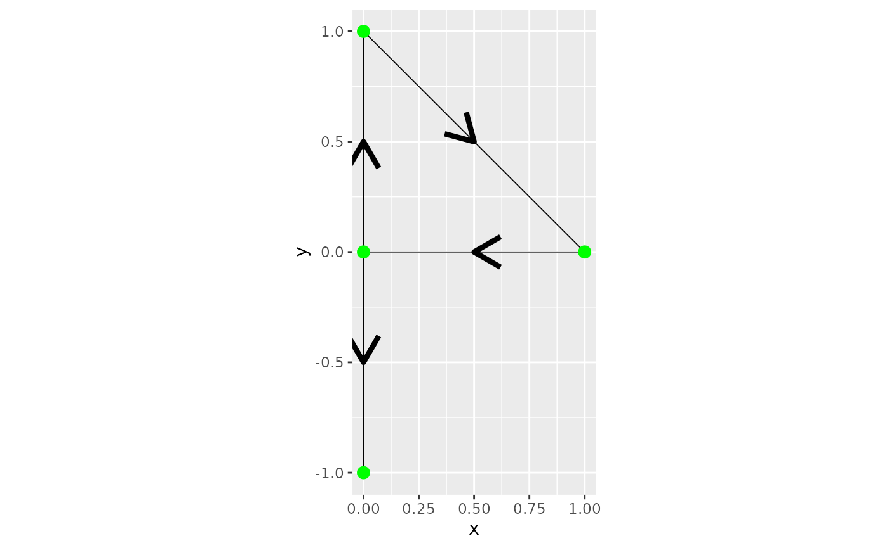
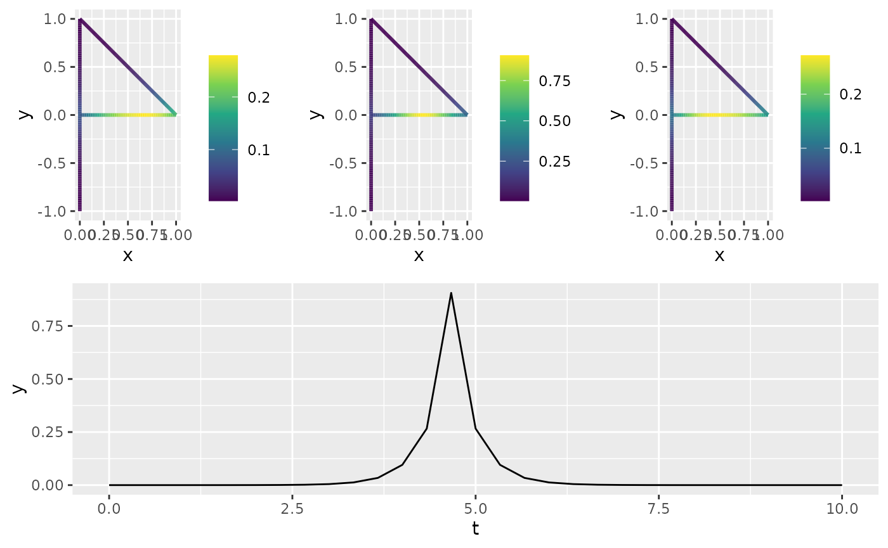

# Spatio-temporal Models on Compact Metric Graphs

## Introduction

The `MetricGraph` package, combined with the `rSPDE` package, implements
the following spatio-temporal model on compact metric graphs:
``` math
d u + \gamma(\kappa^2 + \rho \cdot \nabla - \Delta)^{\alpha} u = dW_Q, \quad \text{on } T \times \Gamma
```
where $`T`$ is a temporal interval, and $`\Gamma`$ is a compact metric
graph. Here, $`\kappa > 0`$ is a spatial range parameter, $`\rho`$ is a
drift parameter, and $`W_Q`$ is a $`Q`$-Wiener process with spatial
covariance operator $`\sigma^2(\kappa^2 - \Delta)^{-\beta}`$, where
$`\sigma^2`$ is a variance parameter. The model has two smoothness
parameters, $`\alpha`$ and $`\beta`$, which are assumed to be integers.
This model generalizes the spatio-temporal models introduced in
[Lindgren et al.
(2024)](https://www.raco.cat/index.php/SORT/article/view/428665), where
the generalization is to allow for drift and to allow for metric graphs
as spatial domains. The model is implemented using a finite element
discretization of the corresponding precision operator:
``` math
\sigma^{-2}(d + \gamma(\kappa^2 + \kappa^{d/2}\rho\cdot \nabla - \Delta)^{\alpha})(\kappa^2 - \Delta)^{\beta} ((d + \gamma(\kappa^2 - \kappa^{d/2}\rho\cdot \nabla - \Delta)^{\alpha}))
```
in both space and time, following a similar discretization to [Lindgren
et al. (2024)](https://www.raco.cat/index.php/SORT/article/view/428665).
This parameterization of the drift term, using $`\rho \kappa^{d/2}`$ in
place of the standard $`\rho`$, is chosen to simplify the enforcement of
theoretical bounds on the range of $`\rho`$, ensuring that the equation
remains well-posed and also providing numerical stability for
finite-dimensional approximations.

## Implementation Details

The function
[`spacetime.operators()`](https://davidbolin.github.io/rSPDE/reference/spacetime.operators.html),
provided by the `rSPDE` package, constructs the spatio-temporal
precision matrix for models on metric graphs and enables interaction
with the `MetricGraph` package. This function requires inputs that
define the spatial structure via a `MetricGraph` object and the temporal
domain through a vector of discretized time points. Key parameters like
`kappa` and `sigma` control the range and variance of the field,
respectively, whereas `alpha` and `beta` govern the smoothness of the
field.

This function processes these inputs to create a `spacetime.operators`
object containing the discretized precision matrix, covariance
structure, and essential methods for model evaluation, simulation, and
kriging on metric graphs.

``` r

library(sp)
library(rSPDE)
library(MetricGraph)

# Define graph edges
line1 <- Line(rbind(c(1, 0), c(0, 0)))
line2 <- Line(rbind(c(0, 0), c(0, 1)))
line3 <- Line(rbind(c(0, 0), c(0, -1)))
line4 <- Line(rbind(c(0, 1), c(1, 0)))
lines <- sp::SpatialLines(list(
  Lines(list(line1), ID="1"),
  Lines(list(line2), ID="2"),
  Lines(list(line3), ID="3"),
  Lines(list(line4), ID="4")
))

# Initialize metric graph
graph <- metric_graph$new(edges = lines)
graph$plot(direction = TRUE)
```



``` r


# Create finite element mesh and compute matrices
h <- 0.01
graph$build_mesh(h = h)
graph$compute_fem()

# Define model parameters and construct spatio-temporal operator
t <- seq(from = 0, to = 10, length.out = 31)
kappa <- 5
sigma <- 10
gamma <- 0.1
rho <- 0.3
alpha <- 1
beta <- 1

op <- spacetime.operators(graph = graph, time = t,
                          kappa = kappa, sigma = sigma, alpha = alpha,
                          beta = beta, rho = rho, gamma = gamma)
op$plot_covariances(t.ind = 15, s.ind = 50, t.shift = c(-1, 0, 1))
```



    #> TableGrob (2 x 1) "arrange": 2 grobs
    #>   z     cells    name            grob
    #> 1 1 (1-1,1-1) arrange gtable[arrange]
    #> 2 2 (2-2,1-1) arrange  gtable[layout]
    #> TableGrob (2 x 1) "arrange": 2 grobs
    #>   z     cells    name            grob
    #> 1 1 (1-1,1-1) arrange gtable[arrange]
    #> 2 2 (2-2,1-1) arrange  gtable[layout]

## Simulating Observations and Estimating Parameters

``` r

# Simulate data
x <- simulate(op, nsim = 1) 

n.obs <- 500
PtE <- cbind(sample(1:graph$nE, size = n.obs, replace = TRUE), runif(n.obs))
t.obs <- max(t) * runif(n.obs)

# including vertices of degree 1 in the A matrix
A <- make_A(op, PtE, t.obs, include_deg1 = TRUE)
sigma.e <- 0.01
Y <- as.vector(A %*% x + sigma.e * rnorm(n.obs))
df <- data.frame(y = as.matrix(Y), edge_number = PtE[,1], 
                        distance_on_edge = PtE[,2], 
                        time = t.obs)
graph$add_observations(data = df, normalized=TRUE,
                              group = "time")

# Estimate model parameters using rspde_lme
res <- rspde_lme(y ~ 1, loc_time = "time",
                 model = op, 
                 parallel = TRUE)

# Display summary
summary(res)
#> 
#> Latent model - Spatio-temporal with alpha =  1 , beta =  1
#> 
#> Call:
#> rspde_lme(formula = y ~ 1, loc_time = "time", model = op, parallel = TRUE)
#> 
#> Fixed effects:
#>             Estimate Std.error z-value Pr(>|z|)
#> (Intercept)  0.01252   0.01420   0.882    0.378
#> 
#> Random effects:
#>               Estimate Std.error z-value
#> kappa          5.08187   0.31786  15.988
#> sigma         10.60853   1.15784   9.162
#> gamma          0.10777   0.01272   8.474
#> rho            0.18580  20.44590   0.009
#> alpha (fixed)  1.00000        NA      NA
#> beta (fixed)   1.00000        NA      NA
#> 
#> Measurement error:
#>          Estimate Std.error z-value
#> std. dev 0.011318  0.002192   5.164
#> ---
#> Signif. codes:  0 '***' 0.001 '**' 0.01 '*' 0.05 '.' 0.1 ' ' 1 
#> 
#> Log-Likelihood:  -38.30923 
#> Number of function calls by 'optim' = 70
#> Optimization method used in 'optim' = L-BFGS-B
#> 
#> Time used to:     fit the model =  4.43042 mins 
#>   set up the parallelization = 9.50825 secs

# Compare estimated results with true values
results <- data.frame(kappa = c(kappa, res$coeff$random_effects[1]), 
                      sigma = c(sigma, res$coeff$random_effects[2]),
                      gamma = c(gamma, res$coeff$random_effects[3]), 
                      rho = c(rho, res$coeff$random_effects[4]),
                      sigma.e = c(sigma.e, res$coeff$measurement_error),
                      intercept = c(0, res$coeff$fixed_effects),
                      row.names = c("True", "Estimate"))
                      
print(results)
#>             kappa    sigma     gamma       rho    sigma.e  intercept
#> True     5.000000 10.00000 0.1000000 0.3000000 0.01000000 0.00000000
#> Estimate 5.081869 10.60853 0.1077685 0.1858043 0.01131791 0.01251826
```

## inlabru Implementation

We now proceed with the inlabru implementation. First, we create a
temporal mesh:

``` r

library(INLA)
library(inlabru)
library(fmesher)
mesh_time <- fm_mesh_1d(t)
st_graph <- rspde.spacetime(mesh_space = graph, 
                                    mesh_time = mesh_time, 
                                    alpha = 1, beta = 1)
```

We define the data object by using the
[`graph_data_rspde()`](https://davidbolin.github.io/rSPDE/reference/graph_data_rspde.html)
function with `bru` set to `TRUE`:

``` r

st_data_bru <- graph_data_rspde(st_graph, bru = TRUE)
```

Next, we define the model component for inlabru, where we pass a list
with two elements: `space`, which is given by the spatial locations
(`cbind(.edge_number, .distance_on_edge)`), and `time`, which is given
by the time points.

``` r

cmp_graph <- y ~ 1 + field(list(
                        space = cbind(.edge_number, .distance_on_edge), 
                                    time = time), 
                                    model = st_graph)
```

Fit the model by passing `st_data_bru` to the `data` argument:

``` r

bru_fit_graph <- bru(cmp_graph, data = st_data_bru[["data"]])
```

Compare the estimated parameters with the true values:

``` r

param_st <- transform_parameters_spacetime(bru_fit_graph$summary.hyperpar$mean[2:6], 
                                            st_graph)

results <- data.frame(kappa = c(kappa,  param_st[[1]]), 
                      sigma = c(sigma,  param_st[[2]]),
                      gamma = c(gamma,  param_st[[3]]), 
                      rho = c(rho, param_st[[4]]),
                      sigma.e = c(sigma.e, sqrt(1/bru_fit_graph$summary.hyperpar$mean[1])),
                      intercept = c(0, bru_fit_graph$summary.fixed$mean),
                      row.names = c("True", "Estimate"))
                      
print(results)
#>             kappa    sigma     gamma       rho   sigma.e  intercept
#> True     5.000000 10.00000 0.1000000 0.3000000 0.0100000 0.00000000
#> Estimate 5.097325 10.57207 0.1069257 0.1260439 0.0104253 0.01260829
```

## Fitting Model with Replicates in inlabru

We will now simulate from the same model, but this time with replicates.
We will assume we have 10 replicates.

Let us start by simulating the field:

``` r

n_rep = 10
x <- simulate(op, nsim = n_rep) 

n.obs <- 500
PtE <- cbind(sample(1:graph$nE, size = n.obs, replace = TRUE), runif(n.obs))
t.obs <- max(t) * runif(n.obs)
A <- make_A(op, PtE, t.obs, include_deg1 = TRUE)
sigma.e <- 0.01
Y <- as.vector(A %*% x + sigma.e * rnorm(n.obs))
df <- data.frame(y = as.matrix(Y), edge_number = PtE[,1], 
                        distance_on_edge = PtE[,2], time = t.obs,
                        repl = rep(1:n_rep, each = n.obs))

graph_rep <- graph$clone()
```

We add the observations into the metric graph object. Observe that this
time we have two grouping variables, `time` and `repl`. We need grouping
variables whenever we want to allow the storage of different
observations at the exact same location.

``` r

graph_rep$add_observations(data = df, normalized=TRUE, 
                    clear_obs = TRUE, group = c("time", "repl"))
#> Adding observations...
#> Assuming the observations are normalized by the length of the edge.
```

We now create the `rSPDE` model object:

``` r

st_graph_repl <- rspde.spacetime(mesh_space = graph_rep, 
                                mesh_time = mesh_time, 
                                alpha = 1, beta = 1)
```

We create the data object by using the
[`graph_data_rspde()`](https://davidbolin.github.io/rSPDE/reference/graph_data_rspde.html)
function, setting `bru` to `TRUE` and specifying `repl_col`:

``` r

st_data_bru_repl <- graph_data_rspde(st_graph_repl, 
                                  repl = ".all",
                                  repl_col = "repl",
                                  bru = TRUE)
```

Next, we create the `inlabru` component by also passing the replicate
argument with the `repl` element of the object returned by
[`graph_data_rspde()`](https://davidbolin.github.io/rSPDE/reference/graph_data_rspde.html):

``` r

cmp_graph_repl <- y ~ 1 + field(list(space = cbind(.edge_number, .distance_on_edge), 
                                time = time),
                                model = st_graph_repl,
                                replicate = st_data_bru_repl[["repl"]]
                                )
```

Fit the model passing `st_data_bru_repl` to the `data` argument:

``` r

bru_fit_graph_repl <- bru(cmp_graph_repl, 
                      data = st_data_bru_repl[["data"]])
```

Compare the estimated parameters with the true values:

``` r

param_st_repl <- transform_parameters_spacetime(
                              bru_fit_graph_repl$summary.hyperpar$mean[2:6], 
                              st_graph_repl)

results_repl <- data.frame(kappa = c(kappa,  param_st_repl[[1]]), 
                      sigma = c(sigma,  param_st_repl[[2]]),
                      gamma = c(gamma,  param_st_repl[[3]]), 
                      rho = c(rho, param_st_repl[[4]]),
                      sigma.e = c(sigma.e, sqrt(1/bru_fit_graph_repl$summary.hyperpar$mean[1])),
                      intercept = c(0, bru_fit_graph_repl$summary.fixed$mean),
                      row.names = c("True", "Estimate"))
                      
print(results_repl)
#>             kappa     sigma      gamma       rho     sigma.e  intercept
#> True     5.000000 10.000000 0.10000000 0.3000000 0.010000000 0.00000000
#> Estimate 5.060969  9.974465 0.09879074 0.3257687 0.005259032 0.01108632
```

## Example: Setting `bounded_rho = FALSE`

The `bounded_rho` parameter in
[`rspde.spacetime()`](https://davidbolin.github.io/rSPDE/reference/rspde.spacetime.html)
ensures that $`\rho`$ stays within a range that guarantees numerical
stability and well-posedness. However, in some cases, better fits can be
achieved by setting `bounded_rho = FALSE`. Below, we show how to modify
the model to handle this case.

### Using `rspde_lme()`

Here we set `bounded_rho = FALSE` when creating the spatio-temporal
operator and fit the model using
[`rspde_lme()`](https://davidbolin.github.io/rSPDE/reference/rspde_lme.html):

``` r

# Create the spatio-temporal operator with bounded_rho = FALSE
op_unbounded <- spacetime.operators(
  graph = graph,
  time = t,
  kappa = kappa,
  sigma = sigma,
  alpha = alpha,
  beta = beta,
  rho = rho,
  gamma = gamma,
  bounded_rho = FALSE
)

# Fit the model using rspde_lme
res <- rspde_lme(y ~ 1, loc_time = "time", model = op_unbounded, parallel = TRUE)
```

### Comparing Results

``` r

# Compare results for rspde_lme
results <- data.frame(
  kappa = c(kappa, res$coeff$random_effects[1]),
  sigma = c(sigma, res$coeff$random_effects[2]),
  gamma = c(gamma, res$coeff$random_effects[3]),
  rho = c(rho, res$coeff$random_effects[4]),
  sigma.e = c(sigma.e, res$coeff$measurement_error),
  intercept = c(0, res$coeff$fixed_effects),
  row.names = c("True", "Estimate")
)

print(results)
#>            kappa    sigma    gamma       rho    sigma.e  intercept
#> True     5.00000 10.00000 0.100000 0.3000000 0.01000000 0.00000000
#> Estimate 5.08243 10.61114 0.107797 0.1840097 0.01132673 0.01250813
```

### Using `inlabru`

Here we set `bounded_rho = FALSE` when creating the spatio-temporal
operator and prepare data for `inlabru`:

``` r

# Create the spatio-temporal operator for inlabru
st_graph_unbounded <- rspde.spacetime(
  mesh_space = graph,
  mesh_time = mesh_time,
  alpha = 1,
  beta = 1,
  bounded_rho = FALSE
)

# Prepare data for inlabru
st_data_bru_unbounded <- graph_data_rspde(
  st_graph_unbounded,
  bru = TRUE
)

# Define inlabru component with unbounded rho
cmp_graph_unbounded <- y ~ 1 + field(
  list(
    space = cbind(.edge_number, .distance_on_edge),
    time = time
  ),
  model = st_graph_unbounded
)
```

### Fitting the Model with `inlabru`

``` r

bru_fit_graph_unbounded <- bru(cmp_graph_unbounded, data = st_data_bru_unbounded[["data"]])
```

### Comparing Results

``` r

# Transform parameters and compare results
param_st_unbounded <- transform_parameters_spacetime(
  bru_fit_graph_unbounded$summary.hyperpar$mean[2:6],
  st_graph_unbounded
)

results_unbounded <- data.frame(
  kappa = c(kappa, param_st_unbounded[[1]]),
  sigma = c(sigma, param_st_unbounded[[2]]),
  gamma = c(gamma, param_st_unbounded[[3]]),
  rho = c(rho, param_st_unbounded[[4]]),
  sigma.e = c(sigma.e, sqrt(1 / bru_fit_graph_unbounded$summary.hyperpar$mean[1])),
  intercept = c(0, bru_fit_graph_unbounded$summary.fixed$mean),
  row.names = c("True", "Estimate")
)

print(results_unbounded)
#>             kappa    sigma     gamma      rho    sigma.e  intercept
#> True     5.000000 10.00000 0.1000000 0.300000 0.01000000 0.00000000
#> Estimate 5.152798 10.74653 0.1080981 0.194208 0.01030457 0.01275623
```

## INLA Implementation (Added for Completeness)

**Note:** While it is possible to fit the model directly using INLA, we
strongly recommend utilizing the inlabru implementation. Its
higher-level interface and enhanced functionalities provide a more
user-friendly and robust experience, especially for those with less
experience in advanced modeling.

### Fitting the Model with INLA

First, we create the temporal mesh and spatio-temporal graph:

``` r

library(INLA)
library(fmesher)
mesh_time <- fm_mesh_1d(t)
st_graph <- rspde.spacetime(mesh_space = graph, 
                                    mesh_time = mesh_time, 
                                    alpha = 1, beta = 1)
```

We define the data object by using the
[`graph_data_rspde()`](https://davidbolin.github.io/rSPDE/reference/graph_data_rspde.html)
function with `bru` set to `FALSE`:

``` r

st_data_inla <- graph_data_rspde(st_graph, name = "field", time = "time", bru = FALSE)
```

Now we create the `inla.stack` object. The `st_data_inla` contains the
dataset as the `data` component, the index as the `index` component, and
the so-called `A` matrix as the `basis` component. We will now create
the stack using these components:

``` r

stk.dat <- inla.stack(
  data = st_data_inla[["data"]], 
  A = st_data_inla[["basis"]],
  effects =
    c(st_data_inla[["index"]],
      list(Intercept = 1))
  )
```

Finally, we create the formula object and fit the model:

``` r

f_st <- y ~ -1 + Intercept + f(field, model = st_graph)

rspde_fit <- inla(f_st, data = inla.stack.data(stk.dat),
  control.inla = list(int.strategy = "eb"),
  control.predictor = list(A = inla.stack.A(stk.dat), compute = TRUE),
  num.threads = "1:1"
)
```

Let us compare the fitted values with the true values:

``` r

param_st <- transform_parameters_spacetime(rspde_fit$summary.hyperpar$mean[2:6], 
                                            st_graph)

results <- data.frame(kappa = c(kappa,  param_st[[1]]), 
                      sigma = c(sigma,  param_st[[2]]),
                      gamma = c(gamma,  param_st[[3]]), 
                      rho = c(rho, param_st[[4]]),
                      sigma.e = c(sigma.e, sqrt(1/rspde_fit$summary.hyperpar$mean[1])),
                      intercept = c(0, rspde_fit$summary.fixed$mean),
                      row.names = c("True", "Estimate"))
                      
print(results)
#>             kappa   sigma     gamma      rho    sigma.e  intercept
#> True     5.000000 10.0000 0.1000000 0.300000 0.01000000 0.00000000
#> Estimate 5.169932 11.0784 0.1115865 0.113168 0.01057404 0.01264107
```

### Fitting Model with Replicates in INLA

We will now simulate from the same model, but this time with replicates.

Let us create the data object for INLA:

``` r

st_data_inla_repl <- graph_data_rspde(st_graph_repl, 
                                  repl = ".all",
                                  repl_col = "repl",
                                  time = "time",
                                  bru = FALSE)
```

Let us now create the corresponding `inla.stack` object:

``` r

st_dat_rep <- inla.stack(
  data = st_data_inla_repl[["data"]],
  A = st_data_inla_repl[["basis"]],
  effects = c(st_data_inla_repl[["index"]],
          list(Intercept = 1))
)
```

Now, we can create the formula object and fit the model:

``` r

f_st_rep <-
  y ~ -1 + Intercept + f(field,
    model = st_graph_repl,
    replicate = field.repl
  )

rspde_fit_rep <-
  inla(f_st_rep,
    data = inla.stack.data(st_dat_rep),
    control.predictor =
      list(A = inla.stack.A(st_dat_rep))
  )
```

Let us compare the fitted values with the true values:

``` r

param_st_rep <- transform_parameters_spacetime(rspde_fit_rep$summary.hyperpar$mean[2:6], 
                                            st_graph)

results_inla_repl <- data.frame(kappa = c(kappa,  param_st_rep[[1]]), 
                      sigma = c(sigma,  param_st_rep[[2]]),
                      gamma = c(gamma,  param_st_rep[[3]]), 
                      rho = c(rho,  param_st_rep[[4]]),
                      sigma.e = c(sigma.e, sqrt(1/rspde_fit_rep$summary.hyperpar$mean[1])),
                      intercept = c(0, rspde_fit_rep$summary.fixed$mean),
                      row.names = c("True", "Estimate"))
                      
print(results_inla_repl)
#>             kappa     sigma      gamma       rho     sigma.e  intercept
#> True     5.000000 10.000000 0.10000000 0.3000000 0.010000000 0.00000000
#> Estimate 5.046862  9.782636 0.09717941 0.2041102 0.006620939 0.01315047
```

## References

Lindgren, Finn, Haakon Bakka, David Bolin, Elias Krainski, and Håvard
Rue. 2024. “A Diffusion-Based Spatio-Temporal Extension of Gaussian
Matérn Fields.” *SORT Statistics and Operations Research Transactions*
48 (1): 3–66.
